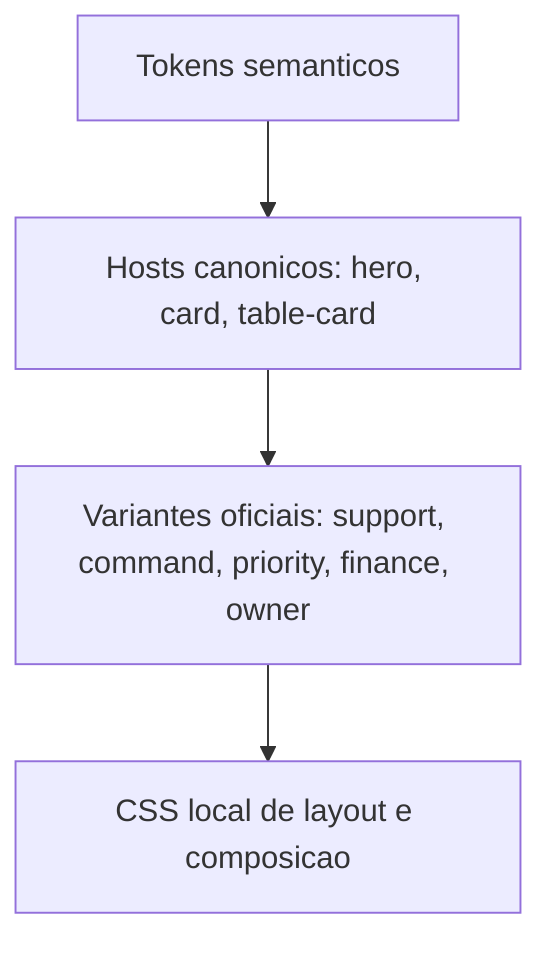

# Canonical Hero Card Variants Design

**Spec**: `.specs/features/canonical-hero-card-variants/spec.md`
**Status**: Draft

---

## Architecture Overview

A arquitetura proposta separa quatro camadas:

1. tokens
2. hosts canonicos
3. variantes oficiais
4. composicao local

## What Already Exists

O projeto ja tem blocos importantes que favorecem exatamente essa arquitetura.

### 1. Hosts canonicos ja existem

Base atual:

1. `static/css/design-system/components/hero.css`
2. `static/css/design-system/components/cards.css`

Isso significa que nao precisamos inventar as familias do zero.
Elas ja existem como host estrutural.

### 2. O projeto ja usa tuning por custom properties

Exemplos visiveis:

1. `dashboard.css` ja ajusta `--hero-surface`, `--hero-border`, `--hero-shadow`, `--hero-padding` e `--hero-radius`
2. `operations/refinements/hero.css` ja opera com um contrato extenso de `--operation-hero-*`
3. `cards.css` ja usa knobs como `--metric-card-surface`, `--metric-card-border`, `--metric-card-shadow` e `--metric-card-accent`

Em linguagem simples:

- a mesa ja tem botoes
- so ainda nao demos nome oficial para quais botoes cada tela pode girar

### 3. Ja existe lingua de modificadores em varias areas

Exemplos:

1. `cards.css` ja tem estados como `status-clean`, `status-attention` e `status-neutral`
2. `layout-blocks.css` ja usa modificadores como `layout-block--split`, `layout-block--rail` e `layout-block--workspace`
3. `dashboard/side.css` ja usa `dashboard-focus-card--danger`, `dashboard-focus-card--brand` e `dashboard-focus-card--info`
4. `dashboard/metrics.css` ja usa dialetos como `kpi-amber`, `kpi-red`, `kpi-blue`, `kpi-green` e `kpi-slate`

Ou seja:

1. o time ja fala parcialmente a linguagem de variantes
2. o problema e que ela ainda esta espalhada e local demais

### 4. Ja existe manifesto de componentes com ordem estavel

Base atual:

1. `static/css/design-system.css`
2. `static/css/design-system/components.css`

Isso facilita muito, porque:

1. podemos adicionar `hero-variants.css` e `card-variants.css` no lugar certo
2. sem baguncar o entrypoint principal
3. sem criar carga extra por tela sem necessidade

### 5. Ja existe governanca documental favoravel

Docs que ja apontam para esse caminho:

1. `docs/experience/css-guide.md`
2. `docs/reference/design-system-contract.md`

Ambos ja afirmam que:

1. tokens mandam na tinta
2. `hero` e `card` sao familias canonicas
3. CSS local nao deveria virar um segundo motor de tema

## Interpretation

A descoberta principal desta vistoria e:

**o projeto ja tem a infraestrutura tecnica para variantes canonicas; o que falta e consolidar isso como contrato oficial e migrar os dialetos locais para dentro desse contrato.**

---

## Wave 1 Findings

Wave 1 respondeu duas perguntas:

1. quais variantes ja existem de forma implicita
2. onde ainda existe repaint local em vez de variante oficial

### Finding A. Ja existe um proto-sistema de variantes

O projeto ja usa tres mecanismos que, juntos, formam um meio-sistema:

1. knobs por custom properties
2. modificadores por classe
3. wrappers semanticos de dominio

Exemplos concretos:

1. `dashboard.css` ja faz tuning de hero por variaveis sem reescrever o host
2. `cards.css` ja possui `metric-card` como subfamilia com knobs proprios
3. `cards.css` ja possui estados semanticos de superficie com `status-clean`, `status-attention` e `status-neutral`
4. `dashboard/side.css` ja possui uma familia de focus cards orientada por acento com `dashboard-focus-card--danger`, `--brand` e `--info`
5. `dashboard/metrics.css` ja possui uma familia local de estados KPI com `kpi-amber`, `kpi-red`, `kpi-blue`, `kpi-green` e `kpi-slate`

Conclusao:

1. o projeto nao sofre por falta de ideias de variante
2. sofre por falta de centralizacao dessas ideias

### Finding B. Os repaint hotspots seguem um padrao repetido

Os repaint hotspots mais importantes se concentram em:

1. `dashboard.css`
2. `static/css/design-system/components/dashboard/metrics.css`
3. `static/css/design-system/components/dashboard/side.css`
4. `static/css/catalog/finance/_shell.css`
5. `static/css/catalog/finance/_cards.css`
6. `static/css/catalog/finance/_dark.css`
7. `static/css/design-system/operations/owner/simple/panels.css`
8. `static/css/design-system/operations/owner/simple/dark.css`
9. `static/css/system-pages.css`

Pattern observado:

1. a pagina cria uma superficie local
2. essa superficie acaba decidindo fundo, borda e sombra
3. o host canonico continua la, mas deixa de ser soberano

### Finding C. O melhor candidato tecnico e a estrategia "variant by knobs"

Entre as abordagens possiveis, a que mais respeita a base existente e:

1. manter `hero`, `card` e `table-card` como host
2. mover diferencas recorrentes para variantes oficiais
3. expressar essas variantes por custom properties

Por que isso e melhor aqui:

1. reaproveita a infraestrutura atual
2. reduz especificidade extra
3. evita criar outra arvore de componentes paralela
4. e barato de aplicar no manifesto existente

---

## Variant Inventory

### Implicit hero families already present

1. dashboard narrative hero
2. operation command hero
3. finance hero
4. owner hero
5. placeholder hero

Leitura tecnica:

1. essas familias ja existem semanticamente
2. ainda nao existem como dialeto oficial e previsivel

### Implicit card families already present

1. support rail card
2. focus card
3. metric card
4. KPI state card
5. summary and priority card
6. placeholder support panel

Leitura tecnica:

1. as familias de card ja foram descobertas empiricamente pelo produto
2. a arquitetura nova deve absorver, nao negar, esse aprendizado

---

## Proposed Minimal Vocabulary

Wave 1 recomenda um vocabulário minimo, nao maximalista.

### Hero variants for Wave 2

1. `hero--command`
   - para heros de abertura operacional
2. `hero--support`
   - para heros de apoio e leitura secundaria
3. `hero--feature`
   - para heros com presenca premium um pouco maior
4. `hero--placeholder`
   - para superficies provisórias como whatsapp placeholder

Observacao:

1. `finance` e `owner` devem, sempre que possivel, nascer de combinacao entre variantes semanticas e knobs locais leves
2. so devem virar variantes nomeadas se o comportamento se repetir em mais de um contexto

### Card variants for Wave 2

1. `card--support`
   - para trilhos laterais e paineis de apoio
2. `card--focus`
   - para cards com acento semantico forte e leitura de prioridade
3. `card--metric`
   - para leitura numerica principal
4. `card--priority`
   - para urgencia controlada
5. `card--soft`
   - para superficies de apoio mais discretas
6. `table-card--support`
   - para rails e side boards baseados em `table-card`

### Status and accent vocabulary to preserve

1. `status-clean`
2. `status-attention`
3. `status-neutral`
4. `danger`, `warning`, `info`, `success`

Recommendation:

1. manter essa lingua
2. centralizar a implementacao visual dela

---

## Classification Matrix

### Host concern

Quando a mudanca mexe em:

1. fundo estrutural
2. borda estrutural
3. sombra estrutural
4. pseudo-elemento compartilhado
5. espinha dorsal do hero ou card

ela pertence ao host canonico.

### Variant concern

Quando a mudanca mexe em:

1. familia de acento
2. intensidade de glass
3. rail decorativo
4. tom de suporte versus prioridade
5. presenca premium controlada

ela pertence a variante oficial.

### Local composition concern

Quando a mudanca mexe em:

1. grid
2. ordem
3. largura
4. densidade de conteudo
5. agrupamento interno

ela pertence ao CSS local.

## Contract Model

### Layer 1. Tokens

Ownership:

1. `static/css/design-system/tokens.css`

Responsabilidade:

1. cor
2. contraste
3. sombra
4. glow
5. glass tiers

### Layer 2. Canonical Hosts

Ownership:

1. `static/css/design-system/components/hero.css`
2. `static/css/design-system/components/cards.css`

Responsabilidade:

1. estrutura visual base
2. borda
3. fundo
4. sombra
5. pseudo-elementos compartilhados
6. comportamento padrao de leitura

### Layer 3. Official Variants

Ownership proposto:

1. `static/css/design-system/components/hero-variants.css`
2. `static/css/design-system/components/card-variants.css`

Responsabilidade:

1. tuning por variaveis
2. personalidades oficiais de familia
3. ajustes semanticos de support, command, priority, premium, finance e owner

### Layer 4. Local Composition

Ownership:

1. CSS da tela local

Responsabilidade:

1. grid
2. gap
3. ordem
4. largura
5. composicao de conteudo

Nao deve possuir:

1. repaint estrutural de host
2. segunda familia de background
3. border and shadow authority paralela

## Variant Direction

### Hero variants candidatas

1. `hero--command`
2. `hero--support`
3. `hero--finance`
4. `hero--owner`
5. `hero--placeholder`

### Card variants candidatas

1. `card--support`
2. `card--priority`
3. `card--critical`
4. `card--soft`
5. `table-card--rail`
6. `table-card--support`

## Initial Migration Targets

1. dashboard heroes e side cards
2. finance heroes e finance cards principais
3. owner simple panels e support surfaces

## Wave 3 Pilot Outcome

A primeira migracao real validou o contrato em quatro frentes:

1. dashboard
2. financeiro
3. owner
4. whatsapp placeholder

O que entrou na pilotagem:

1. `page_hero.html` passou a aceitar variante oficial opcional
2. `financeiro` passou a declarar `hero--command`
3. `owner` passou a declarar `hero--command`
4. `whatsapp` passou a declarar `hero--placeholder`
5. o hero narrativo do dashboard passou a declarar `hero--feature`
6. boards de sessao e cards de apoio passaram a declarar `table-card--support` ou variantes equivalentes
7. cards focais e de prioridade passaram a declarar `card--focus`, `card--priority` ou `card--soft`

Leitura tecnica:

1. a arquitetura deixou de ser apenas hipotese
2. ela ja consegue atravessar template, host e CSS sem mudar a engenharia base

## Risks

1. migrar rapido demais e misturar redesign com arquitetura
2. criar variantes demais cedo e inflar o sistema
3. manter legado visual escondido por tras de classes locais antigas

## Recommendation

Comecar pequeno e oficial:

1. criar poucas variantes de alto reaproveitamento
2. migrar as tres superficies com maior retorno
3. endurecer a regra documental depois da primeira validacao

---

## Wave 4 Governance Outcome

Wave 4 endureceu a governanca em dois niveis:

1. documentacao operacional
2. limpeza de redundancia de baixo risco

O que foi institucionalizado:

1. o projeto agora reconhece explicitamente a camada `host -> variante oficial -> composicao local`
2. o CSS guide passa a exigir avaliacao de variante oficial antes de qualquer repaint local de `hero`, `card` ou `table-card`
3. o contrato curto do design system passa a registrar que variantes oficiais pertencem a `components`

O que foi limpo:

1. o placeholder do WhatsApp perdeu um bloco local redundante que repetia a pele de `hero--placeholder`
2. o owner simple perdeu parte do override dark duplicado onde o template ja declara `card--support`, `card--priority` ou `card--soft`

Leitura tecnica:

1. a base ainda tem debito de migracao em dashboard, financeiro e owner
2. mas agora o caminho oficial esta escrito e uma parte do legado ja deixou de competir com as variantes

---

## Wave 5 Pruning Outcome

Wave 5 atacou a redundancia restante onde a migracao piloto ja tinha base suficiente para podar sem redesign.

O que mudou:

1. `dashboard-hero` deixou de reescrever superficie, borda e sombra que agora pertencem a `hero--feature`
2. o card executivo do financeiro passou a declarar `card--metric`
3. `finance-command-hero` deixou de definir `background`, `border` e `box-shadow` por conta propria e passou a alimentar knobs de `metric-card`
4. seletores mortos como `finance-hero-panel` foram removidos

Leitura tecnica:

1. dashboard continua com composicao local de ritmo e espacamento
2. financeiro continua com composicao local de conteudo e layout
3. a pele visual migrou mais um passo para dentro do design system
