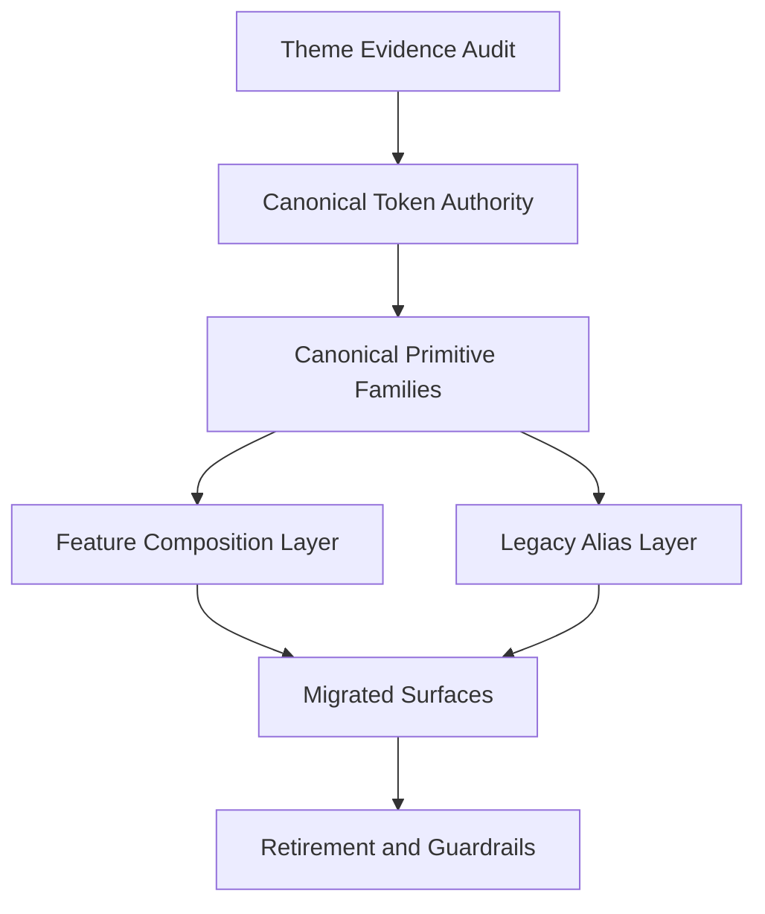

# Canonical Theme Unification Design

**Spec**: `.specs/features/canonical-theme-unification/spec.md`
**Status**: Approved

---

## Architecture Overview

The canonical theme should not be a fifth competing painter.
It should be the final authority that absorbs the best parts of the previous four and then governs the whole product.

The provided Gemini references are not screenshot implementation targets.
They are system references for:

1. dark theme temperature
2. premium surface treatment
3. restrained glow behavior
4. shell elegance
5. breathable composition
6. controlled accent usage

The design follows a strict authority ladder:

1. semantic tokens
2. canonical primitives
3. feature-level composition
4. legacy aliases

---

## Final Painter Contract

The final painter is now explicitly elected.

### Elected Canonical Authorities

| Family | Canonical Authority | Host | Notes |
| --- | --- | --- | --- |
| Tokens | `theme semantic tokens` | `static/css/design-system/tokens.css` | one semantic source of truth |
| Surface/Card | `card family` | `static/css/design-system/components/cards.css` | `.card` becomes the primary surface primitive |
| Structured Data Card | `table-card variant` | `static/css/design-system/components/cards.css` | variant of the same card family, not a separate dialect |
| Hero | `hero family` | `static/css/design-system/components/hero.css` | one command-banner grammar |
| Banner/Notice | `notice-panel family` | `static/css/design-system/components/states.css` | `.notice-panel` is canonical; `note-panel` becomes migration input, not final authority |
| Topbar | `topbar family` | `static/css/design-system/topbar.css` | consumes theme tokens, no parallel kingdom |

### Locked Interpretation

1. `.card` is the canonical visual container
2. `.table-card` is not a second theme; it is a structured variant of the canonical card family
3. `.glass-panel` stops being a competing base container and becomes an atmospheric helper or alias during migration
4. `note-panel` is useful, but its current file location does not justify permanent authority
5. premium sub-dialects like `elite-glass-card` and `glass-panel-elite` may survive only as scoped variants if they inherit from the same canonical card base

In simple terms:

- one family owns the wall
- the others may still lend tools during the renovation
- but they do not choose the paint anymore

---

## Code Reuse Analysis

### Existing Components to Leverage

| Component | Location | How to Use |
| --- | --- | --- |
| Theme tokens base | `static/css/design-system/tokens.css` | Keep as the home for semantic theme variables, but reduce stacked authority passes |
| Core cards | `static/css/design-system/components/cards.css` | Reuse as the home for canonical surface and card primitives after pruning competing definitions |
| Core hero | `static/css/design-system/components/hero.css` | Reuse as the home for the canonical hero family after removing competing author passes |
| Topbar implementation | `static/css/design-system/topbar.css` | Rework to consume canonical tokens instead of behaving like a separate theme system |
| Shared utilities | `static/css/catalog/shared/utilities.css` | Reuse only as helpers and temporary aliases, not as theme authority |
| Front display wall contracts | `docs/experience/front-display-wall.md` | Use as inspiration for the final painter's tone and presence |
| CSS guide | `docs/experience/css-guide.md` | Use as a style constraint and maintenance reference |
| Gemini visual references | `C:/Users/renan/Downloads/Gemini_Generated_Image_skpc03skpc03skpc.png`, `C:/Users/renan/Downloads/Gemini_Generated_Image_9cqim9cqim9cqim9.png` | Use as aesthetic direction for dark premium openness, not literal clone targets |

### Integration Points

| System | Integration Method |
| --- | --- |
| Existing templates | Replace mixed visual families with canonical primitives over migration waves |
| Existing CSS modules | Convert authority-heavy files into canonical hosts or alias layers |
| Existing refined surfaces | Use `students`, `finance`, `reports-hub`, and student workspace refinements as proof targets for migration |

---

## Canonical Authority Model

### Tier 1: Semantic Tokens

- **Purpose**: own color, elevation, border, spacing, focus, and state semantics
- **Location**: `static/css/design-system/tokens.css`
- **Rule**: this file defines values, not multiple competing visual ideologies
- **Reference mood**: deep navy dark, readable text contrast, restrained warm accent, soft chromatic glow
- **Canonical election**: this remains the only legal home for root theme semantics

### Tier 2: Canonical Primitives

- **Purpose**: define the official visual families
- **Locations**:
  - `static/css/design-system/components/cards.css`
  - `static/css/design-system/components/hero.css`
  - `static/css/design-system/components/states.css`
  - `static/css/design-system/topbar.css`
- **Rule**: one primitive family per role, no parallel authorities
- **Reference mood**: premium, soft, breathable, and adaptable
- **Canonical election**: cards, hero, notices, and topbar must each expose one official primitive family

### Tier 3: Feature Composition

- **Purpose**: compose pages and modules from canonical primitives
- **Locations**:
  - `templates/catalog/`
  - `templates/dashboard/`
  - `templates/operations/`
  - local CSS files in `static/css/catalog/` and `static/css/operations/`
- **Rule**: feature files compose canon; they do not redefine canon

### Tier 4: Legacy Alias Layer

- **Purpose**: keep migration safe while the product transitions
- **Locations**:
  - `static/css/catalog/shared/utilities.css`
  - other touched legacy files
- **Rule**: aliases are transitional, named, documented, and scheduled for retirement

---

## Canonical Families

### Surface and Card Family

- **Purpose**: unify the product's base containers
- **Location**: `static/css/design-system/components/cards.css`
- **Reuses**:
  - structural discipline from `table-card`
  - atmosphere lessons from `glass-panel`
  - density lessons from the refined student and financial workspaces
- **Decision**: `.card` is the canonical base surface; `.table-card` is a first-class structured variant inside the same family
- **Reference mood**: frosted premium panels with low-opacity lift, not hard closed slabs

### Card Family Governance

| Current Name | Status | Rationale |
| --- | --- | --- |
| `.card` | canonical | broadest reusable base and best host for final authority |
| `.table-card` | canonical variant | high-footprint structured variant that should stay in-family |
| `.glass-panel` | alias/helper | useful atmosphere layer, but not a permanent base container authority |
| `.glass-panel-elite` | migrate | premium dialect should inherit from canonical base, not compete with it |
| `.elite-glass-card` | migrate | same reason as above |
| `.ui-card` | remove or migrate | isolated dialect with too little footprint to justify autonomy |

### Hero Family

- **Purpose**: unify top-of-page command presence
- **Location**: `static/css/design-system/components/hero.css`
- **Reuses**:
  - current refined hero work
  - Front Display Wall editorial direction
- **Decision**: hero becomes a single official grammar, not a file that accumulates competing passes
- **Reference mood**: calm command banner, generous spacing, high-confidence text, subtle glow

### Hero Governance

| Current Name | Status | Rationale |
| --- | --- | --- |
| `.hero` | canonical | already the main shared top-of-page primitive |
| local hero passes in the same file | remove or merge | same file cannot keep multiple active visual ideologies |

### Banner and Notice Family

- **Purpose**: unify context, warnings, and guided next-step communication
- **Location**: `static/css/design-system/components/states.css`
- **Reuses**:
  - `note-panel`
  - refined workspace banners
- **Decision**: separate state messaging from ad-hoc local styling
- **Reference mood**: contextual emphasis without shouting

### Banner and Notice Governance

| Current Name | Status | Rationale |
| --- | --- | --- |
| `.notice-panel` | canonical | first-class design-system host for contextual messaging |
| `.state-notice` | canonical alias | existing state template contract now inherits from the same family |
| `.note-panel` | alias/migrate | strong footprint, but wrong long-term authority host |
| ad-hoc local banners | remove or absorb | local messaging should inherit the same grammar |

### Topbar Family

- **Purpose**: unify shell navigation with the same visual authority as the rest of the app
- **Location**: `static/css/design-system/topbar.css`
- **Reuses**:
  - current responsive behavior and interaction logic
- **Decision**: topbar stops owning a parallel token dialect and instead consumes canonical tokens
- **Reference mood**: elegant shell rail, dark glass, soft edge separation, small controlled chips

### Topbar Governance

| Current Name | Status | Rationale |
| --- | --- | --- |
| `.topbar` | canonical | must remain the shell rail, but under shared token authority |
| local topbar token subsystem | remove | behavior can stay, visual sovereignty cannot |

---

## Migration Matrix Strategy

Each active visual family will be classified as one of:

1. `canonical`
2. `alias`
3. `migrate`
4. `remove`

Examples already visible in the audit:

| Family | Current State | Likely Direction |
| --- | --- | --- |
| `table-card` | Strong structural primitive | candidate for canonical base or direct merge into canonical card |
| `glass-panel` | Broadly reused atmosphere layer | alias or partial merge into canonical surface |
| `elite-glass-card` | local premium dialect | migrate |
| `glass-panel-elite` | competing premium dialect | migrate or remove |
| `note-panel` | notice-specific family | merge into canonical notice/banner family |
| `ui-card` | isolated dialect | migrate or remove |

Final classification will be locked during Onda 1.

The explicit classification now lives in:

- `.specs/features/canonical-theme-unification/migration-matrix.md`

---

## Error Handling Strategy

| Error Scenario | Handling | User Impact |
| --- | --- | --- |
| A core primitive breaks visually after normalization | keep alias fallback until the target surface is safely migrated | temporary duplication, lower regression risk |
| A page depends on a legacy utility for both layout and theme | split layout helper from theme authority before removing it | safer migration with less surprise |
| Topbar resists direct token adoption | preserve behavior first, then normalize the visual layer in place | stable navigation while theme is unified |

---

## Tech Decisions

| Decision | Choice | Rationale |
| --- | --- | --- |
| Theme strategy | one final canonical painter | the current problem is authority fragmentation |
| Migration strategy | family-first, then surface-first | reduces random CSS churn and makes progress measurable |
| Legacy handling | alias where needed, retire on purpose | safer than big-bang rewrites and cleaner than endless coexistence |
| Topbar treatment | normalize in place | topbar is too central to fork casually |
| Governance | document canon and ban new competing authorities | without guardrails the problem will reappear |
| Reference handling | system inspiration, not literal cloning | preserves flexibility and avoids brittle overfitting |
