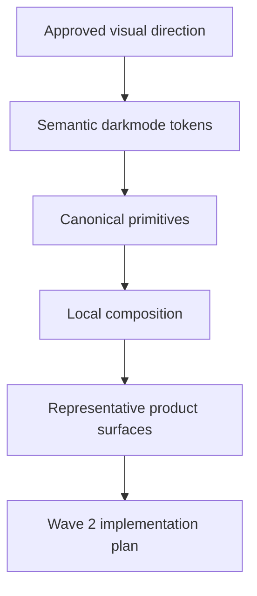

# Darkmode Theme Hardening Design

**Spec**: `.specs/features/darkmode-theme-hardening/spec.md`
**Status**: Draft

---

## Architecture Overview

Wave 1 is an audit-and-classification wave.

Its job is not to repaint the whole product yet.
Its job is to prove where darkmode authority is leaking and to define the safest path for Wave 2 implementation.

The guiding rule remains:

1. semantic tokens own theme intent
2. canonical primitives own shared visual behavior
3. local CSS composes the system
4. local CSS does not become a second theme engine

The approved `design-guideless.md` now adds aesthetic direction, but it must enter through the same ladder.

---

## Wave 1 Mission

Wave 1 must answer three questions with evidence:

1. which darkmode problems belong to tokens
2. which darkmode problems belong to canonical shared components
3. which darkmode problems are local residual debt

If we skip this separation, implementation becomes a patch storm.

In child-language terms:
if one room is cold, we first check whether the heater is broken, whether the main pipe is broken, or whether only that room left the window open.

---

## Approved Theme Direction to Absorb

The following direction is now explicitly approved from `docs/architecture/design-guideless.md`:

1. premium dark root near `#0a0a0f`
2. iOS-inspired complete light mode
3. semantic neon accents:
   - red `#ff0844`
   - yellow `#ffb020`
   - green `#00ff88`
   - blue `#00d4ff`
   - purple `#af52de`
4. restrained glassmorphism for cards and overlays
5. discreet modern scrollbar

### Translation Rule

This direction must be translated like this:

| Design direction | Canonical host |
| --- | --- |
| root background, text, borders, accent semantics | `static/css/design-system/tokens.css` |
| shared cards and panel treatment | `static/css/design-system/components/cards.css` |
| shared hero tone and support panel readability | `static/css/design-system/components/hero.css` |
| notices and support copy hierarchy | `static/css/design-system/components/states.css` |
| shell chrome and toggle experience | `static/css/design-system/topbar.css` |
| shared frame and scrollbar polish | `static/css/design-system/shell.css` and token-backed global styling |

---

## Audit Classification Model

Wave 1 classifies findings into three buckets.

### Bucket A: Token Gaps

These are problems caused by missing or too-shallow semantic tokens.

Typical signals:

1. shared CSS needs raw `rgba(...)` values to tune contrast
2. darkmode surfaces need repeated gradient recipes
3. accent glow intensity is hardcoded instead of semantic
4. scrollbar or chrome styling has no token path

### Bucket B: Canonical Primitive Drift

These are problems where shared components still embed too much local visual decision.

Typical signals:

1. shared cards mix token usage with direct atmosphere values
2. heroes depend on special local overrides for readable dark mode
3. shell or topbar still use hardcoded translucent whites
4. notices or helper panels lose hierarchy because the primitive is too weak

### Bucket C: Local Residual Debt

These are problems where individual pages still act as light-first theme owners.

Typical signals:

1. `body[data-theme="dark"]` branches in page CSS
2. repeated hex values or `rgba(...)` values for surfaces and text
3. status colors written directly into local files
4. mobile-only dark repainting in local modules

---

## Wave 1 Findings by Layer

### 1. Token Layer Findings

**Host**: `static/css/design-system/tokens.css`

Current state:

1. base dark tokens already exist
2. light and dark roots are functional
3. accent roles exist, but the approved palette is not yet aligned
4. semantic vocabulary is still narrow for shell surfaces, glass intensity, and scrollbar styling

Wave 1 conclusion:

1. tokens need palette alignment
2. tokens need clearer surface tiers for premium dark glass
3. tokens need shared semantics for chrome, overlay, and scrollbar treatment

### 2. Canonical Shared Components

#### Cards

**Host**: `static/css/design-system/components/cards.css`

Current state:

1. already canonical and token-aware
2. still embeds some atmosphere recipes directly in the component layer
3. likely safe to harden in Wave 2 after token expansion

Classification: `canonical primitive drift`

#### Hero

**Host**: `static/css/design-system/components/hero.css`

Current state:

1. strong shared base exists
2. still carries direct white inset shadows and local atmosphere assumptions
3. depends on workspace overrides for some dark premium behavior

Classification: `canonical primitive drift`

#### States and Notices

**Host**: `static/css/design-system/components/states.css`

Current state:

1. reasonably token-driven
2. likely lower risk than cards and shell
3. still needs verification under the new neon role mapping

Classification: `mostly healthy, validate in Wave 2`

#### Topbar

**Host**: `static/css/design-system/topbar.css`

Current state:

1. already framed as a canonical host
2. still contains several direct visual recipes and isolated literal colors
3. should consume the approved palette more semantically

Classification: `canonical primitive drift`

#### Shell Frame

**Host**: `static/css/design-system/shell.css`

Current state:

1. carries explicit light and dark translucent white recipes
2. darkmode shell frame still uses hand-tuned values instead of deeper semantic tokens
3. should become more token-backed before polishing downstream screens

Classification: `canonical primitive drift`

### 3. Local Residual Debt

#### Workspace

**Host**: `static/css/design-system/workspace.css`

Current state:

1. behaves like a local theme engine for workspace panels and hero overrides
2. carries strong light and dark recipes inline
3. useful as evidence, but dangerous as a long-term authority

Classification: `local residual debt with shared blast radius`

#### Student Form Stepper

**Host**: `static/css/catalog/student_form_stepper.css`

Current state:

1. many light-first gradients and dark overrides
2. direct status hex colors for paid, overdue, and pending
3. multiple hand-tuned surface recipes

Classification: `high-priority local residual debt`

#### Intake

**Host**: `static/css/onboarding/intakes.css`

Current state:

1. direct text colors and table contrast values
2. mobile darkmode repainting at the local file level
3. mini-card surfaces own their own atmosphere

Classification: `high-priority local residual debt`

#### Import Progress

**Host**: `static/css/catalog/import-progress.css`

Current state:

1. progress track, bar, metric cards, and error list still use hardcoded colors
2. semantics are clear, but not tokenized
3. good candidate for early low-risk migration

Classification: `medium-priority local residual debt`

#### Dashboard Residual Card Dialect

**Host**: `static/css/design-system/dashboard.css` and `static/css/design-system/neon.css`

Current state:

1. some dashboard-side surfaces still present themselves through local wrappers such as `dashboard-side-card`, `dashboard-support-card`, `dashboard-table-card`, and `layout-panel`
2. template hosts like `table-card` and `hero operation-hero` are present, but local dashboard layers still appear to repaint them into a parallel family
3. examples already visible in runtime language include:
   - `section.hero.operation-hero[data-panel="dashboard-hero"]`
   - `table-card layout-panel layout-panel--stack dashboard-table-card dashboard-side-card dashboard-support-card dashboard-side-card-sticky`
   - `table-card layout-panel layout-panel--stack dashboard-table-card dashboard-side-card dashboard-support-card owner-sessions-panel`
   - `card-body card-body-metric` inside dashboard-specific composition
4. there is also a dashboard narrative banner that behaved like a hero without formally inheriting the canonical `.hero` host

Classification: `high-priority residual card conformance debt`

Interpretation:

the card base is now healthier, but some dashboard layers are still dressing it in an older dialect.
This is like putting the team in the same uniform and then letting a few departments wear their old jackets on top.

---

## Wave 1 Output Contract

Wave 1 is complete when it leaves behind:

1. one approved classification map for token gaps, primitive drift, and local residual debt
2. one prioritized execution order for Wave 2
3. one rule for how the approved palette enters the system without creating a parallel authority

---

## Recommended Wave 2 Order

1. `static/css/design-system/tokens.css`
2. `static/css/design-system/shell.css`
3. `static/css/design-system/components/cards.css`
4. `static/css/design-system/components/hero.css`
5. `static/css/design-system/topbar.css`
6. `static/css/design-system/workspace.css`
7. `static/css/catalog/student_form_stepper.css`
8. `static/css/onboarding/intakes.css`
9. `static/css/catalog/import-progress.css`

This order fixes the water source before polishing the faucets.

## Recommended Next Order After Wave 3

1. `static/css/design-system/dashboard.css`
2. `static/css/design-system/neon.css`
3. dashboard templates using `dashboard-side-card`, `dashboard-support-card`, `dashboard-table-card`, `layout-panel`, and `owner-sessions-panel`

This is the card-conformance pass:

1. keep `.card`, `.table-card`, and `.hero` as the visual authority
2. let dashboard-local classes define composition and semantics
3. stop dashboard wrappers from repainting the base family into a second theme
