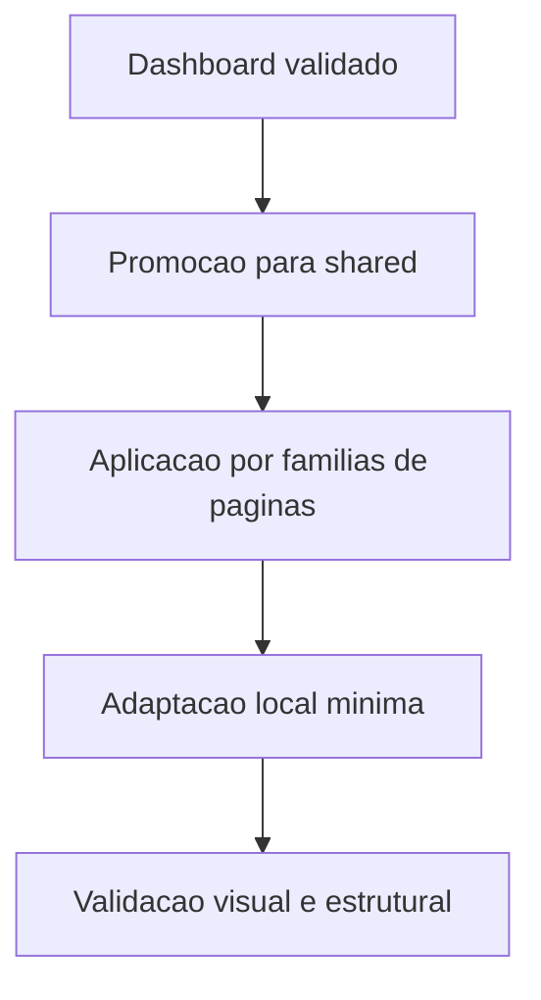

# Dashboard Pattern Propagation Waves Design

**Spec**: `.specs/features/dashboard-pattern-propagation-waves/spec.md`
**Status**: Draft

---

## Architecture Overview

A arquitetura desta frente separa quatro niveis de decisao:

1. docs e governanca
2. design system compartilhado
3. familias de paginas
4. polimento local

## Code Reuse Analysis

### Existing Components to Leverage

| Component | Location | How to Use |
| --- | --- | --- |
| Hero canonico | `static/css/design-system/components/hero.css` | Receber variantes oficiais e knobs compartilhados |
| Host do hero | `templates/includes/ui/layout/page_hero.html` | Declarar variantes por pagina sem markup paralelo |
| Shell | `static/css/design-system/shell.css` | Herdar atmosfera base sem reabrir a casca |
| Topbar | `static/css/design-system/topbar.css` | Reusar a linguagem premium-controlada nas outras telas |
| Sidebar | `static/css/design-system/sidebar/` | Reusar o trilho editorial sem criar outra familia |

### Integration Points

| System | Integration Method |
| --- | --- |
| `docs/plans` | Registrar o plano canonico para navegacao humana e futura |
| `.specs/features` | Quebrar a frente em spec, design, tasks e C.O.R.D.A. |
| Skills locais | `octobox-design` governa a assinatura visual e `CSS Front end architect` governa ownership, modularidade e hygiene |

## Page Family Strategy

### Family 1. Foundation Shared

Escopo:

1. `hero`
2. `card` e `table-card`
3. `topbar`
4. `sidebar`
5. shell e atmosfera base

Regra:

1. so entra aqui o que servir para mais de uma tela

### Family 2. Catalog Core

Escopo:

1. `students`
2. `finance`
3. `finance-plan-form`
4. `class-grid`

Regra:

1. herdar opening, surface e command hierarchy
2. manter a composicao local propria de cada tela

### Family 3. Operations Roles

Escopo:

1. `manager`
2. `reception`
3. `coach`
4. `dev`

Regra:

1. padrao compartilhado, persona local
2. nenhuma role vira clone do dashboard

### Family 4. Special Cases

Escopo:

1. superficies hibridas
2. placeholders
3. telas com markup especial

Regra:

1. adaptar sem contaminar o design system com excecoes demais

## Tech Decisions

| Decision | Choice | Rationale |
| --- | --- | --- |
| Unidade de rollout | Ondas por familia | Reduz regressao e facilita leitura de impacto |
| Fonte oficial do plano | `docs/plans` + `.specs/features` | Mantem governanca e execucao no mesmo trilho |
| Skills obrigatorios | `octobox-design` e `CSS Front end architect` | Garante assinatura correta e higiene estrutural |
| Criterio de migracao | shared first, local second | Evita copiar solucao local como se fosse padrao |

## Risks

| Error Scenario | Handling | User Impact |
| --- | --- | --- |
| Copiar CSS do dashboard direto para outras telas | Bloquear e promover para host/variante primeiro | Menor risco de caos visual futuro |
| Misturar familias muito diferentes na mesma onda | Separar por grupo funcional | Menor risco de regressao difusa |
| Criar excecao local cedo demais | Validar no host canonico antes | Menor debito tecnico e menos override |

