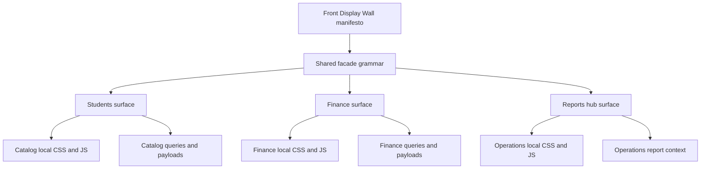

# Front Display Wall Refinement Design

**Spec**: `.specs/features/front-display-wall-refinement/spec.md`
**Context**: `.specs/features/front-display-wall-refinement/context.md`
**Status**: Approved

---

## Architecture Overview

This is a patch-first front refinement across three visible surfaces:

1. `students`
2. `finance`
3. `reports-hub`

The architecture does not reopen domain or routing foundations. Instead, it refines the visible facade layer through:

- stronger top-of-page command layers
- reduced inline front-end debt
- improved semantic and accessibility contracts
- lighter perceived load on first render

The key design rule is:

- keep the runtime architecture stable
- patch the visible experience hard
- only reconstruct locally where the top-of-page facade or interaction contract is clearly underpowered

---

## Code Reuse Analysis

### Existing Components to Leverage

| Component | Location | How to Use |
| --- | --- | --- |
| Shared hero patterns | `static/css/design-system/components/hero.css` | Reuse visual grammar for command-layer tops |
| Metric cards | `templates/includes/ui/shared/metric_card.html` | Keep as part of the operational facade |
| Shared action/button system | `static/css/design-system/components/actions.css` | Use for primary and secondary CTA consistency |
| Shared states/notices | `static/css/design-system/components/states.css` | Reuse for priority notices and next-step blocks |
| Catalog shared facade base | `static/css/catalog/shared.css` | Extend instead of inventing per-page layout primitives |
| Finance local modules | `static/css/catalog/finance/` | Apply page-local hierarchy refinements without leaking into the whole system |
| Existing interactive tabs | `static/js/pages/interactive_tabs.js` | Harden semantics and fallback instead of replacing immediately |

### Integration Points

| System | Integration Method |
| --- | --- |
| Students page | Refine `templates/catalog/students.html` and included student partials |
| Finance page | Refine `templates/catalog/finance.html` and finance includes |
| Reports hub | Refine `templates/operations/reports-hub.html` and page-local assets |
| Front grammar docs | Follow `docs/experience/front-display-wall.md` and `docs/experience/layout-decision-guide.md` |
| Codebase constraints | Respect `.specs/codebase/CONVENTIONS.md`, `.specs/codebase/CONCERNS.md`, and `.specs/codebase/STRUCTURE.md` |

---

## Components

### Shared Priority Notice Layer

- **Purpose**: Create a calm but explicit block that answers "what matters now" on each main surface
- **Location**: likely shared CSS in `static/css/design-system/components/states.css` plus local template insertion per page
- **Interfaces**:
  - page title
  - current pressure summary
  - next action summary
- **Dependencies**: existing page payloads and local page copy
- **Reuses**: shared states/notices and hero typography

### Students Command Surface

- **Purpose**: Turn the top of students into a readable command layer instead of a plain header + controls slab
- **Location**: `templates/catalog/students.html` plus student local CSS/JS
- **Interfaces**:
  - clear title and page role
  - one primary CTA
  - visible priority summary
  - quick indicators for student health and payment state
- **Dependencies**: student page payload, filters, KPI cards
- **Reuses**: existing KPI grid, catalog shared layout, current student partials

### Finance Command Surface

- **Purpose**: Turn finance into a pressure-and-decision cockpit with clearer staged loading
- **Location**: `templates/catalog/finance.html` plus finance includes and local CSS/JS
- **Interfaces**:
  - hero that communicates current financial pressure
  - priority rail emphasis
  - context summary block
  - staged or lighter tab behavior
- **Dependencies**: finance payload, interactive tabs, hero actions
- **Reuses**: existing finance hero, rail, queue, and portfolio structures

### Reports Hub Controlled Secondary Surface

- **Purpose**: Make the hub feel deliberate and alive even while export commands stay visually hidden
- **Location**: `templates/operations/reports-hub.html` plus page-local CSS
- **Interfaces**:
  - purposeful heading
  - per-card next step
  - controlled explanation of hidden exports
- **Dependencies**: current operations context only
- **Reuses**: current card layout structure and state notice pattern

### Interaction Hygiene Layer

- **Purpose**: Move inline JS/CSS into stable assets and improve semantics/fallbacks
- **Location**:
  - `templates/catalog/includes/student/student_directory_panel.html`
  - `templates/includes/catalog/finance/boards/control_board.html`
  - `templates/includes/catalog/finance/boards/queue_board.html`
  - corresponding static CSS/JS modules
- **Interfaces**:
  - bulk selection
  - filter summaries
  - tab semantics
  - keyboard/focus behavior
- **Dependencies**: current DOM IDs and data attributes
- **Reuses**: existing page scripts and design-system classes

---

## Data Models

No new persistent data model is required for this phase.

Optional later-phase enhancement:

- cached or snapshot-backed KPI and tab payloads for high-traffic surfaces

That remains a performance enhancement, not a structural requirement for this refinement phase.

---

## Error Handling Strategy

| Error Scenario | Handling | User Impact |
| --- | --- | --- |
| Broken upload form attribute | Fix template contract directly | Prevent visible operational failure |
| Markup mismatch in finance queue | Fix semantic container closing tag | Prevent layout and assistive-tech drift |
| Hidden export state causes dead-end feeling | Replace placeholder copy with controlled next-step guidance | Preserve trust without exposing hidden tools |
| Inline JS extraction breaks behavior | Keep IDs/data attributes stable and verify parity | Prevent regression while improving hygiene |
| Staged rendering introduces state mismatch | Default to safe active-tab fallback before deeper lazy loading | Avoid blank or confusing first frames |

---

## Tech Decisions

| Decision | Choice | Rationale |
| --- | --- | --- |
| Delivery mode | Patch-first, selective local rebuild | The architecture is stable; the facade is what needs refinement |
| Scope center | Students, finance, reports hub | These are the most visible and currently discussed surfaces |
| Hero strategy | Shared command grammar, local expression | Keeps continuity without flattening page identity |
| Export stance | Backend preserved, UI hidden | Matches current product decision and avoids rework |
| Inline debt | Extract from primary facade surfaces first | Highest maintenance and consistency ROI |
| Performance posture | Perceived speed first, deep optimization second | Fits the current stage of front-facing refinement |

---

## Notes From Codebase Constraints

1. Keep JavaScript vanilla-first and attach behavior to stable IDs and data attributes.
2. Respect CSS ownership:
   - shared primitives in design system or catalog shared
   - page-specific semantics in local CSS
3. Avoid reopening model, migration, or financial backend structure in this phase.
4. Any future snapshot/cache improvement should respect the existing Shadow State concerns documented in `.specs/codebase/CONCERNS.md`.

---

## Recommended Execution Shape

This feature should be delivered in three waves:

1. integrity and hygiene
2. facade hierarchy and hero refinement
3. perceived speed and accessibility hardening

That keeps risk low and preserves the current product while upgrading the visible experience.
