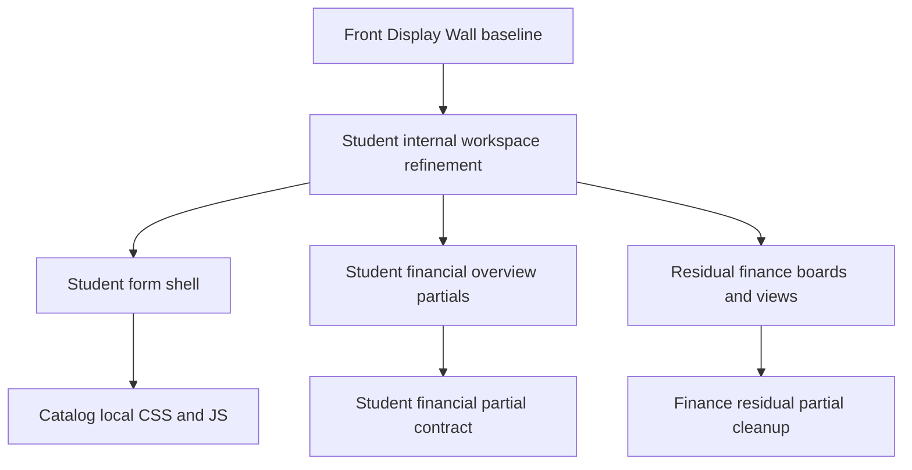

# Student Financial Workspace Refinement Design

**Spec**: `.specs/features/student-financial-workspace-refinement/spec.md`
**Context**: `.specs/features/student-financial-workspace-refinement/context.md`
**Status**: Draft

---

## Architecture Overview

This is a patch-first refinement of the deeper student and finance operational workspace.

Primary target surfaces:

1. `templates/catalog/student-form.html`
2. `templates/includes/catalog/student_form/financial/*`
3. `templates/includes/catalog/finance/views/movements.html`
4. `templates/includes/catalog/finance/boards/portfolio_board.html`

The architecture stays stable. We do not reopen domain models, routing, or financial workflow rules. We refine the inner workspace through:

- structural hygiene and markup correction
- reduced inline debt
- better grouping and hierarchy inside dense panels
- improved trust in sensitive student and finance interaction zones

The key design rule is:

- keep the business workflow stable
- refine the deep interior hard
- only reconstruct locally when the existing contract is clearly too weak

---

## Code Reuse Analysis

### Existing Components to Leverage

| Component | Location | How to Use |
| --- | --- | --- |
| Shared hero grammar | `static/css/design-system/components/hero.css` | Reuse tone and hierarchy for the student form upper layer where useful |
| Shared state/notice language | `static/css/design-system/components/states.css` | Reuse for lock states, empty states, and contextual notices |
| Student local CSS modules | `static/css/catalog/students/` | Borrow rhythm and spacing grammar without flattening identity |
| Finance local CSS modules | `static/css/catalog/finance/` | Reuse for internal finance consistency where safe |
| Existing student form partial split | `templates/includes/catalog/student_form/` | Keep and strengthen, instead of collapsing back into one template |
| Existing lock JS | `static/js/catalog/student_form_lock.js` | Preserve behavior while improving the visual contract around it |

### Integration Points

| System | Integration Method |
| --- | --- |
| Student form shell | Refine `templates/catalog/student-form.html` and its local includes |
| Student financial overview | Refine partials under `templates/includes/catalog/student_form/financial/` |
| Finance residual panels | Clean `movements.html`, `portfolio_board.html`, and adjacent residual templates |
| Front grammar docs | Follow `docs/experience/front-display-wall.md` and `docs/experience/layout-decision-guide.md` |
| Codebase constraints | Respect `.specs/codebase/CONVENTIONS.md`, `.specs/codebase/CONCERNS.md`, and current modular split |

---

## Components

### Student Form Workspace Shell

- **Purpose**: Make the student form feel like a deliberate workspace, not just a form container with a financial tab bolted on
- **Location**: `templates/catalog/student-form.html`
- **Interfaces**:
  - top-level page framing
  - lock state presentation
  - essential vs financial workspace transition
- **Dependencies**: `student_form_page`, lock context, existing includes
- **Reuses**: student workspace shell, existing hero include, current local JS

### Student Financial Overview Cluster

- **Purpose**: Make the financial interior easier to scan and safer to trust
- **Location**: `templates/includes/catalog/student_form/financial/*`
- **Interfaces**:
  - current plan
  - KPIs
  - payment rows
  - history
  - enrollment actions
- **Dependencies**: existing student/payment context from `catalog/views/student_views.py`
- **Reuses**: current modular partial split

### Residual Finance Internal Panels

- **Purpose**: Clean remaining panels that still expose visible debt after the facade pass
- **Location**:
  - `templates/includes/catalog/finance/views/movements.html`
  - `templates/includes/catalog/finance/boards/portfolio_board.html`
- **Interfaces**:
  - residual board headings
  - record rows
  - empty states
  - semantic wrappers
- **Dependencies**: `finance` page payloads already present
- **Reuses**: current board layout structure and shared state components

### Internal Interaction Trust Layer

- **Purpose**: Extend accessible and semantic trust into deeper operational surfaces
- **Location**:
  - student form shell
  - student financial partials
  - finance residual panels
- **Interfaces**:
  - focus
  - lock status clarity
  - semantic grouping
  - calm state transitions
- **Dependencies**: stable IDs, current page behavior
- **Reuses**: existing JS hooks and design-system classes

---

## Data Models

No new persistent data model is required for this phase.

No model migration should be introduced unless a true workflow bug makes it unavoidable.

That guardrail matters because these surfaces sit on sensitive student and finance flows and the current pain is mostly presentation and interaction debt, not schema design.

---

## Error Handling Strategy

| Error Scenario | Handling | User Impact |
| --- | --- | --- |
| Inline lock banner presentation is fragile | Move dominant presentation into CSS while preserving JS hook behavior | Clearer and safer lock feedback |
| Residual finance board has broken semantic closing tags | Fix markup first before visual passes | Prevent layout and assistive-tech drift |
| Encoding corruption damages trust | Normalize text and preserve meaning in PT-BR | Avoid low-trust product appearance |
| Dense financial partial cleanup breaks behavior | Preserve hooks and refine incrementally | Avoid operational regressions |
| Internal workspace still feels too dense after cleanup | Reorder grouping locally before considering broader rebuild | Lower risk and stronger continuity |

---

## Tech Decisions

| Decision | Choice | Rationale |
| --- | --- | --- |
| Delivery mode | Patch-first, selective local rebuild | Deep flows are sensitive and already functional |
| Scope center | Student form + internal finance workspace | This is where contrast is highest now |
| Structural stance | Fix markup and inline debt before style polish | Cosmetic gains on crooked structure are fragile |
| Copy stance | Calm, current, product-grade language | Deep flows should feel as mature as the facade |
| Accessibility stance | Extend trust pass into deep surfaces | Confidence must survive beyond the first click |

---

## Notes From Codebase Constraints

1. Keep JavaScript vanilla-first and attach behavior to stable IDs and `data-*` hooks.
2. Preserve the current modular split under `student_form/financial/` instead of collapsing files just to "simplify".
3. Avoid touching financial models or billing rules in this phase.
4. Treat payment and enrollment surfaces as sensitive operational areas; visual cleanup cannot compromise behavior.

---

## Recommended Execution Shape

This feature should be delivered in four waves:

1. structural hygiene
2. student form hierarchy
3. internal finance calm and continuity
4. interaction trust pass

That sequence keeps us from decorating a room before fixing the cracked frame behind the wall.
