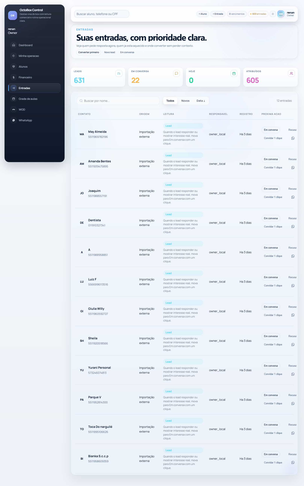
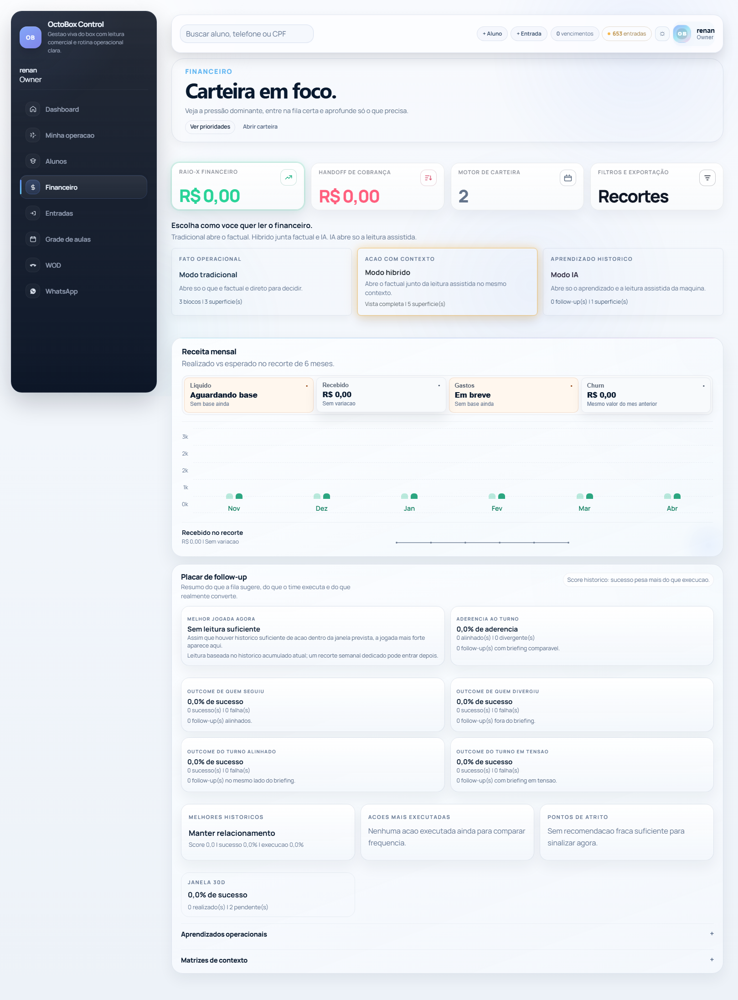

<!--
FILE: main public overview of the project.

WHY IT EXISTS:
- Explains the product, its architecture, execution flow, and onboarding path for anyone entering the repository.

WHAT THIS FILE DOES:
1. Summarizes the current functional scope.
2. Explains the project structure.
3. Documents local execution and deploy/staging paths.

DOCUMENT TYPE:
- institutional and strategic entry point

AUTHORITY:
- high for general repository context

PARENT DOCUMENT:
- none; this is the public starting point of the repository

WHEN TO USE:
- when the question is what the product is, what the main direction is, and which document to open first

CRITICAL POINTS:
- This file must stay aligned with the product reality so it does not sell a false version of the system.
- This file must not become a detailed debugging guide or an exhaustive code map.
-->

# OctoBox Control

Official README in English. The Portuguese version is available as an annex in [README.pt-BR.md](README.pt-BR.md).

OctoBox is an operational hub for boxes and gyms that need to move beyond improvised WhatsApp workflows, spreadsheets, and an admin surface that is too raw for day-to-day reality.

## Visual Preview

Below are real product snapshots already available in the repository, chosen to show both the commercial face of the product and the operational surfaces that drive daily work.

<p align="center">
  
  
</p>

<p align="center">
  
  
</p>

<p align="center">
  
</p>

## The problem OctoBox solves

In practice, many boxes grow with fragmented operations: leads in WhatsApp, students in spreadsheets, billing in manual controls, scheduling in team memory, and management decisions without trustworthy visibility. The result is usually rework, lost commercial opportunities, financial delays, follow-up failures, and a routine that depends too much on whoever happens to be serving at the moment.

## The solution proposed by the project

OctoBox was designed to concentrate that operation into a single, clear, and day-to-day usable flow. It connects students, intake, plans, enrollments, billing, class scheduling, attendance, auditing, and management visibility in an operational base that is simple to navigate. The project's proposal is to turn scattered routine into a visible, traceable, and actionable process for reception, management, coaches, and owners.

## Execution milestone

The first functional milestone of the project was delivered in less than 24 hours.

Timeline of this first cycle:

1. project started on 2026-03-10
2. main functional milestone reached on 2026-03-11
3. first version ready for operation, with a validated functional base and future evolution focused on new features, refinements, and improvements

## Current scope

- student base with legacy primary phone, but WhatsApp channel identity already hardened through a searchable blind index
- intake center for leads and provisional entries before definitive registration, with structured payloads for future traceability
- lightweight student registration and edit flow with intake conversion
- immediate connection between student, plan, enrollment, and initial billing
- one-time, installment, or recurring billing from the student record
- direct actions in the student record to update billing, mark payment, cancel, refund, regenerate, and reactivate enrollment
- visual finance center with filters by time window, plan, status, and method
- shell navigation and operational shortcuts consolidated through a central route contract
- initial dashboard for fast operational reading
- classes, attendance, check-in, check-out, absences, and operational incidents
- built-in authentication with owner, dev, manager, reception, and coach roles
- role-filtered navigation
- audit trail for login, logout, admin changes, and sensitive product actions
- student app with identity, invite entry, active-box switching, online-first PWA shell, class grid, WOD, RM, settings, and offline support
- finance queue with follow-up analytics, risk reading, and semi-assisted operational outreach
- quick sales surface connected into student finance operations
- lead import pipeline with guided volume routing, operational policy, and nightly scheduling path

## Current operational state

- recent hardening wave already landed on `main`
- WhatsApp identity contract with blind index, historical backfill, and uniqueness constraint
- shell navigation contract stabilized across the core surfaces
- visual student and finance flows updated and protected by catalog and finance tests
- finance follow-up analytics, retention queue reading, and churn foundation already live in the visual finance surface
- student directory now carries operational KPI shortcuts, 30-day growth reading, and an expanded quick panel flow
- owner, manager, reception, and dev surfaces already absorb the newer shared shell and page-payload contracts
- CI workflow for performance and integrity already tracks migrate, fixture loading, and a supported PostgreSQL baseline
- admin hardened with a configurable private path and centralized role gate
- scope-based throttling active for login, admin, writes, exports, dashboard, heavy reads, and autocomplete
- optional shared cache through Redis, with local fallback and safe degradation when external cache fails
- presenters and page payloads consolidated across the main dashboard, catalog, guide, and operations surfaces
- student app identity and membership flows already promoted, including invite-based access and box switching
- student app navigation now already carries the Grade, WOD, and RM direction in the current shell
- lead import execution now already includes a documented pipeline, background path, and nightly scheduler support
- published-page probes, request timing, and finance snapshot timing telemetry already inform the current performance work
- docs now also have a guided architecture layer in `docs/guides/` for onboarding by topic and by profile

## Technical capabilities already in the repository

The project already carries a broader technical surface than a CRUD back office. Today the repository includes these capabilities:

- internal project RAG with document ingestion, chunking, optional embeddings, hybrid lexical plus semantic retrieval, answer generation with citations, and authenticated API endpoints for `health`, `search`, `answer`, and `reindex`
- webhook boundaries for WhatsApp poll votes and Resend invitation delivery, with normalized contracts, verification, correlation id propagation, and integration-focused API routes under `api/v1/integrations/*`
- idempotency and replay protection at multiple layers, including shared idempotency helpers, Stripe checkout idempotency keys, webhook fingerprint deduplication, `X-Idempotency-Key` support, and persistent webhook event tracking with retry metadata
- Stripe payment integration for hosted checkout sessions, Pix and card payment methods, optimistic concurrency awareness through payment versioning, and audit trail entries for checkout initiated and checkout failed flows
- Signal Mesh primitives for external events and async boundaries, including signal envelopes, correlation ids, idempotency key resolution, retry policy, failure classification, and runtime retry sweep visibility
- scheduled webhook retry and reprocessing flows, with due retry sweep commands, WhatsApp webhook event persistence, backoff-aware retry decisions, and monitoring hooks for dispatched versus skipped retries
- security hardening around authentication and privileged surfaces, including role-gated access, private admin path support, CSP headers, trusted proxy handling, blocked IP and range support, and security logging
- rate limiting and throttling for login, admin, writes, heavy reads, exports, autocomplete, anti-exfiltration paths, anti-card-testing protection, and student or identity-specific abuse windows
- session and device protection, including cache-backed Django sessions, device fingerprint binding, student session fingerprint checks, and automatic forced re-authentication when the device signature changes materially
- honeypot and deception controls, including honeypot role isolation, IP-based honeypot triggers, global threat bit activation, and middleware that traps suspicious actors into a controlled fake surface
- encrypted and privacy-aware identity handling, including blind index lookup for WhatsApp and student phone resolution, encrypted PII fields, webhook fingerprint uniqueness, and invite-token cookie hardening to keep sensitive invite tokens out of public URLs
- Redis-backed cache and runtime acceleration, including shared cache with safe degradation, page and snapshot caching, role caching, student app smart snapshots for agenda, home, WOD, and RM, plus request-level cache telemetry surfaced in `Server-Timing`
- runtime observability and monitoring, including health endpoints, Prometheus middleware, request timing telemetry, Signal Mesh runtime snapshots, Red Beacon and Alert Siren support, and metrics for realtime and retry channels
- background and async job execution without forcing an external queue first, including async job registry and dispatch paths, reindex job dispatch for project knowledge, and room to evolve toward heavier workers later
- mobile-first student surface with identity, invite-based onboarding, active-box switching, PWA manifest and service worker, offline support, WOD, RM, class schedule, attendance confirmation, and cache-aware student runtime telemetry
- operational WOD tooling that already goes beyond editing a single class, including approval corridors, post-publication history, weekly smart paste, projection preview, replication batches, undo flows, and quick RM edits tied to workout context

## Current project snapshot

Today the project is best described as:

1. a domain-oriented modular monolith
2. with `boxcore` preserved as historical Django state, not as the best explanation of the current runtime
3. with stronger public facades, page-payload contracts, and presenter-based screen assembly
4. with a real mobile/PWA student surface already in motion alongside the main web operation
5. with active work focused on performance discipline, operational imports, student experience, and safer production rollout

## How to use the documentation

Use the docs by question level:

1. this README explains the product, current state, and overall direction
2. [docs/reference/documentation-authority-map.md](docs/reference/documentation-authority-map.md) tells you which doc wins when there is conflict, age, or ambiguity
3. [docs/guides/README.md](docs/guides/README.md) gives a guided reading layer for architecture, methodology, backend, frontend, CSS, performance, security, and profile-based onboarding
4. docs in [docs/architecture](docs/architecture) define the thesis, principles, and structural direction
5. docs in [docs/plans](docs/plans) define active fronts and execution order
6. [docs/reference/reading-guide.md](docs/reference/reading-guide.md) is for navigating the code and debugging the codebase, not for defining product direction
7. [docs/map/1-map-by-tests.md](docs/map/1-map-by-tests.md) maps the live project skeleton from the current test suite
8. docs in [docs/rollout](docs/rollout) are for release, staging, and field operations

## OctoBox governance

The project uses three governance rails so it does not become a construction site where each person is looking at a different map:

1. documentation and precedence: [docs/reference/documentation-authority-map.md](docs/reference/documentation-authority-map.md)
2. technical conventions and C.O.R.D.A.: [.specs/codebase/CONVENTIONS.md](.specs/codebase/CONVENTIONS.md)
3. technical runtime reading: [docs/reference/reading-guide.md](docs/reference/reading-guide.md)

Practical translation:

1. `C.O.R.D.A.` means `Context`, `Objective`, `Risks`, `Direction`, and `Actions`
2. use this framework when we are closing beta, prioritizing UX, or deciding between polish and structural correction
3. first we align the ground, then we choose the route; this avoids putting varnish on a door that still does not close properly

## Quick product reading

Today the system has four main product layers:

1. role-based operations
2. visual catalog for students and finance
3. student app and identity surface
4. admin back office and auditing

Important for the current technical reading:

1. `boxcore` should no longer be read as the center of the runtime
2. it remains in the project as a legacy Django state app
3. the current runtime should prefer real apps such as `access`, `catalog`, `operations`, `students`, `finance`, `auditing`, `communications`, `api`, `integrations`, and `jobs`

In the areas with the highest rule density, the codebase was organized more explicitly:

1. domain-based HTTP views
2. read queries and snapshots
3. business rule actions and workflows

This README stops at the institutional and strategic layer. To navigate file by file, reading sequence, bug hotspots, and runtime technical boundaries, use [docs/reference/reading-guide.md](docs/reference/reading-guide.md).

If you want to study the codebase in pedagogical order, use [docs/reference/reading-guide.md](docs/reference/reading-guide.md).

If you want to understand how the project's CSS should be organized, expanded, and debugged without turning into accumulated patchwork, use [docs/experience/css-guide.md](docs/experience/css-guide.md).

If a visual change appears in `static/` but does not show up in the UI, audit static drift before assuming the CSS is wrong:

1. run `.\.venv\Scripts\python.exe .\manage.py check_static_drift --strict`
2. if drift is detected, run `.\.venv\Scripts\python.exe .\manage.py collectstatic --noinput`
3. for fast local mirroring, use `.\.venv\Scripts\python.exe .\manage.py sync_runtime_assets --collectstatic`

If you want to understand the official visual theme of the product, which aesthetic language wins when there is conflict, and how OctoBox defines its Futuristic Luxury 2050 signature, use [docs/architecture/themeOctoBox.md](docs/architecture/themeOctoBox.md).

If you want to understand specifically what still holds historical state inside `boxcore`, use [docs/architecture/boxcore-model-state-plan.md](docs/architecture/boxcore-model-state-plan.md) and [docs/architecture/boxcore-state-residue-inventory.md](docs/architecture/boxcore-state-residue-inventory.md).

If you want to understand the technical direction for growing without losing simplicity, use [docs/architecture/architecture-growth-plan.md](docs/architecture/architecture-growth-plan.md).

If you want to understand where operational intelligence, scoring, prediction, and ML belong in the architecture without contaminating the transactional core, use [docs/architecture/operational-intelligence-ml-layer.md](docs/architecture/operational-intelligence-ml-layer.md).

If you want to understand the specific strategy for making the business stop depending on Django as the core, use [docs/architecture/django-core-strategy.md](docs/architecture/django-core-strategy.md) and [docs/architecture/django-decoupling-blueprint.md](docs/architecture/django-decoupling-blueprint.md).

If you want to understand the official declaration of what becomes the conceptual center of the system, use [docs/architecture/octobox-conceptual-core.md](docs/architecture/octobox-conceptual-core.md).

If you want to understand the new architectural CENTER that separates access level and internal core, use [docs/architecture/center-layer.md](docs/architecture/center-layer.md).

If you want to understand the complementary structure of signals, integrations, and cross-system expansion, use [docs/architecture/signal-mesh.md](docs/architecture/signal-mesh.md).

If doubt comes up around the mirrored `OctoBox/` folder, treat it as isolated legacy and use [docs/reference/octobox-mirror-legacy-status.md](docs/reference/octobox-mirror-legacy-status.md).

If doubt comes up around `prompts/`, `prototypes/`, or supporting/archive materials, use [docs/reference/support-material-map.md](docs/reference/support-material-map.md).

If you want to understand how the architecture treats temporary construction supports without confusing them with the final structure, use [docs/architecture/scaffold-agents.md](docs/architecture/scaffold-agents.md).

If you want to understand the large front display wall of the product, where the visible experience must stay clean even with side construction and architectural transition, use [docs/experience/front-display-wall.md](docs/experience/front-display-wall.md).

If you want the practical implementation order for the official visual theme, including risk, checklist, and acceptance criteria, use [docs/plans/theme-implementation-final.md](docs/plans/theme-implementation-final.md).

If you want the official plan for reorganizing the front end in alignment with the Front Display Wall, with clear screen contracts and future fit into the Django decoupling movement, use [docs/plans/front-end-restructuring-guide.md](docs/plans/front-end-restructuring-guide.md).

If you want the specific catalog blueprint to standardize `page payload` and `presenter` in students, records, finance, plans, and class grid, use [docs/plans/catalog-page-payload-presenter-blueprint.md](docs/plans/catalog-page-payload-presenter-blueprint.md).

If you want the official step-by-step guide for thinking through, assembling, and validating site layouts while keeping priority, pending work, and next action as structural criteria, use [docs/experience/layout-decision-guide.md](docs/experience/layout-decision-guide.md).

If you want to understand the plan for the new Reception module, its functional boundary, current cost versus future cost, and why this area was reinterpreted as the visible triumph of the construction, use [docs/plans/reception-module-plan.md](docs/plans/reception-module-plan.md).

If you want to understand the official direction of the product's second floor for the mobile app, its visual cleanliness rule, its essential navigation, and the thesis for how OctoBox should become a favorite in people's hands, use [docs/experience/octobox-mobile-guide.md](docs/experience/octobox-mobile-guide.md).

If you want the translation of that direction into concrete screens, prototyping order, and mobile app navigation hierarchy, use [docs/plans/octobox-mobile-screen-blueprint.md](docs/plans/octobox-mobile-screen-blueprint.md).

If you want to understand the upper layer of visible emission and trustworthy signaling of system state, use [docs/architecture/red-beacon.md](docs/architecture/red-beacon.md).

If you want to understand the maximum alert escalation and the defensive posture shift of the building, use [docs/architecture/vertical-sky-beam.md](docs/architecture/vertical-sky-beam.md) and [docs/architecture/alert-siren.md](docs/architecture/alert-siren.md).

If you want the operational security baseline for deploys, throttles, trusted proxies, and an initial blocklist criterion without guesswork, use [docs/reference/production-security-baseline.md](docs/reference/production-security-baseline.md) and [docs/reference/external-security-edge-playbook.md](docs/reference/external-security-edge-playbook.md).

If you want the direct translation of that into Cloudflare rules and a locked-down admin posture, use [docs/reference/cloudflare-edge-rules.md](docs/reference/cloudflare-edge-rules.md).

If you want a consolidated view of the entire architectural building in a single document, use [docs/architecture/octobox-architecture-model.md](docs/architecture/octobox-architecture-model.md).

This structure is also now defined as elastic, with a fixed baseline, controlled expansion, and safe return to the basal state whenever there is structural risk.

If you want to study the architectural criteria behind the decisions, reapply this method in other projects, and learn the terms in plain language, use [docs/reference/personal-architecture-framework.md](docs/reference/personal-architecture-framework.md), [docs/reference/architecture-terms-glossary.md](docs/reference/architecture-terms-glossary.md), and [docs/reference/personal-growth-roadmap.md](docs/reference/personal-growth-roadmap.md).

If you want to understand the reasoning behind the first delivery, the decisions taken, and what I learned during the process, see [docs/history/v1-retrospective.md](docs/history/v1-retrospective.md).

## Architecture snapshot

At a public level, the repository is easier to understand in six slices:

1. `access`, `dashboard`, `catalog`, `operations`
   main web operation, role-based workspaces, students, finance, and class scheduling
2. `student_app`, `student_identity`
   student-facing PWA shell, identity, invite entry, active-box switching, Grade, WOD, RM, and offline support
3. `communications`, `integrations`, `api`, `jobs`
   external boundaries, messaging, webhooks, API surface, and asynchronous work
4. `shared_support`, `monitoring`, `reporting`, `model_support`
   cross-cutting contracts, performance, runtime helpers, observability, and shared base structures
5. `boxcore`
   historical Django state, migrations anchor, and compatibility surface
6. `docs`, `.specs`, `tests`, `scripts`
   governance, plans, rollout, technical reading, validation, and operational tooling

If you need the code-level reading order, ownership map, and debugging entry points, jump to [docs/reference/reading-guide.md](docs/reference/reading-guide.md) instead of using this README as a file-by-file inventory.

## Core product surfaces

- /dashboard/ -> operation summary
- /operacao/owner/ or role-based operation routes -> command surfaces by role
- /alunos/ -> main student base, funnel, and commercial search
- /alunos/novo/ -> lightweight student creation with plan and billing
- /alunos/<id>/editar/ -> commercial student record
- /financeiro/ -> management view of plans, revenue, churn, and finance queue
- /grade-aulas/ -> visual class grid
- /aluno/ -> student app home
- /aluno/grade/ -> student app schedule
- /aluno/wod/ and /aluno/rm/ -> student workout and personal record surfaces

## External and growth boundaries

- /api/ -> official entry point of the product API
- /api/v1/ -> first version API manifesto
- /api/v1/health/ -> basic health for the external boundary
- channel identity already prefers explicit WhatsApp contact and external provider id before the legacy phone fallback
- intake payloads and message logs are now stored as sanitized JSON, with limits and sensitive key masking

## Engineering conventions

Every relevant file should quickly explain its role at the top.

For the header pattern and the official file-template standard, use [docs/reference/new-file-template.md](docs/reference/new-file-template.md).

## Current system roles

- owner: strategic view of the box and maximum business access
- dev: technical maintenance, inspection, support, and controlled auditing
- manager: administrative, commercial, finance, and student operations
- reception: front desk, scheduling, intake, and short-cycle billing inside the operational flow
- coach: technical class routine, attendance, and follow-up

The command to prepare the base groups is:

```bash
python manage.py bootstrap_roles
```

## How to run

1. Create and activate the virtual environment.
2. Install dependencies with `pip install -r requirements.txt`.
3. Copy `.env.example` to `.env` and adjust the minimum required values.
4. Run `python manage.py migrate`.
5. Run `python manage.py bootstrap_roles`.
6. Create an administrative user with `python manage.py createsuperuser`.
7. Start the server with `python manage.py runserver`.
8. Run `python manage.py test` to automatically use the project's test configuration path.

Notes:

- login, logout, admin changes, and sensitive commercial actions already feed the audit trail
- for local environments, the project automatically reads `.env` when it exists
- `python manage.py test` prefers `config.settings.test` and also accepts a local `.env.test` as an optional complement
- for local environments, you can define `DJANGO_SECRET_KEY` in a `.env` file or in system variables
- for environments that use WhatsApp channel identity, also define `PHONE_BLIND_INDEX_KEY`
- the project now accepts `DJANGO_ENV=development` or `DJANGO_ENV=production` to separate local configuration from staging/production
- for staging/production, the recommended path is using `DATABASE_URL` with PostgreSQL, `REDIS_URL` for shared cache, running `collectstatic`, and publishing behind HTTPS
- the public admin path must be defined by `DJANGO_ADMIN_URL_PATH`, not by `/admin/`
- to expose the server on the local network, use the `Run Django Server (LAN)` task or run `python manage.py runserver 0.0.0.0:8000`
- for CI or staging with PostgreSQL, use Postgres 14 or newer

New guides:

- staging deploy: [docs/rollout/deploy-homologation.md](docs/rollout/deploy-homologation.md)
- minimum database backup: [docs/rollout/backup-guide.md](docs/rollout/backup-guide.md)
- production security baseline: [docs/reference/production-security-baseline.md](docs/reference/production-security-baseline.md)
- real mobile validation checklist: [docs/experience/mobile-real-validation-checklist.md](docs/experience/mobile-real-validation-checklist.md)
- backup scripts: [scripts/backup_sqlite.ps1](scripts/backup_sqlite.ps1) and [scripts/backup_postgres.ps1](scripts/backup_postgres.ps1)
- Hostinger VPS production deploy: [docs/rollout/hostinger-vps-production-deploy.md](docs/rollout/hostinger-vps-production-deploy.md)

## License

This project is licensed under the GNU Affero General Public License v3.0 (AGPL-3.0). See [LICENSE](LICENSE).

## Initial student import

The project includes a command to import students by CSV using WhatsApp as the deduplication key.

Supported columns:

- full_name
- whatsapp or phone
- email
- gender
- birth_date in YYYY-MM-DD format
- health_issue_status
- cpf
- status
- notes

Execution:

```bash
python manage.py import_students_csv path/to/students.csv
```

## Ideas that may be smart next steps

- add export for financial and commercial reports
- deepen the recurring follow-up and renegotiation layer
- expand auditing for role-based operational review
- prepare future integrations with WhatsApp, physical assessment, and external billing
