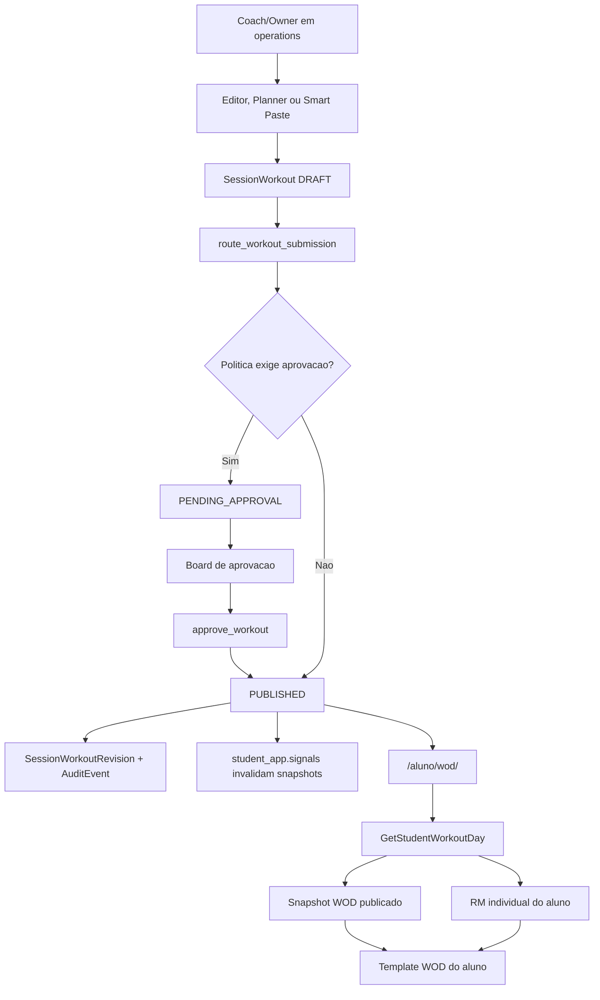

<!--
ARQUIVO: mapa de comunicacao entre app do aluno e WOD operacional.

TIPO DE DOCUMENTO:
- mapa de integracao interna
- mapa de fronteiras entre operacao, modelos compartilhados, cache e app do aluno

AUTORIDADE:
- alta para explicar como WOD sai da operacao e chega ao aluno
- subordinado ao runtime real, testes e codigo atual

DOCUMENTOS PAIS:
- [student-app-complete-map.md](student-app-complete-map.md)
- [student-app-wod-page-structure-map.md](student-app-wod-page-structure-map.md)
- [../reference/operations-wod-ownership-map.md](../reference/operations-wod-ownership-map.md)

QUANDO USAR:
- quando a duvida for "como o WOD publicado chega no app do aluno?"
- quando operacao mostra uma coisa e `/aluno/wod/` mostra outra
- quando Smart Paste, planner, editor, aprovacao ou historico parecerem fora de sincronia com o aluno
- quando precisar separar bug de criacao/aprovacao de bug de consumo no app

POR QUE ELE EXISTE:
- o WOD tem duas vidas: vida operacional antes de publicar e vida do aluno depois de publicar.
- ambas usam modelos compartilhados, mas passam por corredores diferentes.
- este mapa evita tratar bug de cozinha como bug de vitrine.

O QUE ESTE ARQUIVO FAZ:
1. mostra o fluxo de criacao, revisao, publicacao e consumo do WOD.
2. separa responsabilidades de `operations` e `student_app`.
3. explica como cache e sinais mantem o app coerente.
4. lista os pontos de debug quando as camadas discordam.

PONTOS CRITICOS:
- aluno consome apenas `SessionWorkoutStatus.PUBLISHED`.
- Smart Paste cria rascunhos; nao publica direto por si so.
- editor/planner podem publicar direto apenas quando a politica permite.
- qualquer mudanca em WOD publicado precisa preservar revisao, auditoria, versao e invalidacao.
-->

# Como app do aluno e WOD se comunicam

## Tese curta

O WOD se comunica por estado publicado, nao por conversa direta entre telas.

Pense assim:

1. o coach escreve a receita
2. o owner/manager aprova a receita
3. a receita aprovada vai para a prateleira `published`
4. o app do aluno pega apenas o que esta nessa prateleira
5. o cache tira uma foto da receita para servir rapido

Em termos tecnicos:

1. `operations` cria, edita, duplica, projeta, aprova e acompanha WOD
2. `student_app.models` guarda o estado compartilhado do WOD
3. `student_app.application.wod_snapshots` entrega o WOD publicado como snapshot cacheavel
4. `student_app.application.use_cases.GetStudentWorkoutDay` personaliza por aluno
5. `templates/student_app/wod.html` exibe

## Fronteira principal

Modelo compartilhado:

1. [../../student_app/models.py](../../student_app/models.py)

Corredor operacional:

1. [../../operations/workout_editor_views.py](../../operations/workout_editor_views.py)
2. [../../operations/workout_editor_actions.py](../../operations/workout_editor_actions.py)
3. [../../operations/workout_planner_views.py](../../operations/workout_planner_views.py)
4. [../../operations/workout_board_views.py](../../operations/workout_board_views.py)
5. [../../operations/workout_action_views.py](../../operations/workout_action_views.py)
6. [../../operations/workout_support.py](../../operations/workout_support.py)
7. [../../operations/services/wod_projection.py](../../operations/services/wod_projection.py)

Corredor do aluno:

1. [../../student_app/views/wod_context.py](../../student_app/views/wod_context.py)
2. [../../student_app/application/use_cases.py](../../student_app/application/use_cases.py)
3. [../../student_app/application/wod_snapshots.py](../../student_app/application/wod_snapshots.py)
4. [../../templates/student_app/wod.html](../../templates/student_app/wod.html)

Regra:

1. operacao escreve estado
2. app do aluno le estado publicado
3. cache acelera leitura
4. sinais invalidam fotos velhas

## Modelo de dados compartilhado

Arquivo:

1. [../../student_app/models.py](../../student_app/models.py)

Entidades principais:

1. `SessionWorkout` e o WOD de uma `ClassSession`
2. `SessionWorkoutBlock` e um bloco do WOD
3. `SessionWorkoutMovement` e um movimento dentro de um bloco
4. `SessionWorkoutRevision` guarda snapshot historico de eventos
5. `StudentWorkoutView` registra abertura pelo aluno
6. `StudentExerciseMax` e `StudentExerciseMaxHistory` alimentam recomendacao de carga
7. `WeeklyWodPlan`, `DayPlan`, `PlanBlock`, `PlanMovement` alimentam Smart Paste semanal
8. `ReplicationBatch` agrupa WODs criados por projecao semanal

Estados de WOD:

1. `draft`
2. `pending_approval`
3. `published`
4. `rejected`

Regra de visibilidade:

1. aluno so ve `published`
2. operacao ve fila, historico, draft, pending e rejected conforme papel

## Fluxo manual do coach

Arquivos:

1. [../../operations/workout_editor_views.py](../../operations/workout_editor_views.py)
2. [../../operations/workout_editor_actions.py](../../operations/workout_editor_actions.py)
3. [../../operations/workout_editor_dispatcher.py](../../operations/workout_editor_dispatcher.py)
4. [../../operations/workout_support.py](../../operations/workout_support.py)

Rota:

1. `/operacao/coach/aula/<session_id>/wod/`

Passos:

1. `CoachSessionWorkoutEditorView` carrega `ClassSession`
2. `_get_or_create_workout` cria `SessionWorkout` em `draft` se nao existir
3. actions salvam cabecalho, blocos e movimentos
4. editar WOD publicado/rejeitado pode voltar status para `draft`
5. `submit_for_approval` chama `route_workout_submission`
6. politica decide `pending_approval` ou `published`
7. revisao e auditoria sao registradas

Arquivos de decisao:

1. [../../operations/workout_support.py](../../operations/workout_support.py)
2. [../../operations/workout_approval_policy.py](../../operations/workout_approval_policy.py)

Resultado:

1. se politica exigir aprovacao -> `pending_approval`
2. se politica permitir bypass -> `published`

## Fluxo de aprovacao

Arquivos:

1. [../../operations/workout_board_views.py](../../operations/workout_board_views.py)
2. [../../operations/workout_approval_board_context.py](../../operations/workout_approval_board_context.py)
3. [../../operations/workout_action_views.py](../../operations/workout_action_views.py)
4. [../../operations/workout_approval_actions.py](../../operations/workout_approval_actions.py)
5. [../../operations/workout_support.py](../../operations/workout_support.py)

Rotas:

1. `/operacao/wod/aprovacoes/`
2. `/operacao/wod/<workout_id>/approve/`
3. `/operacao/wod/<workout_id>/reject/`
4. `/operacao/wod/aprovacoes/lote/`

Passos:

1. board carrega WODs pendentes
2. `build_workout_review_snapshot` monta leitura de blocos, movimentos, diffs e sinais
3. aprovacao manual chama `approve_workout`
4. rejeicao chama `reject_workout`
5. aprovacao muda `status` para `published`
6. rejeicao muda `status` para `rejected`
7. ambos criam revisao e auditoria

Momento em que o aluno passa a poder ver:

1. quando `SessionWorkout.status == published`

## Fluxo Smart Paste semanal

Arquivos:

1. [../../operations/workout_board_views.py](../../operations/workout_board_views.py)
2. [../../operations/workout_smart_paste_context.py](../../operations/workout_smart_paste_context.py)
3. [../../operations/forms.py](../../operations/forms.py)
4. [../../operations/services/wod_paste_parser.py](../../operations/services/wod_paste_parser.py)
5. [../../operations/services/wod_projection.py](../../operations/services/wod_projection.py)
6. [../../operations/services/wod_replication_batches.py](../../operations/services/wod_replication_batches.py)

Rota:

1. `/operacao/wod/paste/`

Passos:

1. usuario cola semana
2. `WeeklyWodSmartPasteForm` valida `week_start`, label e texto
3. parser transforma texto em `parsed_payload`
4. preview mostra dias, blocos, movimentos e itens nao resolvidos
5. review inline corrige movimentos
6. projection preview compara plano com aulas reais da semana alvo
7. `project_plan_to_sessions` cria `SessionWorkout` em `draft`
8. `ReplicationBatch` agrupa criacoes
9. undo pode apagar apenas lote ainda todo em `draft` dentro de 24h

Regra importante:

1. Smart Paste nao publica direto
2. ele organiza rascunhos em massa
3. publicacao ainda passa por editor/planner/aprovacao/politica

Politica de colisao:

1. se aula ja tem WOD, projecao pula a aula
2. nao sobrescreve WOD existente

## Fluxo planner e template confiavel

Arquivos:

1. [../../operations/workout_planner_views.py](../../operations/workout_planner_views.py)
2. [../../operations/workout_planner_actions.py](../../operations/workout_planner_actions.py)
3. [../../operations/workout_templates.py](../../operations/workout_templates.py)
4. [../../operations/workout_support.py](../../operations/workout_support.py)

Rotas:

1. `/operacao/wod/planner/`
2. `/operacao/wod/planner/celula/<session_id>/template-confiavel/<template_id>/`
3. `/operacao/wod/planner/celula/<session_id>/duplicar-slot-anterior/`

Passos:

1. planner mostra semana, aulas e status
2. template confiavel pode ser aplicado pelo owner/manager
3. `apply_trusted_template_to_session` cria ou atualiza WOD
4. `route_workout_submission` decide pending ou published
5. duplicar slot anterior cria rascunho para aquela aula

Resultado:

1. template confiavel pode chegar mais rapido a `published`
2. duplicacao simples fica como base/rascunho

## Fluxo de consumo pelo aluno

Arquivos:

1. [../../student_app/views/wod_context.py](../../student_app/views/wod_context.py)
2. [../../student_app/application/use_cases.py](../../student_app/application/use_cases.py)
3. [../../student_app/application/wod_snapshots.py](../../student_app/application/wod_snapshots.py)
4. [../../student_app/views/wod_tracking.py](../../student_app/views/wod_tracking.py)
5. [../../templates/student_app/wod.html](../../templates/student_app/wod.html)

Rota:

1. `/aluno/wod/`

Passos:

1. aluno autentica
2. runtime resolve membership e box ativo
3. dashboard encontra `active_wod_session` ou `focal_session`
4. contexto chama `GetStudentWorkoutDay`
5. snapshot busca `SessionWorkout` publicado
6. RM do aluno personaliza carga
7. template renderiza hero e blocos
8. tracking registra abertura

Filtro decisivo:

1. `status=SessionWorkoutStatus.PUBLISHED`

Se WOD esta em `draft`:

1. operacao pode ver
2. aluno nao deve ver

Se WOD esta em `pending_approval`:

1. board pode ver
2. aluno nao deve ver

Se WOD esta em `published`:

1. app do aluno pode ver
2. snapshot compartilhado pode cachear

## Cache e invalidacao entre camadas

Arquivos:

1. [../../student_app/application/cache_keys.py](../../student_app/application/cache_keys.py)
2. [../../student_app/application/cache_invalidation.py](../../student_app/application/cache_invalidation.py)
3. [../../student_app/signals.py](../../student_app/signals.py)
4. [../../student_app/application/wod_snapshots.py](../../student_app/application/wod_snapshots.py)

Chave do WOD compartilhado:

1. `student_app:wod:v1:<box>:session:<session_id>:version:<workout_version>`

Invalidacoes relevantes:

1. salvar/deletar `ClassSession` invalida agenda/home
2. salvar/deletar `Attendance` invalida agenda/home do aluno
3. salvar/deletar `SessionWorkout` invalida agenda/home
4. salvar/deletar `SessionWorkoutBlock` invalida agenda/home
5. salvar/deletar `SessionWorkoutMovement` invalida agenda/home
6. salvar RM invalida home/RM

Observacao importante:

1. o snapshot do WOD usa `workout.version`
2. edicoes relevantes devem incrementar versao quando precisam criar nova foto cacheada
3. sinais atuais protegem agenda/home; a chave versionada protege WOD compartilhado

## Diagrama principal



## Onde cada problema mora

### Operacao criou, aluno nao ve

Cheque:

1. WOD esta `published`?
2. aula certa tem `SessionWorkout`?
3. `SessionWorkout.session_id` bate com a aula do dashboard?
4. aluno esta no box certo?
5. dashboard esta escolhendo outra sessao?
6. cache/versao foi atualizado?

Primeiros arquivos:

1. [../../student_app/models.py](../../student_app/models.py)
2. [../../student_app/views/wod_context.py](../../student_app/views/wod_context.py)
3. [../../student_app/application/wod_snapshots.py](../../student_app/application/wod_snapshots.py)
4. [../../student_app/application/use_cases.py](../../student_app/application/use_cases.py)

### Board mostra pendente, aluno nao ve

Provavelmente correto.

Motivo:

1. `pending_approval` ainda nao e publico para aluno

O que fazer:

1. aprovar pela board
2. ou ajustar politica de aprovacao conscientemente

### Smart Paste criou e aluno nao ve

Provavelmente correto.

Motivo:

1. Smart Paste cria `draft`
2. draft nao aparece para aluno

O que fazer:

1. abrir editor/planner
2. enviar/aprovar/publicar

### Aluno ve treino velho

Cheque:

1. `workout.version`
2. status atual
3. cache do snapshot WOD
4. invalidacao de agenda/home
5. se a edicao voltou WOD para `draft`

Primeiros arquivos:

1. [../../operations/workout_editor_actions.py](../../operations/workout_editor_actions.py)
2. [../../student_app/application/wod_snapshots.py](../../student_app/application/wod_snapshots.py)
3. [../../student_app/signals.py](../../student_app/signals.py)

### Carga personalizada errada

Cheque:

1. `movement_slug`
2. `load_type`
3. `load_value`
4. `StudentExerciseMax`
5. `student_app/domain/workout_prescription.py`
6. snapshot de RM

Primeiros arquivos:

1. [../../student_app/application/use_cases.py](../../student_app/application/use_cases.py)
2. [../../student_app/application/rm_snapshots.py](../../student_app/application/rm_snapshots.py)
3. [../../student_app/domain/workout_prescription.py](../../student_app/domain/workout_prescription.py)

## Contratos que mantem as camadas conversando

### Contrato de status

1. `draft` e rascunho operacional
2. `pending_approval` e fila operacional
3. `rejected` volta para ajuste operacional
4. `published` e unica lingua publica do aluno

### Contrato de versao

1. `workout.version` deve subir quando o conteudo do WOD muda
2. chave de cache do WOD publicado inclui versao
3. revisoes guardam snapshots historicos

### Contrato de auditoria

1. submissao registra revisao e auditoria
2. publicacao registra revisao e auditoria
3. rejeicao registra revisao e auditoria
4. follow-up e memoria operacional ficam no historico operacional

### Contrato de leitura do aluno

1. aluno nao consulta board
2. aluno nao consulta draft
3. aluno nao calcula permissao operacional
4. aluno recebe payload pronto por use case/snapshot

### Contrato de RM

1. WOD publicado diz "este movimento usa 80% do RM"
2. RM do aluno diz "meu RM neste movimento e 100 kg"
3. use case junta os dois e recomenda carga
4. snapshot compartilhado do WOD nao guarda dado pessoal

## Testes e gates

Gate principal do app do aluno:

```powershell
.\.venv\Scripts\python.exe manage.py test student_app.tests --noinput
```

Gates especificos de WOD/Smart Paste observados no projeto:

```powershell
.\.venv\Scripts\python.exe -m pytest tests\test_workout_smart_paste.py tests\test_wod_paste_parser.py tests\test_wod_projection.py -q
```

Depois de mexer em template/CSS do aluno:

```powershell
.\.venv\Scripts\python.exe manage.py check_static_drift --strict
```

Se houver drift:

```powershell
.\.venv\Scripts\python.exe manage.py sync_runtime_assets --collectstatic
```

## Riscos de debito tecnico

Evite:

1. fazer Smart Paste publicar direto sem politica clara
2. deixar `pending_approval` vazar para o aluno
3. editar `SessionWorkout` sem revisar `version`
4. pular `SessionWorkoutRevision` em publicacao/rejeicao
5. pular auditoria em mutacao operacional
6. colocar logica de aprovacao dentro do app do aluno
7. colocar logica de RM individual dentro do snapshot compartilhado
8. apagar lote de replicacao depois que algum WOD saiu de `draft`

Regra mental:

1. WOD operacional e a cozinha com faca, fogo e aprovacao
2. WOD do aluno e o prato servido na mesa
3. se misturar os dois, um aluno pode acabar vendo ingrediente cru

