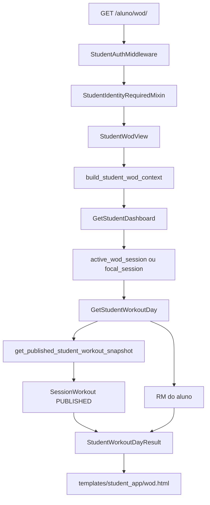

<!--
ARQUIVO: mapa da pagina WOD do app do aluno.

TIPO DE DOCUMENTO:
- mapa operacional de pagina
- anatomia de rota, view, contexto, template, CSS, JS e dados

AUTORIDADE:
- alta para localizar a estrutura de `/aluno/wod/`
- subordinado ao runtime real, testes e codigo atual

DOCUMENTOS PAIS:
- [student-app-complete-map.md](student-app-complete-map.md)
- [student-app-path-map.md](student-app-path-map.md)
- [../reference/operations-wod-ownership-map.md](../reference/operations-wod-ownership-map.md)

QUANDO USAR:
- quando a pagina WOD do aluno quebrar
- quando o WOD publicado nao aparecer para o aluno
- quando a recomendacao por RM parecer errada
- quando o layout de `/aluno/wod/` precisar ser alterado sem quebrar o contrato

POR QUE ELE EXISTE:
- a pagina WOD junta tres mundos: agenda, treino publicado e RM individual.
- sem mapa, e facil mexer na "fachada" e esquecer que os dados vem de snapshots e cache.

O QUE ESTE ARQUIVO FAZ:
1. explica como `/aluno/wod/` monta seu contexto.
2. separa dados compartilhados do WOD e personalizacao do aluno.
3. descreve a estrutura visual da pagina.
4. lista pontos de debug e riscos de debito tecnico.

PONTOS CRITICOS:
- a pagina WOD do aluno so consome `SessionWorkout` publicado.
- WOD em `draft` ou `pending_approval` pertence a operacao, nao ao aluno.
- recomendacao por RM e calculada por aluno depois do snapshot compartilhado.
- `session_id` por query param pode trocar a sessao alvo, mas ainda depende de WOD publicado.
-->

# Mapa da pagina WOD do aluno

## Tese curta

`/aluno/wod/` e a vitrine autenticada do treino publicado.

Pense em uma lanchonete:

1. `operations` cozinha o lanche
2. aprovacao decide se o lanche pode ir para o balcao
3. `SessionWorkoutStatus.PUBLISHED` coloca o lanche na vitrine
4. `/aluno/wod/` entrega o lanche para aquele aluno
5. RM do aluno decide o tempero personalizado da carga

Em termos tecnicos:

1. `StudentWodView` e a casca HTTP
2. `build_student_wod_context` monta o contexto da pagina
3. `GetStudentWorkoutDay` transforma WOD publicado em cards
4. `get_published_student_workout_snapshot` faz snapshot compartilhado e cacheavel
5. RM individual entra depois do cache compartilhado
6. `templates/student_app/wod.html` renderiza hero, blocos e calculadora

## Ordem curta de leitura

Leia nesta ordem:

1. [student-app-complete-map.md](student-app-complete-map.md)
2. [student-app-wod-communication-map.md](student-app-wod-communication-map.md)
3. [../../student_app/urls.py](../../student_app/urls.py)
4. [../../student_app/views/shell_views.py](../../student_app/views/shell_views.py)
5. [../../student_app/views/wod_context.py](../../student_app/views/wod_context.py)
6. [../../student_app/application/use_cases.py](../../student_app/application/use_cases.py)
7. [../../student_app/application/wod_snapshots.py](../../student_app/application/wod_snapshots.py)
8. [../../student_app/application/results.py](../../student_app/application/results.py)
9. [../../templates/student_app/wod.html](../../templates/student_app/wod.html)
10. [../../static/css/student_app/screens/wod.css](../../static/css/student_app/screens/wod.css)
11. [../../static/js/student_app/wod.js](../../static/js/student_app/wod.js)
12. [../../student_app/models.py](../../student_app/models.py)
13. [../../student_app/tests.py](../../student_app/tests.py)

## Rota

Arquivo:

1. [../../student_app/urls.py](../../student_app/urls.py)

Contratos:

1. `/aluno/wod/` usa `StudentWodView`
2. `/aluno/treino/` e alias da mesma view
3. rota exige identidade de aluno e membership ativo via `StudentIdentityRequiredMixin`

Query param relevante:

1. `?session_id=<id>` pode forcar uma sessao alvo

Observacao:

1. sem `session_id`, a tela usa `dashboard.active_wod_session` ou `dashboard.focal_session`
2. com `session_id`, a tela busca `ClassSession` por id

## View HTTP

Arquivo:

1. [../../student_app/views/shell_views.py](../../student_app/views/shell_views.py)

Classe:

1. `StudentWodView`

Responsabilidades:

1. renderizar `student_app/wod.html`
2. usar `WorkoutPrescriptionForm`
3. passar `student` para o form
4. no GET, montar contexto via `build_student_wod_context`
5. no POST, calcular prescricao manual via `GetStudentWorkoutPrescription`
6. quando houver WOD publicado, registrar visualizacao e atividade

Mutacoes feitas pela pagina:

1. `track_student_workout_view(...)` cria ou atualiza `StudentWorkoutView`
2. `record_student_app_activity(...)` registra `StudentAppActivityKind.WOD_VIEWED`
3. calculadora por POST nao muda o WOD publicado

O que a pagina nao faz:

1. nao cria treino
2. nao edita treino
3. nao aprova treino
4. nao muda status de WOD

## Montagem de contexto

Arquivo:

1. [../../student_app/views/wod_context.py](../../student_app/views/wod_context.py)

Funcao:

1. `build_student_wod_context(view, **kwargs)`

Passo a passo:

1. chama `super(...).get_context_data(...)`
2. resolve `request_perf` para telemetria
3. executa `GetStudentDashboard`
4. define nav e titulo do shell
5. define `student_next_session`
6. escolhe sessao alvo
7. executa `GetStudentWorkoutDay`
8. busca `SessionWorkout` publicado para tracking
9. carrega snapshot de RM
10. injeta `student_workout_day` e `student_rm_preview`

Campos de contexto:

1. `dashboard`
2. `student_shell_nav = 'wod'`
3. `student_shell_title = 'WOD'`
4. `student_next_session`
5. `student_workout_day`
6. `student_rm_preview`
7. `form`
8. `prescription`, quando POST de calculadora for valido

Sessao alvo:

1. primeira escolha: `dashboard.active_wod_session`
2. segunda escolha: `dashboard.focal_session`
3. override: `GET session_id`

Risco:

1. o override por `session_id` busca a aula diretamente
2. se no futuro isso precisar ser mais restrito, valide a sessao contra o radar/membership antes de montar o WOD

## Dashboard e janela do WOD

Arquivo:

1. [../../student_app/application/use_cases.py](../../student_app/application/use_cases.py)

Classe:

1. `GetStudentDashboard`

Contratos relevantes:

1. `wod_window_before_minutes = 30`
2. `wod_window_after_minutes = 30`
3. `home_mode` vira `wod_active` quando aluno tem reserva ativa dentro da janela
4. `active_wod_session` guarda a sessao que ativa o WOD
5. `focal_session` guarda a melhor sessao de contexto quando nao ha WOD ativo
6. `primary_action` vira `open_wod` quando WOD esta ativo

Regra simples:

1. se o aluno reservou uma aula e esta perto do horario, a home aponta para WOD
2. fora dessa janela, a home volta para agenda/grade

## WOD publicado compartilhado

Arquivo:

1. [../../student_app/application/wod_snapshots.py](../../student_app/application/wod_snapshots.py)

Funcao:

1. `get_published_student_workout_snapshot(...)`

Filtro duro:

1. `SessionWorkout.objects.filter(session_id=session_id, status=SessionWorkoutStatus.PUBLISHED).first()`

Payload compartilhado:

1. `schema_version`
2. `box_root_slug`
3. `session_id`
4. `session_title`
5. `session_scheduled_at`
6. `coach_name`
7. `workout_id`
8. `workout_version`
9. `workout_title`
10. `coach_notes`
11. `blocks`
12. `movements`

Cache:

1. chave: `student_app:wod:v1:<box>:session:<id>:version:<workout_version>`
2. TTL padrao: `STUDENT_WOD_CACHE_TTL_SECONDS`, fallback de 21600 segundos
3. snapshot compartilhado nao contem RM individual

Regra:

1. cache do WOD e como cardapio impresso
2. RM individual e como a anotacao do garcom para aquela mesa
3. nao misture os dois na mesma camada

## Personalizacao por RM

Arquivos:

1. [../../student_app/application/use_cases.py](../../student_app/application/use_cases.py)
2. [../../student_app/application/rm_snapshots.py](../../student_app/application/rm_snapshots.py)
3. [../../student_app/domain/workout_prescription.py](../../student_app/domain/workout_prescription.py)

Fluxo:

1. `GetStudentWorkoutDay` recebe snapshot publicado
2. identifica movimentos com `load_type == percentage_of_rm`
3. busca RM do aluno por `movement_slug`
4. calcula carga recomendada com `build_workout_prescription`
5. cria `StudentWorkoutMovementCard`
6. marca primeira recomendacao disponivel como `primary_recommendation`

Estados possiveis por movimento:

1. percentual do RM com RM registrado -> mostra carga recomendada
2. percentual do RM sem RM registrado -> pede registro do RM
3. carga fixa -> mostra kg definido pelo coach
4. carga livre -> mostra orientacao livre

## Dataclasses da pagina

Arquivo:

1. [../../student_app/application/results.py](../../student_app/application/results.py)

Saidas relevantes:

1. `StudentWorkoutDayResult`
2. `StudentWorkoutBlockCard`
3. `StudentWorkoutMovementCard`
4. `WorkoutPrescriptionResult`

Campos de `StudentWorkoutDayResult`:

1. `session_title`
2. `session_scheduled_label`
3. `session_weekday_label`
4. `coach_name`
5. `workout_title`
6. `coach_notes`
7. `blocks`
8. `primary_recommendation`

Campos de `StudentWorkoutMovementCard`:

1. `movement_label`
2. `prescription_label`
3. `load_context_label`
4. `recommendation_label`
5. `recommendation_copy`
6. `notes`
7. `recommended_load_kg`
8. `base_rm_kg`
9. `percentage`
10. `is_primary_recommendation`

## Template

Arquivo:

1. [../../templates/student_app/wod.html](../../templates/student_app/wod.html)

Blocos visuais:

1. hero com recomendacao principal
2. hero de WOD sem recomendacao principal
3. estado vazio quando WOD ainda nao foi publicado
4. card de blocos
5. lista de movimentos
6. card de calculadora
7. resultado de prescricao manual

Estados principais:

1. `student_workout_day` com `primary_recommendation`
2. `student_workout_day` sem `primary_recommendation`
3. sem `student_workout_day`
4. `prescription` depois de POST valido

Arquivos visuais anexos:

1. [../../static/css/student_app/screens/wod.css](../../static/css/student_app/screens/wod.css)
2. [../../static/js/student_app/wod.js](../../static/js/student_app/wod.js)

Contrato visual:

1. WOD e uma superficie de tensao/energia
2. a calculadora deve continuar utilitaria
3. detalhes excepcionais devem aparecer sem poluir o treino principal

## Form de calculadora

Arquivos:

1. [../../student_app/forms.py](../../student_app/forms.py)
2. [../../student_app/views/shell_views.py](../../student_app/views/shell_views.py)

Form:

1. `WorkoutPrescriptionForm`

POST:

1. recebe `exercise_slug`
2. recebe `percentage`
3. executa `GetStudentWorkoutPrescription`
4. renderiza `prescription`

Regra:

1. a calculadora e independente da existencia de WOD publicado
2. ela usa os RMs do aluno
3. ela nao muda `SessionWorkout`

## Tracking

Arquivos:

1. [../../student_app/views/wod_tracking.py](../../student_app/views/wod_tracking.py)
2. [../../student_app/application/activity.py](../../student_app/application/activity.py)
3. [../../student_app/models.py](../../student_app/models.py)

Quando ocorre:

1. somente se `payload['workout']` e `payload['workout_day']` existem

Modelos afetados:

1. `StudentWorkoutView`
2. `StudentAppActivity`

Uso esperado:

1. saber se o aluno abriu o WOD
2. alimentar progresso/atividade futura
3. apoiar follow-up operacional

## Diagrama de montagem

## Heuristicas de debug

### WOD nao aparece

Verifique:

1. existe `ClassSession` correta?
2. existe `SessionWorkout` ligado a essa aula?
3. status esta `published`?
4. `workout.version` mudou depois da ultima edicao?
5. `dashboard.active_wod_session` existe?
6. `dashboard.focal_session` aponta para outra aula?
7. `session_id` de query esta forçando aula errada?

### Carga recomendada nao aparece

Verifique:

1. movimento usa `WorkoutLoadType.PERCENTAGE_OF_RM`?
2. `load_value` existe?
3. `movement_slug` bate com o slug do RM do aluno?
4. aluno tem `StudentExerciseMax` registrado?
5. cache de RM foi invalidado apos salvar RM?

### Pagina aparece, mas dados parecem velhos

Verifique:

1. sinais em [../../student_app/signals.py](../../student_app/signals.py)
2. invalidacao em [../../student_app/application/cache_invalidation.py](../../student_app/application/cache_invalidation.py)
3. chave em [../../student_app/application/cache_keys.py](../../student_app/application/cache_keys.py)
4. versao do `SessionWorkout`

### POST da calculadora falha

Verifique:

1. `WorkoutPrescriptionForm`
2. choices de exercicio
3. `GetStudentWorkoutPrescription`
4. existencia de RM para `exercise_slug`

## Riscos de debito tecnico

Evite:

1. renderizar ORM cru no template
2. colocar calculo de carga no template
3. cachear RM pessoal dentro do snapshot compartilhado do WOD
4. mostrar `draft` ou `pending_approval` no app do aluno
5. fazer a pagina WOD publicar ou editar treino
6. alterar WOD publicado sem entender invalidacao e `workout.version`
7. transformar `wod_context.py` em local de mutacao

Regra mental:

1. a pagina WOD e o prato servido
2. a operacao e a cozinha
3. se o aluno nao deveria ver algo, nao coloque no prato achando que o garcom vai esconder depois

