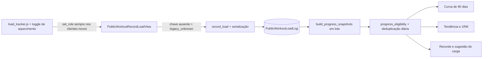

# Curva: overview de implementação, arquitetura e rollout

**Plano de referência:** [curva-grafico-hierarquia-e-set-role.md](curva-grafico-hierarquia-e-set-role.md)
**Branch de implementação:** `codex/curva-set-role-pr`
**Base verificada:** `dc72b6fb` (`main`)
**Atualizado em:** 2026-09-24

Este documento preserva o contexto desta entrega para revisões e continuação em outra sessão. O plano de referência define o resultado de produto; aqui estão o estado implementado, as decisões de engenharia, os efeitos esperados, a validação e a sequência operacional.

## Objetivo e fronteira

A tela de cargas deve destacar a série principal recente, desenhar uma curva apenas com séries comparáveis e manter aquecimento/histórico sem classificação visíveis sem usá-los como prova de evolução. A mesma regra de elegibilidade vale para tendência semanal, 1RM estimado, recorde pessoal e sugestão de carga.

A implementação fica no domínio já existente `public_workouts.PublicWorkoutLoadLog`. Não adiciona app/modelo paralelo, sessão de treino, campos de correção ou metadados de equipamento. Esses assuntos pertencem a frentes independentes e não devem entrar neste PR por dependência acidental.

## Regras do domínio

| Uso | `top_set` | `max_set` | `warmup` / `feeder` | `legacy_unknown` / `NULL` |
|---|---:|---:|---:|---:|
| Curva de evolução | Sim | Não | Não | Não |
| Tendência semanal e 1RM exibido | Sim | Não | Não | Não |
| Recorde pessoal | Sim | Sim | Não | Não |
| Histórico completo | Visível | Visível | Visível | Visível, em grupo neutro |
| Presença no calendário / eco do que acabou de salvar | Mantém semântica atual | Mantém semântica atual | Mantém semântica atual | Mantém semântica atual |

`progress_eligibility.py` é a regra pura e compartilhada. `effective_top_sets_by_day` mantém, por dia, o registro mais recente por `created_at`, desempata timestamp igual por PK e é usado tanto pela curva quanto pela tendência semanal.

## Fluxo implementado

- A view HTTP sempre resolve o protocolo: campo `set_role` ausente significa `legacy_unknown`; valor presente é validado pelo serviço. Chamadas Python existentes a `record_load()` mantêm default `top_set` para compatibilidade. O modelo não tem default fabricado.
- `build_progress_snapshots(account_id, as_of)` prepara todos os movimentos em lote com duas consultas, preserva `NULL` temporariamente como legado e entrega última série principal, pontos dos últimos 90 dias, presença de legado, escala, tendência e 1RM.
- A view principal e a prévia compartilham o mesmo snapshot com pacote, revisão semanal, sugestão e tag do gráfico. A revisão semanal isolada também pode receber `as_of` para testes determinísticos.
- `personal_record` filtra a série elegível antes de escolher o maior peso. `movement_load_display` recebe a última série principal do snapshot; não busca o histórico bruto por conta própria.
- O histórico serializado inclui `set_role`. A tabela continua preservando aquecimentos e histórico antigo.

## Persistência e deploy

Migrations incluídas:

1. `0028_load_log_set_role.py`: adiciona enum/campo nullable sem default e índice por `(account, set_role, movement_slug, performed_on)`. Preserva o índice anterior `(account, movement_slug, performed_on)`.
2. `0029_load_log_set_role_check.py`: restringe o campo aos cinco valores definidos, aceitando `NULL` durante a transição.

O comando `backfill_public_workout_load_log_set_role` marca somente `NULL` como `legacy_unknown`. É idempotente, oferece `--dry-run` e não classifica dados históricos como `top_set`.

A coluna **permanece nullable nesta entrega**. A migration que a tornará `NOT NULL` não está incluída e só deve ser criada depois de rodar o backfill no ambiente alvo e registrar evidência de zero `NULL`. O leitor já trata `NULL` como legado para não esconder registros se houver atraso entre deploy e backfill.

`PUBLIC_WORKOUT_CACHE_EPOCH` sobe de 4 para 5 para renovar clientes PWA e o `load_tracker.js` novo. Clientes antigos e itens de outbox anteriores que omitem a chave entram como `legacy_unknown` com segurança.

## Gráfico e hierarquia visual

- O template usa `progress_chart_for_movement` e o snapshot; não reconstrói progresso a partir de dicionários de histórico bruto.
- X corresponde a datas reais em uma janela de 90 dias, com marcas de calendário. Y é absoluto, em incrementos de 2,5 kg, com padding para séries planas.
- Apenas `top_set` forma a linha. Pontos legados recentes aparecem neutros e desconectados, mas contribuem para a escala para não serem cortados. Histórico legado mais antigo continua sinalizado mesmo fora da janela visual.
- O último peso principal é o elemento principal. A frase de estado vem do mesmo sinal semanal usado no review; 1RM/sinal ficam em “Ver detalhes”; variações ficam recolhidas.
- O toggle novo permite marcar aquecimento. O papel de aproximação e esforço máximo existe no domínio, mas não foi adicionado como escolha nesta UI, conforme o recorte atual.

## Efeitos de produto e riscos conhecidos

1. Antes do backfill, linhas `NULL` aparecem como histórico legado; após o backfill continuam neutras. O histórico antigo não fornece recorde, 1RM, tendência nem sugestão até o aluno registrar novas séries classificadas. É uma perda temporária e esperada de personalização, não algo a mascarar atribuindo `top_set` retroativamente.
2. O gráfico mostra 90 dias; o restante do histórico permanece na lista/tabela e a presença de legado continua indicada.
3. Um só ponto `top_set` não desenha uma linha; são necessárias duas datas efetivas para mostrar evolução. O ponto de referência e a sugestão ainda podem aparecer.
4. Offline, dados novos carregam a escolha de papel no outbox. Payloads antigos sem campo são preservados como desconhecidos.
5. O banco PostgreSQL local não estava acessível na avaliação anterior. Os testes desta implementação foram executados usando o fallback SQLite de diagnóstico; isso verifica os fluxos Django e constraint neste backend, mas não substitui a validação final de PostgreSQL no CI/ambiente que o tenha disponível.
6. A inspeção visual em navegador real, especialmente largura 360 px e temas claro/escuro, ainda deve ser feita no ambiente com a aplicação e seus dados disponíveis.

Antes de ativar os leitores em produção, alinhar com Renan/Giovanna a mudança temporária na personalização dos registros antigos. Não executar backfill automaticamente no deploy e não avançar para `NOT NULL` sem consulta de confirmação.

## Validação executada nesta implementação

- `manage.py check`: passou.
- `manage.py makemigrations --check --dry-run public_workouts`: sem mudanças pendentes.
- `compileall` nos módulos Python tocados: passou.
- 243 testes direcionados de 1RM/tendência, serviço de gravação/histórico, revisão semanal, snapshots, renderização do template e endpoint: passaram no SQLite de diagnóstico.
- Incluídos testes para exclusão de aquecimento na tendência, elegibilidade do recorde, compatibilidade `NULL`/legado, deduplicação diária, janela de 90 dias, backfill idempotente, constraint de papel, protocolo HTTP ausente/presente/inválido.
- A execução dos testes de `build_student_package` em SQLite motivou um fallback portátil: PostgreSQL mantém `DISTINCT ON`; backends sem suporte usam iterator ordenado, sem carregar todos os objetos simultaneamente. O conjunto direcionado final passou.
- Ainda pendentes: suíte de PostgreSQL, verificação visual em navegador móvel/temas e gates normais do PR.

## Arquivos de referência

- Modelo/migrations/backfill: `public_workouts/models.py`, `public_workouts/migrations/0028_load_log_set_role.py`, `public_workouts/migrations/0029_load_log_set_role_check.py`, `public_workouts/management/commands/backfill_public_workout_load_log_set_role.py`.
- Elegibilidade/projeção/tendência: `public_workouts/progress_eligibility.py`, `public_workouts/progress_snapshot.py`, `public_workouts/one_rep_max.py`.
- Serviços, renderização, contrato HTTP e PWA: `public_workouts/services.py`, `public_workouts/templatetags/public_workouts_extras.py`, `student_app/views/public_workout_views.py`, `static/js/public_workouts/load_tracker.js`.
- Apresentação: `templates/public_workouts/workout.html`, `static/css/public_workouts/workout-shell.css`.
- Testes: `public_workouts/test_progress_snapshot.py`, `public_workouts/test_one_rep_max.py`, `public_workouts/test_load_log.py`, `public_workouts/test_weekly_review.py`, `public_workouts/test_workout_template.py`, `student_app/test_public_workout_record_load_endpoint.py`.

**Estado do PR:** ainda não criado. Atualizar esta linha com a URL e o estado dos checks após abrir o pull request.
