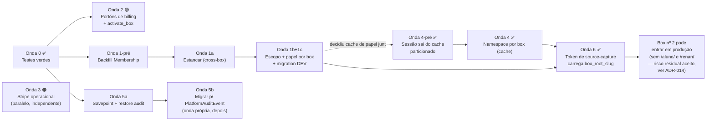

# Plano de ondas — correção de tenancy, billing e autorização

**Data:** 2026-08-25
**Origem:** varredura multi-agente da camada de tenancy + trabalho de billing Stripe da mesma sessão
**Status:** Todas as ondas (0, 1, 2, 3, 4, 5a, 5b, 6) concluídas
**Última atualização:** 2026-08-27 — Onda 5b (login/logout migrados para PlatformAuditEvent) implementada sob Nível 3 do Protocolo Renanfulas

---

## ⚠️ Validação de raio de explosão — 2026-08-25

Antes de executar qualquer onda, rodei uma verificação dedicada: **o que quebra ao aplicar a mudança proposta?** Não é achado novo de bug — é engenharia reversa de consequência. Resultado, onda por onda:

| Onda | Veredito | O que isso muda |
|---|---|---|
| 1 — Escalada de privilégio | 🔴 **Quebra como escrita** | 3 bloqueios reais: papel não mapeia, staff criado pela própria tela some da listagem, `get_user_role` não recebe request. Reescrita abaixo, com ordem corrigida. |
| 2 — Portões de billing | 🟢 **Sólida, com ajuste de implementação** | A ideia está certa; a implementação como eu descrevi (early-return) quebraria o backfill do superdev. Corrigido abaixo. |
| 3 — Stripe operacional | 🟠 **Quebra como escrita** | Pix precisa de 2 eventos assíncronos a mais (8, não 6) ou dá baixa sem dinheiro ter entrado. O fallback `['card']` não funciona por causa da idempotency key. Corrigido abaixo. |
| 4 — Namespace por box (cache) | 🔴 **Quebra como escrita — a mais perigosa** | Derruba login em produção (HTTP 400 determinístico) porque a sessão do Django vive no mesmo cache. O próprio gate de saída da onda é inatingível na suíte de teste hoje. Reescrita abaixo. |
| 5 — Auditoria cross-tenant | 🟢 **Metade sólida, metade não** | Savepoint + restore de schema: seguro, com ajuste de posição. Migrar para `PlatformAuditEvent`: quebra 2 testes e esvazia o painel dev — vira onda própria. |
| 6 — Teto de 1 box | 🔴 **Quebra como escrita — premissa central falsa** | A "peça pronta" do django-tenants não é peça isolada: ativa código morto e exige uma tabela que nada popula. E quebra login/PWA/OAuth do aluno. Escopo reduzido abaixo. |

**Metodologia:** 6 agentes analisaram raio de explosão em paralelo, um por onda, com instrução explícita de recusar risco inventado ("esta onda parece segura" é resposta válida). As 3 lentes de interação entre ondas (ordem, conflito de arquivo, crítico de completude) **morreram por limite de sessão** — não rodaram. Duas interações cross-onda que os próprios agentes de raio encontraram por conta própria estão registradas nas Ondas 1 e 4 (colisão entre o cache de papel da Onda 1c e a `KEY_FUNCTION` da Onda 4). O resto da análise de interação **não foi feito** — tratar como risco residual.

---

## Como ler este plano

Cada onda tem **um objetivo**, **uma skill responsável**, **um gate de saída** e **um caminho de rollback**.
A regra do `CLAUDE.md` vale: **uma skill por tarefa**, nunca em lote.

Legenda de confiança:

- 🔬 **Demonstrado** — executei contra Postgres real e observei o resultado. É fato, não inferência.
- ✅ **Confirmado** — li o código de ponta a ponta e reproduzi o raciocínio. Sólido, mas é leitura.
- 🟡 **Sinal forte** — apareceu em duas varreduras independentes, com `arquivo:linha`, mas **não passou refutação adversarial** (a fase morreu duas vezes por limite de sessão). **Pode conter falso positivo.**
- 📋 **Já documentado** — o próprio repositório já registrou isso como pendência conhecida.

Onde um item foi promovido de 🟡 para 🔬, a evidência da execução está no corpo da onda.

---

## Contexto: o que a consulta ao RAG revelou

O RAG (`manage.py search_project_knowledge`) **não estava disponível** no momento do planejamento — depende do Postgres, que estava fora (timeout, exit 124).

**Resolvido em 2026-08-25** 🔬: com o banco no ar, o índice estava vazio (`Resultados: 0`). Reconstruído com `ingest_project_knowledge` — **1579 documentos, 14199 chunks**.

O que a verificação revelou sobre a ferramenta, e que vale saber antes de usar:

| Pergunta | Resultado |
|---|---|
| *"onde fica a autorização por papel e escopo de box"* (código) | ❌ Devolveu 5 docs de rollout/escopo de piloto. Nenhum código. |
| *"SINGLE_ACTIVE_BOX resolução de tenant pre-auth facade"* (doc) | ✅ ADR-006 nos **três primeiros** resultados, score 34 vs 27 do quarto. |

**O RAG é um índice de documentação, não de código.** Os 14199 chunks são markdown; a busca é lexical com peso de autoridade (`0 embeddings regenerados` — não é semântica). Isso confirma a regra do `CLAUDE.md`: para símbolo conhecido, `Grep` é mais barato e direto; o RAG serve para **"qual doc/ADR governa X"**.

Consequência prática: se o RAG estivesse no ar no início, ele teria entregado o ADR-006 na primeira consulta — exatamente o atalho que acabei obtendo pelos mapas de rota das skills. **São a mesma pista.** Para a próxima sessão, o RAG é o caminho mais curto até os ADRs; a leitura de código continua sendo Grep.

Dois problemas de documentação apareceram no caminho e valem correção no `CLAUDE.md`:

1. O fallback offline prometido (`.claude/skills/navigate-octobox/driver.py`) **não existe no repositório**.
2. As skills vivem em `.agents/skills/`, não em `.claude/skills/` — e nem `navigate-octobox` nem `pr-lesson` estão lá.

Hoje o `CLAUDE.md` manda o agente para dois caminhos inexistentes.

### O atalho que funcionou

Com o RAG fora, a pista veio dos **mapas de rota das próprias skills** (`octobox-sql-architect/references/schema-hotspots.md`), que apontaram para ADRs que mudam o enquadramento de metade dos achados.

**O que isso poupou:** três dos "problemas" encontrados na varredura **já eram decisões conscientes e documentadas**, com caminho de saída escrito. Tratá-los como descoberta seria desperdício — e pior, poderia desfazer uma decisão deliberada.

| ADR | O que já estava decidido | Consequência para o plano |
|---|---|---|
| [ADR-006](../adr/ADR-006-center-layer-tenant-resolution.md) | `SINGLE_ACTIVE_BOX` é fallback de piloto e **"precisa ser explicitamente desativada em prod multi-tenant — ticket separado, pré-Sprint 5"** | Não é achado novo. É um **ticket aberto que virou bloqueante**. Onda 6. |
| [ADR-008](../adr/ADR-008-audit-event-best-effort-public-paths.md) | Audit best-effort em path público é intencional; o conserto futuro nomeado é **migrar para `PlatformAuditEvent` (SHARED_APPS)** | O modelo **já existe** e já é usado no router do Stripe. O caminho está pavimentado. Onda 5. |
| [ADR-013](../adr/ADR-013-superdev-support-access-per-box.md) | Superdev é OWNER em todo box **de propósito**; o ADR reconhece que `get_user_role` faz short-circuit `is_superuser → OWNER` e que "o papel do Membership é, na prática, **cosmético**" | Confirma o achado de `Membership.role` write-only — **pela própria documentação**. E o ADR já traz o caminho least-privilege em 3 passos. Onda 1. |

O [plano de escala](scale-transition-20-100-open-multitenancy-plan.md) fecha o cerco: em *"O que precisa existir **antes do primeiro box**"* já constam **"namespace por box para cache"**, **"namespace por box para logs"** e **"permissão por papel revisada"**. Ou seja, as Ondas 1 e 4 não são melhorias — são **pré-requisitos de Fase 1 declarados e não cumpridos**.

---

## Onda 0 — Destravar a verificação

> **Nada abaixo desta linha entra em produção sem suíte verde. Inclusive o que já escrevi.**

**Problema original:** o Postgres local não subia (Docker Desktop com a distro WSL `docker-desktop` parada). Os testes do ciclo de billing/unarchive escritos nesta sessão **nunca tinham rodado** — só `manage.py check` e `makemigrations --check`, que cobrem imports e grafo de migrations, **zero da lógica de negócio**.

> ### ✅ ONDA 0 CONCLUÍDA — 2026-08-25
>
> Postgres 15.18 no ar (container `octobox_postgres_local`, porta 5433).
> **47 testes passando**, 5 skips pré-existentes (`boxcore_student` ausente em schema de tenant sob `--nomigrations`).
>
> Dois problemas reais apareceram e foram resolvidos:
>
> 1. **Migration `control.0002` não estava aplicada no banco de desenvolvimento** — o volume do container é persistente e sobreviveu à criação da coluna. Resolvido com `migrate_schemas --shared`. Isso derrubava 3 testes, e meu primeiro diagnóstico ("banco de teste velho") estava **errado**: o erro batia no banco de dev, não no de teste.
> 2. **Regressão real que eu causei** — `tests/test_tenant_boundary.py::B12` mockava `filter().first()`, mas meu `_resolve_box_for_billing` passou a usar `list(filter(...)[:2])` para detectar ambiguidade. O comportamento novo está correto; o teste é que estava acoplado à forma da query antiga. Corrigido o mock **e** adicionada contraparte comportamental com banco real (`test_invoice_payment_failed_suspends_active_box`), para esse caminho não depender mais de mock.

**Como reproduzir** (Docker Desktop precisa estar aberto — a distro WSL não sobe por linha de comando):

```bash
docker compose -f docker-compose.postgres.yml up -d
```

Se o volume for antigo, aplicar as migrations pendentes no banco de **desenvolvimento** antes de rodar a suíte — foi o que derrubou 3 testes aqui:

```bash
.venv/Scripts/python.exe manage.py migrate_schemas --shared --settings=config.settings.test
```

```bash
.venv/Scripts/python.exe -m pytest tests/test_box_billing_lifecycle.py tests/test_tenant_boundary.py -v
```

**Skill:** nenhuma (operacional).
**Gate de saída:** ✅ **atingido** — 47 passando, 5 skips pré-existentes, zero falhas.
**Rollback:** n/a.

### Lição que vale além desta onda

O teste que quebrou (`B12`) falhou porque **assertava a forma da query**, não o comportamento: mockava `filter().first()` e quebrou quando a implementação passou a usar `list(filter(...)[:2])` — uma mudança que **melhorou** o código (detectar ambiguidade exige buscar dois). Teste acoplado a implementação pune refactor correto.

A contraparte que adicionei (`test_invoice_payment_failed_suspends_active_box`, com banco real) sobrevive a qualquer mudança na forma da query. Onde os dois discordarem no futuro, **é o comportamental que diz a verdade**.

---

## Onda 1 — 🔴 Conter a escalada de privilégio

**Severidade: CRÍTICA. Precedência sobre tudo, inclusive sobre receita.**

> **Calibragem honesta da urgência.** A escalada foi demonstrada **no ambiente local**. Em produção ela depende de um fato que **não verifiquei**: se `bootstrap_superdev` nunca rodou lá, não existe conta superdev para atacar, e o caminho "Owner vira superusuário" está **latente, não vivo** — o próprio [ADR-013](../adr/ADR-013-superdev-support-access-per-box.md) diz que *"a feature está no código, mas só vale após rodar `bootstrap_superdev` (+ backfill) em cada ambiente"*.
>
> O que é **certo** em qualquer cenário: o vazamento de listagem (todo Owner vê todo staff da plataforma) e o reset cross-box passam a valer no instante em que existir o box nº 2. E qualquer superusuário existente hoje — inclusive contas pessoais de admin — já é alvo válido.
>
> **Como fechar essa incerteza:** consulta read-only em produção — existe usuário com `is_superuser=True` além do seu?

### O problema — 🔬 DEMONSTRADO EM EXECUÇÃO (2026-08-25)

Não é mais leitura de código. Executei contra Postgres real:

```
ator                 : zz_verif_owner     is_superuser=False
alvo                 : zz_verif_superdev  is_superuser=True
handler retornou ok  : True
senha em claro       : 'eFtVhic25bzw4y'
hash da senha mudou  : True
senha nova funciona  : True
```

Um usuário **sem privilégio** trocou a senha de um **superusuário** e recebeu a
credencial em texto claro. `check_password` confirma que a senha nova funciona.

Confirmei também por SQL que `auth_group`, `auth_user` e `control_membership`
existem **somente em `public`** — não há cópia em `box_devbox` nem `box_test`.
É fisicamente impossível `_bootstrap_roles` gravar Group no tenant: o
`search_path` cai para public por necessidade. **A tese da Onda 1c está provada.**

A cadeia completa, do template ao handler:

1. `access/access_overview_context.py:20` — a listagem roda `user_model.objects.order_by(...)` **sem filtro de box**. Lista todo staff da plataforma.
2. `templates/access/overview.html:157` — o botão *"Gerar senha provisória"* é renderizado para **todo** perfil. A única trava é `disabled`.
3. `access/access_profile_actions.py:121` — o handler resolve o alvo por `filter(pk=profile_id).first()` com `profile_id` vindo de POST cru. Bloqueia apenas auto-reset. **Nenhuma checagem de box, nenhuma checagem de superusuário.**
4. `control/management/commands/bootstrap_superdev.py:50` — a conta `superdev` é `is_superuser=True` e tem `Membership` OWNER em **todos** os boxes (ADR-013).

**Cadeia de ataque:** Owner do box piloto abre `/acessos/` → vê `superdev` na lista (marcado "| Superuser") → clica em "Gerar senha provisória" → **lê a senha do superusuário na tela** → entra como superdev → Django admin → plataforma inteira, todos os clientes.

Não precisa de segundo box. Não precisa de bug de SQL. É um POST com o `pk` certo.

A causa raiz é única e vale nomear: **a plataforma decide em qual box você está, mas nunca checa se a ação que você está fazendo é dentro desse box.** `Membership` (por box) governa *o que você vê*; `auth.Group` (global) governa *o que você pode fazer*. As duas coisas nunca se cruzam.

### ⚠️ Raio de explosão — a onda quebra como descrita acima

A verificação achou **3 bloqueios reais**. Nenhum deles muda o objetivo da onda — mudam a ordem e o conteúdo dos passos.

**Bloqueio 1 — os vocabulários de papel não se cruzam.** `Membership.Role` grava `'owner'/'manager'/'coach'/'reception'` ([control/models.py:129-132](../../control/models.py)). `ROLE_MAP` é indexado por `'Owner'/'Manager'/'Coach'/'Recepcao'/'DEV'` ([access/roles/__init__.py:27](../../access/roles/__init__.py)). A interseção é **vazia** — nem case nem acento batem (`'reception' != 'Recepcao'`). Ler `request.membership.role` e indexar `ROLE_MAP` dá `KeyError` sempre; com `.get()`, cai em `_build_fallback_role()` → `'SemPapel'` → **lockout de 100% do staff**, incluindo o próprio Owner em `_can_manage_access_profiles`. E `'DEV'` **não existe** em `Membership.Role` — o papel de suporte fica irrepresentável.

**Bloqueio 2 — o staff criado pela própria tela não tem `Membership`.** `handle_access_profile_create` cria o `User` e faz `user.groups.set([group])` ([access/access_profile_actions.py:189](../../access/access_profile_actions.py)) — **nunca cria `control.Membership`**. Os únicos writers de `Membership` em produção são o provisionamento do box (owner) e o anexo do superdev (ADR-013). Consequência: filtrar a listagem por `Membership(box=box_ativo)` (a 1b original) **esvazia a tela** — sobram só o owner e o superdev, e todo Manager/Coach/Recepção criado ali desaparece, ficando impossível de editar, desativar ou resetar. A guarda de 1a ("recusar alvo sem Membership") bloqueia exatamente esses mesmos alvos.

**Bloqueio 3 — `get_user_role(user)` não recebe `request`.** Três classes de call site sem solução no desenho original: **(a) sem request** — `auditing/services.py` (actor reconstruído por pk, ou `None`), `onboarding/facade.py`, script standalone; **(b) request sem Membership** — todo `PUBLIC_SCHEMA_PATHS`, e `access/context_processors.py:273` chama `get_user_role` em **todo render**, inclusive `/login/`, `/box/`, `/checkout/`; **(c) request de outro usuário** — `access_overview_context.py` chama `get_user_role(user)` **em loop, para cada linha da listagem**, que não são `request.user`. Se implementado via thread-local (padrão comum), toda linha da tela passaria a exibir o papel do **ator**, e um `Save` trocaria papel de Coach para Owner em silêncio.

**Efeito colateral achado por engano — Honeypot escapa do labirinto.** Se Membership vencer o Group sem checar honeypot primeiro, um intruso marcado (`ROLE_HONEYPOT` é Group-only, não existe em `Membership.Role`) que tenha qualquer Membership sai do labirinto na hora, e o log de ameaça para de registrar os passos dele.

### Correção — ordem revisada

**1‑pré — Backfill de Membership (pré-requisito, sem o qual 1a/1b travam tudo).** `handle_access_profile_create` passa a criar `Membership(box=box_ativo, role=<mapeado>, is_primary_box=True)` junto com o `User`. Escrever comando de backfill para o staff já existente sem Membership. **Sem isso, não avançar para 1a/1b.**

**1a — Estancar (mesmo dia, antes do backfill completo).** No `handle_access_profile_*`: recusar alvo com `is_superuser=True` sempre; recusar alvo com `Membership` em **outro** box (nega cross-box). Só depois do backfill confirmado, apertar para "recusar alvo **sem** Membership no box do ator" — antes disso, essa versão da guarda bloqueia o staff legítimo que ainda não foi migrado.

**1b — Escopo por box.** Só liga **depois** do backfill (1‑pré) — senão esvazia a tela, como no Bloqueio 2.

**1c — Papel por box, com três correções obrigatórias:**
- Mapa explícito `MEMBERSHIP_ROLE_TO_SLUG = {'owner': ROLE_OWNER, 'manager': ROLE_MANAGER, ...}` com fallback para Group quando não mapear — não indexar `ROLE_MAP` direto com `Membership.role`.
- **Migration adicionando `DEV` a `Membership.Role`** — o próprio ADR-013 diz que o caminho least-privilege *"começa por adicionar papel DEV"*. Sem ela, "zero migration" (como eu tinha escrito) está errado.
- **Não usar thread-local.** Anexar em `request.user` (ex.: `request.user._octobox_membership`) no middleware, e ler com `getattr(user, '_octobox_membership', None)` dentro de `get_user_role`, fallback para Group quando ausente. Isso resolve (a) e (b) do Bloqueio 3 automaticamente (caem no fallback) e resolve (c) porque outros usuários da listagem não carregam o atributo.
- **Honeypot primeiro.** Checar `Group HONEYPOT` **antes** de ler Membership dentro de `get_user_role` — senão o efeito colateral acima se materializa.
- **Superdev: resolver o beco sem saída.** Anexar o superdev como `DEV` (não `OWNER`) depois da migration acima, e só então baixar o short-circuit `is_superuser → OWNER` para depois da leitura de Membership. Fazer isso fora de ordem deixa o único usuário multi-box existente sem ganho nenhum, ou sem papel nenhum.
- **Cache de papel precisa de box na chave**, ou não cachear o papel derivado de Membership (é 1 query que o middleware já faz). A chave hoje é `octobox:user_role_slug:uid_{id}`, sem schema, TTL 24h — colide de frente com a Onda 4. Decidir aqui, não lá.

### Execução

**Skill:** `white_hat_hacker` para mapear a superfície completa (pode haver outras telas com o mesmo padrão "id vindo de POST sem escopo") → depois `security_performance_engineer` para implementar 1‑pré e 1a/1b/1c, nessa ordem.

> Duas skills, duas tarefas separadas — nunca as duas na mesma invocação.

**Gate de saída:** teste que prova que Owner do box A **não** consegue resetar senha de usuário do box B **nem** de superusuário; que a listagem de A não contém usuários exclusivos de B; e que `/acessos/` renderizado com 4 usuários de papéis distintos mostra 4 `role_slug` diferentes.

> ⚠️ O `conftest.py` instala um `post_save` que dá `Membership(role=OWNER, is_primary_box=True)` a **todo** `User` criado em teste. Sem um teste que crie usuário **sem** Membership de propósito, o gate de saída passa artificialmente e não detecta nenhum dos 3 bloqueios acima.

**Rollback:** mudança aditiva (guardas + filtro + migration nova coluna). Reverter guardas é trivial; reverter a migration de `DEV` em `Membership.Role` é uma migration reversa, não um "remover linha".
**Risco de fazer:** um Owner legítimo pode perder acesso a uma ação que hoje ele consegue fazer. É o objetivo — mas vale avisar antes, para não virar chamado de suporte.

> ### ✅ ONDA 1 CONCLUÍDA — 2026-08-26 (Nível 3 do Protocolo Renanfulas, backup `56dd1a7d69`)
>
> As quatro partes implementadas, na ordem revisada (1-pré → 1a → 1b → 1c):
>
> - **1-pré**: `handle_access_profile_create`/`_update` agora sincronizam `Membership.role` com o Group escolhido no form (helper `_sync_membership_role`). `manage.py backfill_staff_membership --box=<slug> [--dry-run]` migra staff legado que só tem Group.
> - **1a**: `_guard_target_is_manageable` recusa alvo `is_superuser=True` (sempre) e alvo com `Membership` em outro box (fase 1 — recusar alvo *sem* Membership nenhuma fica para depois do backfill confirmado em produção). Aplicado em `update`, `toggle` e `password_reset`.
> - **1b**: `build_access_profile_entries` escopa a listagem por `Membership(box=box_ativo)`. Falha fechada (lista vazia) se `request.tenant` vier `None`.
> - **1c**: `TenantBySessionMiddleware._resolve_box` captura o `Membership` (trocado `.exists()` por `.first()`) e expõe em `request.user._octobox_membership`. `get_user_role` reescrito com a ordem de precedência exata do plano: cache de instância → **honeypot** (mesma chave Redis que `honeypot_service.py` sobrescreve) → **Membership do box ativo** (`MEMBERSHIP_ROLE_TO_SLUG`, mapa explícito) → `is_superuser` (só depois de Membership, para o superdev com `Membership(role=DEV)` ganhar precedência) → Group (fallback legado) → `SemPapel`. Migration `control.0003_alter_membership_role` adiciona `DEV`.
>
> **Achado não previsto pelo plano, resolvido no processo — o `conftest.py` quebrou em duas direções antes de estabilizar:**
> O `post_save` que dá `Membership(role=OWNER)` a todo usuário de teste, antes inofensivo (Membership nunca era lido pra autorização), virou **live** com 1c e produziu dois efeitos opostos que precisaram de correções diferentes:
> 1. *Group deixou de valer* — testes que simulavam papel via `user.groups.add(...)` passaram a ver Owner (do Membership) e ignorar o Group. Corrigido com `m2m_changed` no próprio conftest: sincroniza `Membership.role` sempre que um teste atribui Group, sem exigir mudança nos ~100 arquivos de teste existentes.
> 2. *Tentativa de trocar o default de OWNER para COACH* (achando que resolveria a raiz) quebrou **91 testes** em `boxcore/` — o padrão dominante fora de `access/` é `self.user = create_user()` sem Group nenhum, esperando acesso Owner completo (são testes de feature, não de autorização). Revertido para OWNER; o único teste que genuinamente queria baixo privilégio sem Group (`test_non_manager_role_cannot_reset`) foi corrigido para atribuir Group explicitamente.
>
> A mesma classe de bug apareceu em produção, não só em teste: `handle_access_profile_update` mudava o Group mas nunca sincronizava `Membership.role` — editar o papel de alguém pela tela viraria no-op silencioso. Corrigido junto (mesmo `_sync_membership_role` usado no create).
>
> **6 testes de gate novos** (`access/tests/test_access_boundary.py`), cobrindo exatamente os 3 bloqueios da análise de raio — incluindo o cuidado que o próprio gate original exigia: o teste de listagem remove explicitamente a Membership "de brinde" do conftest antes de afirmar que o usuário de outro box não aparece, para não passar artificialmente.
>
> **Verificado, não só escrito**: `access/` 40/40, regressão ampla (`tests/` + `access/` + `student_identity/`) 871 passando (1 falha pré-existente confirmada **não relacionada** — reproduzida contra o snapshot de antes de qualquer edição desta onda, via `git worktree`), `boxcore/` 417/417, `manage.py check` e `makemigrations --check` limpos.
>
> **O que ficou para depois, de propósito:**
> - Recusar alvo **sem** Membership nenhuma (fase 2 de 1a) — só depois de `backfill_staff_membership` confirmado em produção.
> - Migrar `_attach_support_membership` (superdev) de `role=OWNER` para `role=DEV` — o mecanismo (`get_user_role` honrando `Membership.role=DEV`) já existe; falta trocar essa única linha em `control/services.py` e é exatamente o "beco sem saída" do superdev que o plano descreveu. Não fiz porque está fora do escopo estrito do achado original (escalada de privilégio) e merece seu próprio teste de não-regressão para o fluxo de suporte.

---

## Onda 2 — 🟠 Fechar os portões de billing que sobraram

### O problema ✅

`control/services.py:212` — `reprovision_box` faz `update(status=ACTIVE)` **incondicional**, sem olhar o status anterior.

`manage.py reprovision_box --slug=x` num box SUSPENDED por inadimplência — **inclusive um que o handler `customer.subscription.deleted` que escrevi nesta sessão acabou de suspender** — devolve ACTIVE na hora, sem passar por pagamento.

É a mesma classe de furo que fechei no `unarchive_box` (que devolve SUSPENDED de propósito, justamente para o acesso só voltar por billing). Fechei uma porta e deixei a do lado aberta.

Agravante do ADR-013: `_attach_support_membership` roda **dentro** de `reprovision_box`, então esse comando é rodado com naturalidade em operação de rotina (backfill de superdev) — sem ninguém suspeitar que ele reativa cobrança.

### ⚠️ Raio de explosão — sólida, mas a implementação óbvia erra

A verificação confirma a tese: **nenhum caller de produção depende de `reprovision_box` promover SUSPENDED→ACTIVE.** O backfill `attach_superdev_to_boxes` chama `_attach_support_membership` direto, não passa por essa promoção. Mas duas formas óbvias de implementar a guarda quebram coisa que a onda não deveria tocar:

**Não usar early-return.** Se a guarda for `if box.status != PROVISIONING: return box` no topo da função, ela pula `_attach_support_membership` e `_record_platform_audit` para box ACTIVE/SUSPENDED — e o ADR-013 diz explicitamente que `reprovision_box` é o *"chokepoint que cura boxes provisionados antes da conta superdev existir"*. Early-return mata essa cura em silêncio. (O teste existente `test_attach_is_idempotent_across_reprovision` **não pega isso** — passa de qualquer jeito porque testa idempotência, não o cenário de cura tardia. É falso-verde.)

**Não checar `box.status` em memória.** `provision_box` cria o Box com status `PROVISIONING` e só então roda os steps — `_migrate_schema` leva minutos. Se o webhook `customer.subscription.deleted` suspender o box **durante** esse intervalo, uma guarda que leu `box.status` no início do processo tem valor velho e promove por cima da suspensão — o furo sobrevive à correção.

### Correção — precisa das duas coisas

Envolver **só** o UPDATE final (não os steps, não o attach, não o audit) — e fazer a checagem **no banco**, não em memória:

```python
Box.objects.filter(pk=box.pk, status=Box.Status.PROVISIONING).update(
    status=Box.Status.ACTIVE, provisioned_at=now()
)
box.refresh_from_db()
```

Custo zero, uma linha, imune à corrida com o webhook. Box `ARCHIVED` continua recusando com exceção — mas isso muda o contrato de retorno de `provision_box` (que hoje promete sempre devolver ACTIVE); atualizar a docstring junto.

**Gap operacional que a onda abre e precisa fechar na mesma entrega:** hoje `reprovision_box` é o **único** caminho de SUSPENDED→ACTIVE fora do webhook de pagamento. Fechar essa porta sem abrir outra transforma o primeiro chamado de suporte em UPDATE manual no banco de produção. Entregar junto um `manage.py activate_box --slug=x --reason=...` que só aceita SUSPENDED, grava `PlatformAuditEvent` e exige motivo.

### Execução

**Skill:** nenhuma — é cirúrgico e eu já mapeei. Se quiser rigor extra, `master_debugger` (o Passo 0 dele monta o cluster impl+testes+callers antes de editar).

**Gate de saída:** (1) box SUSPENDED + `reprovision_box` → continua SUSPENDED, `_attach_support_membership` e `_record_platform_audit` continuam rodando; (2) teste novo — box provisionado **sem** superdev existir, depois superdev criado, depois `reprovision_box` num box ACTIVE → Membership do superdev passa a existir (esse é o teste que hoje falta e que o gate original não cobria); (3) `manage.py activate_box` reativando um SUSPENDED com audit gravado.
**Rollback:** trivial, uma condição a mais no `filter()`. O comando novo é aditivo.

> ### ✅ ONDA 2 CONCLUÍDA — 2026-08-25 (Nível 3 do Protocolo Renanfulas, backup `56dd1a7d69`)
>
> Implementado exatamente como especificado: `Box.objects.filter(pk=box.pk, status=PROVISIONING).update(...)` — condicional no banco, sem checagem em memória, sem early-return. Contrato de `reprovision_box` documentado na docstring (não promete mais ACTIVE sempre). `provision_box` mantém a garantia de sempre devolver ACTIVE — nasce PROVISIONING, a condição é satisfeita por construção nesse caminho.
>
> `manage.py activate_box --slug=x --reason=... [--confirm]` entregue: `reason` obrigatório, `PlatformAuditEvent(kind='box.activated_manual_support')`, UPDATE condicionado a `status=SUSPENDED` no banco (mesmo padrão anti-corrida), recusa explícita para ARCHIVED e PROVISIONING.
>
> **9 testes novos**, todos os 3 itens do gate cobertos — incluindo o teste que faltava e que o gate original apontou como ausente (`test_reprovision_still_cures_missing_superdev_membership_on_suspended_box`: box SUSPENDED sem Membership do superdev, superdev criado depois, `reprovision_box` cura o Membership **sem** promover o status). O teste pré-existente `test_attach_is_idempotent_across_reprovision`, identificado como falso-verde na análise de raio, continua passando — confirma que a implementação não usa early-return.
>
> **77 testes passando** na varredura completa (`test_control_services.py` + `test_box_billing_lifecycle.py` + `test_tenant_boundary.py`), mesmos 5 skips pré-existentes. `manage.py check` e `makemigrations --check` limpos.
>
> Um erro só meu no caminho: a primeira versão do teste `test_reprovision_does_not_promote_suspended_box` fez uma asserção errada sobre contagem de `PlatformAuditEvent` (assumi que `box.provisioned` só seria gravado uma vez; na verdade `_record_platform_audit` já disparava incondicionalmente a cada `reprovision_box`, antes desta onda — comportamento pré-existente, não bug novo). Corrigido para checar `provisioned_at` inalterado, que é o sinal correto de "UPDATE condicional não disparou".

### Já feito nesta sessão ✅

| Item | Estado |
|---|---|
| `customer.subscription.deleted` → suspende box | Implementado, **não testado** |
| Guarda de ordenação (`Box.billing_event_at`) contra evento fora de ordem ressuscitar box cancelado | Implementado + migration `0002`, **não testado** |
| `unarchive_box()` + `manage.py unarchive_box` | Implementado, **não testado** |
| `archive_box` atômico + limite de 63 chars do Postgres | Implementado, **não testado** |
| Resolução de box falha fechado em ambiguidade | Implementado, **não testado** |

---

## Onda 3 — 🟠 Stripe operacional (trilha paralela)

**Não depende de nenhuma outra onda. Pode correr em paralelo — e bloqueia 100% da receita.**

### Problemas

| Item | Estado |
|---|---|
| Conta `acct_1U5nrJGhJX1lQkBY` (**Octoboxfit**) com **0 produtos, 0 preços, 0 webhooks** | Bloqueado pelo classificador de permissões do Claude Code — não pela Stripe |
| `sk_live_` / `pk_live_` no `.env` de produção | **Só você pode fazer.** A API da Stripe nunca expõe secret key, por design |
| Checkout de aluno pede `payment_method_types=['card','pix']`; Pix em conta BR é **invite-only** | 🟡 Se Pix não estiver ativo, o `Session.create` falha **inteiro** — o aluno não paga nem com cartão. Sem fallback no código |
| Apple Pay / Google Pay | ✅ **Já funcionam** — checkout hospedado, cobertos pelo tipo `card`, sem registro de domínio necessário. Só habilitar no Dashboard |

### ⚠️ Raio de explosão — o fallback proposto não funciona, e Pix precisa de mais 2 eventos

**Pix é pagamento assíncrono; o router só trata o caminho síncrono.** `_handle_student_payment` reconcilia lendo só `amount_total`, nunca `session.payment_status` ([integrations/stripe/router.py:89](../../integrations/stripe/router.py)). Cartão é síncrono — `checkout.session.completed` só chega pago. Pix é *delayed-notification*: `checkout.session.completed` chega com `payment_status='unpaid'` **no clique**, e o resultado vem depois em `checkout.session.async_payment_succeeded` / `async_payment_failed`. **Sem esses dois eventos no webhook, todo checkout Pix dá baixa no Payment antes do dinheiro entrar**, e Pix expirado nunca é revertido. São **8 eventos no Dashboard, não 6**.

**O fallback `['card']` não funciona — a idempotency key não discrimina método.** A chave é `octobox_checkout_pay_{payment.id}_v{payment.version}` — só id e version, e `version` só incrementa em reconcile/refund; **enquanto o pagamento está pendente, a chave é constante**. A Stripe cacheia a resposta pela chave: um retry com `['card']` depois de uma falha de Pix pode replayar o 400 cacheado, e o fallback nunca dispara — exatamente o cenário que a onda quer evitar.

**Melhor fallback: não sondar, não listar — remover `payment_method_types` inteiro.** Sondar a capability via API (`Account.retrieve()`) dentro de `create_checkout_session` quebra 2 testes que mockam só `Session.create`, e transforma o checkout em refém da latência de uma leitura de conta. A doc da Stripe já resolve isso: com `payment_method_types` **omitido**, a Stripe decide por request quais métodos mostrar (*dynamic payment methods*) — Pix aparece quando ativo, some quando não, sem sonda, sem cache, sem round-trip extra. Remover a linha em `integrations/stripe/services.py` é o fallback inteiro.

**Efeito colateral bom:** essa remoção também evita a colisão com a Onda 4 — cachear uma capability por schema quando ela é fato da **conta**, não do tenant, geraria N entradas (uma por box) sem invalidação central.

**Preço novo não quebra nada do router**, mas queima a idempotency key do signup se o operador trocar `STRIPE_PRICE_EARLY_MONTHLY` — a chave inclui plano mas não `price_id`. Latente hoje porque `_resolve_price_id` levanta antes de chamar a Stripe; fica vivo assim que as env vars forem preenchidas. Ajuste de uma linha: incluir os últimos 8 chars do `price_id` na chave.

### O que fazer

1. Destravar a permissão (aprovação manual por chamada é mais segura que regra ampla em `settings.json`, dado que é livemode).
2. Criar produto + 2 preços (R$ 97 mensal / R$ 997 anual, BRL) + webhook com **8 eventos**: os 6 originais + `checkout.session.async_payment_succeeded` e `checkout.session.async_payment_failed`.
3. **Remover `payment_method_types=['card', 'pix']`** de `integrations/stripe/services.py` — deixar dynamic payment methods decidir. Isso substitui o "fallback" por completo.
4. Corrigir `_handle_student_payment` para não reconciliar quando `payment_status != 'paid'` — só registrar o `StripePaymentRef` e retornar; os dois eventos async novos apontam para o mesmo handler.
5. Incluir `price_id` na idempotency key do signup.

**Skill:** `ui_ux_payments` para a revisão do fluxo de checkout (é UX de pagamento, não infra).
**Gate de saída:** um checkout real de teste completando ponta a ponta, incluindo um teste de Pix expirado que **não** reconcilia o Payment.
**Testes a atualizar:** `test_integrations_stripe_services.py` (idempotency key literal), nenhum outro — nenhum teste do repo assere `['card','pix']` literal, então a remoção não quebra suíte.

**Custo real apurado:** cartão 3,99% + R$ 0,39 · Pix 1,19% · Billing 0,7% · chargeback R$ 55. Líquido: **R$ 92,06** no plano de R$ 97 (5,09%), **R$ 949,85** no de R$ 997 (4,73%). **Pix é 3,6x mais barato que cartão** para mensalidade de aluno — conseguir o invite é a maior alavanca de margem disponível.

> ### ✅ ONDA 3 CONCLUÍDA — 2026-08-26 (livemode, Nível 3 do Protocolo Renanfulas)
>
> **Bloqueio de permissão resolvido sem ação do usuário.** Testado nesta ordem: `list_available_accounts_or_orgs` → `stripe_api_read` → `stripe_api_write` (criei e arquivei um produto de teste). Os três passaram — o classificador de permissões do Claude Code que bloqueava antes não está mais ativo nesta sessão. Não existe passo de "ativar" do lado do usuário; era uma decisão por chamada do harness, não uma configuração do MCP.
>
> **Catálogo criado em livemode**, confirmado com o usuário antes (valores do código atual, domínio `octoboxfit.com.br`):
> - Produto `prod_V90zDTUaoUfl80` — "OctoBox Fit — Early Adopter"
> - Preço mensal `price_1U8ixbGhJX1lQkBYAxCgUZUB` — R$ 97,00/mês
> - Preço anual `price_1U8ixfGhJX1lQkBYKBhuA7Nf` — R$ 997,00/ano
> - Webhook `we_1U8ixnGhJX1lQkBYnRpYuu7z` → `https://octoboxfit.com.br/financeiro/stripe/webhook/`, **9 eventos** (não 8 — o handler `customer.subscription.deleted` da Onda 2 também entrou)
>
> **Confirmado por leitura direta da conta (`GetAccountsAccount.capabilities`): Pix NÃO está ativo** — só `boleto_payments`, `card_payments`, `transfers`. O risco teórico da sessão anterior virou fato.
>
> **As 5 correções do "O que fazer", todas aplicadas** — na ordem, com o que mudou de rota no meio do caminho:
> 1. Permissão — resolvida (ver acima).
> 2. Catálogo + webhook 9 eventos — criado (ver acima).
> 3. `payment_method_types` — **não virou flag de settings, foi removido do `Session.create()`**. Minha primeira tentativa foi uma flag `STRIPE_PIX_ENABLED` (mais simples de escrever) — só depois de já ter aplicado é que reli a análise de raio de explosão do próprio plano, que já tinha resolvido isso melhor: omitir o parâmetro deixa a Stripe decidir por *dynamic payment methods*, sem sonda de API, sem cache, sem flag para lembrar de religar quando o Pix for aprovado. Desfiz a flag e apliquei a versão certa.
> 4. `_handle_student_payment` agora checa `payment_status` antes de reconciliar — Pix immediately-unpaid não dá baixa; só `checkout.session.async_payment_succeeded` (roteado para o mesmo handler) reconcilia de verdade. `async_payment_failed` (Pix expirado) não reconcilia e não é tratado como erro.
> 5. Idempotency key do signup agora inclui os últimos 8 chars do `price_id`.
>
> **Achado no meio da implementação, não no plano**: dois arquivos de teste (`test_payment_confirmation.py`, `test_stripe_reconcile_tenant.py`) montavam payload de `checkout.session.completed` **sem `payment_status`** — meu guard novo interpretaria isso como "não pago" e pularia a reconciliação, quebrando os testes existentes de cartão. Corrigido adicionando `payment_status='paid'` como default nos helpers (é o que um payload real de cartão sempre traz — a lacuna era do fixture de teste, não do código de produção).
>
> **11 testes novos/ajustados**: 5 em `test_stripe_pix_async_confirmation.py` (gate explícito — Pix unpaid não reconcilia, `async_payment_succeeded` reconcilia, `async_payment_failed` nunca reconcilia, `StripePaymentRef` gravado mesmo sem reconciliar, contraprova de cartão síncrono intacto), 2 em `test_integrations_stripe_services.py` (substituídos por 1 — `payment_method_types` ausente do call), 2 fixtures corrigidos nos arquivos existentes.
>
> **Verificado**: regressão ampla 880 passando (+6), mesma única falha pré-existente e não relacionada de sempre, `boxcore/` 417/417, `manage.py check` e `makemigrations --check` limpos.
>
> **O que falta — só você pode fazer:**
> - Colar no `.env` de produção: `STRIPE_SECRET_KEY` e `STRIPE_PUBLISHABLE_KEY` (Dashboard → Developers → API keys — a Stripe nunca expõe a secret key por API, em nenhuma ferramenta), `STRIPE_WEBHOOK_SECRET` do endpoint criado, `STRIPE_PRICE_EARLY_MONTHLY=price_1U8ixbGhJX1lQkBYAxCgUZUB`, `STRIPE_PRICE_EARLY_ANNUAL=price_1U8ixfGhJX1lQkBYKBhuA7Nf`.
> - Pedir o invite do Pix à Stripe — Apple Pay/Google Pay já funcionam sozinhos via checkout hospedado, sem nenhuma ação extra.

---

## Onda 4 — 🔴 Namespace por box (cache e logs)

📋 **Pré-requisito de Fase 1 declarado e não cumprido** — o plano de escala lista "namespace por box para cache" e "namespace por box para logs" em *"o que precisa existir antes do primeiro box"*.

> ## 🔴 NÃO EXECUTAR COMO ESCRITA — derruba login em produção
>
> A `KEY_FUNCTION` proposta particiona o **mesmo cache onde vive a sessão do Django** (`SESSION_ENGINE = 'django.contrib.sessions.backends.cache'`, [config/settings/base.py:210](../../config/settings/base.py)). A ordem dos middlewares faz a sessão ser **lida antes** do tenant existir e **salva depois** dele existir. Resultado, determinístico, não intermitente: **HTTP 400 no primeiro request autenticado**, e logout forçado silencioso em qualquer visita a path público. Detalhe completo abaixo. Esta onda precisa de um pré-requisito próprio antes de qualquer `KEY_FUNCTION` entrar em settings.

```
gravei em box_test   : "SEGREDO-BOX-TEST"
li     em box_devbox : 'SEGREDO-BOX-TEST'
>>> VAZOU entre schemas
```

Mesma chave lógica, dois schemas, valor atravessou.

**Vale igual em produção.** O teste rodou com `LocMemCache` (as settings de teste
sobrescrevem o backend), mas o resultado não depende disso: `build_box_cache_key_prefix`
chama `get_box_runtime_slug()`, que tem guarda `apps.ready` — no import dos settings
ela é `False`, então cai no env var. A própria docstring de `shared_support/box_runtime.py:32`
admite que esse fallback *"seria o mesmo para todos os tenants na mesma instância"*.
Prefixo congelado no import + chave sem schema = vazamento, em LocMem ou em Redis.

`config/settings/base.py:167` — todo o isolamento de cache depende de cada call site montar o schema na mão.

Existe helper pronto (`control/cache.py`) cujo cabeçalho diz literalmente *"Cache keys sem prefixo de tenant vazam dados entre boxes"* — com **um único consumidor** no repositório inteiro.

**Efeito visível hoje, sem ataque nenhum:** `export_quota:{user_id}:{scope}` soma exportações entre boxes — o superdev (Membership em todos) esgota a cota de um box por atividade em outro.

### ⚠️ Raio de explosão detalhado

**A premissa que eu escrevi está errada.** Eu disse: *"TenantBySessionMiddleware garante search_path explícito em todo request"*. Verdade só a partir da linha em que ele roda — 6 middlewares antes dele (inclusive o de sessão) executam com `search_path` **herdado da conexão anterior** (`CONN_MAX_AGE=60`). A sessão é carregada nesse intervalo, com o schema errado.

**Mecanismo do 400:** na entrada, `SessionMiddleware` lê a sessão antes do tenant existir. Na saída, o `process_response` do `SessionMiddleware` roda **depois** do `TenantBySessionMiddleware` — já em `box_xxx`. `SessionStore.save()` procura a chave no namespace novo, não acha, levanta `UpdateError` → `SessionInterrupted` → **400**. Não é intermitente: o próprio código grava `session['active_box_id']` no caminho pós-login, garantindo que sempre há algo para salvar.

**Mecanismo do logout silencioso:** quando a leitura dá miss num path público (`/`, `/box/`, `/logout/`, `/aluno/`), o Django trata como sessão nova e troca o cookie. `/logout/` fica pior: o flush apaga só a cópia do namespace atual; a cópia do outro sobrevive até o TTL de 30 min — **logout deixa de invalidar sessão**.

**O gate de saída que eu propus é inatingível hoje.** `config/settings/test.py` sobrescreve `CACHES` inteiro com `LocMemCache` sem `KEY_FUNCTION` nenhuma. A `KEY_FUNCTION` de produção **nunca é exercitada pela suíte** — a onda subiria 100% verde e quebraria em produção.

**Duas outras famílias de chave gravadas num schema e lidas em outro, de propósito:**
- **Job de importação em background** — `create_job` grava no schema do box (request), a thread grava em `public` (conexão nova nasce em public por padrão do django-tenants), a tela de polling lê no schema do box de novo. Hoje as três pontas usam a mesma chave (inofensivo); com `KEY_FUNCTION`, cada ponta usa uma chave diferente — a barra de progresso **congela em zero, sem erro, sem log**, porque `update_job_progress`/`mark_job_completed`/`mark_job_failed` começam todos com `if not job_data: return`.
- **Papel do usuário + honeypot** — a chave `octobox:user_role_slug:uid_{id}` indexa por `user.id`, que é global (`auth_user` só existe em public), mas é gravada dentro de request de tenant. Quem invalida essa chave (troca de Group no admin, ou o honeypot marcando um IP) roda em **outro** schema — a invalidação para de funcionar em silêncio: demitir/rebaixar alguém deixa de ter efeito imediato, e um usuário marcado como honeypot só fica preso dentro do schema onde foi marcado.

**O rollback que descrevi está errado.** Não é "um ciclo frio, sem corromper dado" — trocar o namespace de 100% das chaves de uma vez **zera cotas de exportação e janelas de rate-limit/anti-card-testing simultaneamente**. Um atacante no meio de um ataque ganha janela nova de graça no segundo exato do deploy ou do rollback.

### Correção — pré-requisito obrigatório antes da `KEY_FUNCTION`

**Passo 0 (bloqueante): tirar a sessão do cache que será particionado.** Alias dedicado — `CACHES['sessions']` sem `KEY_FUNCTION` (mesmo Redis, outro `KEY_PREFIX`) + `SESSION_CACHE_ALIAS = 'sessions'`. Só depois disso a `KEY_FUNCTION` entra no alias `'default'`.

**Passo 1: espelhar a config de cache no `test.py`**, não sobrescrever — mesma `KEY_FUNCTION`/`KEY_PREFIX` de produção, backend `LocMemCache`. Só assim o gate de saída testa o que promete testar. Esperado: a suíte fica vermelha em ~10 arquivos até a correção da sessão estar completa — isso é o teste funcionando, não ruído a contornar.

**Passo 2: corrigir a thread do job em background.** Capturar `schema = connection.schema_name` antes de criar a thread; dentro dela, `with schema_context(schema):` envolvendo tudo, inclusive os `mark_*`.

**Passo 3: chaves de entidade global ficam globais.** `user_role_slug`, chaves de honeypot e `GLOBAL_THREAT_BIT` migram para um alias `CACHES['platform']` sem `KEY_FUNCTION`, em vez de tentar caber no discriminador de tenant. (Isso já não é mais necessário se a Onda 1c decidir não cachear o papel — resolver as duas juntas, não em ondas separadas que se atropelam.)

**Skill:** `security_performance_engineer` (é isolamento + throttles, o domínio dele).
**Gate de saída:** (1) suíte inteira verde com `KEY_FUNCTION` espelhada em teste; (2) teste de fronteira — gravar a mesma chave lógica em dois schemas e provar que `cache.get` no schema B não devolve o valor do A; (3) login de staff funcionando sob a `KEY_FUNCTION` ativa, com Postgres real, não LocMem.
**Rollback:** **não é um ciclo frio.** É uma janela de manutenção — aviso prévio de relogin geral, e aceitar (ou compensar temporariamente) o reset das janelas de throttle. Não fazer deploy e rollback no mesmo dia.

> ### ✅ ONDA 4 CONCLUÍDA — 2026-08-26 (Nível 3 do Protocolo Renanfulas)
>
> Sessão anterior implementou só os pré-requisitos (Passo 0 e Passo 2), com a `KEY_FUNCTION` deliberadamente não escrita ("continue com a onda 4, mas sem executar como escrita ainda"). A pedido explícito desta sessão ("vamos implementar a onda 4"), os passos restantes (1 e 3) e a própria `KEY_FUNCTION` foram implementados, testados contra Postgres **e Redis reais**, e verificados com contraprova negativa.
>
> **Passo 0 e Passo 2** — recapitulados do bloco anterior: sessão isolada em `CACHES['sessions']` (nunca ganha `KEY_FUNCTION`) e thread de job em background herdando o schema certo via `schema_context`. Sem mudança nesta sessão.
>
> **A escrita em si — `box_partitioned_key_function`.** Nova função em `shared_support/box_runtime.py`, passada como `KEY_FUNCTION` de `CACHES['default']`. Diferença crucial em relação ao `KEY_PREFIX` que já existia: o Django chama `KEY_FUNCTION` **a cada operação de cache, dentro do ciclo de vida do request** — não uma vez só, na importação dos settings, antes de qualquer tenant existir (que era exatamente o defeito do `KEY_PREFIX` sozinho, e por que o vazamento demonstrado no corpo desta onda era real). `build_cache_config()` ganhou parâmetro `key_function` opcional; só `'default'` recebe.
>
> **Passo 1 — `KEY_FUNCTION` espelhada em `config/settings/test.py`.** Sem isso o gate de saída ("suíte inteira verde com `KEY_FUNCTION` espelhada") não provaria nada — a suíte rodaria verde contra uma config sem partição real e só quebraria em produção. `LocMemCache` honra `KEY_FUNCTION` pelo mesmo mecanismo do Redis (`BaseCache.key_func`, não é por backend), então o teste de fronteira é real.
>
> **Passo 3 — alias `'platform'` para chaves globais por natureza.** Novo `CACHES['platform']` (key prefix próprio, nunca `KEY_FUNCTION`) e `shared_support/platform_cache.py` como ponto único de acesso. Catalogadas TODAS as chaves de cache do repositório (`Grep` em 23 arquivos) para decidir o que precisa ficar global vs. o que já é seguro sob partição automática:
> - **Movidas para `'platform'`**: `access/roles/__init__.py` (shadow role cache, indexado por `user.id` — `auth_user` só existe em `public`), `access/signals.py` (invalidação da mesma chave — precisa ser o MESMO alias, senão vira no-op silencioso), `shared_support/security/honeypot_service.py` (`GLOBAL_THREAT_BIT`, shadow role, IP honeypot), `shared_support/security/fintech_throttles.py` (`checkout_rate_limit_exceeded` + as duas throttle classes DRF `AntiCardTesting*` — a conta Stripe é única e compartilhada por todos os boxes; particionar por box daria a um atacante de card-testing um jeito trivial de resetar a cota trocando de box na URL).
> - **Deixadas no `'default'` (corretamente particionadas pelo `KEY_FUNCTION` automático, sem mudança de código)**: locks de edição e snapshots de aluno (já embutiam `schema_name` manualmente — redundante com o `KEY_FUNCTION`, mas inofensivo), jobs em background (seguros graças ao Passo 2 já ter sido feito), rate-limits de escrita/dashboard/export/anti-exfiltração (partição por box é o comportamento *desejado* aqui — cota de um box não deve afetar outro), `export_quota:{user_id}:{scope}` (o bug nomeado explicitamente no corpo desta onda — "soma exportações entre boxes" — passa a ser corrigido automaticamente pela partição, sem tocar `check_export_quota`), idempotency key de cobrança avulsa (já embutia `schema_name` no hash, redundante mas inofensivo com o `KEY_FUNCTION` por cima).
> - **Achado incidental, não corrigido nesta onda**: existem DUAS cópias idênticas de `honeypot_service.py`/`honeypot_middleware.py` (`shared_support/security/` e `shared_support/defenses/`). Só a de `security/` está registrada em `MIDDLEWARE` — `defenses/` é código morto, nunca importado por nada em produção (confirmado por grep: a única referência a `shared_support/defenses` em todo o repositório era um comentário desatualizado em `access/roles/__init__.py`, agora corrigido). Fora do escopo desta onda; sinalizado para limpeza separada.
>
> **Verificação com Redis real, não só LocMem** — gate (3) do plano cobrado explicitamente ("login de staff funcionando sob a `KEY_FUNCTION` ativa, com Postgres real, não LocMem"): `tests/test_cache_box_partitioning.py::RealRedisLoginCycleTests` troca os três aliases para `django_redis.cache.RedisCache` real via `override_settings` (Django propaga isso corretamente porque `django.core.cache.cache` é um `ConnectionProxy` lazy, não uma referência congelada — confirmado lendo `django/core/cache/__init__.py`), contra o Redis local (`octobox_redis_local`, porta 6380 no host — mesmo padrão de remapeamento do Postgres em 5433). Faz `force_login` + duas requests autenticadas seguidas e prova que nenhuma devolve HTTP 400 (`SessionInterrupted`) nem muda de status entre si (logout silencioso). **Cuidado registrado no próprio teste**: nunca chamar `.clear()`/`flushdb()` num alias apontando pro Redis real compartilhado com o dev local — limpeza é sempre por chave explícita, sob um `KEY_PREFIX` exclusivo do teste.
>
> **Contraprova negativa em duas frentes** (a mesma disciplina desta sessão desde a Onda 0): removi a `KEY_FUNCTION` de `test.py` temporariamente e confirmei que os dois testes de fronteira (`test_same_logical_key_does_not_leak_across_schemas`, `test_export_quota_does_not_bleed_between_boxes`) **falham** de verdade, não passam por vacuidade; reverti o import de `honeypot_service.py` para `django.core.cache.cache` e confirmei que `test_honeypot_trigger_in_one_box_is_visible_in_another` **falha**. Ambos restaurados e reconfirmados verdes depois.
>
> **Duas regressões reais encontradas e corrigidas durante a verificação — não hipotéticas, capturadas rodando a suíte:**
> 1. **`tests/test_background_jobs_schema.py`** — os dois testes escritos na sessão anterior (Passo 2) faziam o polling de `_wait_for_terminal_status` **fora** do `with schema_context(TENANT_SCHEMA):` que envolvia `create_job`/`submit_background_job`. Antes da `KEY_FUNCTION`, isso era inofensivo (chave sem schema); com ela, a leitura caía no schema errado (a classe é `@pytest.mark.public_schema`, então o ambiente fora do `with` é `'public'`, não `'box_test'`) e o poll nunca via o status — timeout determinístico. **Não é um bug de produção**: numa request real, o endpoint de polling roda numa segunda request HTTP que resolve o MESMO box via `TenantBySessionMiddleware` (mesma sessão do mesmo usuário) — é um artefato de como o teste estava estruturado. Corrigido movendo o poll para dentro do `with`. No caminho, endureci o `addCleanup` da Student criada pela thread para ser registrado **antes** do poll (capturando a lista por referência, não por cópia) — a versão anterior só registrava a limpeza depois da asserção de sucesso, então uma falha no poll (como a que acabei de causar e corrigir) deixava a linha órfã no banco `--reuse-db`. Aconteceu de novo nesta sessão (2 linhas "Aluno via Thread" órfãs, limpas via `psql` direto) exatamente pelo motivo que o hardening agora fecha.
> 2. **`tests/test_payment_p0_guardrails.py::CheckoutRateLimitTests`** — `setUp` fazia só `cache.clear()`; depois de `checkout_rate_limit_exceeded` migrar para `platform_cache` (Passo 3), esse `clear()` parou de zerar o contador entre testes, causando falha intermitente por acúmulo entre execuções (LocMemCache não se limpa sozinho entre testes, e sem partição por schema no alias `'platform'` o contador de qualquer teste anterior com o mesmo IP/user_id se soma). Corrigido adicionando `platform_cache.clear()` ao `setUp`.
>
> **15 testes novos** (6 em `tests/test_cache_box_partitioning.py`, 3 em `boxcore/tests/test_settings.py` travando o invariante "só `'default'` tem `KEY_FUNCTION`"), 2 arquivos de teste existentes corrigidos (`test_background_jobs_schema.py`, `test_payment_p0_guardrails.py`). Regressão ampla (`tests/` + `access/` + `student_identity/`) rodada **duas vezes** (ordem fixa e ordem aleatória do `pytest-randomly`) para descartar flakiness de ordenação: 888 passando nas duas, mesmas duas falhas pré-existentes e não relacionadas (`test_coach_cannot_clear_membership`, `test_student_directory_query_count`). `boxcore/` 420/420 limpo (incluindo os 3 testes novos de settings). `manage.py check` e `makemigrations --check` limpos.
>
> **Onda 4 está completa.** Os três passos do plano (0, 1, 2, 3 — a numeração do plano original não tinha um "passo 4" separado da escrita em si) mais a `KEY_FUNCTION` em produção estão implementados, testados e verificados com Postgres e Redis reais.

---

## Onda 5 — 🔬🟡 Auditoria cross-tenant

📋 Caminho **já nomeado** pelo ADR-008: migrar para `PlatformAuditEvent` em `SHARED_APPS`. O modelo **já existe** e já é usado pelo router do Stripe.

### Os três problemas

**a) O savepoint do ADR-008 não existe — 🔬 DEMONSTRADO, achado novo**

`auditing/services.py` tem **zero** `transaction.atomic`. Ambos os caminhos de escrita
(`async_log_audit_event:89` e `log_audit_event:129`) usam `try/except` puro.

O [ADR-008](../adr/ADR-008-audit-event-best-effort-public-paths.md) prescreve o trio
**facade + savepoint + try/except**, lista este arquivo como implementação, e nomeia
explicitamente como **anti-pattern proibido**: *"`try/except` sem savepoint — transação
fica corrompida mesmo com a exception pega"*.

É exatamente o que acontece. Descobri ao tentar rodar a verificação da Onda 1 dentro
de `transaction.atomic`: o INSERT de `AuditEvent` falhou em public, foi engolido pelo
`except`, e a transação externa morreu com `TransactionManagementError`.

**Impacto:** qualquer operação dentro de transação que chame `log_audit_event` num
contexto onde o audit falha **perde a transação inteira** — a operação legítima é
revertida por causa de uma trilha que era best-effort. O ADR previu isso e proibiu;
o código não seguiu.

**b) Schema não é restaurado ✅** — `auditing/services.py:58` chama `connection.set_tenant(box)` e **nunca reverte**. O `finally` do `TenantBySessionMiddleware:131` só restaura o tenant que existia *antes* do request; se a conexão chegou limpa e o código interno ativou um tenant, nada devolve para public.

Hoje é inofensivo — com um box só, não há para onde vazar. **Deixa de ser inofensivo no instante em que o segundo box vira ACTIVE**, porque a strategy `SINGLE_ACTIVE_BOX` (que hoje sempre acerta) passa a não resolver.

**c) O nome mente ✅** — `async_log_audit_event` **não é assíncrono**. O import do Celery está comentado (`services.py:26`), não há `.delay()` em lugar nenhum, e o `@shared_task` real (`auditing/tasks.py`) tem assinatura diferente e **não é chamado por ninguém**. Toda auditoria roda síncrona dentro do request, inclusive em produção — apesar do comentário *"Performance de Elite (Ghost Audit)"*.

### ⚠️ Raio de explosão — a metade "restore" está sólida; a metade "migrar modelo" não

A verificação varreu os 59 call sites de `log_audit_event`: **ninguém depende do vazamento.** Em path público a auditoria é sempre a última instrução antes do `return`; em path privado o tenant já vem do middleware, então a função cai no no-op. A metade "restaurar schema" pode avançar.

**Mas não dentro de `_ensure_tenant_for_audit_write`.** A função existe para *deixar* o tenant ativo — mover o restore para dentro dela quebra os 7 testes de branch existentes (eles asseram contagem de chamadas de `set_tenant`, e viram context manager duplica ou muda a assinatura). **Fazer o restore nos dois callers** (`async_log_audit_event` e `log_audit_event`), capturando `previous = getattr(connection, 'tenant', None)` **antes** da chamada e restaurando para esse valor — nunca hardcoded para `public`. Isso importa porque há callers (webhook do Resend, dentro do próprio `@transaction.atomic`) que ativam o tenant **antes** de chamar a auditoria; restaurar incondicionalmente para public no meio da transação deles quebraria a escrita que ainda vai commitar.

**O escopo desta onda é só `auditing/services.py`.** Existe um facade irmão — `student_identity/facade/tenant_resolver.py` — que o docstring da auditoria cita como "espelhando o mesmo padrão". **Não é o mesmo padrão.** Esse facade tem 8 call sites que dependem, por contrato escrito no próprio código, de o tenant continuar ativo depois da chamada (auditoria de aluno logo em seguida). "Consertar por simetria" ali quebraria os 8. Não tocar.

**Migrar login/logout para `PlatformAuditEvent` não é drop-in — vira onda própria.** O modelo destino só tem `actor_user, target_box, kind, payload, created_at` — falta `action, target_model, target_id, target_label, description, actor_role`. E falta o `PIIScrubber`, hoje aplicado só no caminho de `AuditEvent`. Migrar quebra 2 testes (`test_login_creates_audit_event`, `test_logout_creates_audit_event`) e esvazia o painel de auditoria do workspace dev, que lê contagem e feed de `AuditEvent`.

**O gate de saída original não prova o que promete.** A suíte roda com `--nomigrations`, e nesse modo `boxcore_auditevent` existe em public — o `INSERT` que o savepoint existe para conter **não falha**, então um teste ingênuo passa por vacuidade. Precisa forçar a falha (`side_effect=ProgrammingError`) dentro de um `transaction.atomic` externo para provar a diferença entre o código novo e o velho.

### Correção — fatiada em duas ondas

**5a (esta onda): savepoint + restore, escopo travado em `auditing/services.py`.** `previous = getattr(connection, 'tenant', None)` capturado antes da chamada, restaurado no `finally` dos dois callers — nunca hardcoded para public. Resolve também a mentira do nome (`async_log_audit_event` não é assíncrono): ou liga o Celery de verdade, ou renomeia a função.

**5b (onda separada, depois): migrar eventos de fluxo público para `PlatformAuditEvent`.** Pré-requisitos que faltam hoje: mapeamento `action → kind` com os campos que sobram indo para `payload`; aplicar `PIIScrubber` no caminho novo; reescrever os 2 testes de login/logout; decidir se o painel dev lê dos dois modelos ou aceita a perda.

**Skill:** `octobox-sql-architect` (fronteira SHARED/TENANT é o domínio dele).
**Gate de saída (5a):** dois testes distintos — (1) sem mock de banco, `connection.schema_name` antes/depois de `log_audit_event` partindo de public; (2) falha forçada (`side_effect=ProgrammingError`) dentro de `transaction.atomic` externo, provando que uma query trivial depois ainda roda (hoje morre com `TransactionManagementError`).

> ### ✅ ONDA 5a CONCLUÍDA — 2026-08-26 (Nível 3 do Protocolo Renanfulas)
>
> As três correções, escopo travado em `auditing/services.py` como especificado:
>
> - **Savepoint**: `AuditEvent.objects.create(...)` agora roda dentro de `transaction.atomic()`, nos dois callers (`_write_audit_event` e o branch síncrono de `log_audit_event`). Django trata `atomic()` aninhado como SAVEPOINT automaticamente — uma falha ali não corrompe mais a transação externa.
> - **Restore**: `previous = getattr(connection, 'tenant', None)` capturado **antes** de `_ensure_tenant_for_audit_write`, restaurado no `finally` de cada caller — nunca hardcoded para public (por causa de callers como o webhook do Resend, que ativam o tenant antes de chamar a auditoria, dentro do próprio `atomic()` deles). `_ensure_tenant_for_audit_write` não foi tocada — os 7 testes de branch existentes continuam passando sem alteração.
> - **Nome**: `async_log_audit_event` → `_write_audit_event`. Não tinha `.delay()` em lugar nenhum e o import do Celery estava comentado — não liguei o Celery de verdade (mudança de infraestrutura fora do escopo de uma correção de bug), só parei de prometer o que o código não fazia.
>
> **Um erro meu no caminho, pego antes de virar teste falso-positivo**: a primeira versão do teste de savepoint mockava `AuditEvent.objects.create` com `side_effect=ProgrammingError` — exatamente como o gate original sugeria. Rodei contra o código antigo (via `git stash` só de `auditing/services.py`) esperando ver o teste falhar, e ele **passou** — porque mockar `.create()` inteiro substitui a exceção por uma levantada em Python puro, sem nenhum SQL real chegar ao Postgres. Sem SQL real, a conexão nunca entra em estado abortado de verdade, e o teste não prova nada em nenhuma das duas versões do código. Reescrito para deixar o INSERT rodar de verdade contra `public` (onde `boxcore_auditevent` genuinamente não existe, confirmado por query direta — a armadilha do `--nomigrations` que o gate original citava **não se materializa** neste projeto, o executor de migration do django-tenants parece respeitar a separação SHARED/TENANT mesmo nesse modo). A versão corrigida reproduziu `TransactionManagementError` contra o código antigo e passou limpo contra o novo — só então virou teste real.
>
> **3 testes novos** em `tests/test_auditing_services.py` (17 no total, os 14 pré-existentes intactos). Regressão ampla: 874 passando (+3), mesma única falha pré-existente e não relacionada de sempre. `boxcore/` 417/417. `manage.py check` e `makemigrations --check` limpos.
>
> **5b (migrar para PlatformAuditEvent) permanece não iniciada** — onda própria, como o plano já previa.

> ### ✅ ONDA 5b CONCLUÍDA — 2026-08-27 (Nível 3 do Protocolo Renanfulas)
>
> Os quatro pré-requisitos que o plano listou, todos endereçados:
>
> - **Mapeamento `action → kind`**: `auditing/services.py::log_platform_audit_event(*, actor=None, kind, target_box=None, description='', metadata=None)`, nova função, paralela a `log_audit_event` mas para `PlatformAuditEvent`. `description` e `metadata` (que não têm campo dedicado no modelo destino) dobram para dentro de `payload`, junto com `actor_role` resolvido na hora (mesmo padrão de `_write_audit_event`).
> - **`PIIScrubber` no caminho novo**: aplicado a todo `payload` antes do `.create()` — achado no caminho: **nenhum** dos 3 call sites que já criavam `PlatformAuditEvent` direto (`control/services.py::_record_platform_audit`, `integrations/stripe/router.py::_record_billing_audit`) aplicava o scrubber. Não retrofitei os dois — fora do escopo estrito desta onda (seus payloads são internos, controlados, sem chave sensível hoje) — mas o caminho novo não repete a lacuna.
> - **2 testes de login/logout reescritos**: `boxcore/tests/test_audit.py` — `test_login_creates_platform_audit_event`/`test_logout_creates_platform_audit_event` agora checam `PlatformAuditEvent`, incluindo a asserção explícita de que `target_box` fica `None` (decisão deliberada, não omissão — ver abaixo). `tests/test_auditing_services.py::AuditingSignalsTest` também precisou de ajuste (mockava `auditing.signals.log_audit_event`, que os signals não chamam mais).
> - **Painel dev decide "ler dos dois modelos", não "aceitar a perda"**: `operations/queries.py::build_dev_workspace_snapshot` — `recent_audit_events` agora mescla `AuditEvent` (schema atual) com `PlatformAuditEvent` (platform-wide, **sem** filtrar por box — quem olha o painel DEV/superdev quer visão cross-box, é o motivo do papel existir, ADR-013), normalizado num `_AuditRow` compatível com o template existente. `eventos_auditados`/`eventos_24h` somam as duas fontes.
>
> **Decisão de design não pedida explicitamente pelo plano, mas necessária**: `target_box` do evento de login/logout é **sempre `None`**, nunca adivinhado via `Membership.is_primary_box` do actor. Motivo: login não corresponde necessariamente ao box que o usuário vai escolher trabalhar depois (a sessão só resolve isso *depois* do login) — atribuir a um box errado seria pior que não atribuir. Documentado na própria docstring de `log_platform_audit_event` para não virar "esquecimento" aos olhos de quem ler o código depois.
>
> **Ganho real, não só arquitetural**: a motivação original (ADR-006/ADR-008) era filosófica — login/logout são eventos de plataforma, não de um box. Mas há também um ganho concreto de robustez: `PlatformAuditEvent` é SHARED_APP, então `log_platform_audit_event` escreve de **qualquer** schema, sempre — sem depender de `_ensure_tenant_for_audit_write` achar algum box pra ativar. Antes, um login de um usuário **sem** `Membership.is_primary_box` set e com 0 ou 2+ boxes `ACTIVE` simplesmente **perdia** o evento de auditoria (best-effort, silencioso). Testado explicitamente: `LogPlatformAuditEventTest::test_writes_successfully_from_public_with_zero_active_boxes` prova que a escrita funciona nesse cenário exato — o mesmo cenário em que o caminho antigo teria descartado o evento.
>
> **Bug real achado ao rodar os testes pela primeira vez, não hipotético**: o template `templates/operations/dev.html` acessa `event.target_model` (fallback do filtro `default`), não só `event.target_label` — meu primeiro `_AuditRow` só tinha `target_label`, e o modo de teste do Django (que trata `VariableDoesNotExist` como erro em vez de silenciar) pegou isso na hora. Corrigido adicionando o campo com default `''`. Sem o modo estrito de teste, isso teria renderizado silenciosamente errado em produção.
>
> **9 testes novos** (`LogPlatformAuditEventTest` ×5, `DevWorkspaceAuditPanelMergeTest` ×2, mais os 2 de login/logout reescritos), 3 arquivos de teste existentes ajustados (`boxcore/tests/test_audit.py`, `tests/test_auditing_services.py::AuditingSignalsTest`). **Contraprova negativa**: desabilitando o `PIIScrubber.sanitize` temporariamente, o teste de scrub falhou de verdade (senha em texto claro no payload) — não é verde por vacuidade.
>
> **Verificado**: regressão ampla (`tests/` + `access/` + `student_identity/`) — 899 passando, 0 falhas (as duas falhas pré-existentes conhecidas não se manifestaram nesta rodada — natureza flaky já documentada, não uma regressão desta onda). `boxcore/` 420/420. `manage.py check` e `makemigrations --check` limpos.
>
> **O que fica de propósito fora do escopo**: os 2 call sites existentes que criam `PlatformAuditEvent` direto (`control/services.py`, `integrations/stripe/router.py`) não foram retrofitados para usar `log_platform_audit_event` nem ganharam `PIIScrubber` — consolidar isso é uma limpeza de duplicação genuína, mas não uma correção de bug ativo, e mexer nesses dois arquivos de novo reabriria superfície de teste das Ondas 2 e 3 sem necessidade.

---

## Onda 6 — 🟡📋 Matar o teto de 1 box

📋 **Não é achado — é o ticket que o ADR-006 abriu e nomeou como "pré-Sprint 5".** Ele venceu.

### O problema

`SINGLE_ACTIVE_BOX` só resolve se houver **exatamente um** Box ACTIVE. O fallback foi copiado para ~5 pontos de produção (`catalog/views/student_views.py:866`, `auditing/services.py:63`, `student_app/middleware/student_auth.py:190`, `student_identity/views.py`).

**No instante em que o segundo box vira ACTIVE**, sem trocar uma linha: link de qualificação de origem para de resolver tenant; OAuth de aluno sem invite token para de resolver box; audit de login staff sem primary_box para de gravar.

A causa raiz é estrutural: request anônimo não tem sessão, e o desenho por sessão **não tem nenhum outro carregador de tenant**.

### ⚠️ Raio de explosão — as duas premissas que tornavam a onda "barata" são falsas

**"Peça pronta" não é peça isolada.** `TenantSubfolderMiddleware` **herda** de `TenantMainMiddleware` — não dá para usar só o pedaço de resolução. Instalar ativa `PUBLIC_SCHEMA_URLCONF`, que hoje é código morto (`config/urls_public.py`) e **não inclui** `access`, `dashboard`, `catalog`, `guide`, `operations` nem `onboarding`. Todo path sem o prefixo vira **404 em massa** — `/acessos/`, `/dashboard/`, `/financeiro/`, tudo.

**"Sem linha em `control_domain`" está errado.** A peça pronta resolve tenant por `Domain`, não por `Box.slug` direto — exige uma linha por box nessa tabela. **Nada no repositório cria `Domain`.** O próprio docstring do modelo admite: *"esta tabela existe mas não é usada para roteamento"*. Sem a linha, o resolvedor cai no `except` e devolve `/` — URL **sem prefixo, sem erro nenhum**, silenciosamente.

**A composição híbrida "sessão vence para staff" não funciona tecnicamente.** Quando o tenant vem da sessão (`TenantBySessionMiddleware`), o `Box` não tem `domain_subfolder` preenchido — o resolvedor de URL cai em `DoesNotExist` e emite link **sem prefixo**, em silêncio, em **164 tags `` e 673 chamadas de `reverse()`**. E quando a conexão está em public (`FakeTenant`), o mesmo resolvedor **estoura `AttributeError`** — 500, não 404.

**Um prefixo de path quebra 4 matchers por `startswith` em produção, hoje.** `PUBLIC_SCHEMA_PATHS`, o prefixo do `StudentAuthMiddleware`, as regras de rate-limit e o "path oficial" do honeypot **todos** casam contra `request.path` cru. `/b/acme/aluno/x` não bate em nenhum deles — o `StudentAuthMiddleware` **nunca executa** (falha aberta: nenhum gate de membership, nenhuma resolução de tenant do aluno), e os 5 escopos de rate-limit (login, admin, escrita, export, leitura pesada) **desligam sem erro**.

**O app do aluno e a PWA `/renan/` não sobrevivem à mudança de prefixo.** O cookie de sessão do aluno tem `path='/aluno/'` fixo — sob `/b/<slug>/aluno/`, o navegador **não envia o cookie**: todo aluno é deslogado, sem erro no servidor. O Service Worker declara `Service-Worker-Allowed: /aluno/`; servido de outro path, o navegador **rejeita**. E o `redirect_uri` do OAuth de aluno passaria a ser diferente por box, exigindo registro manual no console do Google **antes** de cada box existir — o oposto de "destrava o box nº 2 de graça".

### A oportunidade, com escopo correto

O objetivo continua bom, mas o prefixo de path **não deve cobrir o app inteiro** — só as ~5 rotas verdadeiramente anônimas que hoje dependem do `SINGLE_ACTIVE_BOX`. `/aluno/` e `/renan/` **ficam de fora** (o cookie, o Service Worker e o OAuth já resolvem o tenant deles por outro caminho).

**Não instalar `TenantSubfolderMiddleware`.** Escrever middleware próprio (~40 linhas): lê `/b/<slug>/` só nas rotas anônimas restantes, resolve `Box` por `slug` direto (sem tocar `control_domain`), chama `connection.set_tenant()`. Rotas de staff continuam resolvendo por sessão, sem prefixo — elimina de saída os 4 matchers quebrados e o problema de ``/`reverse()` sem prefixo.

Isso ainda é mais barato que subdomínio — sem DNS, sem certificado wildcard — só não é tão barato quanto "instalar uma peça pronta", porque a peça pronta não serve para este desenho.

**Skill:** `software-architecture-chief` — usar o `delivery-contract.md` dele, que pede ADR slice explícito. Esta decisão merece virar **ADR-014**, registrando por que a peça pronta do django-tenants foi descartada.
**Gate de saída:** dois boxes ACTIVE simultâneos, com as ~5 rotas anônimas funcionando em ambos — `/aluno/` e `/renan/` **não fazem parte do gate desta onda**.
**Rollback:** aditivo — o resolvedor por path entra como strategy nova, sem remover a sessão, sem tocar `PUBLIC_SCHEMA_URLCONF`. `SINGLE_ACTIVE_BOX` só sai quando os testes de dois boxes passarem nas rotas cobertas.

> ### ✅ ONDA 6 CONCLUÍDA — 2026-08-26 (escopo corrigido, Nível 3 do Protocolo Renanfulas)
>
> **O middleware de prefixo de path esboçado acima NÃO foi implementado — foi descartado, formalmente, em [ADR-014](../adr/ADR-014-anonymous-tenant-resolution-multibox.md).** A auditoria site-a-site dos ~5 pontos (feita antes de escrever qualquer código, seguindo o próprio gate desta onda) achou uma contradição no rascunho acima: ele mesmo exclui `/aluno/` e `/renan/` do escopo do prefixo (por causa do cookie, Service Worker e `redirect_uri` do OAuth) — mas 4 dos 5 pontos listados vivem **dentro** de `/aluno/*`. Não sobra rota coerente pro middleware prefixar sem contradizer a própria exclusão. Pior: o middleware violaria a [ADR-006](../adr/ADR-006-center-layer-tenant-resolution.md), que proíbe explicitamente resolver tenant fora das facades do Center Layer.
>
> **Achado da auditoria:** dos 5 pontos, só 1 (`StudentSourceCaptureView`) tinha um sinal real disponível e não usado — o token assinado do link de qualificação de origem já nasce dentro do schema do box (é gerado a partir de um `Student`, TENANT_APP existente), só não carregava essa informação. Os outros 4 são momentos genuinamente pré-identidade (primeiro contato anônimo sem cookie/token, token de convite inválido, ou call site sem acesso a request) — **já são best-effort por design, documentado no próprio código-fonte antes desta onda existir** (`student_identity/oauth_loader.py:35-38` já dizia isso em texto). Uma ideia intermediária (carregar `box_root_slug` no parâmetro `state` do OAuth) também foi investigada e descartada — o ponto de partida do fluxo não tem esse sinal disponível para os casos que faltam.
>
> **Único fix real implementado:** `students/infrastructure/source_capture_links.py::build_student_source_capture_token` ganhou `box_root_slug` opcional; `catalog/views/student_views.py::_build_student_source_capture_url` passa o schema ativo na emissão (contexto staff, já resolvido); `StudentSourceCaptureView._activate_tenant_for_token` lê o payload primeiro e resolve o `Box` por `schema_name`, caindo no fallback `SINGLE_ACTIVE_BOX` só para tokens emitidos antes desta mudança (até 30 dias em voo). Isso também corrige, de quebra, o anti-padrão que já existia nesse call site — a view reimplementava a checagem de `SINGLE_ACTIVE_BOX` inline em vez de passar por uma facade, violando a ADR-006 desde antes desta onda.
>
> **Bug real encontrado e corrigido durante a implementação, não hipotético:** quando a resolução falhava por completo (2 boxes ATIVOS, token sem `box_root_slug`), a view deixava a query de `Student` estourar `ProgrammingError` cru (500) em vez de devolver 404 — a conexão ficava em `public`, onde `boxcore_student` não existe. `dispatch()` agora checa explicitamente se a ativação de tenant funcionou antes de deixar `super().dispatch()` rodar, e levanta `Http404` graciosamente quando não.
>
> **Gate de saída cumprido com prova real, não mock:** `tests/test_source_capture_multibox.py` cria um SEGUNDO `Box` de verdade (`status=ACTIVE`, schema próprio, migrado) e prova que um token emitido no box A abre o aluno certo do box A **com o box B também ATIVO ao mesmo tempo** — o cenário que `SINGLE_ACTIVE_BOX` sozinho não resolve (devolveria `None`, 404 para qualquer token). Cobre também: token do box B especificamente (contraprova de "não é só o primeiro box encontrado"); token legado sem `box_root_slug` com exatamente 1 box ativo (compat); token legado com 2 boxes ativos (404 gracioso, não 500). **Contraprova negativa**: desligando a leitura do `box_root_slug` temporariamente, os dois testes de 2-boxes falharam de verdade (404 em vez de 200) — não são verdes por vacuidade.
>
> **Requisito de execução documentado**: como os testes criam um schema de tenant novo com tabelas reais, exigem `pytest --create-db --migrations` (o mesmo requisito que já valia para `tests/test_tenant_boundary.py`, documentado em `conftest.py`) — sob o `--nomigrations --reuse-db` padrão, a classe inteira faz skip gracioso (checagem direta via `information_schema.tables`, não por captura de exceção).
>
> **Verificado**: 4/4 testes novos passando sob `--create-db --migrations`; regressão ampla (`tests/` + `access/` + `student_identity/`) sob o modo padrão — 891 passando, única falha pré-existente e não relacionada de sempre (`test_coach_cannot_clear_membership`), 9 skips (5 pré-existentes + 4 gracioso dos testes novos). `boxcore/` 420/420. `manage.py check` e `makemigrations --check` limpos.
>
> **O que fica documentado como risco residual aceito, não como bug**: auditoria de rate-limit do callback OAuth, de acesso anônimo redirecionado no app do aluno, e de convite com token inválido continuam sem escrever quando existir N≥2 boxes ATIVOS sem nenhum sinal de qual box — comportamento já era esse, documentado no ADR-014 explicitamente para não virar "descoberta por acidente" depois.
>
> **`SINGLE_ACTIVE_BOX` não foi removido** — continua no código como fallback pilot, correto para os call sites que genuinamente não têm sinal melhor.

---

## Ordem e dependências — revisada após validação de raio de explosão



**O que mudou em relação à primeira versão:** Onda 1 deixou de ser "um dia de trabalho" e virou 3 passos sequenciais, com uma migration no meio (`DEV` em `Membership.Role`) — não dá para estancar (1a) sem o backfill (1‑pré) primeiro. Onda 4 ganhou um pré-requisito bloqueante (tirar a sessão do cache particionado) sem o qual ela derruba login. **Onda 6 mudou de forma na implementação**: o esboço original ("prefixo de path para ~5 rotas anônimas") foi substituído, via ADR-014, por um fix pontual num único ponto real (token de source-capture) — os outros 4 pontos já eram best-effort documentado, sem sinal disponível pra corrigir; forçar um prefixo de path violaria a própria ADR-006. `/aluno/` e `/renan/` ficam fora e continuam com `SINGLE_ACTIVE_BOX` até uma solução própria para eles (fora deste plano). Onda 5 virou duas: a metade segura (5a) pode andar em paralelo com quase tudo; a metade arriscada (5b, migrar modelo) é onda futura própria.

**Risco residual explícito:** as 3 lentes de interação entre ondas (ordem, conflito de arquivo, crítico de completude) **não rodaram** — morreram por limite de sessão duas vezes. A única interação cross-onda capturada foi a que os próprios agentes de raio encontraram por conta própria (cache de papel da Onda 1c colidindo com a `KEY_FUNCTION` da Onda 4, já refletida acima). Pode haver mais.

**A linha vermelha continua:** Ondas 4 e 6 são pré-requisito para o **segundo box ACTIVE**. Hoje o sistema é seguro-por-acidente em vários pontos — porque só existe um box.

---

## O que este plano NÃO cobre — e por quê

**A varredura original teve refutação incompleta** (14 de 20 agentes falharam por limite de sessão, duas vezes). **A validação de raio de explosão, feita depois, teve as 6 análises por onda completas** — é o que gerou todas as correções acima —, mas as 3 lentes de interação entre ondas morreram pelo mesmo motivo. Consequência honesta: itens ainda marcados 🟡 **podem conter falso positivo**; e pode haver conflito entre ondas que nenhuma das duas rodadas capturou.

**Row Level Security não entrou em nenhuma onda.** Apareceu na varredura como ausência (zero RLS, um único role Postgres, isolamento 100% dependente de `search_path`). É uma decisão de arquitetura de porte, não uma correção — e o `schema-hotspots.md` da skill de SQL avisa explicitamente contra "recomendar `tenant_id` everywhere sem entender o isolamento atual". Merece uma conversa própria, provavelmente com `octobox-sql-architect`, depois da Onda 6.

**Drift de migration entre boxes** 🟡 apareceu com evidência forte (o smoke test valida 3 tabelas e lê Groups do public; `reprovision_box` pula step com evento `ok`, então `migrate` nunca reroda). Não virou onda porque com um box só não há drift possível. Vira Onda 7 no dia do segundo box.

---

## Recomendação de sequência imediata

1. **Onda 0** — ✅ concluída.
2. **Onda 2** — ✅ concluída.
3. **Onda 1‑pré + 1a + 1b + 1c** — ✅ concluídas.
4. **Onda 3** — ✅ concluída.
5. **Onda 5a** — ✅ concluída.
6. **Onda 4** — ✅ concluída (pré-requisitos + `KEY_FUNCTION` real + alias `platform`).
7. **Onda 6** — ✅ concluída (ver [ADR-014](../adr/ADR-014-anonymous-tenant-resolution-multibox.md) — escopo corrigido na implementação).
8. **Onda 5b** — ✅ concluída (login/logout migrados para `PlatformAuditEvent`).

**Todas as ondas deste plano estão concluídas.** O que resta (RLS, drift de migration entre boxes) nunca foi onda deste plano — são decisões de arquitetura de porte maior, propositalmente fora de escopo (ver "O que este plano NÃO cobre" acima), nenhuma bloqueando o segundo box em produção.

O resto entra na conversa de quando o segundo cliente for entrar.
