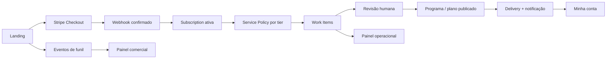

# CORDA — Aceleração operacional e comercial do Curva

**Status:** implementação técnica principal concluída; validação operacional e Gate 8 em andamento  
**Data:** 2026-09-20  
**Dono de produto:** Renan  
**Escopo:** fechar os gaps entre aquisição, promessa comercial, operação humana e mensuração  
**Planos de origem:**

- [public-workouts-go-to-market-plan.md](public-workouts-go-to-market-plan.md)
- [public-workouts-escala-e-nutricao-corda.md](public-workouts-escala-e-nutricao-corda.md)

Este documento não substitui os dois planos de origem. Ele transforma a auditoria do
runtime atual no próximo plano executável e passa a ser a autoridade para as fases de
aceleração posteriores à primeira implementação de landing, checkout, onboarding,
central do cliente e nutrição.

---

# C — Contexto

## Estado real de partida

O núcleo comercial já existe:

1. landing pública com três tiers;
2. cadastro a frio;
3. Stripe Checkout e webhook dedicado;
4. assinatura iniciando em `PENDING_PAYMENT`;
5. anamnese de treino e anamnese nutricional;
6. central `Minha conta` orientada por estado;
7. revisão humana de rascunho antes da publicação;
8. plano alimentar versionado e validado;
9. Customer Portal e reconciliação de troca de tier;
10. entrega autenticada do programa de treino;
11. compatibilidade com os alunos legados.

O problema mudou. Já não é principalmente conectar landing, pagamento e cadastro. O
problema agora é garantir que aquilo que foi vendido seja entregue dentro de prazo,
medido por canal e sustentável para duas agendas humanas.

## Diagnóstico resumido

| Área | Estado atual | Gap que impede acelerar |
|---|---|---|
| Checkout e assinatura | sólido e coberto por testes | configuração externa ainda precisa de gate de deploy |
| Jornada do cliente | centralizada em `journey.py` | nutrição não tem entrega equivalente à do treino |
| Operação | filtros derivados no Django Admin | sem SLO, idade, responsável, prioridade ou capacidade |
| Premium | preço e entitlement existem | revisão semanal e prioridade não são contratos operacionais |
| Nutrição | schema e snapshots corretos | nutricionista edita JSON em textarea |
| Landing | oferta e checkout conectados | prova provisória, claims não medidos e credenciais duplicadas |
| GTM | métricas descritas no plano | nenhuma instrumentação própria de funil e atribuição |
| Gestão | Stripe guarda cobrança | produto não mostra churn, conversão, MRR por tier ou tempo de entrega |

## Restrições

1. Preservar o monólito modular e o app `public_workouts` como dono do domínio.
2. Não misturar a consultoria com `finance.Payment`, matrícula ou frequência do box.
3. Não substituir Stripe por cobrança própria.
4. Não automatizar a revisão humana para fora do produto.
5. Não criar microserviços, fila distribuída ou data warehouse nesta fase.
6. Não quebrar os alunos legados nem exigir login retroativo sem migração explícita.
7. Dados de saúde continuam privados, fora de caches públicos e protegidos por posse
   da conta.
8. Eventos analíticos não podem armazenar respostas de anamnese, conteúdo do treino,
   conteúdo nutricional ou outros dados sensíveis.

## Premissas operacionais

- O time inicial é pequeno: Renan, nutricionista e suporte técnico.
- O Django Admin continuará sendo a primeira superfície interna.
- A primeira meta é operar com segurança dezenas de clientes, não milhares.
- As capacidades numéricas de cada profissional ainda serão medidas. O sistema deve
  aceitá-las por configuração sem inventar um número definitivo.
- O tráfego pago pode continuar em modo de teste, mas não deve escalar antes do gate
  definido no fim deste documento.

---

# O — Objetivo

Transformar o Curva de um funil que consegue cobrar e cadastrar em uma operação que:

1. sabe de onde cada venda veio;
2. mede cada queda relevante do funil;
3. traduz cada tier em obrigações operacionais verificáveis;
4. atribui trabalho, prazo e prioridade aos profissionais;
5. alerta antes de uma entrega atrasar;
6. limita vendas ou abre lista de espera quando a capacidade real acaba;
7. permite que a nutricionista publique sem editar JSON;
8. entrega e notifica plano alimentar com a mesma confiabilidade do treino;
9. sustenta claims comerciais apenas com evidência;
10. mostra se crescimento gera margem e retenção, não apenas MRR bruto.

## Métricas de sucesso da implementação

### Funil

- 100% dos checkouts iniciados possuem `acquisition_session_id` e tier.
- 95% ou mais das compras confirmadas preservam canal/origem quando disponíveis.
- É possível calcular visita → escolha de tier → checkout → pagamento por canal.

### Operação

- 100% das assinaturas ativas que exigem trabalho possuem work item aberto ou entrega
  concluída correspondente.
- Nenhum item vencido fica invisível no admin.
- Tempo pagamento → primeira publicação pode ser calculado sem planilha manual.
- Premium gera revisão recorrente conforme a política do tier.

### Nutrição

- A nutricionista não precisa escrever JSON.
- Payload inválido continua impossível de publicar.
- Toda publicação nutricional possui autoria, entrega e rastreabilidade.

### Comercial

- MRR, churn e composição por tier são calculáveis a partir do produto/Stripe.
- Claims “mais escolhido” e “vagas limitadas” são derivados de dados ou não aparecem.
- Escala de tráfego só é liberada se capacidade e SLO estiverem saudáveis.

---

# R — Riscos

## R1 — Instrumentação virar coleta indiscriminada de dados

Mitigação: eventos usam allowlist, sem payload livre de saúde. E-mail não entra nos
eventos; quando for necessário correlacionar, usa-se `account_id` interno ou um ID de
sessão aleatório assinado.

## R2 — Criar uma segunda fonte de verdade para assinatura

Mitigação: `PublicWorkoutWorkItem` representa trabalho operacional, nunca estado de
pagamento. `PublicWorkoutSubscription` e eventos Stripe continuam sendo a verdade de
cobrança. Work items são criados idempotentemente a partir de transições do domínio.

## R3 — SLO interno virar promessa pública impossível

Mitigação: o prazo nasce como SLO interno e só vira SLA/copy pública depois de medição.
O painel deve comparar capacidade planejada e tempo real antes de publicar prazo na
landing.

## R4 — Automação publicar conteúdo sem revisão

Mitigação: automação pode abrir tarefas, calcular prazo e notificar; nunca aprova treino
ou plano alimentar. Publicação continua sendo ação humana explícita.

## R5 — Editor nutricional visual divergir do schema

Mitigação: o editor apenas monta o mesmo `payload`; `nutrition_schema.validate_payload`
continua sendo a barreira final no servidor. O JSON não deixa de existir como formato de
persistência, apenas deixa de ser a interface da nutricionista.

## R6 — Capacidade bloquear receita por erro de contagem

Mitigação: primeiro modo `observe`, depois `warn`, por último `enforce`. O bloqueio de
checkout só entra após quatro semanas ou amostra operacional suficiente, além de teste da
regra com dados reais.

## R7 — Eventos client-side serem bloqueados e distorcerem conversão

Mitigação: eventos financeiros e de onboarding são registrados no servidor. JavaScript
fica restrito a visita, interação e seleção de tier. Métricas distinguem eventos
observados no cliente de transições confirmadas no servidor.

## R8 — Crescer MRR sem margem

Mitigação: painel separa receita bruta, taxas, reembolsos, horas estimadas e receita
líquida operacional. A divisão societária continua sendo regra de negócio/contabilidade,
não payout automático nesta fase.

## R9 — Trial gratuito consumir trabalho humano antes da primeira receita

No baseline auditado, a garantia de sete dias estava implementada como trial nativo da
Stripe. O Gate 0 adotou cobrança imediata + garantia de reembolso porque o serviço inicia
trabalho humano no onboarding. Os modelos abaixo permanecem como registro da decisão:

Mitigação: antes de acelerar aquisição, escolher conscientemente entre:

1. **cobrança imediata + garantia de reembolso em sete dias** — recomendada para serviço
   com trabalho humano desde o onboarding;
2. **trial com entrega limitada** — coleta de anamnese e diagnóstico durante o trial,
   publicação personalizada somente após a primeira cobrança;
3. **trial completo** — aceitar explicitamente o custo de aquisição em trabalho humano.

O sistema não chama `checkout.session.completed` de “pagamento confirmado”: esse evento
valida Price ID e vincula IDs Stripe. Somente `invoice.payment_succeeded` ativa a
assinatura, registra receita e libera trabalho. Se um trial voltar a existir, ele
permanece pendente até dinheiro recebido.

---

# D — Direção arquitetural

## D.1 — Preservar o núcleo e adicionar uma camada operacional

Não reescrever checkout, assinatura ou snapshots. A evolução adiciona três conceitos:

1. **Funnel Event:** fato analítico append-only, sem comandar negócio.
2. **Work Item:** obrigação operacional com dono, prazo e estado.
3. **Service Policy:** contrato em código que traduz tier em entitlement, prioridade,
   prazo interno e recorrência.



## D.2 — Aquisição é uma sessão vinculável; eventos são fatos

Somente uma tabela de eventos não garante que UTM sobreviva ao salto
landing → Stripe → webhook. Criar `PublicWorkoutAcquisitionSession` como envelope
first-party da aquisição:

- UUID aleatório em cookie assinado;
- first touch e last touch explícitos;
- `landing_variant` e `offer_version`;
- vínculo posterior opcional com `account` e `subscription`;
- datas de primeira e última interação;
- sem e-mail, anamnese ou conteúdo sensível.

O cold signup vincula a sessão à conta. O checkout grava seu UUID em metadata. O webhook
reconcilia a assinatura com a mesma sessão. Isso permite atribuição consistente sem usar
fingerprinting.

Novo modelo `PublicWorkoutFunnelEvent`:

```python
class PublicWorkoutFunnelEvent(models.Model):
    event_id = models.UUIDField(unique=True, editable=False)
    event_type = models.CharField(max_length=48, db_index=True)
    acquisition_session = models.ForeignKey(
        PublicWorkoutAcquisitionSession, null=True, blank=True,
        on_delete=models.SET_NULL, related_name='events',
    )
    account = models.ForeignKey(
        PublicWorkoutAccount, null=True, blank=True,
        on_delete=models.SET_NULL, related_name='+',
    )
    subscription = models.ForeignKey(
        PublicWorkoutSubscription, null=True, blank=True,
        on_delete=models.SET_NULL, related_name='+',
    )
    tier = models.CharField(max_length=16, blank=True)
    channel = models.CharField(max_length=32, blank=True, db_index=True)
    source = models.CharField(max_length=80, blank=True)
    medium = models.CharField(max_length=80, blank=True)
    campaign = models.CharField(max_length=120, blank=True)
    schema_version = models.PositiveSmallIntegerField(default=1)
    correlation_id = models.UUIDField(null=True, blank=True, db_index=True)
    client_event_id = models.UUIDField(null=True, blank=True, unique=True)
    occurred_at = models.DateTimeField(db_index=True)
    created_at = models.DateTimeField(auto_now_add=True)
```

Não usar `metadata=JSONField` arbitrário na primeira versão. Se surgir dimensão nova,
adicionar campo explícito. Isso reduz vazamento acidental e mantém queries previsíveis.

First touch responde “o que trouxe a pessoa”; last touch responde “o que antecedeu a
conversão”. Os dois devem ser exibidos. Escolher apenas um modelo de atribuição esconderia
parte da jornada e induziria decisão ruim de mídia.

Allowlist inicial:

- `landing_viewed`;
- `tier_selected`;
- `checkout_started`;
- `checkout_authorized`;
- `invoice_paid`;
- `checkout_canceled`;
- `training_intake_completed`;
- `nutrition_intake_completed`;
- `program_published`;
- `meal_plan_published`;
- `program_opened`;
- `subscription_canceled`.

## D.3 — Work item é projeção operacional, não fila de pagamento

Novo modelo `PublicWorkoutWorkItem`:

```python
class PublicWorkoutWorkItemType(models.TextChoices):
    TRAINING_PROGRAM = 'training_program', 'Montar treino'
    NUTRITION_PLAN = 'nutrition_plan', 'Montar plano nutricional'
    TRAINING_REVIEW = 'training_review', 'Revisão de treino'
    NUTRITION_REVIEW = 'nutrition_review', 'Revisão nutricional'

class PublicWorkoutWorkItemStatus(models.TextChoices):
    OPEN = 'open', 'Aberto'
    IN_PROGRESS = 'in_progress', 'Em andamento'
    BLOCKED = 'blocked', 'Bloqueado'
    DONE = 'done', 'Concluído'
    CANCELED = 'canceled', 'Cancelado'

class PublicWorkoutWorkItem(models.Model):
    account = models.ForeignKey(PublicWorkoutAccount, on_delete=models.CASCADE)
    subscription = models.ForeignKey(PublicWorkoutSubscription, on_delete=models.CASCADE)
    item_type = models.CharField(max_length=32, choices=PublicWorkoutWorkItemType.choices)
    cycle_key = models.CharField(max_length=64)
    status = models.CharField(max_length=16, choices=PublicWorkoutWorkItemStatus.choices)
    priority = models.PositiveSmallIntegerField(default=100, db_index=True)
    estimated_effort_minutes = models.PositiveSmallIntegerField(default=30)
    actual_effort_minutes = models.PositiveSmallIntegerField(null=True, blank=True)
    assigned_to = models.ForeignKey(
        PublicWorkoutProfessional, null=True, blank=True,
        on_delete=models.PROTECT, related_name='work_items',
    )
    due_at = models.DateTimeField(db_index=True)
    started_at = models.DateTimeField(null=True, blank=True)
    completed_at = models.DateTimeField(null=True, blank=True)
    blocked_reason = models.CharField(max_length=255, blank=True)
    created_at = models.DateTimeField(auto_now_add=True)
    updated_at = models.DateTimeField(auto_now=True)

    class Meta:
        constraints = [
            models.UniqueConstraint(
                fields=['subscription', 'item_type', 'cycle_key'],
                name='unique_public_workout_work_item_cycle',
            ),
        ]
```

`cycle_key` torna abertura e retry idempotentes:

- onboarding: `onboarding`;
- revisão semanal: `2026-W39`;
- revisão por ciclo: `program:<program_id>`.

Work item concluído não publica conteúdo por conta própria. O service de publicação
conclui o item correspondente dentro da mesma transação ou agenda reconciliação.

Transições usam `select_for_update()` e um service explícito; admin não altera `status`
diretamente. Estados permitidos:

```text
OPEN → IN_PROGRESS → DONE
  ↘       ↕
   BLOCKED
OPEN/IN_PROGRESS/BLOCKED → CANCELED
```

## D.4 — Política de serviço em código antes de tabela configurável

Criar `public_workouts/service_policy.py` com uma estrutura imutável:

```python
@dataclass(frozen=True)
class TierServicePolicy:
    training_initial_sla_hours: int
    nutrition_initial_sla_hours: int | None
    priority: int
    training_review_cadence_days: int | None
    nutrition_review_cadence_days: int | None
```

Os valores iniciais devem vir de settings, com defaults conservadores, até que a
capacidade real seja medida. Não criar tabela de planos agora: preços e composição ainda
são três opções fixas. Reconsiderar quando a equipe precisar editar política sem deploy
ou houver preços por profissional/região.

Todo entitlement deve consumir essa política:

- precisa de nutrição;
- prioridade operacional;
- revisão recorrente;
- SLO interno;
- capacidade consumida.

## D.5 — Editor visual sem mudar o formato persistido

Manter `PublicWorkoutMealPlan.payload` e `nutrition_schema.py`. Substituir o textarea por
um editor Django Admin progressivo:

- campos de meta diária;
- lista ordenável de refeições;
- adicionar/remover refeição;
- adicionar/remover item;
- adicionar/remover substituição;
- preview do plano;
- hidden input contendo JSON serializado;
- fallback técnico somente para superusuário, atrás de `<details>`.

Não normalizar alimentos em tabelas nesta fase. O ganho necessário é UX operacional,
não criar uma base nutricional global.

## D.6 — Entrega de nutrição espelha treino

Adicionar `PublicWorkoutMealPlanDelivery` com:

- `meal_plan` OneToOne;
- `attempted_at`;
- `sent_at`;
- `opened_at`;
- `last_error`;
- `attempt_count`.

O e-mail aponta para a central autenticada, não para uma URL pública de plano. A central
deve mostrar CTA “Abrir plano alimentar” quando houver plano ativo. Retry manual no
admin segue o padrão de `PublicWorkoutProgramDelivery`.

## D.7 — Capacidade é política explícita, não copy

Capacidade não deve ser “quantos alunos cabem”. Um Essencial estável e um Premium em
onboarding consomem esforços muito diferentes. A unidade inicial será **minuto de trabalho
previsto**, calibrado por `estimated_effort_minutes` e corrigido pelo esforço real.

Primeira versão em settings e policy:

- minutos disponíveis por semana por profissional;
- esforço padrão por tipo de work item e tier;
- horizonte de compromissos futuros (14 e 28 dias);
- modo `observe|warn|enforce`;
- margem de segurança.

O snapshot calcula:

```text
carga comprometida = soma do esforço estimado dos itens abertos no horizonte
utilização = carga comprometida / minutos disponíveis
throughput real = itens concluídos e minutos reais por semana
```

Contagem de alunos continua visível, mas nunca decide sozinha se há vaga. Depois de quatro
semanas, medianas reais substituem estimativas por tipo de tarefa. Não usar média simples:
outliers de um plano complexo distorcem a capacidade; usar mediana e percentil 80.

Adicionar `PublicWorkoutWaitlistEntry` somente quando `enforce` for habilitado:

- e-mail normalizado;
- tier desejado;
- aquisição/origem;
- estado `waiting|invited|converted|expired`;
- token de convite com validade;
- consentimento de contato.

No modo `observe`, nenhuma compra é bloqueada. No modo `warn`, o admin recebe alerta e a
landing comunica prazo maior. No modo `enforce`, CTA indisponível abre lista de espera.

## D.8 — Read models por query antes de dashboard complexo

Criar serviços de leitura:

- `build_funnel_snapshot(start, end, channel=None)`;
- `build_operations_snapshot(now)`;
- `build_revenue_snapshot(start, end)`;
- `build_capacity_snapshot(now)`.

Primeira interface: páginas read-only dentro do admin. Não introduzir Celery, BI externo
ou materialized views antes de medir latência. Cache curto é permitido para snapshots,
sempre invalidável e sem dados de saúde.

## D.9 — Contrato comercial versionado

Tier é um rótulo mutável; a promessa aceita pelo cliente não pode mudar retroativamente
quando a copy ou a policy mudar. Salvar na assinatura/checkout um snapshot enxuto:

- `offer_version`;
- `service_policy_version`;
- `terms_version` e `privacy_version` aceitas;
- tier e Price ID contratados;
- data da contratação;
- modelo de garantia (`refund_guarantee|limited_trial|full_trial`).

Não duplicar toda a landing em JSON. Guardar identificadores imutáveis cujos artefatos
correspondentes permanecem versionados no repositório. Mudança material cria nova versão;
renovação comum preserva contrato, upgrade/downgrade exige aceite da versão vigente.

## D.10 — Outbox transacional para efeitos externos

Publicar conteúdo e enviar e-mail na mesma requisição cria uma janela clássica: o banco
confirma, o processo cai antes do envio, ou o e-mail demora e prende o admin. Evoluir as
entregas para uma outbox pequena e persistente:

- transação publica snapshot, conclui work item e grava mensagem pendente;
- `drain_public_workout_outbox` envia fora da transação;
- chave idempotente por tipo+objeto+versão;
- retry com backoff e dead-letter visível;
- o mecanismo de jobs/scheduler já existente dispara o drain;
- retry manual permanece como contingência.

Não criar broker novo. Postgres é suficiente para o volume atual e elimina dual write
entre conteúdo publicado e pedido de notificação.

## D.11 — Retenção antes de churn

Churn é um indicador atrasado. Criar um score operacional determinístico, não ML, usando
somente sinais já autorizados:

- programa entregue mas nunca aberto;
- nenhuma carga registrada no período esperado;
- anamnese incompleta;
- cobrança em risco;
- revisão vencida;
- queda sustentada de atividade.

O score abre um work item `CUSTOMER_SUCCESS_CONTACT` e explica quais regras dispararam.
Nunca inferir condição médica, motivação psicológica ou usar conteúdo da anamnese para
marketing. Começar em modo observação e validar falsos positivos antes de contato
automático.

---

# ADRs

## ADR-1 — Eventos próprios mínimos, não Google Analytics como fonte de verdade

**Decisão:** transições críticas ficam no Postgres; ferramenta externa pode ser adicionada
depois para marketing. Ad blockers não podem apagar a verdade de pagamento/onboarding.

**Trade-off:** menos recursos prontos de atribuição, mas privacidade e consistência muito
maiores.

## ADR-2 — Work item separado da assinatura

**Decisão:** assinatura continua representando cobrança; work item representa trabalho.

**Trade-off:** uma tabela e reconciliação novas. Aceito porque Premium e revisões
recorrentes já tornaram a fila derivada por `plan_slug` insuficiente.

## ADR-3 — Política por tier em código

**Decisão:** dataclass/settings agora, tabela configurável depois.

**Trade-off:** mudar SLO exige deploy. Aceito enquanto são três tiers e uma equipe pequena.

## ADR-4 — JSON continua sendo armazenamento nutricional

**Decisão:** corrigir a interface, não reestruturar o domínio.

**Trade-off:** queries por alimento continuam limitadas. Não são necessárias para o
objetivo atual.

## ADR-5 — Sem payout automático para sócia nesta rodada

**Decisão:** medir receita e gerar relatório; repasse permanece contábil/manual.

**Trade-off:** trabalho mensal manual. Aceito até existir volume ou erro recorrente que
justifique Stripe Connect/automação financeira.

## ADR-6 — Capacidade por carga de trabalho, não por cabeça

**Decisão:** minutos previstos, throughput e percentis orientam disponibilidade.

**Trade-off:** exige registrar esforço real por algumas semanas. Aceito porque uma regra
simples de alunos por tier venderia precisão falsa.

## ADR-7 — Contrato comercial possui versão imutável

**Decisão:** assinatura referencia a versão de oferta/policy/termos vigente na contratação.

**Trade-off:** upgrades exigem reconciliação de versão. Aceito para impedir que alterações
futuras mudem silenciosamente o que um cliente comprou.

## ADR-8 — Postgres outbox antes de broker

**Decisão:** efeitos externos usam outbox transacional drenada pelo runtime de jobs atual.

**Trade-off:** polling pequeno no Postgres. Adequado ao volume atual e muito mais simples
que operar infraestrutura distribuída.

---

# Plano de execução

> **Status verificado em 2026-09-21:** Gate 0 e fases 0–7 possuem implementação
> incremental no repositório, protegida por flags. A suíte ampla do domínio Curva passou
> com **885 testes + 65 subtests**, a suíte crítica passou com migrations reais
> (**99 testes**) e o conjunto visual/E2E de SmartPaste, pendências mobile, calendário e
> navegação Curva passou com **53 testes**. O editor nutricional ganhou ainda um E2E de
> browser próprio, verde em banco recriado (**1 teste**), cobrindo login autenticado,
> edição visual, serialização e publicação sem manipular JSON.
>
> A inconsistência multi-tenant que bloqueava a suíte global foi corrigida na causa raiz:
> como `contenttypes` existe por tenant, `admin` agora também cria `django_admin_log` por
> tenant, evitando que um ContentType de `box_test` seja gravado contra o FK do schema
> `public`. Um teste de regressão valida essa topologia e duas execuções consecutivas com
> banco reutilizado passaram. Em banco recriado, PostgreSQL e migrations reais, a suíte
> global terminou com **2491 passed, 168 subtests passed, 8 skipped e zero falhas** em
> **11m13s**.
>
> As jornadas E2E comerciais também foram fechadas em browser: contratação nova,
> recontratação autenticada, portal de assinatura de cliente ativo e login por magic link.
> A Stripe hospedada é substituída somente pela URL de retorno local no teste; sessão,
> contrato, landing, CSRF, JavaScript e estados do produto continuam reais. A Fase 8 ainda
> permanece **não concluída** pelas janelas operacionais: capacidade, SLO, atribuição e
> margem devem cumprir observação real; teste automatizado não substitui quatro semanas de
> dados nem duas semanas consecutivas de gates.
> O procedimento operacional está em
> [../runbooks/public-workouts-operacao.md](../runbooks/public-workouts-operacao.md).

| Fase | Estado técnico | Evidência que ainda falta para liberar escala |
|---|---|---|
| Gate 0 / Fases 0–4 | implementado e coberto no domínio | smoke de produção e confirmação dos schedulers |
| Fase 5 | implementada em `observe`, com `warn`/`enforce` disponíveis | quatro semanas ou amostra suficiente de mediana/P80 |
| Fases 6–7 | modelos, admin e snapshots implementados | dados reais de consentimento, CAC, churn e margem |
| Fase 8 | parcial | gates operacionais verdes por duas semanas após observação real |

## Gate 0 — Decisão econômica da garantia

**Objetivo:** não automatizar escala sobre uma contradição econômica.

Antes da Fase 0, decidir e registrar um dos três modelos do R9. Recomendação atual:
**cobrança imediata + reembolso em sete dias**, porque treino e nutrição exigem trabalho
humano irreversível. Se o trial nativo for mantido, o plano precisa declarar qual entrega
fica disponível antes de `invoice.paid` e contabilizar esse esforço como CAC.

### Pronto quando

- landing, termos, Stripe e máquina de estados usam a mesma definição;
- testes distinguem assinatura autorizada, trial e pagamento recebido;
- a fila operacional sabe se pode iniciar trabalho antes da primeira cobrança.

## Fase 0 — Baseline, documentação e feature flags

**Objetivo:** iniciar sem ambiguidade nem mudança visível ao cliente.

### Implementação

1. Marcar nos dois planos anteriores o que está implementado, parcial e pendente.
2. Adicionar settings:
   - `PUBLIC_WORKOUT_FUNNEL_TRACKING_ENABLED`;
   - `PUBLIC_WORKOUT_OPERATIONS_ENABLED`;
   - `PUBLIC_WORKOUT_CAPACITY_MODE`;
   - políticas de SLO/cadência por tier.
3. Criar documento de eventos e política de retenção.
4. Registrar baseline:
   - assinaturas por tier/status;
   - pagamentos confirmados;
   - tempo aproximado de publicação dos atuais;
   - tempo da suíte com `--create-db`.

### Testes

- checks de settings;
- defaults seguros com flags desligadas;
- nenhuma alteração visível para legados.

### Pronto quando

Runtime e documentação concordam e todas as fases seguintes podem ser ativadas
independentemente.

---

## Fase 1 — Instrumentação do funil

**Objetivo:** medir antes de aumentar mídia.

### Implementação

1. Migration de `PublicWorkoutAcquisitionSession` e `PublicWorkoutFunnelEvent`.
2. Cookie first-party de sessão analítica aleatória, sem e-mail.
3. Captura allowlisted de first/last touch, `utm_source`, `utm_medium`,
   `utm_campaign`, referrer, variante e versão da oferta.
4. Endpoint POST CSRF-protected para eventos client-side permitidos.
5. Eventos server-side em:
   - cold signup;
   - criação de checkout;
   - webhook confirmado;
   - anamneses salvas;
   - publicações;
   - cancelamento.
6. Propagação do UUID da aquisição pela metadata da Stripe e reconciliação no webhook.
7. Idempotência por `client_event_id` e pelo ID do evento Stripe quando aplicável.
8. Snapshot com first/last touch e painel de funil no admin.

### Testes

- duplicata não cria evento extra;
- evento inválido retorna 400;
- payload sensível é rejeitado;
- UTM sobrevive landing → checkout → webhook;
- visitante que retorna preserva first touch e atualiza last touch;
- checkout concluído é contado mesmo sem JS;
- isolamento por conta.

### Pronto quando

É possível responder, para qualquer período: quantas pessoas visitaram, escolheram tier,
iniciaram checkout, pagaram e concluíram cada anamnese, segmentadas por canal.

---

## Fase 2 — Contrato de tier e fila operacional com SLO

**Objetivo:** fazer cada promessa comercial virar obrigação rastreável.

### Implementação

1. `service_policy.py` e testes de matriz por tier.
2. Migration de `PublicWorkoutWorkItem`.
3. Service idempotente `ensure_required_work_items(subscription, trigger)`.
4. Abrir itens somente após pré-condições:
   - treino inicial após pagamento + anamnese de treino;
   - nutrição inicial após pagamento + anamnese nutricional;
   - revisões recorrentes somente com assinatura ativa;
   - revisão semanal só entra como trabalho completo quando houver registros/check-in;
     sem atividade, cria contato leve em vez de revisão vazia.
5. Concluir item na publicação correspondente.
6. Cancelar itens futuros ao cancelar/suspender assinatura.
7. Comando de reconciliação para reparar item ausente sem duplicar.
8. Admin com:
   - idade;
   - prazo;
   - atrasado;
   - responsável;
   - tier;
   - prioridade;
   - bloqueio e motivo.
9. Capturar esforço real ao concluir e comparar estimado × real.
10. Usar SLO interno enquanto não houver histórico; “SLA” público somente depois de
    validação comercial e operacional.

### Testes

- matriz Essencial/Completo/Premium;
- retry idempotente;
- Premium recebe prioridade superior;
- publicação conclui exatamente um item;
- cancelamento não deixa revisão futura aberta;
- comando de reconciliação pode rodar duas vezes;
- dados legados são reconciliados sem disparar e-mail.

### Pronto quando

Toda assinatura ativa mostra, sem inferência manual, qual é o próximo trabalho, quem é o
dono e quando vence.

---

## Fase 3 — Editor nutricional estruturado

**Objetivo:** remover JSON da rotina da nutricionista.

### Implementação

1. Componentes do form para metas, refeições, itens e substituições.
2. JavaScript admin pequeno, sem framework novo.
3. Serialização determinística para hidden JSON.
4. Preview usando o mesmo presenter da leitura do aluno.
5. Validação client-side para feedback rápido e server-side como autoridade.
6. Preservar tela read-only das versões antigas.

### Testes

- unitários da serialização;
- form válido gera o payload canônico;
- remover/adicionar/reordenar não perde dados;
- caracteres Unicode e decimais brasileiros;
- payload inválido nunca publica;
- E2E desktop da nutricionista;
- E2E mobile de leitura do aluno.

### Pronto quando

Uma profissional sem conhecimento de JSON cria e revisa um plano completo sem tocar em
estrutura técnica.

---

## Fase 4 — Entrega nutricional e central completa

**Objetivo:** dar à nutrição a mesma confiabilidade de entrega do treino.

### Implementação

1. Migration de `PublicWorkoutMealPlanDelivery` e outbox.
2. `notify_meal_plan_ready()` idempotente, drenado fora da transação de publicação.
3. Retry com backoff, dead-letter e contingência no admin.
4. CTA direto na central do cliente.
5. Registrar `opened_at` no primeiro acesso autenticado.
6. Separar estados da jornada:
   - treino pronto, nutrição pendente;
   - nutrição pronta, treino pendente;
   - ambos prontos;
   - revisão em andamento.

### Testes

- publicação dupla envia uma vez;
- falha de e-mail não desfaz publicação;
- retry envia depois;
- Essencial continua sem endpoint nutricional;
- outra conta recebe 404;
- central nunca aponta para conteúdo ausente.

### Pronto quando

É possível provar publicação, tentativa, envio e abertura de cada plano alimentar.

---

## Fase 5 — Capacidade, alertas e lista de espera

**Objetivo:** impedir que marketing venda além da capacidade humana.

### Implementação

1. Snapshot de capacidade por profissional, tipo de trabalho e tier, em minutos.
2. Alertas por limiar:
   - 70% atenção;
   - 85% risco;
   - 100% lotado.
3. Resumo diário somente quando houver mudança ou ação necessária.
4. Modo `observe` por no mínimo quatro semanas ou amostra suficiente para mediana e P80.
5. Modo `warn` após validação dos cálculos.
6. Migration e fluxo de waitlist antes de `enforce`.
7. Landing consulta disponibilidade server-side.

### Testes

- contagem respeita cancelados/suspensos;
- dois alunos do mesmo tier podem consumir esforços diferentes sem corromper o total;
- projeção de 14/28 dias inclui revisões recorrentes ainda não vencidas;
- capacidade de nutrição não bloqueia Essencial;
- waitlist é idempotente por e-mail+tier ativo;
- convite expira e só converte uma vez;
- mudança de modo não afeta clientes existentes.

### Pronto quando

“Vagas limitadas” corresponde a uma regra observável e o produto para de aceitar venda
quando não consegue cumprir o prazo.

---

## Fase 6 — Landing baseada em evidência

**Objetivo:** alinhar copy, dados e operação.

### Implementação

1. Credenciais vindas de `PublicWorkoutProfessional`, com fallback seguro.
2. Remover `Mais escolhido` até haver amostra mínima configurada.
3. Depois da amostra, derivar badge do mix real dos últimos 90 dias.
4. Substituir gráfico ilustrativo por prova anonimizada aprovada.
5. Publicar depoimentos somente com consentimento versionado.
6. Mostrar disponibilidade real ou lista de espera.
7. Não publicar SLA até Fase 5 produzir dados estáveis.

### Testes

- landing não renderiza claim sem evidência;
- credencial inativa não aparece;
- conteúdo sem consentimento não aparece;
- nenhuma PII é exposta na prova anonimizada;
- CTAs respeitam capacidade.

### Pronto quando

Cada claim importante da página tem fonte de dados, consentimento ou política operacional
correspondente.

---

## Fase 7 — Métricas comerciais e unit economics

**Objetivo:** decidir investimento por margem e retenção.

### Implementação

1. Snapshot de receita com:
   - MRR bruto;
   - receita por tier;
   - novos MRR e MRR perdido;
   - churn de clientes e de receita;
   - reembolsos;
   - taxas conhecidas;
   - inadimplência.
2. Conversão e CAC por campanha.
3. Campo administrativo de custo de campanha por período.
4. Estimativa de esforço por tipo de work item.
5. Relatório de margem operacional por tier.
6. Motivo de cancelamento opcional, sem impedir cancelamento no Stripe.
7. Score determinístico de saúde/engajamento em modo observação.
8. Work item de customer success somente após medir falsos positivos.

### Testes

- timezone e fechamento mensal;
- upgrades/downgrades não contam como novo cliente;
- cancelamento e reativação;
- receita não duplica por webhook repetido;
- CAC sem custo informado aparece como indisponível, nunca zero;
- churn distingue cliente e receita.

### Pronto quando

É possível decidir aumentar ou cortar uma campanha com base em conversão, payback, churn
e capacidade — não apenas em vendas brutas.

---

## Fase 8 — Hardening e liberação de escala

**Objetivo:** provar que produto, operação e aquisição podem crescer juntos.

### Implementação

1. Reexecutar suíte global com PostgreSQL disponível.
2. E2E dos três clientes:
   - novo cliente;
   - cliente ativo renovando/alterando plano;
   - cliente retornando por login.
3. E2E dos dois profissionais:
   - treino;
   - nutrição.
4. Testes de webhook duplicado, atrasado e fora de ordem.
5. Runbook de incidentes:
   - pagamento sem work item;
   - entrega sem e-mail;
   - Price ID desconhecido;
   - capacidade inconsistente;
   - evento analítico perdido.
6. Atualizar os planos anteriores e o mapa de autoridade documental.

### Pronto quando

Todos os gates abaixo estiverem verdes por duas semanas consecutivas.

---

# Gates para acelerar tráfego pago

Não escalar orçamento apenas porque o checkout converteu. Exigir:

1. zero assinatura paga perdida fora da fila operacional;
2. pelo menos 95% das entregas iniciais dentro do SLO interno;
3. nenhum work item vencido invisível por mais de 24 horas;
4. capacidade abaixo de 85% ou waitlist ativa;
5. atribuição conhecida na maioria das compras;
6. churn medido, não estimado;
7. prova social real e consentida na landing;
8. Premium com revisão e prioridade realmente operacionais;
9. editor nutricional usado pela profissional sem intervenção técnica;
10. suíte crítica e E2E verdes no artefato que será publicado.
11. modelo da garantia validado: trabalho humano nunca começa num estado financeiro
    diferente do decidido no Gate 0.

Se qualquer gate de segurança, pagamento ou entrega falhar, mídia volta para modo de
teste até correção. Falha de uma métrica puramente analítica não interrompe clientes já
pagantes, mas impede aumentar orçamento.

O comando `evaluate_public_workout_growth_gate --strict` é a prova reexecutável das
condições mensuráveis: 28 snapshots diários, 14 verdes consecutivos, SLO ≥95% e atribuição
conhecida ≥70%. Os demais gates continuam exigindo evidência operacional e humana na mesma
janela; o comando nunca declara produção pronta quando a amostra é insuficiente.

---

# Sequenciamento recomendado

Evitar datas artificiais antes de conhecer disponibilidade do time. Usar ondas com gate
de saída e faixa de esforço:

| Onda | Conteúdo | Dependência | Esforço indicativo | Gate de saída |
|---|---|---|---:|---|
| A | Gate 0 + Fase 0 | nenhuma | 1–3 dias | garantia e estados financeiros coerentes |
| B | Fase 1 | Onda A | 4–7 dias | funil reconciliado até o webhook |
| C1 | Fase 2 | Onda B | 6–10 dias | 100% do trabalho exigido visível |
| C2 | Fase 3 | Onda B | 5–8 dias | nutricionista publica sem JSON |
| D | Fase 4 + outbox | C1 e C2 | 4–7 dias | treino e nutrição entregues com retry |
| E | Fase 5 | quatro semanas de observação | 5–8 dias | capacidade real e waitlist seguras |
| F | Fases 6 e 7 | B–E | 6–10 dias | claims e investimento sustentados por dados |
| G | Fase 8 | todas | 3–6 dias | gates verdes por duas semanas |

C1 e C2 podem avançar em paralelo somente se cada frente possuir migrations coordenadas
e ownership de arquivos definido. Onda E depende de tempo de observação, não apenas de
tempo de programação; tentar “acelerar” essa espera produziria números inventados.

## Primeiro corte de entrega recomendado

Para acelerar sem abrir sete frentes, o primeiro ciclo deve conter apenas:

1. Gate 0 decidido;
2. Fase 0 completa;
3. Fase 1 completa;
4. Fase 2 completa;
5. Fase 3 completa;
6. parte da Fase 4 até outbox, notificação e CTA.

Esse corte resolve o risco mais urgente: vender sem medir e receber dinheiro sem controlar
prazo. Capacidade, waitlist e otimização de mídia entram depois de quatro semanas ou uma
amostra operacional suficiente — o que ocorrer por último.

---

# Estratégia de migrations e rollout

1. Migrations somente aditivas nas Fases 1–5.
2. Novos campos inicialmente nullable ou com default seguro.
3. Backfill por management command idempotente, nunca dentro de migration longa.
4. Deploy de schema antes de habilitar feature flag.
5. Observação com escrita dupla apenas quando necessário; não duplicar fonte de verdade.
6. Rollback por flag, preservando dados coletados.
7. Remoção de filtros antigos do admin somente depois que work items forem reconciliados
   e comparados por duas semanas.

## Compatibilidade legada

- Assinaturas legadas não ganham tarefas retroativas automaticamente.
- Um comando `reconcile_public_workout_operations --dry-run` mostra o impacto antes de
  criar itens.
- `requires_login=False` permanece até migração específica.
- Programas e planos já publicados continuam acessíveis sem transformação de payload.

---

# Segurança, privacidade e retenção

1. Eventos de funil: retenção detalhada de 13 meses; agregados podem permanecer.
2. IP completo não é persistido no evento de produto.
3. Referrer é normalizado e query strings sensíveis são removidas.
4. UTM aceita tamanho e caracteres limitados.
5. Anamnese e payload nunca entram em evento, log de erro ou atributo HTML analítico.
6. Exportação LGPD deve incluir dados de funil associados à conta quando aplicável.
7. Exclusão/anonymização preserva agregados financeiros necessários, conforme política
   legal definida nos termos.
8. Admin de operação exige os mesmos gates de equipe já usados nas superfícies internas.

---

# Observabilidade

Adicionar logs estruturados e contadores para:

- evento rejeitado/duplicado;
- work item criado/concluído/reconciliado;
- work item vencido;
- publicação sem work item correspondente;
- entrega de treino/nutrição falha;
- capacidade acima do limiar;
- checkout sem atribuição;
- Price ID desconhecido;
- snapshot lento.

Não logar payload nutricional, anamnese ou tokens de login.

---

# O que não fazer agora

- Não criar microserviço de analytics.
- Não adotar Kafka/Celery apenas para abrir work items.
- Não construir catálogo global de alimentos.
- Não criar CMS para a landing.
- Não automatizar payout societário.
- Não gerar plano nutricional por IA.
- Não prometer suporte em tempo real.
- Não adicionar novos tiers antes de medir os três atuais.
- Não escalar mídia com fila vencida.

---

# Matriz de validação final

| Jornada | Evidência obrigatória |
|---|---|
| Visitante chega por campanha | UTM registrada sem PII |
| Escolhe um tier | evento idempotente e disponibilidade verificada |
| Inicia checkout | assinatura pendente + evento server-side |
| Stripe confirma | assinatura ativa + aquisição preservada |
| Responde anamnese | próximo work item aberto com SLO |
| Profissional trabalha | responsável, início e prazo visíveis |
| Publica conteúdo | snapshot imutável + work item concluído |
| Cliente recebe | delivery rastreado e retry possível |
| Cliente abre | abertura registrada e central consistente |
| Premium entra em novo ciclo | revisão recorrente criada uma vez |
| Cliente cancela | portal livre + churn/motivo contabilizados |
| Capacidade acaba | waitlist substitui checkout daquele tier |

---

# Decisão executiva

A implementação anterior foi uma boa fundação e não deve ser reaberta. A aceleração deve
começar por **medição + obrigação operacional**, não por mais landing, mais anúncios ou
mais automação de conteúdo.

A ordem profissional é:

> medir a entrada → controlar o trabalho → facilitar a entrega → limitar capacidade →
> provar a oferta → acelerar aquisição.

Em analogia simples: o caixa da loja já funciona. Agora precisamos numerar os pedidos,
colocar prazo em cada um, mostrar quem está preparando e fechar a porta quando a cozinha
atingir o limite. Só depois faz sentido trazer mais gente para a fila.
