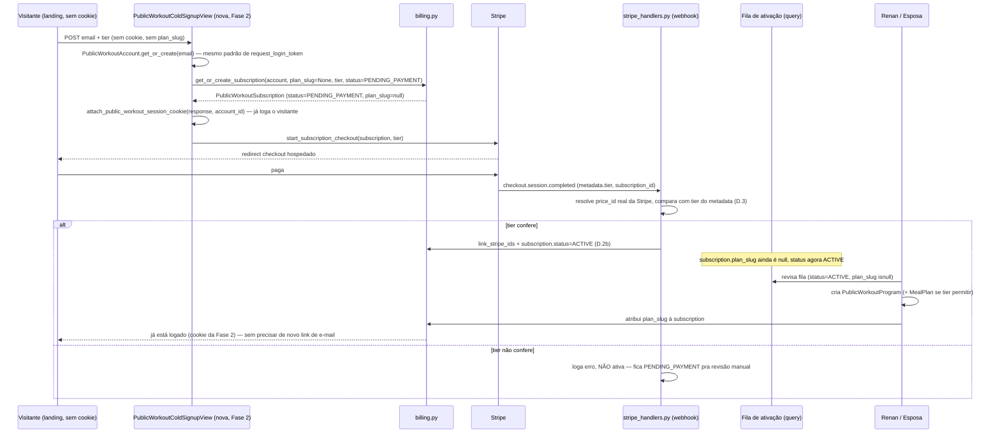
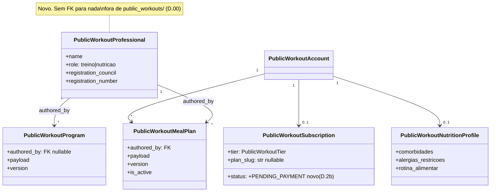

# CORDA — Escala (Entrega 5) + Nutrição (Entrega 6) do corredor de treinos

**Plano de produto original (o "porquê"):** [public-workouts-produtizacao-plan.md](public-workouts-produtizacao-plan.md)
**Execução técnica original (Entregas 0–4):** [public-workouts-produtizacao-corda.md](public-workouts-produtizacao-corda.md)
**Estratégia de venda (o que motiva este documento):** [public-workouts-go-to-market-plan.md](public-workouts-go-to-market-plan.md)
**Este documento:** como construir, em código, o que o GTM pede — landing page,
3 níveis de preço e o módulo de nutrição — continuando a numeração de Entregas já
existente no plano original em vez de inventar um trilho paralelo.

**Status:** plano de execução (era "proposta" — nível de detalhe elevado após
varredura de código real) · **Data:** 2026-09-17 · **Dono:** Renan (+ esposa,
frente de nutrição) · **Nível de esforço avaliado:** chief-architect (ver §Contexto)

> **Status de implementação em 2026-09-21:** as Entregas 5/6 estão materializadas no
> monólito modular, incluindo editor nutricional estruturado, entrega por outbox, hub,
> tiers e operação. A camada adicional de aceleração (contratos, funil, SLO, capacidade,
> waitlist, garantia e unit economics) está em
> [public-workouts-aceleracao-operacional-corda.md](public-workouts-aceleracao-operacional-corda.md).
> Não considerar “liberado para escala” antes da Fase 8: as suítes PostgreSQL e E2E do
> domínio e o runner global multi-tenant já possuem evidência verde, mas as jornadas E2E
> comerciais finais e as janelas reais de capacidade/SLO ainda não fecharam o gate final.

> **Atualização (mesmo dia, pós-Revisão 3 do GTM):** a decisão do §7.6 do GTM mudou de
> "v1 100% manual, payload livre" para **"nasce estruturada desde o v1"** — o dono do
> produto decidiu não aceitar o `payload` como blob JSON livre decidido ad-hoc pela
> nutricionista. D.6 abaixo foi reescrito: `payload` agora segue um schema explícito
> (mesmo padrão de `public_workouts/schema.py`, hand-rolled, sem lib externa), com um
> novo `nutrition_schema.py` espelhando as mesmas convenções do schema de treino. Isso
> **não** muda a decisão de que o preenchimento continua manual (a nutricionista digita
> no admin, não há parser/IA gerando o plano) — muda só a forma dos dados, não quem
> produz. Ver ADR-6 (nova) e Fase 4 revisada.

> **Nota de varredura (mesmo dia — passagem de "proposta" para plano de execução):**
> este documento foi escrito antes de ler `stripe_checkout.py`, `stripe_handlers.py`,
> `student_identity/public_workout_views.py`, `public_workout_session.py`, os
> templates e o `admin.py` linha a linha. Três agentes de exploração leram o código
> real desta vez; correções que isso trouxe:
>
> 1. **`/treinos/` já tem 4 rotas, não 1.** A afirmação "hoje só existe
>    `/treinos/login`" (C e D.7 antigos) estava desatualizada — já existem também
>    `subscribe`, `billing-portal` e `stripe/webhook/` (Onda B2 já entregue). O que
>    continua verdade é que **a raiz `/treinos/` (sem sufixo) é 404** — é aí que a
>    landing entra.
> 2. **`PublicWorkoutSubscribeView` tem uma segunda trava não documentada.** Além de
>    exigir `plan_slug`, ela **exige cookie de sessão já existente** (401 sem ele) —
>    ou seja, hoje é preciso já ter feito login por token *antes* de assinar. O
>    cadastro a frio da Fase 2 precisa contornar as duas travas, não só o slug.
> 3. **Achado novo, não estava em nenhuma versão anterior deste doc:**
>    `PublicWorkoutSubscriptionStatus` tem `default=ACTIVE` no model
>    (`models.py:288-324`). Se a Fase 2 criar a assinatura **antes** do pagamento
>    confirmar (necessário para ter um `pk` a passar ao Stripe Checkout, do jeito que
>    o fluxo atual já faz), ela nasce com `status=ACTIVE` mesmo sem ninguém ter
>    pago — quebrando a premissa da fila (RT2) de que `status=ACTIVE` significa
>    "pagou". Virou **RT7** abaixo, com correção em D.2b.
> 4. **"Reaproveita o design system do `/aluno/`" (D.7 antigo) não existe.** Não há
>    área `/aluno/` autenticada que o corredor reusa — isso é outro produto
>    (`student_app`, tenant do box). O shell real que já roda em produção para as
>    páginas do corredor é `templates/public_workouts/_base.html`. D.7 reescrito.
> 5. **`get_or_create_subscription` não aceita `tier` nem `plan_slug=None` hoje**
>    (`billing.py:220-231`) — vai precisar de assinatura nova, não só de o chamador
>    passar `plan_slug=None`.
> 6. **"13 arquivos de teste de pagamento" era uma contagem solta.** Os arquivos
>    reais de teste de pagamento/checkout do corredor são 8 (listados na Fase 1/2
>    abaixo) — número corrigido no Objetivo.
> 7. **Achado favorável:** já existe `attach_public_workout_session_cookie(response,
>    *, account_id)` em `public_workout_session.py:54` — resolve de graça o problema
>    de "como logar o desconhecido sem round-trip de e-mail antes de pagar" (Fase 2).

---

# C — Contexto

## O que o GTM pede e o que isso vira em engenharia

O plano de go-to-market (Revisão 2) pede três coisas que hoje **não existem em
código nenhum**:

1. Uma **landing page pública** que venda a consultoria para um desconhecido.
2. **Três níveis de preço** (Essencial R$97 · Completo R$267 · Premium R$397).
3. Um **módulo de nutrição real** — hoje "dieta" é um único caso manual, texto
   solto num HTML de 1 cliente (achado durante a migração do parser).

Isso não são três features soltas — são a concretização do que o plano de produto
original já previa e **ainda não construiu**: a Entrega 5 ("Escala") do
`public-workouts-produtizacao-plan.md` já listava "Onboarding self-service: assina,
responde, cai na fila" como entrega pendente. Este documento não inventa uma
entrega nova — **decide a forma concreta da Entrega 5** e adiciona uma **Entrega 6
(Nutrição)** que não existia porque, até a conversa que gerou o GTM Revisão 2, não
havia dono legítimo para essa frente.

## Achado que muda o desenho: o checkout de hoje pressupõe que o aluno já existe (e já está logado)

Lido o código de cobrança linha a linha (`public_workouts/billing.py`,
`stripe_checkout.py`, `stripe_handlers.py`, `student_identity/
public_workout_views.py`, `public_workout_session.py`). O fluxo real hoje —
`PublicWorkoutSubscribeView.post()`, `student_identity/public_workout_views.py:104-138`:

```python
# resumo fiel do fluxo real (não é cópia literal — a view inteira tem mais tratamento de erro)
account_id = get_public_workout_account_id_from_request(request)   # cookie 'octobox_treinos_session'
if account_id is None:
    return JsonResponse({'error': 'nao_autenticado'}, status=401)   # trava 1

plan_slug = (request.POST.get('plan_slug') or '').strip()
if not plan_slug:
    return JsonResponse({'error': 'plan_slug_obrigatorio'}, status=400)   # trava 2

subscription = get_or_create_subscription(account=account, plan_slug=plan_slug)
checkout_url = start_subscription_checkout(subscription=subscription, success_url=..., cancel_url=...)
```

**Duas travas, não uma.** (1) Precisa de cookie de sessão já emitido —
`get_public_workout_account_id_from_request` (`student_identity/
public_workout_session.py:72`) devolve `None` e a view retorna 401 sem isso; o
cookie só é emitido depois de logar via token de e-mail
(`request_login_token`/`verify_login_token`,
`student_identity/public_workout_login.py`), fluxo que por sua vez pressupõe
que a pessoa já tem motivo pra estar ali. (2) `plan_slug` obrigatório, e só
existe depois que Renan já criou manualmente o `PublicWorkoutProgram` daquela
pessoa. Juntas, as duas travas confirmam: **hoje só é possível assinar depois
de já ser aluno E já estar logado.** Isso é coerente com a história do produto
(os 10 legados foram todos onboardados manualmente, depois migrados para
cobrança automática) — mas é **incompatível com uma landing page que vende
para um estranho que nunca falou com o Renan e nunca recebeu link de login**.

Isso não é bug — é o gap exato que a Entrega 5 sempre soube que existia. Este
documento é a primeira vez que alguém desenha a forma concreta de fechá-lo, e
a Fase 2 precisa contornar as **duas** travas, não só o slug (ver D.2b).

## Por que isto é trabalho de arquitetura, não de feature

Três razões, na ordem em que apareceram durante a leitura do código:

1. **Inverte a ordem causal do produto.** Hoje: `pessoa existe → programa existe →
   slug existe → pode cobrar`. O GTM exige: `estranho paga → só depois vira
   pessoa com programa`. Isso muda o dono da verdade do estado inicial — de
   "Renan cria manualmente" para "o pagamento cria um registro pendente que
   Renan (e agora a esposa) preenchem depois".
2. **Introduz um segundo profissional de conteúdo** — algo que o sistema nunca
   modelou (`/renan/` é hoje literalmente hardcoded para um personal só:
   `PUBLIC_WORKOUT_SCOPE = '/renan/'` é constante de módulo em
   `student_app/views/public_workout_views.py:45`, usada só pro escopo do
   Service Worker/PWA — não é o multi-personal em si, mas confirma que o
   único personal previsto hoje é fixo em string).
3. **Cruza a fronteira de cobrança já delicada** (D.00/D.000/S3 do CORDA
   original: checkout próprio, webhook próprio, `stripe.api_key` global como
   race condition latente) com uma mudança real de modelo (3 preços, não 1).
   Errar aqui não é "página feia" — é dinheiro cobrado errado ou aluno pago sem
   acesso.

## Constraints herdadas (não renegociáveis nesta rodada)

- **D.00 do CORDA original:** o corredor consome serviços do OctoBox, nunca
  estende modelos dele. Nada do que segue toca `finance.Payment`,
  `MovementLibrary`, `WorkoutTemplate` ou `StudentBoxMembership`.
- **D.000:** sobrecarga zero no app principal. A única linha que este trabalho
  pode tocar fora de `public_workouts/` é, na pior hipótese, configuração de
  settings — nunca model, nunca migration do box.
- **C1/C5 do CORDA original:** Connect Express (repasse multi-personal) **não
  entra agora** — decisão do Renan, revalidada aqui. A conta Stripe continua
  única (a do box, reusada). Isso simplifica o que seguirá: preço por tier é
  problema de **Price ID**, não de conta.
- **Revisão manual é o produto, não um defeito a eliminar.** O GTM (R3) já
  avisou: escassez real por causa de "vagas limitadas pela sua agenda de
  revisão" é a única escassez honesta a usar. A arquitetura abaixo **preserva**
  essa fila humana — não tenta automatizá-la para fora.

---

# O — Objetivo

1. Permitir que um **desconhecido** pague por um dos 3 tiers **antes** de ter
   `plan_slug`, `PublicWorkoutProgram` ou anamnese — e caia numa fila visível
   para revisão humana.
2. Modelar **3 níveis de preço** sem duplicar a lógica de checkout/webhook já
   testada — 8 arquivos cobrem isso hoje: `tests/test_public_workout_stripe_checkout.py`,
   `tests/test_public_workout_subscription_lifecycle.py`,
   `tests/test_public_workout_payment_amount_guardrails.py`,
   `tests/test_public_workout_payment_notice_drain.py`,
   `tests/test_public_workout_payment_notice_schedule.py`,
   `tests/test_public_workouts_isolation.py`,
   `tests/test_public_workout_vs_box_webhook_routing.py`,
   `student_identity/test_public_workout_login.py` — não reabrir esse capítulo.
3. Modelar um **segundo profissional de conteúdo** (a nutricionista) de forma
   pequena o suficiente para não ser "Connect Express disfarçado", mas real o
   suficiente para não hardcodar "esposa do Renan" em string solta no código.
4. Dar à nutrição uma **v1 com preenchimento manual mas payload estruturado**
   (decisão do GTM §7.6, revertida na Revisão 3: sem parser/IA gerando o
   plano, mas também sem blob livre — schema validado desde o início, ver
   D.6/ADR-6), com o mínimo de fricção possível para a nutricionista
   publicar dentro dessa estrutura.
5. Publicar a **landing page** como novo ponto de entrada público, sem tocar o
   fluxo autenticado existente.
6. Fazer tudo isso **sem quebrar os 10 alunos legados** já migrados e cobrando
   automaticamente hoje.

---

# R — Riscos

### RT1 — 🔴 Migrar `plan_slug` de obrigatório para opcional pode reabrir P6 (assinatura duplicada)

`PublicWorkoutSubscription.account` é `OneToOneField` — hoje isso é o que
impede duplo clique criar duas assinaturas (P6 do CORDA original). Se o campo
`plan_slug` virar opcional, a garantia de unicidade **continua vindo do
`OneToOneField`, não do slug** — então P6 não quebra automaticamente. Mas o
teste que prova isso (`test_payment_create_idempotency`-equivalente) precisa
ganhar um caso explícito: "duplo POST de cold signup sem plan_slug ainda cria
uma linha só". Não presumir que o teste antigo cobre o caminho novo.

### RT2 — 🔴 Fila de ativação sem SLA vira o mesmo gargalo que o produto tentou resolver

Se "aguardando ativação" não tiver visibilidade (painel, contador, alerta), ela
vira um limbo silencioso — exatamente o "sumiço" que o produto original
prometia eliminar ("não sabe quando vence" → virou "não sabe quando começa").
Mitigação: a fila precisa ser uma **query, não uma inferência** (ver D.2), e
precisa aparecer em algum lugar que Renan/esposa olhem todo dia — não é
suficiente existir no banco.

### RT3 — 🟡 Tier errado registrado por falha de metadata no webhook

Mesma classe de risco que P5 do CORDA original (routing por metadata), agora
aplicada a tier: se o Price ID mudar no Stripe Dashboard sem atualizar
`settings`, ou se o metadata não propagar num evento de `invoice.*` (que nem
sempre carrega metadata da Session original), o sistema pode não saber qual
tier ativar. Mitigação: resolver tier a partir do **Price ID do line item da
subscription no Stripe**, não só do metadata da Session — o Price ID é a
fonte de verdade mais próxima do dinheiro (ver D.3).

### RT4 — 🟡 Nutrição vira acoplamento com o app principal por atalho

Tentação óbvia: "vou só adicionar um campo em `StudentIdentity` pra saber se a
pessoa é nutricionista". Isso é exatamente o tipo de violação que V1/V5 do
CORDA original já cortaram para outros casos. Mitigação: `PublicWorkoutProfessional`
nasce **dentro de `public_workouts/`**, sem FK para nada do box.

### RT5 — 🟡 Dado de saúde nutricional exposto do mesmo jeito que A1/A4 já expuseram avaliação física

O plano alimentar é, por natureza, dado de saúde (LGPD art. 5º, II) — mais
sensível que a prescrição de treino (que o CORDA original já classificou como
"baixo risco se exposto", diferente da avaliação física). Mitigação: tratar
`PublicWorkoutMealPlan` com a **mesma régua que já existe para
`PublicWorkoutAssessment`** (autenticação obrigatória, 404 — não 403 — para
quem não é dono, nunca no cache do service worker). Não inventar uma régua
nova; copiar a que já foi corrigida a duras penas em A1/A4.

### RT6 — ⚪ Custo de teste/schema sobe de novo (N6 do CORDA original)

Mais ~4 modelos SHARED no schema `public`. O CORDA original já pediu para medir
o tempo de `--create-db` antes/depois da Onda A1; esta rodada deve repetir a
medição, não assumir que "é só mais uma tabela".

### RT7 — 🔴 `status` nasce `ACTIVE` por default do model, mesmo sem pagamento confirmado

**Achado novo desta rodada, não estava em nenhuma versão anterior deste
documento.** `PublicWorkoutSubscriptionStatus` tem `default=ACTIVE`
(`public_workouts/models.py:288-324`) — decisão que fazia sentido no mundo de
hoje, onde a única forma de uma `PublicWorkoutSubscription` existir é alguém
(Renan) já ter decidido manualmente que a pessoa é cliente. No cadastro a
frio da Fase 2, a assinatura precisa existir **antes** do pagamento — só assim
`start_subscription_checkout(subscription=...)` tem um `pk` pra gerar
`idempotency_key` e `metadata`, exatamente como o fluxo atual já faz para
quem já é aluno. Se a Fase 2 só adicionar `tier` e não tratar `status`
explicitamente, **toda tentativa de checkout iniciada (mesmo abandonada,
mesmo cartão recusado) entra na fila como "pagou, aguardando ativação"** —
o oposto do que RT2 exige (fila = só quem pagou de verdade). Mitigação:
D.2b abaixo.

---

# D — Direção

## D.1 — Tese central desta rodada

**A landing page não é o trabalho difícil. O trabalho difícil é inverter quem
cria o registro do aluno primeiro.** Hoje é Renan (manual, antes de qualquer
cobrança). Depois desta rodada, é o pagamento (automático, com Renan/esposa
preenchendo o resto depois, numa fila visível). A landing page em si é a parte
mais barata de tudo isso — é HTML e Stripe Checkout, que o produto já sabe
fazer desde a Onda B2.

## D.2 — Fila de ativação: campo, não tabela nova

Duas formas de modelar "pagou mas ainda não tem programa":

| Opção | Custo | Veredito |
|---|---|---|
| (a) Nova tabela `PublicWorkoutOnboardingQueue` | modelo novo, mais uma fonte de verdade para manter sincronizada com `PublicWorkoutSubscription` | ❌ complexidade sem necessidade — a pergunta "quem está esperando" é uma query, não precisa de tabela própria |
| (b) **`plan_slug` vira nullable + fila é uma query filtrada** | zero modelo novo; `PublicWorkoutSubscription.objects.filter(status=ACTIVE, plan_slug__isnull=True)` é a fila | ✅ escolhida |

Isso segue o framework do próprio Renan (`personal-architecture-framework.md`):
"existe uma versão intermediária que já melhora a estrutura com risco baixo?" —
sim, um campo nullable é a menor mudança que resolve o problema real.

Consequência de schema: hoje `plan_slug = models.CharField(max_length=50,
db_index=True)` (confirmado em `models.py:288-324` — não tem `unique=True`,
a unicidade de assinatura vem do `OneToOneField` de `account`, não do slug).
Passa a `null=True, blank=True`; o índice atual já cobre buscas por slug, mas
vale trocar por um parcial (`condition=Q(plan_slug__isnull=False)`) porque a
tabela agora vai ter linhas em fila com o campo vazio, que não precisam
entrar nesse índice.

## D.2b — `status` precisa de um estado "aguardando pagamento", não só `ACTIVE`/vazio (RT7)

Achado desta rodada: `PublicWorkoutSubscriptionStatus` (`models.py:281-285`)
hoje só tem `ACTIVE`/`PAST_DUE`/`SUSPENDED`/`CANCELED`, e o campo `status` tem
`default=ACTIVE`. Isso nunca foi um problema porque a única forma de uma
`PublicWorkoutSubscription` nascer sempre foi "Renan decidiu que essa pessoa é
cliente" — ou seja, o estado inicial correto sempre foi `ACTIVE` mesmo. O
cadastro a frio quebra essa premissa: a linha agora nasce **antes** de
qualquer confirmação de pagamento.

**Escolhida:** novo valor `PublicWorkoutSubscriptionStatus.PENDING_PAYMENT`.
O endpoint de cadastro a frio (Fase 2) cria a assinatura com
`status=PublicWorkoutSubscriptionStatus.PENDING_PAYMENT` explícito (nunca
confiando no default do model). O handler do webhook
(`stripe_handlers.py:_handle_checkout_session_completed`) passa a, além de
chamar `billing.link_stripe_ids`, **setar `status=ACTIVE` explicitamente**
quando o pagamento é confirmado — hoje isso não está confirmado no código
(o agente de exploração não achou uma atribuição explícita de `status` nesse
handler); esta rodada precisa **verificar isso antes de codar** e, se não
existir, adicionar. A fila do D.2 (`status=ACTIVE, plan_slug__isnull=True`)
continua correta sem mudança — só passa a ser alimentada corretamente,
porque `ACTIVE` volta a significar "pagou de verdade" mesmo no caminho novo.

**Consequência:** os 10 legados não são afetados (migration não muda `status`
de linha nenhuma existente, só adiciona um `choice` novo ao enum). Teste novo
obrigatório: checkout iniciado e abandonado (sem `checkout.session.completed`)
nunca aparece na fila — só em `PENDING_PAYMENT`, invisível pra Renan/esposa.

## D.3 — Tier resolvido do lado do dinheiro, não do lado da intenção

`stripe_checkout.py` hoje resolve **um** Price ID de `settings`. Passa a
resolver por tier:

```python
_TIER_PRICE_SETTINGS = {
    PublicWorkoutTier.ESSENCIAL: 'PUBLIC_WORKOUT_STRIPE_PRICE_ID_ESSENCIAL',
    PublicWorkoutTier.COMPLETO: 'PUBLIC_WORKOUT_STRIPE_PRICE_ID_COMPLETO',
    PublicWorkoutTier.PREMIUM: 'PUBLIC_WORKOUT_STRIPE_PRICE_ID_PREMIUM',
}
```

O metadata da Session ganha `'tier': tier.value` ao lado de `'product':
'coaching'` e `'public_workout_subscription_id'` (mesmo padrão já usado hoje,
`stripe_checkout.py:80-91`). Mas **RT3** exige mais: `_handle_checkout_session_
completed` (`stripe_handlers.py:99-121`), que já resolve `stripe_customer_id`/
`stripe_subscription_id` da session para chamar `billing.link_stripe_ids`,
ganha um passo extra **antes** de marcar `status=ACTIVE` (D.2b): buscar o
Price ID real da assinatura Stripe —

```python
stripe_subscription = stripe.Subscription.retrieve(session['subscription'])
real_price_id = stripe_subscription['items']['data'][0]['price']['id']
if real_price_id != _TIER_PRICE_SETTINGS_REVERSE.get(tier_from_metadata):
    logger.error('tier_price_mismatch', extra={'event_id': event_id, ...})
    # não seta status=ACTIVE — fica pendente pra revisão manual, nunca adivinha
```

(implementação exata a confirmar contra a versão do `stripe-python` já usada
no projeto — o ponto arquitetural é "nunca confiar só em metadata para
dinheiro", não a chamada exata da SDK). Divergência entre os dois é logada
como erro e a ativação fica pendente para revisão manual, nunca resolvida
por adivinhação — mesmo espírito do handler atual, que já levanta `ValueError`
(linhas 106-114) em vez de assumir um id que não bate.

`idempotency_key` já inclui `price_id` (`stripe_checkout.py:92`) — como cada
tier tem um Price ID diferente, a idempotência **já é por tier de graça**, sem
mudança adicional.

## D.4 — Gate de acesso à nutrição é código, não convenção

Nível Essencial nunca deve alcançar rota de nutrição. A regra vive num único
lugar (mesmo padrão de DA-2 do plano original — "a view resolve a identidade
da sessão e confirma que tem direito, devolve 404 quando não tem"):

```python
def require_nutrition_tier(subscription) -> bool:
    return subscription.tier in (PublicWorkoutTier.COMPLETO, PublicWorkoutTier.PREMIUM)
```

Toda view de nutrição chama isso antes de qualquer query de conteúdo. Igual
ao padrão de A1 (avaliação física): **404, nunca 403** — 403 confirmaria que
existe conteúdo de nutrição para aquela conta.

## D.5 — `PublicWorkoutProfessional`: a menor peça que resolve "quem assina o quê"

Não é o multi-personal completo (Connect Express, contas conectadas, `/joao/`
ao lado de `/renan/`) — isso continua fora de escopo (C5 do CORDA original).
É uma tabela pequena que resolve exatamente um problema: **atribuir autoria e
credencial (CREF/CRN) a um conteúdo**, sem hardcodar nome em template.

```python
class PublicWorkoutProfessionalRole(models.TextChoices):
    TREINO = 'treino', 'Treino'
    NUTRICAO = 'nutricao', 'Nutrição'


class PublicWorkoutProfessional(TimeStampedModel):
    name = models.CharField(max_length=120)
    role = models.CharField(max_length=16, choices=PublicWorkoutProfessionalRole.choices)
    registration_council = models.CharField(max_length=16)   # 'CREF' ou 'CRN'
    registration_number = models.CharField(max_length=32)
    bio = models.TextField(blank=True)
    is_active = models.BooleanField(default=True)
```

`PublicWorkoutProgram` ganha `authored_by = models.ForeignKey(
PublicWorkoutProfessional, null=True, on_delete=models.PROTECT)` — nullable
para não quebrar os programas legados já publicados (migração de dado povoa
retroativamente com a linha do Renan, não é decisão automática). O novo
`PublicWorkoutMealPlan` (D.6) usa a mesma FK, sempre apontando para a linha de
papel `NUTRICAO`.

**Por que isso paga adiantado o futuro sem violar C5:** quando o multi-personal
chegar de verdade, `PublicWorkoutProfessional` já existe — só ganha um vínculo
com `Box`/conta Connect naquele momento. Hoje ele resolve exatamente o
problema de hoje (duas pessoas, dois papéis, dois registros profissionais),
sem construir a parte de dinheiro que ainda não é necessária.

## D.6 — Nutrição: mesmo padrão de snapshot do treino, payload estruturado (não blob livre)

Seguindo D-1/D.00 do CORDA original ("Postgres é a verdade, snapshot imutável
publicado por versão"), sem reinventar o mecanismo de versionamento — mas,
diferente da proposta original deste documento, **o formato interno do
`payload` segue um schema explícito**, decisão tomada na Revisão 3 do GTM
(§7.6: "quero já nascer estruturado", não payload livre decidido ad-hoc).

```python
class PublicWorkoutNutritionProfile(TimeStampedModel):
    """Anamnese nutricional — NÃO reusa os 7 campos da anamnese de treino
    (comorbidade e rotina alimentar não têm equivalente lá). Aviso de uso
    de IA/humano no próprio campo de texto livre, mesmo remédio do N4 do
    CORDA original para o campo 7 da anamnese de treino."""
    account = models.OneToOneField(PublicWorkoutAccount, on_delete=models.CASCADE)
    comorbidades = models.TextField(blank=True)
    alergias_restricoes = models.TextField(blank=True)
    rotina_alimentar = models.TextField(blank=True)
    preferencias = models.TextField(blank=True)


class PublicWorkoutMealPlan(models.Model):
    """Snapshot publicado do plano alimentar — mesmo padrão de
    PublicWorkoutProgram (D-1 do CORDA original): nunca UPDATE, nova
    versão é nova linha, is_active decide qual serve. payload validado
    por nutrition_schema.assert_valid_payload() antes de save() (D.6)."""
    account = models.ForeignKey(PublicWorkoutAccount, on_delete=models.CASCADE, related_name='meal_plans')
    version = models.PositiveIntegerField()
    is_active = models.BooleanField(default=False, db_index=True)
    authored_by = models.ForeignKey(PublicWorkoutProfessional, on_delete=models.PROTECT)
    payload = models.JSONField()   # forma fixa por nutrition_schema.py, conteúdo pela nutricionista
    created_at = models.DateTimeField(auto_now_add=True)

    class Meta:
        constraints = [
            models.UniqueConstraint(fields=['account', 'version'], name='unique_meal_plan_version'),
            models.UniqueConstraint(
                fields=['account'], condition=models.Q(is_active=True),
                name='unique_active_meal_plan_per_account',
            ),
        ]
```

### O schema do `payload` — espelha `public_workouts/schema.py`, não reinventa convenção

Mesma filosofia do schema de treino: validador manual (`_require` + lista de
erros), sem lib externa, `schema_version` próprio (independente do `version`
do model — um é "forma do JSON", o outro é "revisão do conteúdo nutricional
daquele aluno"). Desenhado a partir dos dois casos reais de dieta que já
existem no HTML legado (`rafael.html`, `bruno.html` — este com tabela de
substituição por função, achado do agente de exploração desta rodada):

```python
# public_workouts/nutrition_schema.py — contrato do payload de PublicWorkoutMealPlan
# Mesmo espírito de schema.py: valida a mão, sem lib externa, campos aditivos
# viram opcionais (nunca quebra payload antigo ao adicionar campo novo).

NUTRITION_SCHEMA_VERSION = 1

MACRO_KEYS = ('kcal', 'protein_g', 'carbs_g', 'fat_g')

{
    'schema_version': 1,
    'daily_targets': {'kcal': 2400, 'protein_g': 180, 'carbs_g': 260, 'fat_g': 70},
    'meals': [
        {
            'meal_id': 'refeicao-1',           # obrigatório, único dentro do payload
            'label': 'Café da manhã',           # obrigatório
            'time': '07:00',                    # opcional, 'HH:MM'
            'items': [
                {
                    'food': 'Ovo inteiro',
                    'quantity': '3 unidades',   # texto livre, como no HTML legado ("150g", "1 fatia")
                    'kcal': 210, 'protein_g': 18, 'carbs_g': 1.5, 'fat_g': 15,  # opcionais por item
                },
            ],
            'substitutes': [                    # opcional — mesma ideia da tabela de swap do bruno.html
                {'food': 'Tapioca', 'quantity': '2 unidades pequenas'},
            ],
            'note': 'Pode trocar o café por lanche se treinar em jejum.',   # opcional, texto livre
        },
    ],
}
```

Regras de validação (`assert_valid_payload`, mesmo estilo de
`_validate_movement` em `schema.py`): `daily_targets` obrigatório com as 4
chaves de `MACRO_KEYS`, todas números ≥ 0; `meals` lista não-vazia;
`meal_id` único dentro do payload (mesmo cuidado que `day_id` já tem no
schema de treino); `items` lista não-vazia por refeição; `food`/`quantity`
strings obrigatórias, macros por item **opcionais** (a nutricionista nem
sempre quebra o macro por alimento, só o total da refeição/dia — não forçar
granularidade que o HTML legado também não tinha); `substitutes` e `note`
aditivos.

### Por que substituições ficam embutidas no payload, não numa tabela `FoodItem` compartilhada

Alternativa considerada e rejeitada por agora: extrair um catálogo global de
alimentos com grupos de equivalência, espelhando `PublicWorkoutMovement` +
`movement_pattern` + `suggest_substitutes()` (o mesmo padrão que já existe
para substituição de exercício, achado do agente de exploração). Rejeitado
porque:

- Exercícios são um catálogo genuinamente compartilhado entre todos os
  alunos (o mesmo agachamento serve pra qualquer programa). Substituições de
  alimento no HTML legado (`bruno.html`) são compostas pela nutricionista
  para aquele plano — quantidade e escolha dependem do macro-alvo individual,
  não é uma tabela universal "frango = ovo" independente de contexto.
- Construir um catálogo de alimentos com quantidades equivalentes por macro
  é trabalho de nutrição de verdade (tabela TACO/USDA, conversão por
  gramas), não é decisão de arquitetura de software — não é algo para
  inventar no código sem a nutricionista definir o conteúdo primeiro.

**Reconsiderar se:** depois de alguns planos publicados, os mesmos grupos de
substituição se repetirem entre alunos (sinal de que existe uma taxonomia
real por trás) — aí extrair vira redução de trabalho duplicado, não
antecipação especulativa. Mesma régua de "pagar adiantado só quando o
padrão já apareceu 2+ vezes" usada em ADR-3 (`PublicWorkoutProfessional`).

**Por que `account`, não `slug`:** o plano alimentar nunca teve — e não deveria
ganhar agora — o conceito de "link público compartilhável" que o treino tem.
É sempre privado, sempre atrás de login. Modelar por `account` em vez de
`slug` já deixa isso estruturalmente impossível de vazar por engano (RT5).

**O que "manual" ainda quer dizer, mesmo com schema estruturado:** a decisão
do GTM §7.6 mudou a *forma* dos dados, não quem os produz. Continua sem
parser de PDF, sem IA gerando o plano, sem importação automática — a
nutricionista preenche um formulário no Django Admin com campos por
refeição/item (não mais um textarea único). O ganho de ter schema é
validação (não aceita payload malformado) e a possibilidade de, no futuro,
renderizar o plano num template em vez de copiar HTML à mão — não é
"produto de nutrição completo", ainda é v1.

## D.7 — Landing page: HTML no template, não CMS (corrigido: não existe "design system do /aluno/")

Rota nova `PublicWorkoutLandingView` em `/treinos/` — hoje a raiz de
`/treinos/` **é 404** (o urlconf `student_identity/public_workout_urls.py`
só tem `login`, `subscribe`, `billing-portal`, `stripe/webhook/`; não há
`path('')`). Decisão: **copy hardcoded no template Django**, não um model de
conteúdo editável.

Por quê: o próprio GTM (§7.6, mesma lógica) recomenda validar antes de
escalar. Um CMS agora é resolver um problema ("editar copy sem deploy") que
ainda não apareceu, ao custo de construir um editor que ninguém pediu. Trocar
uma frase da landing nas primeiras semanas é `git commit` + deploy — mais
rápido que abrir um painel de admin de conteúdo.

**Correção desta rodada:** a proposta original dizia "reaproveita o design
system do `/aluno/`" — isso não existe. `/aluno/` é `student_app.urls`, outro
produto (área do aluno de um Box/tenant), sem relação com o corredor de
treinos. As opções reais de reaproveitamento, confirmadas por leitura direta
dos templates:

| Opção | O que é | Prós | Contras |
|---|---|---|---|
| **(a) Estender `templates/public_workouts/_base.html`** | Shell real que já roda em produção — as 10 páginas de cliente (`juliana.html`, `bruno.html` etc.) estendem ele via ``. CSS: `tokens.css`, `layout.css`, `components.css` + outros de `PUBLIC_WORKOUT_STYLESHEETS` (`student_app/views/public_workout_views.py:277-286`) | Comprovado em produção, tokens de cor (`--accent-*`) já existem, zero risco de quebrar nada | Blocos do `_base.html` (`plan_tokens`, `body`, `plan_data`) foram desenhados pra página de UM plano de treino, não pra landing de marketing — vai precisar de blocos novos (hero, preços, FAQ) |
| (b) Seguir o padrão de `workout.html` (protótipo Onda B3) | Linka direto `css/design-system/*` + `css/student_app/app.css`, **sem** estender `_base.html` nem template do `/aluno/` — decisão já registrada no próprio arquivo (`templates/public_workouts/workout.html:22-26`) | Visual mais rico (tabelas, tabs do design system) | É protótipo desconectado de qualquer URL hoje — puxar `css/student_app/app.css` numa página de marketing pública acopla visualmente a um CSS pensado pro produto B2B interno, o oposto do "não pode usar a cara do OctoBox" do GTM §2 |

**Escolhida: (a).** Estende `_base.html`, adiciona os blocos novos que a
landing precisa (hero, credenciais, preços, FAQ, CTA — ver §5 do GTM),
reaproveitando só os tokens de cor/tipografia que já são a identidade visual
do corredor — não a base do OctoBox nem a do `/aluno/`. Se o resultado visual
ficar pobre demais para uma página de venda, revisitar como ADR separado
depois de ver a primeira versão no ar (não vale travar a Fase 3 nisso agora).

---

# Diagramas

## Fluxo de cadastro a frio (o que muda de verdade)



## Modelos novos e fronteira com o que já existe



---

# ADRs

### ADR-1 — Tier como enum em `PublicWorkoutSubscription`, não tabela `MembershipPlan`-like

- **Status:** aceita
- **Contexto:** precisamos representar 3 níveis de preço fixos.
- **Escolhida:** `PublicWorkoutTier` (`TextChoices`) como campo na subscription.
- **Alternativa considerada:** tabela `PublicWorkoutPlan` com preço, nome,
  features — rejeitada por agora (YAGNI): 3 tiers fixos não justificam uma
  tabela de configuração. Reconsiderar **se** os tiers passarem de ~5 ou
  precisarem de preço diferente por profissional/região.
- **Consequência:** trocar preço de um tier ainda é trocar Price ID no Stripe
  Dashboard + variável de settings — mesmo custo operacional de hoje, só que
  triplicado (3 variáveis em vez de 1).

### ADR-2 — `plan_slug` nullable + fila por query, não tabela de fila própria

- **Status:** aceita
- **Contexto:** cadastro a frio precisa existir antes do slug.
- **Escolhida:** D.2 acima.
- **Alternativa considerada:** `PublicWorkoutOnboardingQueue` própria —
  rejeitada por criar uma segunda fonte de verdade para sincronizar.
- **Consequência:** qualquer código que hoje assume `plan_slug` sempre
  preenchido (buscas, admin, relatórios) precisa ser auditado — ver Migração,
  Fase 1.

### ADR-3 — `PublicWorkoutProfessional` como tabela nova, mínima, sem vínculo com Connect

- **Status:** aceita
- **Contexto:** dois profissionais de conteúdo pela primeira vez no produto.
- **Escolhida:** tabela pequena, sem FK externa, sem lógica de repasse.
- **Alternativa considerada:** hardcode do nome da esposa/CRN direto no
  template da página de nutrição — rejeitada: quebra no dia em que outro
  profissional entrar, e mistura dado (nome, CRN) com apresentação.
- **Consequência:** uma migration de dado precisa popular a linha do Renan
  (role=TREINO) e da esposa (role=NUTRICAO) manualmente — não é seed
  automático, é decisão de conteúdo real (nome, número de registro).

### ADR-4 — Nutrição mora em `public_workouts/`, não em app Django novo

- **Status:** aceita
- **Contexto:** onde colocar os ~4 modelos novos.
- **Escolhida:** mesmo app `public_workouts`.
- **Alternativa considerada:** app `public_nutrition` isolado — rejeitada:
  mesmo schema (`public`, SHARED), custo de outro app Django (settings,
  migrations próprias, admin próprio) sem ganho de isolamento real, já que a
  fronteira que importa (D.00, nunca tocar o box) já vale para `public_workouts/`
  inteiro.
- **Consequência:** `public_workouts/models.py` cresce mais — aceitável, é
  onde o resto do domínio do corredor já vive.

### ADR-5 — Tier resolvido também pelo Price ID da Stripe, não só por metadata

- **Status:** aceita
- **Contexto:** RT3 — metadata pode não propagar em todo evento.
- **Escolhida:** D.3 — checagem cruzada, diverência vira pendência manual, nunca adivinhação.
- **Consequência:** handler do webhook fica um pouco mais complexo (uma
  chamada a mais na API da Stripe para resolver o price do line item quando
  necessário) — trade-off aceito porque o custo de errar é dinheiro.

### ADR-6 — `PublicWorkoutMealPlan.payload` segue schema explícito (`nutrition_schema.py`), não JSONField livre

- **Status:** aceita (decisão revertida da proposta original deste documento
  após GTM Revisão 3, §7.6).
- **Contexto:** a primeira versão deste documento propunha `payload` como
  JSONField sem forma fixa ("estrutura decidida pela nutricionista, não pelo
  código"), espelhando o `payload` de texto livre que já existe no HTML
  legado. O dono do produto rejeitou essa opção explicitamente.
- **Escolhida:** schema hand-rolled em `nutrition_schema.py`, mesmo padrão de
  `public_workouts/schema.py` (validador manual, `schema_version` próprio,
  campos aditivos opcionais) — ver D.6.
- **Alternativas consideradas:**
  1. JSONField livre (proposta original) — rejeitada pelo dono do produto:
     sem validação, o formato fica ao sabor de quem preenche, dificulta
     renderizar de forma consistente entre alunos.
  2. Catálogo de alimentos compartilhado com grupos de equivalência
     (espelhando `PublicWorkoutMovement`) — rejeitada por agora (ver D.6):
     tabela de equivalência nutricional é trabalho de conteúdo, não de
     arquitetura, e ainda não há sinal de repetição entre planos que
     justifique extrair uma taxonomia global.
- **Consequência:** o formulário de admin da Fase 4 precisa de campos
  estruturados por refeição/item (não um textarea único) — mais trabalho de
  UI de admin do que a proposta original, mas o ganho é validação real e a
  possibilidade de renderizar o plano num template padronizado depois.

### ADR-7 — `PENDING_PAYMENT` como novo status, em vez de confiar no default `ACTIVE`

- **Status:** aceita.
- **Contexto:** RT7 (achado desta rodada) — `PublicWorkoutSubscriptionStatus`
  tem `default=ACTIVE`, correto no mundo atual (assinatura só nasce depois
  que Renan já decidiu que a pessoa é cliente), errado no cadastro a frio
  (assinatura precisa existir antes do pagamento confirmar).
- **Escolhida:** novo valor `PENDING_PAYMENT`; endpoint de cadastro a frio
  sempre passa `status` explícito, nunca confia no default; webhook promove
  para `ACTIVE` só em `checkout.session.completed` bem-sucedido (D.2b).
- **Alternativa considerada:** remover o `default=ACTIVE` do campo — rejeitada
  porque quebraria qualquer código existente que cria `PublicWorkoutSubscription`
  sem passar `status` explicitamente (ex.: scripts de onboarding manual do
  Renan) — mudança mais arriscada que aditar um valor novo ao enum.
- **Consequência:** migration de dado não precisa tocar nenhuma linha
  existente (todas já são `ACTIVE`, `PAST_DUE` etc. — nenhuma é
  `PENDING_PAYMENT` porque esse valor não existia antes). Fase 1 precisa
  confirmar se `billing.link_stripe_ids` já seta `status=ACTIVE` — se não,
  adicionar isso é parte da Fase 1, não da Fase 2 (é mudança no caminho
  compartilhado por todo mundo que paga, não só cadastro a frio).

---

# Migração — fases

Cada fase é independentemente entregável e testável; nenhuma depende de a
próxima já estar pronta em produção (só depende que a anterior já tenha
migration aplicada). Próxima migration livre em `public_workouts/migrations/`
é `0007_*` (confirmado — nenhuma das 9 migrations existentes toca `tier`,
`plan_slug` nullable ou `PublicWorkoutProfessional`).

### Arquivos tocados, visão geral

| Fase | Arquivos novos | Arquivos alterados |
|---|---|---|
| 1 — Tier plumbing | `public_workouts/migrations/0007_publicworkoutsubscription_tier.py` | `public_workouts/models.py`, `public_workouts/stripe_checkout.py`, `public_workouts/stripe_handlers.py`, `config/settings/base.py`, `tests/test_public_workout_stripe_checkout.py`, `tests/test_public_workout_subscription_lifecycle.py` |
| 2 — Cadastro a frio + fila | `student_identity/public_workout_views.py` (nova view na mesma classe de arquivo), `public_workouts/migrations/0008_*.py` | `public_workouts/billing.py`, `public_workouts/models.py` (enum status), `public_workouts/admin.py`, `student_identity/public_workout_urls.py`, `student_identity/public_workout_login.py` (reuso), `tests/test_public_workout_subscription_lifecycle.py` |
| 3 — Landing page | `templates/public_workouts/landing.html`, `public_workouts/views.py` ou `student_identity/public_workout_views.py` (`PublicWorkoutLandingView`) | `student_identity/public_workout_urls.py` |
| 4 — Nutrição | `public_workouts/nutrition_schema.py`, `public_workouts/migrations/0009_*.py`, `public_workouts/test_nutrition_schema.py`, template de leitura do plano | `public_workouts/models.py`, `public_workouts/admin.py`, `student_identity/public_workout_urls.py` (ou `public_workouts/urls.py` se a rota autenticada viver lá) |

## Fase 1 — Tier plumbing (aditivo, risco baixo)

**Objetivo:** existir um campo `tier` que não muda nada pra ninguém que já
paga hoje.

1. **`public_workouts/models.py`** — novo enum antes de `PublicWorkoutSubscription`:
   ```python
   class PublicWorkoutTier(models.TextChoices):
       ESSENCIAL = 'essencial', 'Essencial'
       COMPLETO = 'completo', 'Completo'
       PREMIUM = 'premium', 'Premium'
   ```
   E em `PublicWorkoutSubscriptionStatus`, adicionar (preparando D.2b, mesmo
   que só seja usado na Fase 2):
   ```python
   PENDING_PAYMENT = 'pending_payment', 'Aguardando pagamento'
   ```
   Em `PublicWorkoutSubscription`, novo campo:
   ```python
   tier = models.CharField(
       max_length=16, choices=PublicWorkoutTier.choices,
       default=PublicWorkoutTier.ESSENCIAL, db_index=True,
   )
   ```
2. **Migration `0007_publicworkoutsubscription_tier.py`** — `AddField` simples
   (Django aplica o `default` a todas as linhas existentes automaticamente,
   sem precisar de migration de dado separada — os 10 legados viram
   `ESSENCIAL` sozinhos) + `AddField` do novo choice em `status` (choices não
   exige migration de schema, só o `AddField` de `tier` mexe no banco de
   verdade).
3. **`config/settings/base.py`** (perto da linha 606, ao lado da var
   existente) — 3 vars novas, mantendo a antiga como alias:
   ```python
   PUBLIC_WORKOUT_STRIPE_PRICE_ID = env_str('PUBLIC_WORKOUT_STRIPE_PRICE_ID', '')  # alias = ESSENCIAL, por 1 deploy
   PUBLIC_WORKOUT_STRIPE_PRICE_ID_ESSENCIAL = env_str('PUBLIC_WORKOUT_STRIPE_PRICE_ID_ESSENCIAL', '') or PUBLIC_WORKOUT_STRIPE_PRICE_ID
   PUBLIC_WORKOUT_STRIPE_PRICE_ID_COMPLETO = env_str('PUBLIC_WORKOUT_STRIPE_PRICE_ID_COMPLETO', '')
   PUBLIC_WORKOUT_STRIPE_PRICE_ID_PREMIUM = env_str('PUBLIC_WORKOUT_STRIPE_PRICE_ID_PREMIUM', '')
   ```
4. **`public_workouts/stripe_checkout.py`** — `_resolve_price_id()` (hoje
   linha 40-46, sem parâmetro) ganha `tier: PublicWorkoutTier`:
   ```python
   _TIER_PRICE_SETTINGS = {
       PublicWorkoutTier.ESSENCIAL: 'PUBLIC_WORKOUT_STRIPE_PRICE_ID_ESSENCIAL',
       PublicWorkoutTier.COMPLETO: 'PUBLIC_WORKOUT_STRIPE_PRICE_ID_COMPLETO',
       PublicWorkoutTier.PREMIUM: 'PUBLIC_WORKOUT_STRIPE_PRICE_ID_PREMIUM',
   }

   def _resolve_price_id(tier: PublicWorkoutTier) -> str:
       price_id = getattr(settings, _TIER_PRICE_SETTINGS[tier], '')
       if not price_id:
           raise PublicWorkoutStripeNotConfiguredError(tier)
       return price_id
   ```
   `start_subscription_checkout` passa a chamar `_resolve_price_id(subscription.tier)`
   em vez de sem argumento, e o `metadata` (linhas 80-91) ganha
   `'tier': subscription.tier` ao lado de `'product': 'coaching'`.
5. **`public_workouts/stripe_handlers.py`** — `_handle_checkout_session_
   completed` (linhas 99-121) ganha o passo de D.3 (cross-check price_id
   real × metadata) **antes** de setar `status=ACTIVE` — confirmar primeiro
   se `billing.link_stripe_ids` já seta `status`; se não, esta fase adiciona
   isso explicitamente aqui (ADR-7).
6. **Testes:**
   - `tests/test_public_workout_stripe_checkout.py` — casos novos: cada tier
     resolve o Price ID certo; tier ausente/inválido levanta erro claro;
     metadata da Session inclui `tier`.
   - `tests/test_public_workout_subscription_lifecycle.py` — migration não
     muda comportamento de assinatura existente (todas nascem/continuam
     `ESSENCIAL`); webhook com price_id que não bate com o tier do metadata
     não ativa (fica pendente, log de erro).
- **Pronto quando:** os 10 alunos legados continuam cobrando exatamente como
  hoje (tier ESSENCIAL, mesmo Price ID de sempre) — nenhuma regressão visível
  para quem já paga; suíte dos 8 arquivos de teste de pagamento (Objetivo,
  item 2) continua verde.

## Fase 2 — Cadastro a frio + fila de ativação

**Objetivo:** um desconhecido paga sem ter cookie nem `plan_slug`, e a
assinatura só conta como "aguardando ativação" depois de pagar de verdade
(RT7/D.2b) — não ao criar a linha.

1. **Migration `0008_*.py`** — `plan_slug` vira `null=True, blank=True`
   (`AlterField`); índice parcial substituindo o `db_index=True` genérico
   (D.2).
2. **`public_workouts/billing.py`** — `get_or_create_subscription`
   (hoje `billing.py:220-231`, só aceita `account`/`plan_slug`) ganha `tier`
   e `plan_slug` opcional:
   ```python
   def get_or_create_subscription(
       *, account, tier: PublicWorkoutTier, plan_slug: str | None = None,
   ) -> PublicWorkoutSubscription:
       subscription, _ = PublicWorkoutSubscription.objects.get_or_create(
           account=account,
           defaults={
               'plan_slug': plan_slug,
               'tier': tier,
               'status': PublicWorkoutSubscriptionStatus.PENDING_PAYMENT,
           },
       )
       return subscription
   ```
   (mesma ressalva que já existe hoje: se a assinatura já existe, os valores
   de `defaults` são ignorados — comportamento preexistente, não uma
   regressão desta fase.)
3. **Nova view `PublicWorkoutColdSignupView`**, em
   `student_identity/public_workout_views.py` (mesmo arquivo de
   `PublicWorkoutSubscribeView`, view irmã) — **sem** checar cookie:
   ```python
   class PublicWorkoutColdSignupView(View):
       def post(self, request):
           email = (request.POST.get('email') or '').strip().lower()
           tier = request.POST.get('tier')
           if not email or tier not in PublicWorkoutTier.values:
               return JsonResponse({'error': 'email_ou_tier_invalido'}, status=400)
           account, _ = PublicWorkoutAccount.objects.get_or_create(email=email)  # mesmo padrão de request_login_token
           subscription = get_or_create_subscription(account=account, tier=tier)
           checkout_url = start_subscription_checkout(
               subscription=subscription,
               success_url=..., cancel_url=...,
           )
           response = JsonResponse({'checkout_url': checkout_url})
           attach_public_workout_session_cookie(response, account_id=account.pk)  # já loga, sem round-trip de e-mail
           return response
   ```
4. **`student_identity/public_workout_urls.py`** — nova rota
   `cadastro` (ou `signup`) apontando pra essa view.
5. **Fila no admin** (`public_workouts/admin.py`) — `PublicWorkoutSubscriptionAdmin`
   novo, seguindo o padrão já existente de `PublicWorkoutMovementAdmin`
   (`list_display`/`list_filter`, sem `fieldsets` customizado): `list_filter`
   com um `SimpleListFilter` "Aguardando ativação"
   (`status=ACTIVE, plan_slug__isnull=True`), `list_display` mostrando
   `tier`, `status`, `plan_slug`, `created_at`. Atribuição de `plan_slug`
   continua manual, via o fluxo de criação de `PublicWorkoutProgram` já
   existente — este admin só dá visibilidade, não automatiza a atribuição
   (RT2 pede visibilidade, não automação).
6. **Testes:**
   - `tests/test_public_workout_subscription_lifecycle.py` — cadastro a frio
     duplo (duplo clique) não cria duas linhas (RT1, `OneToOneField` já
     garante); assinatura nasce `PENDING_PAYMENT`, não `ACTIVE`, antes do
     webhook confirmar; só entra na fila (`ACTIVE` + `plan_slug` nulo) depois
     do `checkout.session.completed`.
   - Novo teste de view para `PublicWorkoutColdSignupView`: sem cookie
     funciona (diferente de `PublicWorkoutSubscribeView`); email inválido ou
     tier fora do enum retorna 400; cookie de sessão sai anexado na resposta.
- **Pronto quando:** um teste ponta-a-ponta paga com tier Essencial, sem
  cookie prévio e sem slug, fica `PENDING_PAYMENT` até o webhook confirmar,
  vira `ACTIVE` só depois, aparece na fila só nesse momento, e some da fila
  quando um `plan_slug` é atribuído.

## Fase 3 — Landing page

**Objetivo:** rota pública em `/treinos/` (raiz, hoje 404) com 3 CTAs que
apontam pro endpoint da Fase 2.

1. **`templates/public_workouts/landing.html`** — `` (D.7), blocos novos: hero, dor/agitação,
   diferencial, credenciais (CREF/CRN), prova social, oferta e preço (3
   tiers), garantia, FAQ, CTA final — estrutura 1:1 com a tabela do §5 do
   GTM.
2. **View** — `PublicWorkoutLandingView` (`TemplateView`, sem lógica de
   negócio: só renderiza copy estático, D.7). Local: mesmo arquivo de
   `PublicWorkoutSubscribeView`/`ColdSignupView` ou um `public_workouts/
   views.py` novo, se o arquivo de `student_identity` já estiver
   sobrecarregado — decisão de organização, não de arquitetura.
3. **`student_identity/public_workout_urls.py`** — `path('', ...)` apontando
   pra `PublicWorkoutLandingView` (a única rota vazia do arquivo hoje).
4. Cada CTA de tier faz POST pra `PublicWorkoutColdSignupView` (Fase 2) via
   JS simples (fetch + redirect pro `checkout_url` da resposta) — mesmo
   padrão de chamada que `PublicWorkoutSubscribeView` já usa hoje no fluxo
   autenticado.
- Depende da Fase 2 existir (senão o CTA não tem para onde mandar o
  visitante).
- **Pronto quando:** alguém sem conta, numa aba anônima, consegue pagar
  qualquer um dos 3 tiers e cair na fila da Fase 2 (`PENDING_PAYMENT` →
  `ACTIVE` após pagamento).

## Fase 4 — Módulo de nutrição mínimo (pode rodar em paralelo à Fase 3)

**Objetivo:** nutricionista publica plano alimentar estruturado e validado;
aluno Completo/Premium lê o próprio.

1. **`public_workouts/nutrition_schema.py`** — `NUTRITION_SCHEMA_VERSION`,
   `MACRO_KEYS`, `assert_valid_payload()` (D.6) — primeiro artefato, porque
   tudo abaixo depende dele. Testes próprios em
   `public_workouts/test_nutrition_schema.py` (nomeado no padrão de
   `test_schema.py`, que já cobre o contrato do payload de treino).
2. **Migration `0009_*.py`** — `PublicWorkoutProfessional`,
   `PublicWorkoutNutritionProfile`, `PublicWorkoutMealPlan` (D.5/D.6), FK
   `authored_by` nullable em `PublicWorkoutProgram`. Todos herdam
   `TimeStampedModel` de `model_support.base` (import já usado em
   `models.py:55` para `PublicWorkoutAccount`/`PublicWorkoutLoginToken`).
3. **Migration de dado** (separada, no mesmo PR) — popula as duas linhas de
   `PublicWorkoutProfessional` (Renan/`TREINO`, esposa/`NUTRICAO`) com nome e
   registro reais — decisão de conteúdo, não seed automático (ADR-3).
4. **`public_workouts/admin.py`** — `PublicWorkoutMealPlanAdmin` novo. Não
   existe precedente de formset estruturado no admin deste app hoje (as duas
   classes existentes, `PublicWorkoutAssessmentAdmin` e
   `PublicWorkoutMovementAdmin`, usam só `list_display`/`list_editable`/
   `actions` — nenhuma tem `fieldsets` ou inline) — este é o primeiro admin
   do app com formulário estruturado de verdade. Abordagem: `InlineModelAdmin`
   por refeição exigiria `PublicWorkoutMealPlan` guardar refeições como FK
   separada (o que o D.6 rejeitou — `payload` é um JSONField único); via
   `list_editable` não serve aqui. Caminho mais simples e honesto com a
   decisão de D.6: um `ModelForm` customizado com um campo JSON estruturado
   por Django widget (ou `django-json-widget`-like próprio, sem lib nova por
   D.00) que serializa/desserializa o `payload` em campos de formulário
   simples (refeição → itens); `clean()` do form chama
   `nutrition_schema.assert_valid_payload()` e transforma erros do validador
   em `ValidationError` por campo. **Sinalizar como o item de maior incerteza
   de esforço desta fase** — construir um form Django que edita uma lista
   aninhada de refeições/itens sem lib nova é mais trabalho de UI do que
   qualquer outra peça deste documento.
5. Rota autenticada de leitura (`student_identity/public_workout_urls.py` ou
   `public_workouts/urls.py`, seguir o mesmo arquivo de onde vive o resto do
   corredor autenticado) — gate por `require_nutrition_tier()` (D.4), 404
   pra quem não tem direito.
6. CRN exibido em qualquer tela que mostre conteúdo nutricional (GTM §2/§5).
7. **Testes:**
   - `public_workouts/test_nutrition_schema.py` — casos válidos e cada campo
     obrigatório faltando/malformado (Guardrails).
   - Novo teste de admin (padrão de `public_workouts/test_movement_admin.py`)
     para `PublicWorkoutMealPlanAdmin`.
   - Novo teste de view pra rota de leitura: tier Completo vê, Essencial
     404, CRN aparece.
   - `tests/test_public_workouts_isolation.py` — itens novos: nenhum modelo
     de nutrição tem FK pra fora de `public_workouts/`.
- **Pronto quando:** uma conta tier Completo vê o próprio plano alimentar
  ativo, renderizado a partir do payload estruturado (refeições, itens,
  macros, substituições); uma conta tier Essencial recebe 404 na mesma
  rota; o CRN aparece na tela; um payload malformado (ex.: refeição sem
  `items`) é rejeitado no admin com erro do `nutrition_schema.py`, nunca
  salvo quebrado.

---

# Guardrails operacionais

- **Idempotência:** cadastro a frio duplo (duplo clique no CTA da landing)
  não pode criar duas subscriptions — o `OneToOneField` de `account` já
  garante isso; teste explícito cobrindo o caminho **sem** `plan_slug` (RT1).
- **Segurança:** `PublicWorkoutMealPlan` segue a mesma régua de A1/A4 (404 para
  quem não é dono, nunca em cache de service worker) — não é uma régua nova a
  inventar, é copiar a existente (RT5).
- **Contrato de payload:** `nutrition_schema.py` precisa de testes próprios
  (casos válidos e cada campo obrigatório faltando/malformado) antes de a
  Fase 4 ser considerada pronta — mesmo padrão de cobertura que já existe
  para `schema.py` do treino (ver `public_workouts/test_workout_template.py`).
  `assert_valid_payload()` é chamado no `save()`/admin, nunca só documentado.
- **Observabilidade:** a fila de ativação (D.2) precisa de uma forma de
  Renan/esposa notarem que cresceu — no mínimo, um contador visível no admin
  (`SimpleListFilter` da Fase 2). **Correção desta rodada:**
  `public_workouts/notifications.py` existe, mas hoje só cobre e-mail de
  cobrança em atraso (`notify_payment_due`, `__all__ = ['notify_payment_due']`)
  — não é um canal genérico de push/e-mail reaproveitável de graça. Avisar a
  fila por e-mail é **função nova**, só usando o mesmo gateway de e-mail que
  `notifications.py` já usa (`get_student_email_gateway()`), não uma reforma
  de canal existente. Escopo mínimo: contador no admin já resolve o "não
  suficiente existir no banco" do RT2; e-mail de alerta é melhoria, não
  bloqueio de Fase 2.
- **Custo de teste:** medir `--create-db` antes/depois desta rodada (N6 do
  CORDA original) — mais ~4 modelos SHARED.
- **Isolamento (Categoria 5 do CORDA original):** `tests/
  test_public_workouts_isolation.py` ganha itens novos: nenhum modelo de
  nutrição tem FK para nada do box; `PublicWorkoutProfessional` não referencia
  `StudentIdentity`.

---

# Validação

- **Como testar a direção:** os 4 "Pronto quando" de cada fase, nesta ordem,
  sem pular etapa — cada um é teste automatizado, não checagem manual.
- **Métrica que prova que está funcionando:** tempo entre pagamento e
  atribuição de `plan_slug` (a fila da D.2) — se esse tempo crescer sem
  controle, o RT2 virou realidade e a fila precisa de mais atenção operacional,
  não de mais código.
- **Sinal de que a decisão estava errada:** se, na prática, tiers precisarem
  mudar de preço/composição toda semana nas primeiras iterações — aí o ADR-1
  (enum simples) para de servir e vale reconsiderar uma tabela de
  configuração.

---

## Analogia para fechar (o porquê em uma frase simples)

Hoje o corredor de treinos funciona como uma loja que só deixa você pagar
**depois** de o dono já ter separado o seu pedido na prateleira. O que este
plano faz é trocar isso por um caixa na porta: você paga primeiro, recebe um
número de senha (a fila), e o dono monta seu pedido — treino, e agora também
dieta — sabendo que você já é cliente de verdade. A loja continua pequena de
propósito (a fila é o controle de qualidade, não um defeito a esconder); o que
muda é a ordem em que o dinheiro e o atendimento acontecem.
