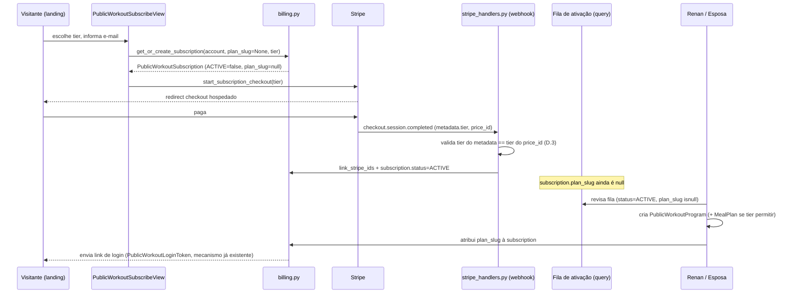
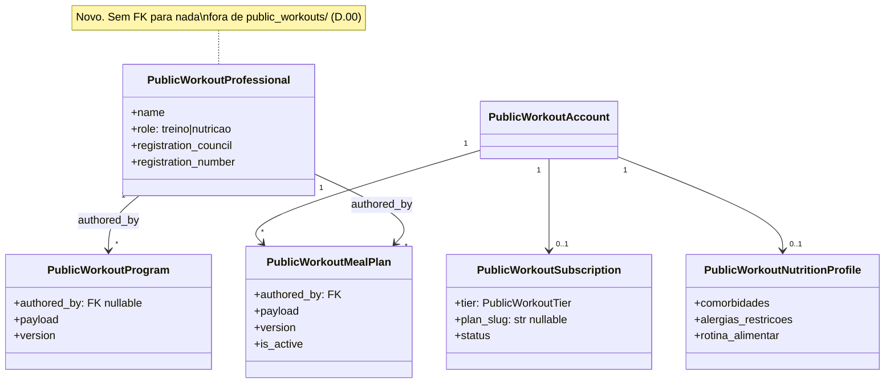

# CORDA — Escala (Entrega 5) + Nutrição (Entrega 6) do corredor de treinos

**Plano de produto original (o "porquê"):** [public-workouts-produtizacao-plan.md](public-workouts-produtizacao-plan.md)
**Execução técnica original (Entregas 0–4):** [public-workouts-produtizacao-corda.md](public-workouts-produtizacao-corda.md)
**Estratégia de venda (o que motiva este documento):** [public-workouts-go-to-market-plan.md](public-workouts-go-to-market-plan.md)
**Este documento:** como construir, em código, o que o GTM pede — landing page,
3 níveis de preço e o módulo de nutrição — continuando a numeração de Entregas já
existente no plano original em vez de inventar um trilho paralelo.

**Status:** proposta · **Data:** 2026-09-17 · **Dono:** Renan (+ esposa, frente de
nutrição) · **Nível de esforço avaliado:** chief-architect (ver §Contexto)

---

# C — Contexto

## O que o GTM pede e o que isso vira em engenharia

O plano de go-to-market (Revisão 2) pede três coisas que hoje **não existem em
código nenhum**:

1. Uma **landing page pública** que venda a consultoria para um desconhecido.
2. **Três níveis de preço** (Essencial R$97 · Completo R$267 · Premium R$397).
3. Um **módulo de nutrição real** — hoje "dieta" é um único caso manual, texto
   solto num HTML de 1 cliente (achado durante a migração do parser).

Isso não são três features soltas — são a concretização do que o plano de produto
original já previa e **ainda não construiu**: a Entrega 5 ("Escala") do
`public-workouts-produtizacao-plan.md` já listava "Onboarding self-service: assina,
responde, cai na fila" como entrega pendente. Este documento não inventa uma
entrega nova — **decide a forma concreta da Entrega 5** e adiciona uma **Entrega 6
(Nutrição)** que não existia porque, até a conversa que gerou o GTM Revisão 2, não
havia dono legítimo para essa frente.

## Achado que muda o desenho: o checkout de hoje pressupõe que o aluno já existe

Antes de desenhar qualquer coisa, fui ler o código de cobrança (`public_workouts/
billing.py`, `stripe_checkout.py`, `student_identity/public_workout_views.py`).
O fluxo atual é:

```python
# student_identity/public_workout_views.py — PublicWorkoutSubscribeView.post()
plan_slug = (request.POST.get('plan_slug') or '').strip()
if not plan_slug:
    return JsonResponse({'error': 'plan_slug_obrigatorio'}, status=400)
subscription = get_or_create_subscription(account=account, plan_slug=plan_slug)
```

**`plan_slug` é obrigatório para assinar.** E `plan_slug` só existe depois que
Renan já criou manualmente o `PublicWorkoutProgram` daquela pessoa. Em outras
palavras: **hoje só é possível assinar depois de já ser aluno.** Isso é coerente
com a história do produto (os 10 legados foram todos onboardados manualmente,
depois migrados para cobrança automática) — mas é **incompatível com uma landing
page que vende para um estranho que nunca falou com o Renan**.

Isso não é bug — é o gap exato que a Entrega 5 sempre soube que existia. Este
documento é a primeira vez que alguém desenha a forma concreta de fechá-lo.

## Por que isto é trabalho de arquitetura, não de feature

Três razões, na ordem em que apareceram durante a leitura do código:

1. **Inverte a ordem causal do produto.** Hoje: `pessoa existe → programa existe →
   slug existe → pode cobrar`. O GTM exige: `estranho paga → só depois vira
   pessoa com programa`. Isso muda o dono da verdade do estado inicial — de
   "Renan cria manualmente" para "o pagamento cria um registro pendente que
   Renan (e agora a esposa) preenchem depois".
2. **Introduz um segundo profissional de conteúdo** — algo que o sistema nunca
   modelou (`/renan/` é hoje literalmente hardcoded para um personal só; o
   próprio CORDA original registra `PUBLIC_WORKOUT_SCOPE = '/renan/'` como
   constante "que precisa nascer derivada do box" — nota para o multi-personal
   futuro que nunca foi implementada).
3. **Cruza a fronteira de cobrança já delicada** (D.00/D.000/S3 do CORDA
   original: checkout próprio, webhook próprio, `stripe.api_key` global como
   race condition latente) com uma mudança real de modelo (3 preços, não 1).
   Errar aqui não é "página feia" — é dinheiro cobrado errado ou aluno pago sem
   acesso.

## Constraints herdadas (não renegociáveis nesta rodada)

- **D.00 do CORDA original:** o corredor consome serviços do OctoBox, nunca
  estende modelos dele. Nada do que segue toca `finance.Payment`,
  `MovementLibrary`, `WorkoutTemplate` ou `StudentBoxMembership`.
- **D.000:** sobrecarga zero no app principal. A única linha que este trabalho
  pode tocar fora de `public_workouts/` é, na pior hipótese, configuração de
  settings — nunca model, nunca migration do box.
- **C1/C5 do CORDA original:** Connect Express (repasse multi-personal) **não
  entra agora** — decisão do Renan, revalidada aqui. A conta Stripe continua
  única (a do box, reusada). Isso simplifica o que seguirá: preço por tier é
  problema de **Price ID**, não de conta.
- **Revisão manual é o produto, não um defeito a eliminar.** O GTM (R3) já
  avisou: escassez real por causa de "vagas limitadas pela sua agenda de
  revisão" é a única escassez honesta a usar. A arquitetura abaixo **preserva**
  essa fila humana — não tenta automatizá-la para fora.

---

# O — Objetivo

1. Permitir que um **desconhecido** pague por um dos 3 tiers **antes** de ter
   `plan_slug`, `PublicWorkoutProgram` ou anamnese — e caia numa fila visível
   para revisão humana.
2. Modelar **3 níveis de preço** sem duplicar a lógica de checkout/webhook já
   testada (13 arquivos de teste de pagamento existentes, por P do CORDA
   original — não reabrir esse capítulo).
3. Modelar um **segundo profissional de conteúdo** (a nutricionista) de forma
   pequena o suficiente para não ser "Connect Express disfarçado", mas real o
   suficiente para não hardcodar "esposa do Renan" em string solta no código.
4. Dar à nutrição uma **v1 deliberadamente manual** (decisão já tomada no GTM
   §7.6: productizar depois de validar demanda), com o mínimo de fricção para
   a nutricionista publicar.
5. Publicar a **landing page** como novo ponto de entrada público, sem tocar o
   fluxo autenticado existente.
6. Fazer tudo isso **sem quebrar os 10 alunos legados** já migrados e cobrando
   automaticamente hoje.

---

# R — Riscos

### RT1 — 🔴 Migrar `plan_slug` de obrigatório para opcional pode reabrir P6 (assinatura duplicada)

`PublicWorkoutSubscription.account` é `OneToOneField` — hoje isso é o que
impede duplo clique criar duas assinaturas (P6 do CORDA original). Se o campo
`plan_slug` virar opcional, a garantia de unicidade **continua vindo do
`OneToOneField`, não do slug** — então P6 não quebra automaticamente. Mas o
teste que prova isso (`test_payment_create_idempotency`-equivalente) precisa
ganhar um caso explícito: "duplo POST de cold signup sem plan_slug ainda cria
uma linha só". Não presumir que o teste antigo cobre o caminho novo.

### RT2 — 🔴 Fila de ativação sem SLA vira o mesmo gargalo que o produto tentou resolver

Se "aguardando ativação" não tiver visibilidade (painel, contador, alerta), ela
vira um limbo silencioso — exatamente o "sumiço" que o produto original
prometia eliminar ("não sabe quando vence" → virou "não sabe quando começa").
Mitigação: a fila precisa ser uma **query, não uma inferência** (ver D.2), e
precisa aparecer em algum lugar que Renan/esposa olhem todo dia — não é
suficiente existir no banco.

### RT3 — 🟡 Tier errado registrado por falha de metadata no webhook

Mesma classe de risco que P5 do CORDA original (routing por metadata), agora
aplicada a tier: se o Price ID mudar no Stripe Dashboard sem atualizar
`settings`, ou se o metadata não propagar num evento de `invoice.*` (que nem
sempre carrega metadata da Session original), o sistema pode não saber qual
tier ativar. Mitigação: resolver tier a partir do **Price ID do line item da
subscription no Stripe**, não só do metadata da Session — o Price ID é a
fonte de verdade mais próxima do dinheiro (ver D.3).

### RT4 — 🟡 Nutrição vira acoplamento com o app principal por atalho

Tentação óbvia: "vou só adicionar um campo em `StudentIdentity` pra saber se a
pessoa é nutricionista". Isso é exatamente o tipo de violação que V1/V5 do
CORDA original já cortaram para outros casos. Mitigação: `PublicWorkoutProfessional`
nasce **dentro de `public_workouts/`**, sem FK para nada do box.

### RT5 — 🟡 Dado de saúde nutricional exposto do mesmo jeito que A1/A4 já expuseram avaliação física

O plano alimentar é, por natureza, dado de saúde (LGPD art. 5º, II) — mais
sensível que a prescrição de treino (que o CORDA original já classificou como
"baixo risco se exposto", diferente da avaliação física). Mitigação: tratar
`PublicWorkoutMealPlan` com a **mesma régua que já existe para
`PublicWorkoutAssessment`** (autenticação obrigatória, 404 — não 403 — para
quem não é dono, nunca no cache do service worker). Não inventar uma régua
nova; copiar a que já foi corrigida a duras penas em A1/A4.

### RT6 — ⚪ Custo de teste/schema sobe de novo (N6 do CORDA original)

Mais ~4 modelos SHARED no schema `public`. O CORDA original já pediu para medir
o tempo de `--create-db` antes/depois da Onda A1; esta rodada deve repetir a
medição, não assumir que "é só mais uma tabela".

---

# D — Direção

## D.1 — Tese central desta rodada

**A landing page não é o trabalho difícil. O trabalho difícil é inverter quem
cria o registro do aluno primeiro.** Hoje é Renan (manual, antes de qualquer
cobrança). Depois desta rodada, é o pagamento (automático, com Renan/esposa
preenchendo o resto depois, numa fila visível). A landing page em si é a parte
mais barata de tudo isso — é HTML e Stripe Checkout, que o produto já sabe
fazer desde a Onda B2.

## D.2 — Fila de ativação: campo, não tabela nova

Duas formas de modelar "pagou mas ainda não tem programa":

| Opção | Custo | Veredito |
|---|---|---|
| (a) Nova tabela `PublicWorkoutOnboardingQueue` | modelo novo, mais uma fonte de verdade para manter sincronizada com `PublicWorkoutSubscription` | ❌ complexidade sem necessidade — a pergunta "quem está esperando" é uma query, não precisa de tabela própria |
| (b) **`plan_slug` vira nullable + fila é uma query filtrada** | zero modelo novo; `PublicWorkoutSubscription.objects.filter(status=ACTIVE, plan_slug__isnull=True)` é a fila | ✅ escolhida |

Isso segue o framework do próprio Renan (`personal-architecture-framework.md`):
"existe uma versão intermediária que já melhora a estrutura com risco baixo?" —
sim, um campo nullable é a menor mudança que resolve o problema real.

Consequência de schema: `PublicWorkoutSubscription.plan_slug` deixa de ter
`db_index=True` implícito como "sempre preenchido" — passa a `null=True,
blank=True`, com um índice parcial (`condition=Q(plan_slug__isnull=False)`)
para manter a fila e a busca por slug ambas rápidas.

## D.3 — Tier resolvido do lado do dinheiro, não do lado da intenção

`stripe_checkout.py` hoje resolve **um** Price ID de `settings`. Passa a
resolver por tier:

```python
_TIER_PRICE_SETTINGS = {
    PublicWorkoutTier.ESSENCIAL: 'PUBLIC_WORKOUT_STRIPE_PRICE_ID_ESSENCIAL',
    PublicWorkoutTier.COMPLETO: 'PUBLIC_WORKOUT_STRIPE_PRICE_ID_COMPLETO',
    PublicWorkoutTier.PREMIUM: 'PUBLIC_WORKOUT_STRIPE_PRICE_ID_PREMIUM',
}
```

O metadata da Session ganha `'tier': tier.value` ao lado de `'product':
'coaching'` — mesmo padrão já usado para `plan_slug`. Mas **RT3** exige mais:
o handler do webhook, ao processar `checkout.session.completed`, não confia só
no metadata — resolve o tier **também** a partir do `price_id` do line item
retornado pela própria Stripe (`session.line_items` ou o price da
subscription criada), e **compara com o metadata**. Divergência entre os dois
é logada como erro e a ativação fica pendente para revisão manual, nunca
resolvida por adivinhação — mesmo espírito do D.0 original ("sem
`metadata.product`, recusa e loga, nunca adivinha").

`idempotency_key` já inclui `price_id` (`stripe_checkout.py:92`) — como cada
tier tem um Price ID diferente, a idempotência **já é por tier de graça**, sem
mudança adicional.

## D.4 — Gate de acesso à nutrição é código, não convenção

Nível Essencial nunca deve alcançar rota de nutrição. A regra vive num único
lugar (mesmo padrão de DA-2 do plano original — "a view resolve a identidade
da sessão e confirma que tem direito, devolve 404 quando não tem"):

```python
def require_nutrition_tier(subscription) -> bool:
    return subscription.tier in (PublicWorkoutTier.COMPLETO, PublicWorkoutTier.PREMIUM)
```

Toda view de nutrição chama isso antes de qualquer query de conteúdo. Igual
ao padrão de A1 (avaliação física): **404, nunca 403** — 403 confirmaria que
existe conteúdo de nutrição para aquela conta.

## D.5 — `PublicWorkoutProfessional`: a menor peça que resolve "quem assina o quê"

Não é o multi-personal completo (Connect Express, contas conectadas, `/joao/`
ao lado de `/renan/`) — isso continua fora de escopo (C5 do CORDA original).
É uma tabela pequena que resolve exatamente um problema: **atribuir autoria e
credencial (CREF/CRN) a um conteúdo**, sem hardcodar nome em template.

```python
class PublicWorkoutProfessionalRole(models.TextChoices):
    TREINO = 'treino', 'Treino'
    NUTRICAO = 'nutricao', 'Nutrição'


class PublicWorkoutProfessional(TimeStampedModel):
    name = models.CharField(max_length=120)
    role = models.CharField(max_length=16, choices=PublicWorkoutProfessionalRole.choices)
    registration_council = models.CharField(max_length=16)   # 'CREF' ou 'CRN'
    registration_number = models.CharField(max_length=32)
    bio = models.TextField(blank=True)
    is_active = models.BooleanField(default=True)
```

`PublicWorkoutProgram` ganha `authored_by = models.ForeignKey(
PublicWorkoutProfessional, null=True, on_delete=models.PROTECT)` — nullable
para não quebrar os programas legados já publicados (migração de dado povoa
retroativamente com a linha do Renan, não é decisão automática). O novo
`PublicWorkoutMealPlan` (D.6) usa a mesma FK, sempre apontando para a linha de
papel `NUTRICAO`.

**Por que isso paga adiantado o futuro sem violar C5:** quando o multi-personal
chegar de verdade, `PublicWorkoutProfessional` já existe — só ganha um vínculo
com `Box`/conta Connect naquele momento. Hoje ele resolve exatamente o
problema de hoje (duas pessoas, dois papéis, dois registros profissionais),
sem construir a parte de dinheiro que ainda não é necessária.

## D.6 — Nutrição: mesmo padrão do treino, v1 sem IA nem editor

Seguindo D-1/D.00 do CORDA original ("Postgres é a verdade, snapshot imutável
publicado por versão"), sem reinventar mecanismo:

```python
class PublicWorkoutNutritionProfile(TimeStampedModel):
    """Anamnese nutricional — NÃO reusa os 7 campos da anamnese de treino
    (comorbidade e rotina alimentar não têm equivalente lá). Aviso de uso
    de IA/humano no próprio campo de texto livre, mesmo remédio do N4 do
    CORDA original para o campo 7 da anamnese de treino."""
    account = models.OneToOneField(PublicWorkoutAccount, on_delete=models.CASCADE)
    comorbidades = models.TextField(blank=True)
    alergias_restricoes = models.TextField(blank=True)
    rotina_alimentar = models.TextField(blank=True)
    preferencias = models.TextField(blank=True)


class PublicWorkoutMealPlan(models.Model):
    """Snapshot publicado do plano alimentar — mesmo padrão de
    PublicWorkoutProgram (D-1 do CORDA original): nunca UPDATE, nova
    versão é nova linha, is_active decide qual serve."""
    account = models.ForeignKey(PublicWorkoutAccount, on_delete=models.CASCADE, related_name='meal_plans')
    version = models.PositiveIntegerField()
    is_active = models.BooleanField(default=False, db_index=True)
    authored_by = models.ForeignKey(PublicWorkoutProfessional, on_delete=models.PROTECT)
    payload = models.JSONField()   # estrutura decidida pela nutricionista, não pelo código
    created_at = models.DateTimeField(auto_now_add=True)

    class Meta:
        constraints = [
            models.UniqueConstraint(fields=['account', 'version'], name='unique_meal_plan_version'),
            models.UniqueConstraint(
                fields=['account'], condition=models.Q(is_active=True),
                name='unique_active_meal_plan_per_account',
            ),
        ]
```

**v1 é 100% manual, por decisão já registrada (GTM §7.6):** sem parser, sem
formato de "refeição" modelado em campos — `payload` é o que a nutricionista
escrever num formulário simples do Django Admin (mesmo padrão já usado para
`PublicWorkoutMovement`, citado no histórico de commits). Isso não é
preguiça — é a mesma lição que o corredor de treinos inteiro já ensinou: não
productizar antes de validar demanda e formato de atendimento.

**Por que `account`, não `slug`:** o plano alimentar nunca teve — e não deveria
ganhar agora — o conceito de "link público compartilhável" que o treino tem.
É sempre privado, sempre atrás de login. Modelar por `account` em vez de
`slug` já deixa isso estruturalmente impossível de vazar por engano (RT5).

## D.7 — Landing page: HTML no template, não CMS

Rota nova `PublicWorkoutLandingView` em `/treinos/` (raiz — hoje só existe
`/treinos/login`). Decisão: **copy hardcoded no template Django**, não um
model de conteúdo editável.

Por quê: o próprio GTM (§7.6, mesma lógica) recomenda validar antes de
escalar. Um CMS agora é resolver um problema ("editar copy sem deploy") que
ainda não apareceu, ao custo de construir um editor que ninguém pediu. Trocar
uma frase da landing nas primeiras semanas é `git commit` + deploy — mais
rápido que abrir um painel de admin de conteúdo.

Reaproveita o design system do `/aluno/` (mesmo padrão já validado no D.5 do
CORDA original) — primitives, não HTML novo do zero.

---

# Diagramas

## Fluxo de cadastro a frio (o que muda de verdade)



## Modelos novos e fronteira com o que já existe



---

# ADRs

### ADR-1 — Tier como enum em `PublicWorkoutSubscription`, não tabela `MembershipPlan`-like

- **Status:** aceita
- **Contexto:** precisamos representar 3 níveis de preço fixos.
- **Escolhida:** `PublicWorkoutTier` (`TextChoices`) como campo na subscription.
- **Alternativa considerada:** tabela `PublicWorkoutPlan` com preço, nome,
  features — rejeitada por agora (YAGNI): 3 tiers fixos não justificam uma
  tabela de configuração. Reconsiderar **se** os tiers passarem de ~5 ou
  precisarem de preço diferente por profissional/região.
- **Consequência:** trocar preço de um tier ainda é trocar Price ID no Stripe
  Dashboard + variável de settings — mesmo custo operacional de hoje, só que
  triplicado (3 variáveis em vez de 1).

### ADR-2 — `plan_slug` nullable + fila por query, não tabela de fila própria

- **Status:** aceita
- **Contexto:** cadastro a frio precisa existir antes do slug.
- **Escolhida:** D.2 acima.
- **Alternativa considerada:** `PublicWorkoutOnboardingQueue` própria —
  rejeitada por criar uma segunda fonte de verdade para sincronizar.
- **Consequência:** qualquer código que hoje assume `plan_slug` sempre
  preenchido (buscas, admin, relatórios) precisa ser auditado — ver Migração,
  Fase 1.

### ADR-3 — `PublicWorkoutProfessional` como tabela nova, mínima, sem vínculo com Connect

- **Status:** aceita
- **Contexto:** dois profissionais de conteúdo pela primeira vez no produto.
- **Escolhida:** tabela pequena, sem FK externa, sem lógica de repasse.
- **Alternativa considerada:** hardcode do nome da esposa/CRN direto no
  template da página de nutrição — rejeitada: quebra no dia em que outro
  profissional entrar, e mistura dado (nome, CRN) com apresentação.
- **Consequência:** uma migration de dado precisa popular a linha do Renan
  (role=TREINO) e da esposa (role=NUTRICAO) manualmente — não é seed
  automático, é decisão de conteúdo real (nome, número de registro).

### ADR-4 — Nutrição mora em `public_workouts/`, não em app Django novo

- **Status:** aceita
- **Contexto:** onde colocar os ~4 modelos novos.
- **Escolhida:** mesmo app `public_workouts`.
- **Alternativa considerada:** app `public_nutrition` isolado — rejeitada:
  mesmo schema (`public`, SHARED), custo de outro app Django (settings,
  migrations próprias, admin próprio) sem ganho de isolamento real, já que a
  fronteira que importa (D.00, nunca tocar o box) já vale para `public_workouts/`
  inteiro.
- **Consequência:** `public_workouts/models.py` cresce mais — aceitável, é
  onde o resto do domínio do corredor já vive.

### ADR-5 — Tier resolvido também pelo Price ID da Stripe, não só por metadata

- **Status:** aceita
- **Contexto:** RT3 — metadata pode não propagar em todo evento.
- **Escolhida:** D.3 — checagem cruzada, diverência vira pendência manual, nunca adivinhação.
- **Consequência:** handler do webhook fica um pouco mais complexo (uma
  chamada a mais na API da Stripe para resolver o price do line item quando
  necessário) — trade-off aceito porque o custo de errar é dinheiro.

---

# Migração — fases

Cada fase é independentemente entregável e testável; nenhuma depende de a
próxima já estar pronta em produção (só depende que a anterior já tenha
migration aplicada).

## Fase 1 — Tier plumbing (aditivo, risco baixo)

- Migration: `PublicWorkoutSubscription.tier` (default `ESSENCIAL` para os
  registros existentes — os 10 legados continuam funcionando sem mudança de
  comportamento).
- 3 settings de Price ID substituem a 1 atual (manter a antiga como alias por
  1 deploy, para não exigir trocar `.env` e código no mesmo commit).
- `stripe_checkout.py` e `stripe_handlers.py` ganham resolução por tier (D.3).
- **Pronto quando:** os 10 alunos legados continuam cobrando exatamente como
  hoje (tier ESSENCIAL, mesmo Price ID de sempre) — nenhuma regressão visível
  para quem já paga.

## Fase 2 — Cadastro a frio + fila de ativação

- Migration: `plan_slug` vira `null=True, blank=True` + índice parcial (D.2).
- Novo endpoint que aceita assinatura **sem** `plan_slug` (tier + e-mail
  apenas).
- Tela/admin simples listando a fila (`status=ACTIVE, plan_slug__isnull=True`)
  — mínimo: uma view de admin do Django, não precisa de painel custom nesta
  fase.
- Fluxo de atribuição manual de `plan_slug` (Renan/esposa preenchem depois de
  revisar a anamnese) — reusa a criação de `PublicWorkoutProgram` já
  existente, só adiciona "atribuir a esta subscription" ao final.
- **Pronto quando:** um teste ponta-a-ponta paga com tier Essencial, sem slug,
  aparece na fila, e só some da fila quando um `plan_slug` é atribuído.

## Fase 3 — Landing page

- `PublicWorkoutLandingView` em `/treinos/`, 3 CTAs (um por tier) apontando
  para o endpoint da Fase 2.
- Depende da Fase 2 existir (senão o CTA não tem para onde mandar o
  visitante).
- **Pronto quando:** alguém sem conta, numa aba anônima, consegue pagar
  qualquer um dos 3 tiers e cair na fila da Fase 2.

## Fase 4 — Módulo de nutrição mínimo (pode rodar em paralelo à Fase 3)

- Migrations: `PublicWorkoutProfessional`, `PublicWorkoutNutritionProfile`,
  `PublicWorkoutMealPlan`, FK `authored_by` em `PublicWorkoutProgram`.
- Migration de dado: popular as duas linhas de `PublicWorkoutProfessional`
  (Renan/treino, esposa/nutrição) com nome e registro reais.
- Admin do Django para a nutricionista publicar o `PublicWorkoutMealPlan`
  (formulário simples, sem editor rico).
- Rota autenticada de leitura do plano alimentar ativo, gate por tier (D.4).
- CRN exibido em qualquer tela que mostre conteúdo nutricional.
- **Pronto quando:** uma conta tier Completo vê o próprio plano alimentar
  ativo; uma conta tier Essencial recebe 404 na mesma rota; o CRN aparece na
  tela.

---

# Guardrails operacionais

- **Idempotência:** cadastro a frio duplo (duplo clique no CTA da landing)
  não pode criar duas subscriptions — o `OneToOneField` de `account` já
  garante isso; teste explícito cobrindo o caminho **sem** `plan_slug` (RT1).
- **Segurança:** `PublicWorkoutMealPlan` segue a mesma régua de A1/A4 (404 para
  quem não é dono, nunca em cache de service worker) — não é uma régua nova a
  inventar, é copiar a existente (RT5).
- **Observabilidade:** a fila de ativação (D.2) precisa de uma forma de
  Renan/esposa notarem que cresceu — no mínimo, um contador visível no admin;
  idealmente, o mesmo canal de notificação já usado para outras réguas do
  corredor (push/e-mail, `notifications.py`) avisando quando a fila passa de
  N itens.
- **Custo de teste:** medir `--create-db` antes/depois desta rodada (N6 do
  CORDA original) — mais ~4 modelos SHARED.
- **Isolamento (Categoria 5 do CORDA original):** `tests/
  test_public_workouts_isolation.py` ganha itens novos: nenhum modelo de
  nutrição tem FK para nada do box; `PublicWorkoutProfessional` não referencia
  `StudentIdentity`.

---

# Validação

- **Como testar a direção:** os 4 "Pronto quando" de cada fase, nesta ordem,
  sem pular etapa — cada um é teste automatizado, não checagem manual.
- **Métrica que prova que está funcionando:** tempo entre pagamento e
  atribuição de `plan_slug` (a fila da D.2) — se esse tempo crescer sem
  controle, o RT2 virou realidade e a fila precisa de mais atenção operacional,
  não de mais código.
- **Sinal de que a decisão estava errada:** se, na prática, tiers precisarem
  mudar de preço/composição toda semana nas primeiras iterações — aí o ADR-1
  (enum simples) para de servir e vale reconsiderar uma tabela de
  configuração.

---

## Analogia para fechar (o porquê em uma frase simples)

Hoje o corredor de treinos funciona como uma loja que só deixa você pagar
**depois** de o dono já ter separado o seu pedido na prateleira. O que este
plano faz é trocar isso por um caixa na porta: você paga primeiro, recebe um
número de senha (a fila), e o dono monta seu pedido — treino, e agora também
dieta — sabendo que você já é cliente de verdade. A loja continua pequena de
propósito (a fila é o controle de qualidade, não um defeito a esconder); o que
muda é a ordem em que o dinheiro e o atendimento acontecem.
