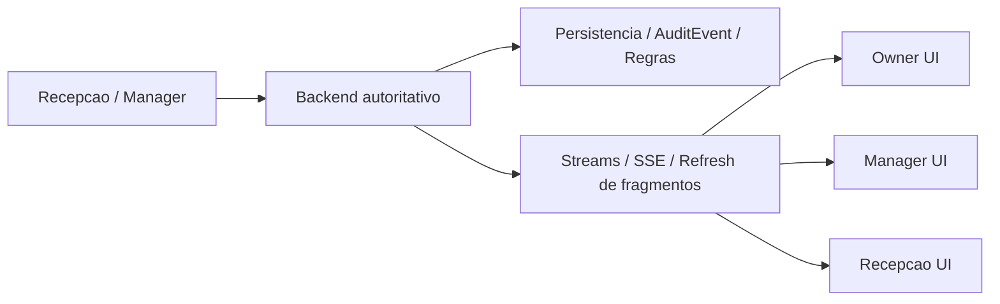
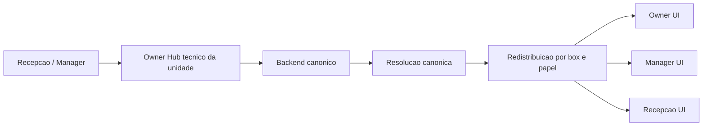

<!--
ARQUIVO: plano de arquitetura para a cascata por unidade no OctoBox, com foco em preparar a fundacao barata antes da ativacao do owner hub real.

TIPO DE DOCUMENTO:
- plano arquitetural de transicao

AUTORIDADE:
- alta

DOCUMENTOS IRMAOS:
- [../architecture/center-layer.md](../architecture/center-layer.md)
- [../architecture/signal-mesh.md](../architecture/signal-mesh.md)
- [front-end-restructuring-guide.md](front-end-restructuring-guide.md)
- [operational-contact-memory-migration-plan.md](operational-contact-memory-migration-plan.md)

QUANDO USAR:
- quando a duvida for como preparar o sistema para coordenacao por unidade sem aumentar latencia cedo demais
- quando precisarmos alinhar backend, front-end e ownership operacional para evoluir do fluxo direto atual para uma cascata por box

POR QUE ELE EXISTE:
- evita discutir a cascata como uma ideia abstrata sem contrato tecnico.
- reduz a chance de construir um owner hub caro antes de preparar a fundacao certa.
- registra o que deve ser feito agora, o que deve ser adiado e quais sinais justificam subir para a fase seguinte.

O QUE ESTE ARQUIVO FAZ:
1. descreve a topologia atual e a topologia alvo da cascata por unidade.
2. define os contratos canonicamente esperados para intencao e resolucao.
3. organiza a fundacao barata por ondas de baixo custo.
4. documenta guardrails de performance, regressao e debito tecnico.

PONTOS CRITICOS:
- nesta fase nao devemos criar um hop extra no request critico.
- o owner hub da V1 e tecnico e invisivel, nao uma inbox visual nova.
- `AuditEvent` pode servir como trilha enriquecida agora, mas nao deve virar o read model final da operacao.
-->

# Plano de Arquitetura: Cascata por Unidade

## Tese central

O OctoBox deve evoluir do fluxo operacional direto:

`ator -> backend -> stream`

para um fluxo de coordenacao por unidade:

`ator -> owner hub tecnico da unidade -> backend canonico -> redistribuicao por box/papel`

A imagem mental e esta:

1. a recepcao e o manager sao como atendentes da loja.
2. o owner hub tecnico funciona como a central local da unidade.
3. o backend canonico continua sendo o cofre que valida a verdade final.
4. as telas passam a consumir sinais redistribuidos por unidade e papel, em vez de depender apenas de broadcasts fragmentados.

Em linguagem de crianca:

1. hoje cada funcionario liga direto para a fabrica.
2. no alvo, eles falam com a central da loja.
3. a central fala com a fabrica.
4. depois a central avisa toda a equipe o que ficou decidido.

## Estado atual vs estado alvo

## Estado atual

Hoje a malha real do sistema esta mais perto disto:



Na pratica:

1. a acao nasce na ponta.
2. ela vai direto para o backend.
3. o backend grava, valida e distribui.
4. owner, manager e recepcao recebem os efeitos por canais ainda muito ligados a superficie, nao a unidade.

## Estado alvo

O alvo recomendado para a cascata por unidade e este:



Na pratica:

1. a ponta nao dispara apenas uma mutacao; ela emite uma intencao.
2. a unidade ganha um corredor tecnico proprio para coordenacao.
3. o backend canonico continua validando permissao, stage, ownership e persistencia.
4. a resolucao volta para a unidade e se espalha de modo mais dirigido.

## O que ja existe e o que ainda falta

### Sinais de que a cascata ja comecou a nascer

1. existe nocao de owner mestre em [../../shared_support/events.py](../../shared_support/events.py).
2. o manager ja tem um caminho quente com stream e refresh dirigido.
3. a memoria operacional ja comecou a carregar stage e ownership em [../../shared_support/operational_contact_memory.py](../../shared_support/operational_contact_memory.py).
4. o front do manager ja usa reconciliacao otimista em fluxos criticos.

### O que ainda falta para a cascata ser real

1. envelope canonico de intencao.
2. resolucao canonica separada da intencao.
3. `box_id` e `owner_user_id` como metadados de primeira classe em fluxos operacionais.
4. versionamento de snapshot por superficie.
5. contrato de front pronto para redistribuicao por unidade.
6. owner hub tecnico real, ainda que invisivel para o usuario final na primeira etapa.

## Contratos canonicos

## `cascade_intent`

Toda acao operacional multiator relevante deve poder ser descrita por um envelope comum:

```text
intent_id
box_id
owner_user_id
requested_by_user_id
requested_by_role
subject_type
subject_id
action_kind
channel
surface
requested_at
```

### Papel de cada campo

1. `intent_id`: protocolo unico da tentativa operacional.
2. `box_id`: unidade dona do contexto.
3. `owner_user_id`: owner mestre resolvido para aquela unidade.
4. `requested_by_user_id`: usuario que iniciou a acao.
5. `requested_by_role`: papel operacional que pediu a acao.
6. `subject_type`: tipo do alvo, como `intake`, `student`, `payment`.
7. `subject_id`: identificador do alvo.
8. `action_kind`: natureza da acao, como `first_touch_whatsapp`, `finance_whatsapp_opened`, `review_opened`.
9. `channel`: canal usado, como `whatsapp`, `workspace`, `detail_view`.
10. `surface`: superficie de origem, como `manager`, `reception`, `owner`.
11. `requested_at`: momento da intencao.

## `cascade_resolution`

A resposta canonica do backend deve poder ser lida assim:

```text
intent_id
status
stage_before
stage_after
ownership_scope
canonical_event_id
resolved_at
```

### Papel de cada campo

1. `intent_id`: conecta resolucao ao pedido original.
2. `status`: informa se foi `accepted`, `rejected` ou `superseded`.
3. `stage_before`: estado operacional antes da acao.
4. `stage_after`: estado operacional depois da acao.
5. `ownership_scope`: escopo de quem deve agir agora.
6. `canonical_event_id`: referencia ao evento persistido e validado.
7. `resolved_at`: quando a resolucao foi confirmada.

## Fundacao barata

O melhor proximo passo nao e construir o owner hub inteiro agora.

O melhor proximo passo e deixar a tubulacao pronta com baixo custo, baixa latencia adicional e utilidade imediata.

A fundacao barata aprovada e mista e equilibrada:

1. um pouco de backend estrutural
2. um pouco de front-end contratual
3. nenhum hop extra no request critico
4. nenhuma fila nova agora

## Ondas de baixo custo

### Onda 1 - Contrato de cascata

Criar o corredor tecnico:

1. [../../shared_support/cascade/contracts.py](../../shared_support/cascade/contracts.py)
2. [../../shared_support/cascade/ownership.py](../../shared_support/cascade/ownership.py)

Objetivo:

1. oferecer `build_cascade_intent(...)`
2. oferecer `build_cascade_resolution(...)`
3. oferecer `resolve_box_owner_user_id(...)`
4. oferecer `resolve_actor_box_id(...)`

Regra:

1. o contrato nao pode nascer como arquivo decorativo.
2. ele precisa ser usado logo nos primeiros fluxos operacionais migrados.

### Onda 2 - Metadata operacional enriquecida

Atualizar os fluxos mais valiosos e mais sensiveis a coordenacao:

1. entradas
2. cobranca por WhatsApp

Objetivo:

1. gravar `intent_id`
2. gravar `box_id`
3. gravar `owner_user_id`
4. gravar `surface`
5. gravar `action_kind`

Destino inicial:

1. metadata enriquecida em `AuditEvent`
2. sem promover `AuditEvent` a read model final

### Onda 3 - `snapshot_version` por superficie

Adicionar `snapshot_version` ao payload de:

1. manager
2. recepcao
3. owner

Objetivo:

1. reduzir refresh cego
2. permitir fallback `SSE -> polling/version`
3. preparar reconciliacao mais barata entre UI otimista e backend

### Onda 4 - Hooks estaveis e estados visuais canonicos

Padronizar no front:

1. `data-panel`
2. `data-action`
3. `data-subject-key`
4. `data-surface`

E tambem os estados:

1. `loading`
2. `empty`
3. `success`
4. `error`
5. `optimistic`
6. `deferred`
7. `stale`
8. `synced`

Objetivo:

1. preparar manager, recepcao e owner para redistribuicao futura por unidade.
2. evitar que o JS dependa de DOM incidental ou classe cosmetica.

## Guardrails

## O que nao fazer agora

1. nao criar hop extra no request.
2. nao criar owner inbox visual agora.
3. nao criar tabela nova agora.
4. nao trocar os streams atuais por um barramento novo nesta fase.
5. nao transformar `AuditEvent` em destino final da memoria operacional.

## O que proteger explicitamente

### Performance

1. nada desta fase pode adicionar um segundo corredor no caminho critico da acao.
2. nada desta fase deve introduzir query nova pesada nas telas quentes.
3. `snapshot_version` deve ser barato de calcular ou barato de invalidar.

### Regressao

1. os fluxos atuais de manager e recepcao precisam continuar funcionando no modo direto.
2. a fundacao nao pode obrigar rollout em big bang.
3. os hooks vivos do front nao devem ser renomeados sem mapa de ownership.

### Debito tecnico

1. se novos fluxos nascerem sem `intent_id`, o custo da cascata futura sobe.
2. se `AuditEvent` virar consulta operacional permanente, o sistema ficara semantico demais no lugar errado.
3. se front-end e backend nomearem a mesma ideia com nomes diferentes, a migracao futura vira um quebra-cabeca.

Analogia simples:

1. `AuditEvent` e o caderno da portaria.
2. ele ajuda muito hoje.
3. mas nao deve virar o painel principal da torre de controle.

## Gatilhos da proxima fase

Subir para a cascata real passa a fazer sentido quando aparecerem sinais como:

1. mais fluxos multiator relevantes alem de entradas e cobranca.
2. dor recorrente de coordenacao por unidade.
3. necessidade clara de distribuicao por box e papel, nao apenas por superficie.
4. `AuditEvent` ficando insuficiente como memoria operacional.
5. necessidade de reconciliar acoes quase simultaneas entre recepcao, manager e owner com mais precisao.

## O que a fase seguinte provavelmente exigira

1. owner hub tecnico por unidade.
2. roteamento dirigido por box e papel.
3. read model operacional dedicado.
4. estrategia mais clara de resolucao e reenvio.
5. observabilidade de ponta a ponta da intencao ate a confirmacao.

## Escopo de rollout recomendado

### Fase inicial

1. entradas
2. cobranca por WhatsApp

### Fase intermediaria

1. check-in
2. sinais operacionais curtos da recepcao

### Fase ampla

1. sinais de aula com impacto operacional
2. memoria operacional mais quente
3. redistribuicao dirigida por unidade e papel

## Criterio de pronto da fundacao barata

Este plano estara realmente implantavel quando:

1. existir um arquivo estavel para contratos da cascata.
2. existir um helper oficial para resolver owner mestre e box do ator.
3. os fluxos iniciais de entradas e cobranca passarem a carregar `intent_id`, `box_id` e `owner_user_id`.
4. manager, recepcao e owner tiverem `snapshot_version` em seus payloads.
5. os hooks e estados de front estiverem documentados de forma unica.
6. ficar explicito o que foi adiado e por que foi adiado.

## Recomendacao final

A recomendacao oficial deste plano e:

1. nao construir a cascata completa agora.
2. sim preparar a fundacao barata imediatamente.
3. usar as primeiras ondas para reduzir custo futuro sem piorar a operacao atual.

Em linguagem simples:

1. ainda nao vamos construir a nova rodovia suspensa.
2. mas vamos passar a fiacao, marcar a pista, numerar as caixas e definir o gerente da loja.
3. assim, quando a cidade crescer, a obra grande nao comeca do zero.
