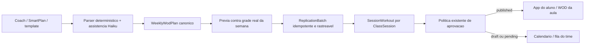

<!--
ARQUIVO: plano de produto e implementacao para programar a semana de WOD e entrega-la ao time e aos alunos.

TIPO DE DOCUMENTO:
- plano de produto e execucao tecnica para revisao de PM, produto, design, engenharia e QA
- evolucao de um fluxo existente; preservar o runtime e migrar em cortes verificaveis

AUTORIDADE:
- alta para o escopo desta frente depois de aprovado
- subordinada ao runtime, testes, modelos de permissao, contrato de publicacao do WOD e design system OctoBox

DOCUMENTOS RELACIONADOS:
- [wod-smart-paste-corda.md](wod-smart-paste-corda.md)
- [wod-smartplan-spec.md](wod-smartplan-spec.md)
- [wod-ui-ux-revolution-corda.md](wod-ui-ux-revolution-corda.md)
- [coach-wod-approval-corda.md](coach-wod-approval-corda.md)
- [wod-post-publication-operational-loop.md](wod-post-publication-operational-loop.md)
- [student-app-grade-wod-rm-corda.md](student-app-grade-wod-rm-corda.md)
- [../architecture/octobox-architecture-model.md](../architecture/octobox-architecture-model.md)
- [../architecture/themeOctoBox.md](../architecture/themeOctoBox.md)
- [../map/design-system-contract.md](../map/design-system-contract.md)

STATUS:
- PLANO PARA ANALISE DO PRODUCT OWNER / PM / TECH LEAD; existe implementacao parcial no worktree, ainda sem autorizacao de rollout
- implementacao local parcial atualizada em 2026-09-28: novo adapter Haiku estrutural somente para erros recuperaveis allowlisted, validacao local do schema/campos/dias/conteudo/numeros, texto adversarial serializado como dado JSON, diff por linha, aceite explicito do coach server-side e link de recuperacao para o SmartPlan GPT. O provider agora exige kill switch global e allowlist por schema tenant; desligado por padrao e proibido no schema public. O QA local passou: 128 testes de parser/SmartPaste, mais 184 testes e 70 subtests de projecao/aprovacao/aluno, e todos os 33 E2Es do contrato visual WOD; `manage.py check`, `makemigrations --check --dry-run operations student_app`, sincronizacao de assets e `check_static_drift --strict` passaram. Teste de integracao comprova que sem provider a fonte e preservada, a distribuicao fica bloqueada e o link de recuperacao aparece. A resposta real da Anthropic e custo/latencia em staging seguem pendentes porque este ambiente nao tem credencial Anthropic; corpus dourado ampliado, UX uniforme para todos os erros e validacao de navegador/dispositivo real/staging tambem continuam pendentes; nao habilitado em producao
- navegacao primaria, ancora de semana, bloqueios estruturais de parse, link SmartPlan e preservacao de prescricao estao em alteracao no runtime; a data escolhida permanece como padrao da previa e retargeting intencional esta em disclosure opcional; os gaps antes encontrados no parser (sets/notas/scaled) e alias de slug ja tem correcao e regressao; round-trip local dos formatos criticos agora tem prova, enquanto validacao de staging/dispositivo e corpus adicional seguem como gates
- preview de cobertura/distribuicao e leitura do aluno usam componentes existentes, mas o contrato visual final de revisao semanal ainda precisa ser validado; nao considerar o popup semanal completo
- a acao e o atalho de exclusao em massa foram removidos da interface principal do Calendario; a rota autenticada continua existindo sem link visual e requer decisao separada de descontinuacao/guardrails antes de ser considerada encerrada
- QA de integracao atualizado: apos a migration de idempotencia passaram 369 testes + 70 subtests da trilha vertical WOD/aluno e 31 E2Es visuais completos em PostgreSQL tenant. O E2E de distribuicao descarta a resposta HTTP depois do commit; ao repetir o mesmo formulario, o coach recebe “Resultado recuperado” sem duplicar WOD/lote. Duas distribuicoes concorrentes para a mesma aula foram testadas com chaves independentes (uma cria, uma pula) e com a mesma chave (um lote e um replay); ambas as variantes passaram em cinco rodadas. A migration 0023 foi revertida e reaplicada com sucesso no schema `box_test` de `test_octobox_control` (sem linhas de lote naquele banco). A chave e vinculada por fingerprint ao coach, plano/conteudo, semana e tipos de aula; reutiliza-la com outra semana falha sem criar lote. O POST sem CSRF tambem foi rejeitado sem criar lote. SQLite nao prova concorrencia nem isolamento tenant.
- atualizacao de QA em 2026-09-28: a auditoria do cache encontrou que confirmar substituicao SmartPlan em texto cru nao incrementava `SessionWorkout.version`. Como essa versao compoe a chave do snapshot do aluno, um WOD antes publicado podia reaparecer do cache depois que o texto fosse aprovado. A action agora avanca a versao antes de encaminhar para aprovacao; regressao real cobre snapshot antigo aquecido → substituir por texto cru → estado pendente invisivel ao aluno → aprovacao por manager → snapshot atualizado. A regressao passou em PostgreSQL tenant dedicado (`codex_wod_gate_20260928`). A trilha editor/SmartPaste/aprovacao/snapshot passou 234 testes + 70 subtests; a suite E2E visual passou 31 testes, incluindo Escape e foco restaurado, layout mobile, aceite explicito e retry apos resposta perdida. QA manual em dispositivo e staging continuam pendentes.
- auditoria adicional do estado de aprovacao: os handlers do editor agora tiram de `pending_approval` o WOD alterado e retornam para rascunho antes de nova submissao; o caminho de adicionar bloco tambem avanca a versao. O teste de regressao comprova pending v5 → editar → draft v6; a suite do editor passou 35 testes apos a correcao.
- atualizacao de fidelidade em 2026-09-28: a tela do aluno antes retornava `format_spec` cedo demais e escondia score, rounds, time cap e intervalo que ja estavam no modelo/snapshot. O resumo agora compoe os metadados sem descartar o formato livre. Regressao integrada percorre `WeeklyWodPlan` → projecao → WOD pendente → publicacao de teste → snapshot → HTML real do app, cobrindo `21/15/9`, sets, faixa `10 a 12`, carga `40/25 kg`, `65% RM`, alternativa scaled, time cap, rounds, intervalo e EMOM com descanso. Trilha `tests/test_wod_projection.py` + `student_app/test_unit_logic.py` + `student_app/tests.py`: 165 testes e 70 subtests passaram em PostgreSQL tenant.
- atualizacao de cobertura em 2026-09-28: regressao prova que a confirmacao recalcula os destinos se uma aula ganhar WOD depois da previa; com duas aulas elegiveis, preserva a ocupada e cria somente na outra. `tests/test_wod_projection.py` + `tests/test_wod_projection_concurrency.py`: 12 testes passaram, incluindo concorrencia PostgreSQL com chaves independentes e replay idempotente.
- atualizacao de QA do calendario em 2026-09-28: 7 E2Es direcionados passaram para o campo de data em viewports/temas distintos e para selecao de quarta-feira com snap visual para segunda. O E2E integrado agora dispara a mudanca do picker para uma quarta-feira em semana futura distinta da sugestao padrao, confirma o snap para segunda e percorre organizacao, distribuicao, `WeeklyWodPlan.week_start`, `ReplicationBatch.target_week_start`, WOD pendente no Planner, navegacao anterior/posterior, aprovacao e consumo pelo aluno. Uma aula sentinela estende o limite do picker sem entrar no alvo da distribuicao. A suite visual completa passou apos o ajuste (`31 passed` em PostgreSQL tenant), e o teste de virada 01/01/2027 → 28/12/2026–03/01/2027 passou (`1 passed`). A mudanca do calendario foi exercitada por evento DOM, nao por UI nativa controlada manualmente. Seguem pendentes timezone de tenant em staging e teste em dispositivo/browser real.
- revalidacao local consolidada em 2026-09-28: `.venv\\Scripts\\pytest.exe --reuse-db tests/test_wod_weekly_normalizer.py tests/test_workout_smart_paste.py tests/test_workout_smart_paste_freeform.py tests/test_wod_smartplan_weekly_parser.py tests/test_wod_projection.py tests/test_wod_projection_concurrency.py tests/test_workout_approval_board.py student_app/test_unit_logic.py student_app/tests.py tests/e2e/test_smart_paste_visual_contract.py -q` passou com 345 testes e 70 subtests (`154.83s`). `manage.py check`, `makemigrations --check --dry-run operations student_app` e `check_static_drift --strict` tambem passaram. Isso e evidencia local da trilha combinada; nao substitui resposta real do Anthropic em staging, timezone do tenant, QA manual em dispositivo, acessibilidade manual, rollout ou aceite PM/Operacao.
- protecao contra previa obsoleta em 2026-09-28: editar texto, ancora semanal ou nome depois de organizar agora desativa a confirmacao no navegador e instrui reorganizar; a view rejeita texto/segunda-feira divergentes da fonte persistida, inclusive em POST direto. Regressao cobre tentativa de confirmar com texto ou data manipulados sem aceitar nem gravar o plano. O contrato Haiku mobile valida a mudanca/reversao de texto, data e nome nos dois temas. A sincronizacao da falha simulada de resposta de distribuicao deixou de depender de espera fixa. Revalidacao posterior passou: 128 testes de parser/SmartPaste/normalizador, 33 E2Es visuais, `manage.py check`, checagem de migrations e `check_static_drift --strict`.
- endurecimento do candidato Haiku em 2026-09-28: a validacao agora exige que todas as ocorrencias de tokens significativos da colagem sobrevivam no payload candidato, inclusive movimentos legiveis fora da linha diagnostica e movimentos repetidos identicos. Uma linha adversarial omitida leva a `needs_review`; a chamada continua serializando a origem inteira como JSON. Um golden inicial cobre series/reps, `% RM`, EMOM por minuto, descanso e notas. Ele revelou que `emom_label` nao entrava na comparacao; o campo agora e validado junto dos demais dados semanticos. Regressao prova que movimentos nao desaparecem nem sao deduplicados e que uma representacao rica correta e aceita. Revalidacao: 131 testes de parser/SmartPaste/normalizador passaram; a suite visual completa mais recente passou 33 E2Es; `manage.py check`, checagem de migrations e `check_static_drift --strict` seguem verdes. O corpus dourado amplo/model response real continua pendente.
- baseline quantitativo, decisoes PM, piloto, rollout e aceite final continuam pendentes
-->

# WOD semanal — programacao unica e distribuicao confiavel

## Resumo executivo para revisao

### Veredito para esta revisao

**O plano resolve o problema certo como direcao, mas ainda nao e autorizacao para rollout.** Ele trata a jornada completa — programar uma vez, revisar a semana, aplicar nas aulas corretas e entregar o WOD publicado ao aluno — em vez de otimizar somente o parser ou o modal. A base existente permite evoluir sem reescrita.

Para decisao de PM/Owner, os bloqueios de produto sao: definir quando um movimento sem vinculo pode seguir como custom; confirmar quais aulas recebem o WOD de cada dia; e manter distintos “confirmar plano”, “distribuir/submeter” e “publicar”. Para decisao tecnica, os bloqueios de release sao: validar a fidelidade da prescricao no app do aluno, resolver a rodada integrada de testes com falhas, e executar a prova tenant/PostgreSQL e browser real antes do piloto.

**O que esta bom no plano:** ha fonte semanal e destino por aula existentes; a regra padrao evita sobrescrita; a revisao humana permanece; o aluno so deve ler estado publicado; e a entrega esta fatiada em gates verificaveis.

**O que precisa de cautela:** a mudanca esta em worktree com muitas areas relacionadas; testes SQLite nao demonstram concorrencia nem isolamento tenant; e os detalhes ainda dependem de observacao com coaches e confirmacao de politica pelo Owner/Head Coach. Estimativas de sprint devem vir depois dessas respostas e da decomposicao dos tickets.

Este documento e o material para analise e decisao. Nesta etapa, ele nao implementa codigo, nao aprova mudanca de politica do box e nao libera trafego/piloto.

### Recomendacao

**A direcao e boa e vale evoluir o codigo atual, mas nao liberar como “fluxo pronto” ainda.** O OctoBox ja tem as pecas essenciais; o trabalho principal e fecha-las como uma jornada unica, previsivel e recuperavel. Nao recomendo apagar o sistema e reescrever: isso descartaria regras de aprovacao, projeccao, isolamento por box e consumo pelo aluno que ja existem.

O produto deve ter duas entradas primarias para o coach:

1. **WOD Semana** — escolhe a segunda-feira, abre opcionalmente o SmartPlan, cola o treino, organiza/revisa os dias e confirma a distribuicao depois de ver a previa.
2. **Calendario** — mostra aulas reais, cobertura de WOD e estados do time; permite abrir diretamente o que precisa ser corrigido, submetido ou aprovado.

“Aprovar semana” nao deve ser um verbo generico. A acao na previa cria/distribui WODs para destinos explicitamente mostrados; a aprovacao/publicacao por aula continua obedecendo ao fluxo e aos papeis existentes. O aluno continua vendo somente WOD publicado.

### O que esta bem encaminhado

- Ha uma fonte de autoria semanal (`WeeklyWodPlan`) e uma unidade operacional por aula (`SessionWorkout`), sem necessidade de inventar um segundo dominio.
- O SmartPaste/parser, a resolucao assistida de movimentos pelo Haiku, a previsao de cobertura, o lote de distribuicao, o Planner e o app do aluno ja formam uma base implementavel.
- A data escolhida e a grade real de aulas podem orientar o destino; o JSON pode ser contrato interno, sem obrigar o coach a conhece-lo.
- O principio de nao sobrescrever WOD existente, preservar o texto de origem e mostrar diferenca entre aviso e erro e o caminho certo para confianca.
- A restricao de duas telas pode ser atendida por duas entradas de navegacao, reutilizando o Planner/fila como detalhes do Calendario em vez de criar um terceiro modulo.

### Onde ainda falha / o que impede chamar de pronto

1. **A promessa de “Haiku corrige tudo” ainda nao esta comprovada como capacidade pronta para uso.** O worktree agora tem um adapter Haiku para corrigir apenas diagnosticos estruturais recuperaveis allowlisted, seguido de validacao deterministica, diff e aceite explicito; isso e uma implementacao local parcial, nao prova de qualidade em todos os formatos nem de provider em staging. Slugs conhecidos devem ser resolvidos localmente; Haiku fica para ambiguidades recuperaveis, nao para reescrever livremente a prescricao. O gate P0 restante e corpus dourado aprovado, resposta real do provider em staging, limites de custo/latencia e UX de recuperacao uniforme. Nenhuma saida de IA pode distribuir antes de validar novamente e receber confirmacao humana.
2. **A previa e distribuicao precisam compartilhar a mesma regra de elegibilidade.** Se grade, cancelamento, horario ou colisao mudar entre ver e confirmar, a confirmacao deve recalcular e pedir revisao; nao pode gravar destino que o coach nao viu.
3. **A data/semana tem que ser uma so fonte de verdade.** Segunda-feira selecionada, intervalo mostrado, dias do payload, `ClassSession`, Calendario e data do WOD no aluno precisam coincidir no timezone do box. Nenhum dia ausente pode cair em segunda-feira por fallback.
4. **Os estados estao em niveis diferentes.** Plano revisto, distribuicao, pendencia de aprovacao e publicado nao sao sinonimos; a UI precisa dizer qual acao acontece e quem pode faze-la.
5. **A fidelidade ate o aluno e gate de produto.** O round-trip dos formatos criticos agora esta provado em PostgreSQL local ate o HTML do aluno; ainda requer smoke em staging/dispositivo e corpus maior antes de liberar.
6. **A experiencia mobile e a recuperacao precisam de prova integrada.** O dialog real de distribuicao ja foi exercitado em E2E sobre PostgreSQL; a suite visual completa ainda deve comprovar restante da pagina servida pela aplicacao, incluindo teclado, scroll longo e erro HTMX/rede.
7. **Calendario ainda mistura acompanhamento semanal com ferramentas administrativas do Planner.** A tela atual mostra painel de uso/funil de templates, atalhos para selecionar template por aula e a acao destrutiva “Remover todos os WODs”. Isso nao invalida essas capacidades, mas deixa a promessa de “Calendario = cobertura e proxima acao” menos clara e aumenta a chance de uma exclusao em massa acidental. O plano recomenda manter rotas e regras existentes, retirar a exclusao em massa da superficie principal e mover insights/templates para uma area secundaria deliberada, apos validar com Owner/Manager se sao usados no trabalho semanal.

### Escopo recomendado para a primeira entrega

Entregar primeiro o caminho completo **segunda-feira → colar uma vez → organizar → revisar cada dia → conferir aulas reais → distribuir sem sobrescrita → aprovar/publicar pela politica atual → aluno abre o WOD certo**. O Calendario precisa refletir o estado real e levar a acao certa, mas geracao automatica de treino, API direta com GPT, notificacoes em massa e reescrita do app ficam fora.

### Plano resumido para decisao

| Etapa | Resultado para o usuario | Gate PM / produto | Gate tecnico / QA |
|---|---|---|---|
| 0. Fechar regras e baseline | Sabemos como o coach trabalha e quem distribui/publica | Observar coaches reais; fechar uma prescricao por dia/turma, movimentos custom, colisao e significado de confirmar | Mapear papeis, timezone, modelos e contratos atuais; registrar lacunas confirmadas |
| 1. Semana confiavel | Colagem nao perde texto; dias e datas ficam certos; erros explicam como recuperar | Coach entende sucesso, aviso e bloqueio sem tutorial de JSON | Testes de contrato/parser/Haiku; nenhuma inferencia silenciosa; source text preservado |
| 2. Preview e distribuicao | Coach ve semana e destinos antes de gravar | Coach preve corretamente o resultado e sabe que ainda pode haver aprovacao | Mesma funcao de elegibilidade no preview e escrita; colisao explicita; idempotencia/revalidacao |
| 3. Calendario e time | Coach/gestor ve cobertura, pendencias e proxima acao | Nao ha terceira tela primaria nem confusao de papeis | Calendario deriva dos `SessionWorkout` e estados reais; acesso por tenant/papel |
| 4. Aluno e piloto | Aluno abre a versao correta na aula/data certas | Um box e um ciclo semanal aprovados com suporte nomeado | Round-trip e migration em PostgreSQL; E2E desktop/mobile; cache, rollback e observabilidade |

### Leitura de produto da implementacao atual (para revisar antes de tickets)

| Superficie/capacidade existente | Avaliacao | Proposta para o MVP | Nao fazer |
|---|---|---|---|
| WOD Semana / SmartPaste | Boa base para autoria semanal; precisa garantir recuperacao, edicao e review sem depender de JSON | Manter como entrada principal, fechar o ciclo do texto bruto ate a distribuicao e preservar o rascunho | Recriar parser ou exigir contrato tecnico do coach |
| Calendario por aulas reais | Boa fonte para cobertura e estado operacional | Simplificar a hierarquia para semana, cobertura, estado e acao seguinte; manter a semana selecionada em links de ida/volta | Duplicar a regra de elegibilidade em outra query/regra visual |
| Fila de aprovacao | Regra de governanca ja existe e deve continuar sendo soberana | Abrir como detalhe/acao contextual a partir do Calendario e mostrar claramente quem pode agir | Fazer “Distribuir” significar “Publicar” ou criar uma terceira entrada primaria |
| Templates confiaveis e insights de uso | Capacidade avancada, mas secundaria a tarefa de programar uma semana | Preservar funcionalidade; avaliar recolher em “Ferramentas”/detalhe, mantendo links por papel | Apagar modelos, telemetria ou rotas sem evidencia de uso |
| “Remover todos os WODs” | Acao de alto impacto e fora do caminho principal; exige auditoria de permissao, escopo e reversao | Remover o CTA do Calendario de rotina. Se houver caso operacional valido, manter em ferramenta secundaria com preview de alvos, digitacao/confirmacao clara, CSRF, papel autorizado e trilha auditavel; preferir undo do lote quando possivel | Deixar a acao destrutiva ao lado da navegacao semanal sem resumo de impacto ou reversao |

**Pergunta de decisao para PM/Owner:** o Calendario deve ser apenas uma superficie de cobertura e pendencias, ou tambem uma ferramenta de edicao manual/auditoria de templates? Recomendacao: a primeira opcao como caminho padrao; capacidades avancadas continuam acessiveis por acao secundaria, sem roubar foco nem desaparecer do produto.

### Decisoes para o reviewer antes de fechar desenho/execucao

As recomendacoes deste plano sao defaults seguros, mas Product Owner/head coach deve confirmar:

1. O mesmo WOD vai para todas as turmas elegiveis daquele dia? Recomendacao: sim, exceto quando o coach escolher explicitamente outro destino.
2. “Prosseguir” com movimento sem cadastro/video e permitido? Recomendacao: aceite explicito por movimento/dia, mantendo texto custom e sem prometer video.
3. Quem distribui versus quem publica? Recomendacao: manter a matriz atual; a previa distribui para o fluxo existente, nao contorna aprovacao.
4. Se uma aula ja tem WOD, como agir? Recomendacao: nao substituir; mostrar colisao e exigir caminho separado com comparacao.
5. O texto em formato livre precisa ser sempre enviado ao Haiku, ou Haiku so e chamado quando o parser deterministico nao fecha a estrutura/correspondencia? Recomendacao tecnica: parser primeiro, Haiku assistivo quando agrega valor, validar novamente e nunca alterar silenciosamente numeros/prescricao.

### Resultado esperado ao aprovar o plano

A aprovacao deste documento autoriza transformar os IDs WOD-01–10 em tickets e iniciar os gates reversiveis de descoberta/contrato/teste. **Nao e autorizacao para habilitar rollout ou mudar politica de publicacao.** Staging/piloto exige evidencias de QA, migracao, responsavel operacional e aceite explicito nos gates abaixo.

## Decisao executiva proposta

Resolver uma tarefa de ponta a ponta: **o coach coloca o treino com o minimo de friccao; o OctoBox organiza a semana, mostra onde cada WOD sera aplicado, encaminha cada item pelo fluxo de aprovacao do box e deixa a versao publicada disponivel para os alunos na aula/data corretas.**

O SmartPlan/GPT e uma opcao de entrada assistida, nao o produto nem um pre-requisito. O JSON e um contrato entre sistemas, nunca algo que o coach precise editar. A fonte da programacao continua sendo `WeeklyWodPlan`; `SessionWorkout` continua sendo o registro operacional publicado para uma aula especifica e consumido pelo app do aluno.

Este plano separa a direcao de produto das decisoes ainda abertas e do estado efetivo do codigo. O trabalho tecnico seguro pode avancar em paralelo, mas mudancas de significado de produto, migracao de dados e piloto dependem dos gates indicados. O alvo e reduzir a tarefa do coach a escolher a segunda-feira, colar/ajustar o treino e confirmar uma previa confiavel; nao exigir que ele entenda JSON, parser, Haiku ou replicacao.

## Brief para revisao de produto e engenharia

### Problema em uma frase

O coach precisa colocar o WOD uma vez e ter a semana organizada para o time e para os alunos, sem precisar aprender um formato tecnico, distribuir manualmente dia por dia ou descobrir tarde que o treino caiu na aula/data errada.

Parser, Haiku, calendario, modal, banco e app do aluno sao meios; nenhum deles, isoladamente, e o problema do usuario. A solucao so funciona quando a intencao da semana sobrevive a cadeia completa: entrada → organizacao → conferencia → distribuicao → aprovacao/publicacao conforme a politica do box → leitura pelo aluno na aula/data correta.

### Resultado esperado por tipo de usuario

| Usuario/caso | O que precisa conseguir fazer | Evidencia de que resolveu |
|---|---|---|
| Coach montando uma semana nova | Escolher a segunda-feira, colar o texto que ja tem, entender a semana organizada, corrigir excecoes e distribuir para as aulas certas | Conclui sem editar JSON nem repetir o mesmo WOD em cada turma; consegue prever o que sera gravado antes de confirmar |
| Coach recorrente | Reabrir a semana, ver cobertura e estados, corrigir ou completar uma aula sem perder o que ja distribuiu | Encontra a pendencia no Calendario e corrige somente o destino necessario, sem recriar a semana |
| Owner/Manager | Entender o que esta pronto, incompleto ou aguardando sua acao e aprovar/rejeitar segundo a politica atual | A fila e o Calendario concordam; nenhuma acao por papel indevido |
| Aluno | Ver o treino correto associado a sua aula quando ele estiver publicado | Dados e prescricao correspondem ao WOD aprovado daquela aula; rascunhos e pendencias nao vazam |

### Promessa e limite do MVP

**Promessa:** “Cole ou ajuste seu WOD; o OctoBox organiza a semana, mostra exatamente onde cada treino vai e encaminha os itens pelo fluxo do seu box.”

**Nao prometer:** que GPT/Haiku sempre entende qualquer formato, que todo movimento tem video/cadastro ou que confirmar a semana publica automaticamente para os alunos. Incerteza deve virar uma decisao pequena e explicita, nunca uma suposicao invisivel.

**Dentro do MVP:** duas entradas primarias — **WOD Semana** para autoria/conferencia/distribuicao e **Calendario** para cobertura/estado/pendencias. Usar a grade e os fluxos atuais como fonte operacional; integrar o aluno existente por `SessionWorkout` publicado.

**Fora do MVP:** substituir o app do aluno, criar uma API direta com o GPT, trocar o modelo de aprovacao do box, gerar/periodizar treinos automaticamente ou reconstruir o dominio/calendario do zero.

### Jornada principal a validar antes de ampliar implementacao

1. O coach escolhe uma segunda-feira e reconhece visualmente a semana alvo.
2. Cola o treino recebido (SmartPlan ou texto suportado); o sistema preserva a entrada original.
3. O OctoBox organiza por dia e apresenta treino, data e problemas localizados. Erro estrutural bloqueia a distribuicao; movimento customizado e aviso recuperavel, conforme politica aprovada.
4. O coach confere a cobertura real contra as aulas do box e abre cada dia/aula para entender o destino.
5. Ele confirma **Distribuir WODs** ou volta para revisar. Este popup confirma a distribuicao, nao substitui a aprovacao de publicacao.
6. O sistema retorna, por aula, criado/ignorado/pendente/falhou e leva a Calendario para acompanhar o fluxo.
7. O papel autorizado submete/aprova/publica no corredor atual; o aluno ve somente a versao publicada da aula correta.

### Critica PM para o design atual

- A acao primaria do popup deve nomear o efeito real. Recomendacao: **Distribuir WODs**; a saida secundaria e **Voltar para revisar**. Evitar “Aprovar” generico, pois existem aprovacao operacional e publicacao em etapa separada.
- “Recusar” deve ser usado somente se a acao realmente rejeitar um plano e registrar esse estado; para fechar a previa sem perda, usar “Voltar para revisar”.
- Dividir a experiencia em duas telas nao significa apagar capacidades existentes: Planner, fila de aprovacao e editores podem continuar como detalhes/estados acessados pela tela Calendario.
- A simplificacao so e real se diminuir passos/repeticao do coach. Um fluxo de colar → modal longo → resolver muitos movimentos manualmente pode apenas deslocar o trabalho; medir tempo total e numero de correcoes, nao apenas sucesso do parser.
- No mobile, a previa deve permitir ler e decidir sem tela branca, perda de scroll ou foco. Se dialog nativo/HTMX nao puder garantir isso em browser suportado, usar painel/rota responsiva com o mesmo contrato, nao insistir no popup por fidelidade visual.

### Questoes de produto que precisam de resposta no review

Estas sao decisoes que podem mudar regra de negocio; os defaults recomendados estao na secao de decisoes abertas mais abaixo. Podem ser respondidas no review sem bloquear testes isolados:

1. Cada WOD do dia vai a todas as turmas elegiveis ou pode variar por turma?
2. Coach pode distribuir/submeter sem aprovacao, ou a confirmacao so cria pendencias para Owner/Manager?
3. Movimento sem catalogo/video pode seguir como texto customizado? Ha alguma modalidade que deve bloquear?
4. Quando uma aula ja tem WOD, o default e ignorar e mostrar colisao (recomendado), ou existe outro fluxo vigente?
5. Depois da distribuicao, quem pode editar e como a mudanca chega a itens pendentes versus publicados?
6. Ha uma janela minima de antecedencia que o produto precisa garantir, ou primeiro medimos no piloto?
7. O pedido de normalizar a semana inteira com Haiku esta dentro do MVP; o runtime hoje resolve apenas slugs. PM/head coach devem fechar os guardrails: quais falhas estruturais sao recuperaveis, que diferencas numericas sempre exigem confirmacao e qual limite aceitavel de custo/latencia. Recomendacao: normalizador estrutural separado, sem mover treino de dia nem mudar prescricao por inferencia silenciosa.

## C.O.R.D.A.

### C — Contexto e problema

O problema de produto nao e “colar texto” isoladamente. E reduzir o trabalho necessario para montar a semana e evitar que a equipe e os alunos recebam programacoes incompletas, divergentes ou no dia errado.

O coach precisa:

1. transformar uma programacao em treinos organizados por dia;
2. saber quais aulas da grade receberao cada WOD;
3. perceber lacunas e incompatibilidades antes de confirmar;
4. acompanhar revisao/publicacao do time;
5. garantir que o app mostre somente o WOD correto, publicado e associado a aula certa.

### Hipotese de produto a validar

O maior custo pode nao ser “formatar texto”, mas converter uma intencao de semana em treinos corretos na grade, sem retrabalho e sem incerteza. Por isso o MVP prioriza **colar uma vez → conferir visualmente a semana → corrigir excecoes → confirmar destino**. Acesso ao GPT e atalho de ajuda, nunca uma dependencia para abrir, editar ou distribuir uma semana. Se a observacao de coaches mostrar que revisao/correcao manual e frequente, priorizar edicao inline em vez de mais automacao.

### O — Objetivo e resultado

Entregar uma jornada semanal coerente entre autoria, grade de aulas, revisao operacional e consumo pelo aluno — mantendo as regras de permissao e publicacao ja existentes.

O sistema deve responder, para qualquer semana: “o que foi programado, para quais aulas, em qual estado e o que o aluno consegue ver?”.

### R — Runtime atual e riscos

O codigo atual ja oferece fundacao real:

1. `WeeklyWodPlan`, `DayPlan`, `PlanBlock`, `PlanMovement` guardam a prescricao semanal e o texto/payload de origem.
2. SmartPaste interpreta texto, tenta reconhecer movimentos pelo catalogo e usa Haiku no fluxo de resolucao de slugs.
3. `operations/services/wod_projection.py` pre-visualiza e projeta dias em `ClassSession`, criando `SessionWorkout` e `ReplicationBatch`.
4. O Planner acompanha WODs por aula. Os estados operacionais incluem rascunho, aguardando aprovacao, publicado e rejeitado.
5. O app do aluno consulta apenas `SessionWorkout` publicado para a sessao. Seu snapshot pode enriquecer a prescricao com dados pessoais, como RM, em camadas posteriores.

Logo, a tese nao e substituir tudo. O gap e fechar a continuidade e a leitura de estado entre essas pecas, sem obrigar o coach a compreender os detalhes internos.

Riscos observados no runtime/documentacao que esta frente deve tratar ou confirmar:

- a conversao SmartPlan extrai o dia pelo titulo do bloco; quando nao encontra um dia, o codigo atual pode associar o bloco a segunda-feira com aviso. A distribuicao nao pode usar esse fallback como se fosse segura;
- a projecao semanal pode manter `SessionWorkout.is_normalized=False` sem perder o conteudo: a tela agora seleciona o tier rico quando `has_structured_content` existe, sem rotular a origem como SmartPlan. A prova integrada atual valida a projecao ate o HTML do aluno; ainda e necessario reproduzir essa leitura no staging/dispositivo real;
- o plano semanal e os WODs por aula sao representacoes diferentes. `ReplicationBatch` registra a origem em lote, mas precisamos definir e testar o comportamento de edicoes posteriores e versoes;
- `SessionWorkoutBlock` e `SessionWorkoutMovement` agora guardam os metadados estruturados; `_parse_reps` continua preenchendo o inteiro legado apenas quando a string e numerica simples, enquanto `reps_spec`/`load_spec` preservam a prescricao original. Foi encontrado e corrigido um gap exclusivamente de apresentacao: com `format_spec` preenchido, o resumo do aluno ocultava score/rounds/time cap/intervalo;
- conflito com WOD ja existente nao deve sobrescrever silenciosamente. Hoje a pre-visualizacao/projecao adota politica de pular colisao; a UX deve tornar isso explicito;
- “semana confirmada” nao significa “publicada para alunos”. Publicacao por aula segue estado e politica do box;
- uma semana pode ter dias sem aulas, aulas sem programacao ou mais de uma aula no mesmo dia; o resumo precisa distinguir estes casos.

Ha tambem uma divergencia documental a resolver antes de consolidar a responsabilidade do modelo: `wod-smartplan-spec.md` descreve normalizacao fora do servidor e parsing sem chamada de API, enquanto `wod-smart-paste-corda.md` descreve L2/Haiku, e o runtime atual tem resolucao via Haiku e parser de texto em caminhos distintos. Este plano recomenda um unico contrato versionado com validacao deterministica e assistencia Haiku limitada; registrar essa decisao e alinhar os documentos antes de alterar o comportamento, para nao manter tres versoes do fluxo.

### D — Direcao de produto e experiencia

#### Usuarios e trabalhos

| Usuario | Trabalho a realizar | Necessidade principal |
|---|---|---|
| Coach | Programar e revisar os treinos | Montar a semana uma vez, corrigir excecoes sem retrabalho |
| Owner/Manager | Garantir cobertura e aprovar conforme politica do box | Ver lacunas e pendencias sem abrir cada WOD individualmente |
| Aluno | Preparar-se para a aula | Encontrar o treino certo na data/aula e confiar que esta publicado |

#### Principios de experiencia

1. **Uma semana, uma revisao de cobertura.** O coach nao deve redescobrir cada destino depois de escrever o treino.
2. **A grade real dirige a distribuicao.** O destino sao as `ClassSession` existentes naquela semana, nao datas ou sessoes inferidas do texto do GPT.
3. **Excecoes ficam visiveis.** Dia sem aula, aula sem WOD, classe incompativel e colisao sao estados distintos, com causa e acao.
4. **Sem publicacao surpresa.** Acoes da semana respeitam a politica de aprovacao do box e mostram claramente o que ficara visivel ao aluno.
5. **Recuperacao sem perda.** Falhas do parser/Haiku/rede preservam o rascunho, texto original e edicoes manuais.
6. **A automacao reduz trabalho, nao remove controle.** O sistema sugere a distribuicao; o coach/manager confirma o escopo e as excecoes.

Aplicar os principios de interacao associados a Apple — foco, previsibilidade, hierarquia, feedback imediato e boas defaults — sob a identidade oficial Luxo Futurista 2050 do OctoBox. A area de programacao e uma ferramenta operacional frequente: priorizar legibilidade e densidade util, usar destaque visual somente para acao/estado prioritario, e nao transformar a tela em uma vitrine com efeitos.

#### Navegacao e fluxo proposto

Manter exatamente duas entradas de navegacao para o coach: **WOD Semana** e **Calendario**. O fluxo existente chamado internamente de Planner e a fila de aprovacao devem ser incorporados/abertos a partir de Calendario, nao expostos como uma terceira tela primaria.

O limite “duas telas” significa duas entradas de navegacao, nao duas paginas monoliticas. Detalhes de dia, preview e confirmacao sao estados/contextos destas telas, com URL/estado recuperavel quando possivel; nao criar um terceiro modulo de publicacao.

**1. WOD Semana — autoria e distribuicao**

1. Abrir uma semana escolhendo a segunda-feira; mostrar intervalo completo e persistir a ancora durante navegacao, refresh e retorno. No servidor, datas sao calculadas no timezone do box, nunca inferidas pelo LLM.
2. Colar o texto de treino; oferecer um CTA discreto para abrir o GPT SmartPlan configurado (`https://chatgpt.com/g/g-69f3b858af6c819197c4c1be8010bad6-octobox-smartplan`) em outra aba, preservando o rascunho original no OctoBox.
3. Acionar **Organizar semana**. Mostrar progresso e impedir duplo envio. A resposta retorna blocos por dia em uma grade revisavel, nao direto na grade oficial nem no app do aluno.
4. No desktop, preview semanal compacto com detalhe por dia. No mobile, seletor horizontal de dia + detalhe expandivel; evitar comprimir sete colunas. Editar dia/bloco/movimento no contexto; manter teclado e foco apos erro.
5. Acionar **Conferir aulas da semana**. Cruzar `DayPlan.weekday` com `ClassSession` reais no intervalo escolhido, incluindo tipo/horario de aula, WOD existente, compatibilidade e politica de aprovacao. Nenhuma escrita no destino nesta etapa.
6. Abrir preview de confirmacao: dialog acessivel no desktop; no mobile, dialog de tela cheia ou rota/painel dedicado que preserve o contexto. Permitir tocar em cada dia/aula para conferir o treino completo. **Aprovar** distribui somente itens explicitamente elegiveis/selecionados; **Recusar/Voltar** fecha a confirmacao sem apagar o rascunho.
7. Mostrar resumo do resultado real: criados, ja existentes/ignorados, aguardando aprovacao e falhas. Levar o coach a Calendario, com filtro/semana e acao direta para tratar cada pendencia.

#### Especificacao de estados e feedback

| Resultado | Comportamento | Acao ao usuario |
|---|---|---|
| Semana valida, movimentos reconhecidos, destinos elegiveis | Abrir preview por dia e por aula; ainda nao escrever `SessionWorkout` | Conferir e aprovar ou voltar |
| Movimento sem slug/video/compatibilidade confiavel | Aviso nao bloqueante e identificavel pelo dia/aula; manter nome/texto original. Permitir continuar somente apos confirmacao explicita; nao fingir que ha video/correspondencia | Corrigir/substituir ou prosseguir com movimento customizado, se a politica permitir |
| Erro estrutural, dia ambiguo/ausente, JSON invalido, duplicidade impeditiva ou conflito que nao possa ser resolvido com seguranca | Nao abrir aprovacao de distribuicao nem persistir destino. Preservar fonte e resposta, indicar trecho e causa | “Treino nao foi organizado: [motivo]. Corrija o texto ou abra o SmartPlan para reformular.” |
| Haiku indisponivel/timeout/limite | Falhar com seguranca; nao substituir por treino parcial ou inventar correspondencia | Tentar novamente ou revisar manualmente; preservar texto |
| Data invalida ou semana desatualizada | Nao projetar silenciosamente para outra semana; revalidar aulas e preview | Selecionar segunda-feira e refazer conferencia |
| WOD ja existente em aula | Manter politica padrao de nao sobrescrever; comparar/mostrar colisao | Excluir destino ou abrir caminho atual para substituicao explicita |

O alerta de movimento desconhecido e diferente de erro de parse. O coach pode aceitar o texto cru sem video se a regra operacional permitir, mas a UI deve dizer exatamente o que o aluno vera e o que nao sera vinculado. Erro estrutural bloqueia; aviso de compatibilidade nao deve fingir aprovacao do dominio.

#### Contrato visual e acessibilidade do preview

- Componentes devem reutilizar o sistema de dialogo/overlay canônico; nunca montar um segundo overlay com `position: fixed` sem contrato de foco/scroll.
- Em desktop: dialog com largura limitada, header com semana/contagem, navegacao de dias, corpo rolavel e acoes fixas no rodape; preservar o dia selecionado.
- Em mobile: ocupar viewport com `100dvh` e fallback; respeitar safe-area, teclado virtual e rolagem interna. Se o componente/HTMX falhar, renderizar preview inline como fallback, nunca uma camada branca vazia.
- `Esc`/Voltar fecha sem descartar fonte; foco entra no dialog, fica preso enquanto aberto, volta ao controle que abriu; anunciar erros/atualizacoes com `aria-live` e dar nomes claros aos botoes.
- O preview e somente leitura e inclui data, dia, tipo/horario da aula, bloco, prescricao completa, movimentos sem correspondencia e estado esperado. Acoes destrutivas/substituicao ficam fora da confirmacao basica.
- Seguir OctoBox Luxo Futurista 2050: conteudo e status legiveis antes do efeito, superficies da familia existente, neon restrito a acao primaria, contraste em claro/escuro, corpo ≥13 px e transicoes leves. Nao redesenhar o produto como modal futurista chamativo.

**2. Calendario — cobertura operacional e consumo**

- mostrar aulas por data/horario e seu WOD associado;
- distinguir sem WOD, rascunho, aguardando aprovacao, publicado, rejeitado e colisao/nao aplicado;
- permitir que coach veja sua acao pendente e que owner/manager veja a fila que pode aprovar;
- representar dias sem aulas como “sem sessoes programadas”, nao como WOD faltante;
- deixar claro que somente “publicado” esta disponivel para aluno.

Na tela de autoria, a previa e parte da pagina, nao um fluxo dependente de popups aninhados. No mobile, os controles de revisao nao podem cobrir o item selecionado nem perder foco/rolagem. Dialogos ficam reservados a confirmacoes pontuais e erros recuperaveis.

#### Contrato de entrada e papel da IA

- Entrada humana: colar a resposta completa do GPT ou texto compativel; coach nao manipula JSON.
- Contrato interno/entre GPT e servidor: JSON versionado, compativel/evoluido a partir de `docs/reference/wod-paste-schema.md`, com dia explicitamente identificado. O coach nunca precisa editar esse JSON.
- `week_start` escolhido na UI e fonte da data; o backend deriva datas dos dias. Texto/LLM nao define a semana alvo.
- Validacao do JSON, dos dias, da estrutura e dos limites do dominio e deterministica no servidor.
- **Runtime-base antes do adapter estrutural:** `detect_and_convert_smartplan_weekly`, `parse_weekly_wod_text` e `parse_weekly_wod_freeform` estruturam a semana deterministicamente; o Haiku preexistente resolvia apenas slugs de movimentos. Isso nao cobre correcoes estruturais por si so.
- **Estado atual do pipeline no worktree:** (1) parser/schema deterministico primeiro; (2) adapter `operations/services/wod_weekly_normalizer.py` e chamado apenas para mensagens allowlisted, com pelo menos um dia explicito e sem diagnostico ambiguo; (3) Haiku retorna `candidate_json` e `changes`; o servidor valida o schema, dia explicito/sem repeticao, referencias de linha, preservacao de todas as ocorrencias de tokens significativos de toda a entrada (nao apenas a linha diagnosticada), movimento de origem, `emom_label` e conjunto de numeros da prescricao; (4) a previa mostra origem/organizacao e requer aceite explicito server-side. Se qualquer ocorrencia de conteudo significativo desaparecer — inclusive movimento repetido ou legivel fora da linha com erro —, a proposta vira revisao manual; sem chave/provider, schema ruim, dia ambiguo ou diferenca numerica, nenhuma confirmacao/distribuicao passa. Haiku de slug e estagio distinto, executado somente quando a estrutura nao esta bloqueada.
- O adapter local pode propor estrutura, mas nao decide semana/data, nao inventa movimento existente/video/compatibilidade, volume, carga, repeticoes, descanso ou scaling. Preservar texto bruto e candidato normalizado para comparar; mudancas em numeros, cargas, distancias, descanso ou alternativas devem bloquear autoaceite e exigir revisao explicita. So salvar/distribuir o payload apos validacao deterministica e confirmacao humana. A qualidade com resposta real do provider ainda nao esta provada em staging.
- Para campos de prescricao, comparar texto original com normalizado. Alteracao de numeros, cargas, distancias ou alternativas e bloqueante/needs-review, nunca autocorrecao silenciosa. Modelo devolve schema estrito; resposta invalida e descartada.
- Sem dia identificavel, prescricao ambigua ou erro de contrato: bloquear distribuicao, preservar fonte e informar linha/trecho/solucao. Nunca jogar bloco para segunda por fallback silencioso.
- Movimento sem cadastro/video/compatibilidade e pendencia de dominio, nao erro de parse. O usuario pode corrigir ou manter como personalizado segundo regra do box; nao converter alerta em publicacao implicita.

#### Contrato do normalizador semanal (WOD-02)

O primeiro corte deste contrato ja esta no worktree; a secao tambem registra o alvo que ainda falta validar antes de rollout. Reutiliza `docs/reference/wod-paste-schema.md` como formato canonico (`WodPasteResult`) e nao exige JSON do coach.

**Responsabilidade unica:** converter uma colagem que o parser local classificou como potencialmente recuperavel em uma representacao estrutural candidata da mesma semana. Nao e gerador de treino, corretor de programacao, resolvedor de slug, validador de video, nem autoridade para decidir dia/data. O resolvedor Haiku atual de slugs permanece um estagio separado.

**Entrada atual do adapter:** texto colado integral e imutavel, diagnosticos do parser deterministico e versao do schema; o texto e serializado como string JSON dentro da mensagem para nao confundir delimitadores de prompt com conteudo colado. `week_start` fica fora do prompt e e aplicado pelo backend. Nao enviar catalogo para este estagio: movimento/slug e responsabilidade separada do resolvedor atual. O adapter recusa sem chamar provider se o diagnostico nao esta allowlisted, se nao houver dia explicito ou se o dia for ambiguo. Ainda faltam id de correlacao nao sensivel, deduplicacao de chamada concorrente e corpus de aceite.

**Saida atual:** envelope Anthropic de schema externo enxuto (`status`, `candidate_json` como texto JSON canonico e `changes`) para evitar gramaticas estruturadas com excesso de tipos-union; o backend decodifica e valida cada chave/tipo contra o contrato interno. O `candidate` completo inclui raiz (`week_label`, `parse_warnings`, `days`) e campos aninhados de `WodPasteResult`; `movement_slug` e obrigatoriamente null nesta etapa e `movement_label_raw` precisa aparecer na origem. `changes` contem numero de linha, trecho original, organizacao e motivo; a referencia e validada contra a linha colada. O metadata persistido inclui `prompt_version` e `schema_version`; `changes` nao altera o schema canonico persistido como parser result. Resposta truncada, malformada, com chave extra ou diferenca nao validada e descartada.

**Politica de transformacao:** pode normalizar separadores, rotulos explicitos de dia/bloco e ordem de leitura quando ha evidencia textual inequivoca. Nao pode inferir dia ausente/duplicado, repartir um bloco ambiguo, deslocar um treino para outro dia, expandir abreviacao de prescricao incerta, nem alterar/inventar exercicios, sets, repeticoes, cargas, percentuais, distancia, descanso, time cap, scaling ou nota. Valores numericos/medidas devem ser copiados sem mudanca semantica; diferenca detectada leva a `needs_review`, nao a autoaceite. Slug continua nulo se identidade nao for certa e e resolvido pelo catalogo/estagio atual; o LLM nao afirma que ha video ou compatibilidade.

**Orquestracao e fronteira de escrita:** executar deterministico primeiro; chamar Haiku apenas para diagnostics allowlisted; validar resposta localmente contra schema, cardinalidade/limites, dia explicito, origem literal, ocorrencias de tokens significativos de toda a entrada e conjunto numerico de prescricao; mostrar previa/diff e exigir checkbox de revisao, com validacao tambem no POST servidor. Nenhum callback do provider grava `WeeklyWodPlan`, `SessionWorkout` ou lote. A confirmacao humana persiste somente o candidato validado; distribuicao mantem revalidacao de cobertura/colisoes. Timeout, rate-limit, erro do provider, diff sem fonte verificavel ou ambiguidade preservam o texto e deixam a correcao manual disponivel. O log operacional registra somente estado, latencia e contagem de tokens, nunca texto colado.

**Comportamento da UX:** o estado deve ser compreensivel sem mencionar parser/schema: “Organizamos estes dias; confira as alteracoes” ou “Nao conseguimos determinar [dia/campo]. Ajuste este trecho ou reformule no SmartPlan”. O preview destaca cada alteracao lado a lado com a origem e mostra os dias/treinos antes de pedir confirmacao. O erro estrutural agora oferece atalho direto ao SmartPlan GPT e instrui colar novamente a semana completa; padronizacao de todas as falhas/transientes ainda falta. Aviso de movimento sem video/cadastro e separado do erro estrutural. Nunca dizer “aprovado” antes da confirmacao e nunca sugerir que o aluno ja recebeu/publicou o WOD.

**Prompt/evaluacao:** manter instrucao de sistema curta e versionada, schema de saida validado fora do modelo, amostras de few-shot retiradas do corpus aprovado e sem dados de cliente. Criar corpus dourado anonimo cobrindo SmartPlan valido (nao chamar normalizador), texto livre recuperavel, dias ausentes/duplicados, cabecalho confuso, blocos/EMOM/rest, numeros brasileiros (`1.200`, virgula decimal), pares de carga, `% RM`, ranges, scaled, linha solta, texto adversarial/instrucao embutida, JSON/truncamento e provider failure. Avaliar exact match semantico dos campos criticos, classificacao correta de bloqueio/revisao, preservacao do texto, ausencia de dia inventado, schema validity e latencia/custo. Gate P0: zero mutacao silenciosa de campo critico e zero distribuicao de saida invalida; medir taxa de recuperacao util e falso bloqueio, sem otimizar apenas parse-success. Cada alteracao de prompt/modelo roda o corpus antes de staging.

**Decisoes PM/Head Coach para fechar antes de estimativa:** lista exata de erros estruturais recuperaveis; campos que exigem revisao mesmo com interpretacao plausivel; aceitabilidade de preservar WOD com movimento custom sem video; texto/acao de erro; teto de latencia/custo e limite de retry. Recomendacao inicial para teste: uma chamada de normalizacao por tentativa, sem retry automatico; oferecer retry manual apos erro transitorio. Os tetos numericos devem ser aprovados apos medir baseline e nao sao definidos por este plano.

O link do GPT e um assistente externo de autoria, sem garantia de contrato nem observabilidade do OctoBox. **Gap frente ao pedido explicito de “Haiku sanitiza tudo”:** o adapter estrutural existe localmente e cobre apenas erros recuperaveis allowlisted, nao qualquer formato; ainda faltam corpus golden aprovado, chamada real em staging e limites/SLO de custo e latencia. O adapter precisa permanecer separado, com diff revisavel e sem escrita silenciosa. Haiku nunca e fonte de verdade. Preferir o SmartPlan/schema existentes a criar outra integracao/API.

### A — Arquitetura e plano de implementacao

#### Fonte de verdade e destino operacional

Regras arquiteturais:

1. Preservar `WeeklyWodPlan` como fonte de autoria semanal; preservar `SessionWorkout` como unidade operacional por aula, ja consumida pelo app do aluno.
2. Nao criar um segundo calendario ou catalogo de WOD. Reutilizar a implementacao/builders do Planner como base interna da tela Calendario; no produto, WOD Semana e Calendario sao as duas unicas entradas primarias.
3. A relacao plano→lote→WOD por aula deve permitir responder origem, versao da semana, destino e estado. Antes de adicionar campos/modelos, verificar se `ReplicationBatch`, `SessionWorkoutRevision` e snapshots existentes atendem; adicionar apenas o minimo ausente.
4. Projecao nao e sincronizacao magica: definir uma regra de versao. Edicoes no plano antes de distribuir alteram o plano. Depois de distribuir, mudancas devem gerar uma previa de impacto e atualizar somente destinos ainda seguros (nao publicados), ou abrir nova aprovacao. WOD ja publicado permanece servido ate a nova versao ser aprovada/publicada.
5. Cada acao de distribuicao deve ser atomica e idempotente para retries. Colisoes, destinos ignorados e falhas parciais precisam aparecer no resultado; retry nao duplica nem substitui por acidente.
6. Validar semana/datas no servidor, timezone local do box, permissao/tenant e politica de aprovacao por acao. Nenhuma chamada a LLM dentro de transacao longa.
7. O estudante continua lendo somente o modelo por aula em `published`; nao fazer o app ler diretamente um plano semanal em rascunho.
8. Sem microservico ou nova API nesta fase. A integracao GPT continua por link + copiar/colar; uma API automatica pode ser avaliada depois por telemetria e custo.

#### Integridade da prescricao — trabalho tecnico prioritario

O schema de entrada e rico e o destino relacional/snapshot agora tem campos correspondentes para blocos e movimentos. A trilha integrada em PostgreSQL confirmou que a projecao mantem `sets`, reps em faixa e em sequencia, carga em percentual ou pareada, scaling, notas, formato, score, rounds, time cap e intervalo ate o HTML real do aluno. O bug encontrado nesta revisao nao era mais perda no banco: era o resumo do bloco retornar apenas `format_spec`, ocultando os demais metadados visiveis; a composicao foi corrigida e coberta.

Antes de distribuir para alunos, o MVP deve garantir:

1. Definir campos canonicos minimos de bloco/prescricao no destino relacional ou extensao versionada, sem usar `structured_payload` como atalho que o aluno nao le.
2. Preservar exatamente `sets`, `reps_spec`, `load_spec`, alternativa scaled e metadados relevantes de bloco; converter para legado numerico somente quando for perda-zero e reversivel.
3. Expor os campos por snapshot/presenter do aluno e renderizar uma prescricao compreensivel; notas de movimento nao podem ficar invisiveis.
4. Atualizar clonagem/duplicacao, templates, editor/admin e migrations que copiam os modelos, ou impedir explicitamente caminhos que descartariam metadados.
5. Ter teste de round-trip entrada → plano semanal → preview → `SessionWorkout` → snapshot → UI do aluno com igualdade semantica dos campos de prescricao.

Gate: nao habilitar distribuicao geral ate cobrir os casos `21/15/9`, range `10 a 12`, `65% RM`, `40/25 kg`, EMOM/intervalo, descanso e alternativa scaled sem alterar significado.

#### Estados: plano semanal vs distribuicao

Nao misturar estados de objetos distintos.

| Nivel | Estados/resultado | Significado |
|---|---|---|
| Plano semanal | `draft`, `confirmed` (ou equivalente existente) | Autoria editavel / semana revisada pelo autor |
| Destino por aula (`SessionWorkout`) | `draft`, `pending_approval`, `published`, `rejected` | Estado oficial do WOD para equipe e aluno |
| Cobertura semanal | calculada: completa, parcial, sem sessoes, com pendencias, bloqueada | Resumo dos destinos e motivos; nao copiar manualmente um status derivado |

Transicoes e garantias:

- Confirmar autoria nao publica automaticamente.
- Distribuir cria/atualiza apenas destinos incluidos e mostrados na previa.
- Owner/Manager aprova de acordo com a regra existente; Coach pode submeter conforme sua permissao.
- App do aluno so enxerga WOD publicado.
- Rejeicao informa o motivo e permite corrigir a semana/destino sem perder dados.
- Dia sem `ClassSession` nao cria treino orfao; aula sem bloco para o dia aparece como lacuna antes da confirmacao.
- Colisao com WOD existente e exibida. Default seguro e nao sobrescrever; qualquer substituicao exige comparar versoes e confirmar explicitamente.

#### Ondas para estimativa e execucao

| Fase | Objetivo/entrega | Saida verificavel | Risco / gate |
|---|---|---|---|
| 0. Descoberta e baseline | Acompanhar um coach montando/distribuindo uma semana; cronometrar tarefas; auditar papeis, grade e configuracao de aprovacao por box; coletar baseline de faltas, retrabalho e colisao | Mapa da jornada atual, baseline e decisoes abertas fechadas | **Pendente.** Nao desenhar tela final sem validar como boxes usam classes/dias e quem publica |
| 1. Contrato de dominio | Formalizar regra plano→data→ClassSession→SessionWorkout, cobertura derivada, fidelidade integral da prescricao, colisao, versao e idempotencia; cobrir regressao do dia inferido | Contrato documentado e testes de servico/modelo | **Em andamento.** Preview antes da escrita e protecao contra lote vazio/repeticao iniciados; ainda faltam testes executados, corrida concorrente, garantia de origem/versao e contrato para metadados de bloco/reps nao numericas |
| 2. Compositor semanal | Evoluir SmartPaste para autoria/revisao em um fluxo; fontes opcionais GPT/template/manual; erros recuperaveis; mobile e teclado | Coach monta e edita plano sem sair da semana nem perder entrada | Feature flag por box; preservar caminho atual |
| 3. Previa de cobertura e distribuicao | Cruzar plano com sessoes reais; mostrar destino/estado/alerta; distribuir com action idempotente e resumo do lote | Cada destino selecionado recebe o WOD correto uma unica vez | Bloquear sobrescrita silenciosa; rollback limitado a itens seguros ainda nao publicados |
| 4. Calendario do time | Incorporar a leitura operacional atual por semana, aula, WOD e estado em Calendario; links para resolver pendencia | Owner/Manager/Coach entendem cobertura sem abrir cada editor | Reutilizar Planner/builders e permissao por papel; evitar duplicar queries pesadas; nao adicionar terceira entrada |
| 5. Publicacao e app do aluno | Percorrer submissao/aprovacao existente, garantir publicacao por sessao, snapshot/cache invalidation e leitura da data/aula certa | Aluno autorizado ve somente versao publicada correta; mudancas requerem aprovacao quando aplicavel | Nao expor rascunho, pendencia ou tenant alheio |
| 6. Piloto e rollout | Piloto em um box, acompanhar semana completa, corrigir friccao, depois habilitar progressivamente | QA assinado e gate de rollout aprovado | Kill switch retorna ao caminho anterior sem apagar planos/lotes |

#### Backlog tecnico para estimativa

| Epic | Entregas tecnicas | Dependencia | Definition of Done |
|---|---|---|---|
| A. Data e calendario | Unificar entrada da ancora semanal; navegacao +/- 7 dias; regra Monday-only coerente client/server; timezone do tenant; intervalo inclusivo/exclusivo correto; indisponibilidade de aula cancelada/remarcada recalcula cobertura | Decisao de calendario e fonte atual `ClassSession` | Mesma semana/data no formulario, preview, persistencia e Calendario; testes em domingo/segunda, virada de mes/ano e DST/timezone aplicavel |
| B. Input e normalizacao | Link SmartPlan; preservar texto colado; parser/schema versionado; adapter Haiku local com timeout, allowlist, validacao estrita, versoes de prompt/schema e telemetria agregada de latencia/tokens; diff e aceite humano no server | Fechar corpus golden, budget/SLO, teste real em staging e falhas/retries | Nenhuma resposta nao validada vira plano distribuivel; provider/modelo testados sob limites aprovados; texto original recuperavel |
| C. Revisao semanal | Presenter de semana, validacao por dia/bloco/movimento, edicao no contexto, erros junto ao trecho; responsividade/teclado/acessibilidade | A + B; decisao de editar movimentos desconhecidos | Desktop/mobile permitem revisar e corrigir sem perder conteudo ou contexto |
| D. Previa contra grade real | Query/servico de cobertura por `ClassSession`; colisao; elegibilidade, compatibilidade e estado esperado; payload de preview estavel | Contrato de dominio + regra de tipos de aula | Preview e distribuicao usam a mesma regra; preview desatualizado expira/recalcula |
| E. Distribuicao segura | Confirmacao explicita, idempotency key, lock/concurrency, atomicidade definida, `ReplicationBatch`, retorno agregado e retry seguro | D + politica de aprovacao atual | Double click/conexao interrompida nao duplica; falha por item aparece e tem retry/recuperacao rastreavel |
| F. Fidelidade e leitura do aluno | Campos de bloco/movimento, migracao aditiva; projection/hydration; serializer/snapshot/cache; presenter/template; editor, duplicacao e templates | Acordo de prescricao canonica; migration na ordem schema-per-tenant | Round-trip semantico confirmado; aluno le apenas treino publicado e a cache reflete nova versao |
| G. Calendario do time | Reuso interno do Planner; cobertura WOD por aula/semana; filtros por papel; acoes diretas para pendencias a partir da segunda tela primaria; simplificar a hierarquia e revisar/remover do caminho principal a limpeza em massa e paineis de template/funil | D/E/F; decisao PM sobre ferramentas avancadas e limpeza em massa | Calendario nao diverge da fonte por aula; dia sem aulas nao e lacuna; consultas dentro do orcamento de performance; nenhuma terceira entrada de navegacao; acao destrutiva fora do caminho principal e com confirmacao/reversao/trilha se mantida |
| H. Rollout e operacao | Feature flag; logs sem texto do aluno/treino bruto; metricas; alarmes de parse/Haiku/distribuicao; suporte e kill switch | A-G em staging | Piloto pode ser interrompido e voltar ao fluxo anterior sem apagar plano, lote ou WOD existente |

Ordem critica: A → B → C → D → E; F e um gate paralelo obrigatorio antes de liberar E para aluno; G e H fecham a operacao. Estimativa em dias/pontos deve ser feita pela equipe apos decompor A–H no tracker; este documento nao inventa prazo sem capacidade, tamanho do time ou resultado da descoberta.

#### Plano de execucao revisavel (estado observado em 2026-09-28)

Esta decomposicao e a referencia para converter o plano em tickets. “Em andamento” significa que ha mudancas no worktree, nao que a entrega foi validada ou pode ser liberada. A disponibilidade do banco e do browser de QA deve ser resolvida antes dos gates de integracao/rollout.

| ID | Prioridade / estado | Escopo concreto | Dependencia | Gate de conclusao |
|---|---|---|---|---|
| WOD-01 | P0 · round-trip e navegação local cobertos; staging parcial | Fechar a ancora da semana em uma unica fonte: segunda-feira escolhida em WOD Semana; derivar datas de cada dia no timezone do box; manter a mesma ancora ao abrir preview de cobertura e Calendario. Auditoria encontrou que o teto do date picker usava `scheduled_at.date()` em UTC; agora usa a data local ativa do box antes de determinar a segunda-feira, com regressao unitária cobrindo domingo 23:30 local / segunda 02:30 UTC. A etapa de cobertura mostra essa semana como padrao e recolhe a troca de semana em opcao avancada. Em 2026-09-28, 7 E2Es direcionados passaram para layout do campo em viewports/temas e snap de quarta para segunda. O E2E integrado dispara a mudanca do picker para quarta-feira em semana futura, confirma snap para segunda, verifica persistencia da ancora em `WeeklyWodPlan` e `ReplicationBatch`, distribui, navega semanas anterior/posterior, aprova e confere consumo pelo aluno. A suite visual completa passou (`31 passed` em PostgreSQL tenant). `PlannerWeekBoundaryTests` confirma 01/01/2027 → semana 28/12/2026–03/01/2027 (`1 passed`). A UI foi acionada por evento DOM, nao por calendario nativo controlado manualmente. Falta timezone de tenant em staging e teste em dispositivo/browser real. | Regra de segunda-feira e timezone do tenant confirmadas | Nenhum caminho troca a semana sem acao explicita; data exibida, persistida e destino `ClassSession` coincidem nos limites UTC/local, virada de mes/ano e navegacao. Trocar o destino so ocorre mediante abrir a opcao avancada e escolher nova segunda-feira. |
| WOD-02 | P0 · parcial no worktree; slug resolver existente validado; normalizador estrutural Haiku implementado mas sem chamada real/staging | Preservar texto bruto; SmartPlan e parser deterministico primeiro; chamar adapter somente para erros recuperaveis allowlisted; validar dias/linhas/campos/conteudo/numeros e slugs separados; exibir diff por linha; exigir checkbox e validacao server-side antes de confirmar. Logs agregam latencia/tokens sem conteudo. Kill switch global e allowlist por schema implementados, ambos falham fechados. Unit tests do adapter e fluxo/mock passam; a resposta real do provider nao foi testada. | PM/head coach confirma allowlist estrutural, diff/copy e movimento custom; custo/latencia maxima, corpus golden, idempotencia e teste real com staging | Nenhum dia ou numero inferido silenciosamente; schema/candidate invalido nao pode confirmar; aceite explicito antes de qualquer escrita; provider indisponivel preserva origem e oferece correcao manual; gates de staging/rollout seguem abertos. |
| WOD-03 | P0 · parcial | Revisao da semana dentro de WOD Semana: mostrar os dias, datas e treinos completos; corrigir excecoes sem apagar a fonte. Diferenciar aviso (movimento fora do catalogo ou sem referencia demonstrativa) de bloqueio (estrutura/data/ambiguidade). A confirmacao distingue desconhecido/sem compatibilidade validada de movimento reconhecido sem video. O servidor rejeita distribuicao direta sem aceite explicito de itens nao vinculados; regressao prova que nenhum plano/lote/destino e criado nesse caminho. | WOD-01/02; decisao de movimento customizado | Coach sabe o que vai para cada dia; erros explicam causa e proximo passo. Texto/prescricao permanecem apos erro e refresh; movimentos sem referencia pedem aceite explicito; POST sem aceite nao grava. |
| WOD-04 | P0 · implementado; verificacao de dispositivos reais pendente | Confirmacao de semana com resumo e detalhes navegaveis por dia/aula; calendario de 7 dias com data, contagem e filtro; botoes inequivocos “Distribuir WODs” e “Voltar para revisar”. Nao usar “Aprovar” para significar publicacao. O worktree abre dialog nativo no preview, com versao mobile de tela cheia e, apos distribuicao HTMX, resumo persistente no proprio painel. Um retry do mesmo POST mostra “Resultado recuperado” e nao duplica o lote; um envio novo recebe outra chave. Apos escrita, o preview e recalculado e as aulas preenchidas ficam bloqueadas para novo envio. | WOD-03; semantica PM para distribuir vs submeter/publicar | Chromium isolado em 320/375/430 px e desktop, dark/light, filtro por dia, bloqueio/aceite de custom, geometria/overflow, foco, retry HTTP e resposta descartada apos commit foram verificados. Os 31 E2Es passaram apos a migration; o E2E de resposta perdida passou isoladamente depois. Scroll longo e teste em dispositivos reais continuam antes do piloto. |
| WOD-05 | P0 · contrato em andamento, garantia pendente | Previa de cobertura deve usar exatamente o mesmo calculo que distribuicao: data/dia → `ClassSession`, sessoes canceladas, varias aulas, WOD preexistente, selecao/nao elegivel e estado esperado. Aulas canceladas nao entram nos destinos; permanecem contadas por dia e separadamente para a UI explicar por que foram ignoradas e distinguir semana vazia. Regressao prova que uma semana composta por aulas canceladas nao cria lote nem WOD. Recalcular ou rejeitar preview vencido. | WOD-01/04; regra de classe/destino | Contagem e lista da previa batem com o resultado da escrita; grade alterada entre preview e confirmacao nao cria destino obsoleto. |
| WOD-06 | P0 · concorrencia e retry idempotente implementados; carga/auditoria pendente | A distribuicao e atomica; falha no segundo destino reverte lote e WODs; `SessionWorkout.session` e `OneToOneField`. A escrita bloqueia sessoes-alvo em ordem estavel, recalcula preview sob lock e usa a restricao unica como ultima barreira. `ReplicationBatch` armazena chave idempotente unica, semana-alvo e fingerprint da requisicao; mesma chave recupera lote/contagens, chave reutilizada para outro conteudo/coach/semana/tipos e rejeitada, e lote desfeito nao pode ser reaplicado pelo token antigo. Migration aditiva deixa campos antigos nulos. PostgreSQL tenant provou duas variantes concorrentes: chaves independentes (uma cria, outra pula) e mesma chave (uma cria, outra replay), cinco rodadas cada. O E2E descartou a resposta HTTP apos o commit e provou recuperacao sem duplicacao. Carga concorrente alta e trilha/intent de auditoria ainda precisam ser cobertas. | WOD-05; PostgreSQL tenant para concorrencia, unicidade e migration | Retry HTTP igual devolve o mesmo lote sem efeitos adicionais; chave diferente nao mascara colisao legitima; fingerprint impede reutilizacao em outra requisicao; rollback nao toca item publicado; migration tenant validada e caminho de carga/auditoria documentado. |
| WOD-07 | P0 · migracao aplicada/revertida em tenant de teste; integracao/staging pendentes | Completar preservacao de prescricao em projection, destino, snapshot/cache, templates, editor, duplicacao e templates reutilizaveis. Auditoria encontrou e corrigiu perda de metadados em `duplicate_persisted_template`; regressao tem teste DB-free e fixture de duplicacao autenticada. Parser SmartPlan semanal agora preserva `sets`, notas e alternativa scaled, com teste unitario. Lookup da biblioteca aceita alias legado de slug com hifen sem alterar o slug canonico do RM/WOD; a tela do coach avisa quando falta referencia demonstrativa. `makemigrations --check --dry-run operations student_app` nao detecta divergencia. A migration 0023 de idempotencia foi revertida para 0022 e reaplicada em `box_test` do banco de teste PostgreSQL, apos confirmar zero lotes nesse schema. Testar rounds, timecap, intervalo/EMOM, `21/15/9`, ranges, `% RM`, carga pareada, descanso, notas e alternativa scaled. | Modelo canonico acordado e schema/tenant migration plan | Testes DB-free de mapeamento/alias passam; gate completo requer migration aplicada/revertida em PostgreSQL tenant de staging e app do aluno mostrando o WOD e o link de referencia corretos na versao publicada. |
| WOD-08 | P0 · parcial | Fechar as duas entradas primarias (WOD Semana e Calendario) e garantir que a fila de aprovacao abra a partir de Calendario sem parecer terceiro modulo. Calendario apresenta cobertura/estado por aula e acao correta por papel. A tela de fila foi verificada por teste de rota: exibe somente as duas abas canonicas e mantem Calendario ativo. O CTA e o atalho de teclado `D` para exclusao em massa foram removidos da tela principal; a rota backend permanece sem link visual enquanto Owner/PM decidem se deve ser encerrada ou ganhar guardrails/reversao. Insights/funil de templates continuam em disclosure recolhido. | WOD-05/06/07; matriz de permissao; decisao PM/Owner sobre utilidade e governanca das ferramentas avancadas | Coach, Manager e Owner veem os dados e acoes autorizados; publicacao do aluno bate com aula/data exibidas no Calendario; caminho principal e focado em cobertura/proxima acao; testes garantem que CTA, dialog e atalho `D` nao reaparecem. Qualquer limpeza em massa mantida nao pode ser acionada sem ver os alvos e tem trilha/reversao testada. |
| WOD-09 | P0 · parcialmente validado; verificacao operacional pendente | QA vertical atualizado (369 testes + 70 subtests), visual (31 E2Es), resposta descartada apos commit/retry por chave, concorrencia com chaves iguais/diferentes (cinco rodadas) e regressao CSRF negativa passaram em PostgreSQL tenant. O POST sem token CSRF retorna 403 e nao cria lote; o E2E autenticado prova o caminho positivo. Migration 0023 passou rollback/forward no schema de teste `box_test`. Ainda falta teste manual em dispositivo real, cache/acessibilidade ponta a ponta e aplicacao/rollback da migration em staging antes do piloto. | WOD-01–08; ambiente staging e browser/device QA | Suites relevantes passam no backend suportado; evidencias E2E desktop/mobile; zero tela branca, dia inferido, sobrescrita silenciosa ou prescricao perdida. Cache, acessibilidade manual, dispositivo real, migration staging e carga concorrente maior precisam de evidencia antes do piloto. |
| WOD-10 | P1 · parcial: kill switch global + allowlist por schema tenant implementados; piloto e observabilidade pendentes | Feature flag/rollout por box via `WOD_WEEKLY_NORMALIZER_ENABLED` e `WOD_WEEKLY_NORMALIZER_BOXES`; manter falso por padrao, suportar rollback global sem apagar plano/lote/WOD. Ainda faltam limites de custo/SLO, alertas operacionais, owner, instrucao de reinicio e teste do procedimento em staging. | WOD-09; limites de custo, SLO e owner definidos | Nenhum schema chama o provider sem estar na allowlist; public nunca elegivel; piloto observavel, reversivel e com responsavel de plantao; rollout so apos gate PM/operacao. |

**Delta funcional importante para o reviewer:** o estado atual do worktree simplifica a navegacao e contem selecao de semana, link SmartPlan, bloqueios de parse, revisao dos destinos antes de distribuir e aceite explicito para movimento sem cadastro/video. O E2E integrado revelou que a confirmacao global desaparecia na resposta HTMX; ela foi movida para o painel. O lote agora e idempotente por chave/fingerprint; quando a resposta e descartada apos o commit, o coach repete o envio e recupera o resultado sem duplicacao. A trilha passou 369 testes + 70 subtests verticais, os 31 E2Es passaram e o POST sem CSRF e rejeitado sem escrita. As duas variantes concorrentes passaram cinco vezes cada. Ainda faltam dispositivo real, cache/acessibilidade, staging e gates operacionais antes de rollout; WOD-04 a WOD-09 continuam gates, nao polimento opcional.

**Estimativa:** nao comprometer datas ate o time decompor os IDs em tickets, medir migrations por tenant, disponibilidade de ambiente e dono de QA. A primeira estimativa deve ser em tamanhos (S/M/L) e risco; depois vira calendario de sprint com capacidade real. WOD-07, WOD-09 e mudancas em `SessionWorkout` sao trilha critica e precisam de folga para staging/migracao.

#### Plano de PM e gates de decisao

| Marco PM | Trabalho | Participantes | Saida/gate |
|---|---|---|---|
| M0. Descoberta curta | Observar ao menos 2 coaches em uma semana real: colagem, correcao, data, aplicacao e busca no aluno; registrar tempo, erros, excecoes e workaround | PM + coach + QA | Problema e baseline confirmados; nao desenhar a solucao pela memoria de uma unica pessoa |
| M1. Contrato do produto | Aprovar as duas entradas, estados, mensagens de erro, o significado de “aprovar”, movimentos customizados, classe/destino e quem publica | PM + Owner/Manager + Coach + Eng | Fluxo e matriz de permissao assinados; questoes criticas da secao R fechadas |
| M2. Protótipo testavel | Wireframe responsivo com semana, preview e erro/warning; testar desktop e celular com tarefas reais, incluindo dialog no mobile | Design/PM + 3–5 coaches quando viavel | Coaches conseguem explicar destino e diferenca entre aviso e bloqueio sem ajuda; sem tela branca/fuga do modal |
| M3. Vertical slice | Um formato de entrada real percorre colagem → validação → preview → distribuicao controlada → estado Planner → aluno publicado | Eng + QA + coach piloto | Round-trip e permissao passam; nenhum dado prescritivo some |
| M4. Piloto assistido | Um box e uma ou mais semanas; suporte proximo; sem escalar trafego automaticamente | PM + suporte/operacao + Eng | Sem divergencia silenciosa; erros recuperaveis; indicadores de esforco e confiabilidade estaveis |
| M5. Decisao de rollout | Revisar metricas, tickets, custo/latencia Haiku e capacidade; decidir expandir, corrigir ou desligar | Product owner + Tech lead + Operacao | Aprovacao explicita do rollout e plano de rollback/teste de kill switch |

PM e design precisam evitar prometer “IA organiza tudo” como garantia. A promessa e “o app organiza e valida; quando houver incerteza, mostra exatamente o que precisa da sua decisao”.

#### Plano de PM para conduzir a entrega

**Problema que guia as decisoes:** “Como o coach coloca o WOD uma vez e confia que a semana inteira ficou organizada para o time e para os alunos, sem aprender formato tecnico nem conferir manualmente cada aula?” Nao otimizar apenas a taxa de parse. Sucesso e menos esforco total e menos erro entre semana planejada, aula publicada e aluno.

**Fatiamento PM recomendado:**

| Corte | Valor observavel para o usuario | Decisao de PM | Evidencia para seguir |
|---|---|---|---|
| 1. Semana entendivel | Escolhe segunda-feira, cola, organiza e revisa dias/datas; recupera erro sem perder treino | Qual campo/linha o coach edita quando a IA nao entende? Movimento fora do catalogo e permitido como custom? | 2 coaches concluem tarefa sem ajuda; registrar tempo, correcoes e pontos de hesitacao. |
| 2. Destino confiavel | Antes de gravar, sabe quais aulas receberao cada dia e o que sera ignorado/bloqueado | Mesmo WOD em todas as aulas do dia? Regra explicita para tipos de aula e sessoes extras | Coach preve o resultado da confirmacao corretamente antes de clicar; sem destino surpresa. |
| 3. Time governado | Distribuicao cai na fila/estado correto para o papel; calendario mostra a pendencia | Separar “confirmar plano”, “distribuir/submeter” e “publicar” em verbos e permissoes | Manager/Owner/Coach explicam quem ve/aprova e o que aluno ainda nao ve. |
| 4. Aluno correto | WOD publicado aparece na aula e data certas com prescricao fiel | Janela de antecedencia para publicacao; apenas medir no piloto ou impor SLA? | Coach compara origem e app aluno; nenhum campo desaparece e rascunho nao vaza. |
| 5. Repetir sem medo | Retry, alteracao posterior e colisao tem resultado previsivel | Politica de edicao apos distribuir e substituicao de WOD existente | Simulacao de falha/retry sem duplicacao; feedback por destino e reversao segura. |

**Ritual de decisao:** no kickoff, PM fecha as decisoes 1–6 da secao R com head coach/Owner e registra as respostas no plano; no fim de cada corte, PM + QA demonstram os cenarios com fixtures canonicas; no piloto, PM revisa funil e entrevistas semanalmente; rollout requer aprovacao explicita de Product Owner, Tech Lead e Operacao. O PM nao aprova qualidade tecnica em lugar de QA, e QA nao decide politica de treino em lugar do head coach.

**Baseline e metas:** antes do piloto, registrar amostra (quantas semanas/coaches, periodo e limitacoes), mediana de tempo, erros por tipo, retrabalho e colisao. Definir metas apos essa medicao. Nao transformar “parse passou” em KPI de sucesso, nem coletar texto bruto de WOD em analytics. Dado pequeno deve vir acompanhado de entrevista e cautela estatistica.

**Go / no-go:**

- Go para prototipo: duas entradas, estados e copy compreendidos; decisoes de produto que afetam dados fechadas.
- Go para staging: testes de contrato, data, permissao, round-trip, colisao e idempotencia passam.
- Go para piloto: QA mobile/browser assinado, PostgreSQL/migrations validados em staging, flag/rollback treinados, suporte responsavel nomeado e baseline coletado.
- Go para expandir: pelo menos um ciclo semanal real concluido sem divergencia silenciosa; latencia/erro/custo Haiku dentro do teto definido; revisar feedback e guardrails antes de abrir novo box.
- No-go imediato: treino no dia errado, prescricao alterada/perdida, WOD nao publicado visivel ao aluno, overwrite silencioso, isolamento de tenant falho, ou falha mobile que impeça revisar/recuperar.

#### Pacote acionavel para analise e kickoff (PM + Tech Lead)

Este pacote converte a direcao acima em trabalho atribuivel. As datas e duracao nao devem ser inventadas neste documento: Tech Lead estima depois de validar dependencias, capacidade da equipe e janela de staging. PM pode iniciar M0/M1 enquanto Engenharia fecha testes locais reversiveis.

| Ordem | Frente / responsavel | Entregavel concreto | Dependencia | Criterio de saida |
|---|---|---|---|---|
| 1 | Decisoes de produto — PM + Product Owner + Head Coach | Uma pagina de regras assinada: dias e turmas elegiveis; movimento custom; colisao; quem distribui/submete/publica; o que a acao primaria faz | Nenhuma; primeiro gate | Cada decisao aberta da secao R tem decisor, regra escolhida e exemplo. Sem isso, nao fechar tickets que alterem comportamento de negocio |
| 2 | Descoberta/baseline — PM + 2 coaches + QA | Registro de duas tarefas observadas de programacao semanal: tempo, repeticoes, correcoes, falhas, workaround e entendimento de destinos; texto bruto nao vai para analytics | Acesso a coaches e box | Baseline datada com limites/amostra e hipotese de friccao validada ou revisada |
| 3 | Contrato e decomposicao — Tech Lead + PM + QA | Tickets WOD-01–10 reordenados por dependencia, cada um com owner, riscos, teste, flag e Definition of Done; arquitetura e dados existentes confirmados no runtime | 1; 2 ajuda calibrar prioridade | Nenhum ticket depende de regra implicita; migracoes/tenancy/permissoes estao identificadas; estimativa S/M/L e risco revisada pelo time |
| 4 | Semana compreensivel — Engenharia + Design + QA | Uma semana colada preserva fonte, organiza dias e permite revisar/corrigir; estados de sucesso, aviso e erro mostram proxima acao; fallback manual funciona sem Haiku | Regras de produto; contrato de parser | Casos dourados e mobile/browser passam; erro ou indisponibilidade nunca apaga entrada nem cria destino |
| 5 | Preview e distribuicao confiaveis — Engenharia + QA + Coach | Previa por dia/aula e resultado por destino; revalidacao antes da escrita; colisao nao sobrescreve; retry nao duplica | Contrato de elegibilidade, semana compreensivel | Resultado persistido corresponde ao preview confirmado; cenarios de concorrencia/retry provados em PostgreSQL tenant |
| 6 | Calendario/time/aluno — Engenharia + QA + Owner/Manager | Calendario de duas entradas mostra cobertura e proxima acao; aprovacoes continuam governadas; app aluno consome somente versao publicada | Distribuicao; matriz de papeis; fidelidade da prescricao | Round-trip ate o aluno correto, com cache invalido e sem vazamento de rascunho; consulta do Calendario deriva do mesmo estado operacional |
| 7 | Release controlado — PM + Operacao + Tech Lead + QA | Runbook de piloto por um box, owner de suporte, monitoramento, kill switch, rollback ensaiado e revisao semanal | 1–6; credencial/provider de staging | Aprovar piloto apenas com evidencia de teste real; expansao requer ciclo semanal concluido e decisao explicita de rollout |

**Prioridade de produto:** P0 e reduzir o esforco total e o risco do caminho colar → revisar → distribuir → aluno certo. API direta com GPT, automatizacao de substituicao publicada, geracao de treino, notificacoes e insights avancados nao entram na primeira entrega. A integracao Haiku nao pode bloquear o caminho manual.

**Responsabilidade das decisoes:** PM/PO decide valor, escopo e metricas; Head Coach valida semantica de treino; Owner/Manager confirma governanca por papel; Tech Lead decide desenho compativel com o runtime e estima; Design define hierarquia/interacao seguindo o tema e design system; QA prova comportamento e regressao; Operacao aceita suporte, monitoramento e rollback. Uma funcao nao substitui o aceite da outra.

**Gate de analise do usuario:** antes de converter para compromisso de sprint, revisar: (a) se o fluxo acima resolve o trabalho real do coach; (b) as cinco regras de produto; (c) P0 vs fora de escopo; (d) metricas/baseline; (e) ordem de rollout. Aprovar o plano permite detalhar tickets, nao autoriza habilitar producao.

### Validacao de produto e QA

#### Cenarios obrigatorios

1. Semana normal com WOD nos dias que tem aulas; mostrar cobertura completa no time e a versao publicada no aluno.
2. Um dia com varias turmas; confirmar se todas recebem o WOD do dia conforme regra adotada.
3. Semana com feriado/dia sem aula; diferenciar corretamente de aula sem WOD.
4. Aula criada, cancelada ou remarcada depois da previa; invalidar/recalcular cobertura antes da escrita.
5. Dia faltando, dia duplicado, bloco sem dia, JSON truncado ou saida em texto livre ambigua; preservar fonte e bloquear destino incorreto.
6. Haiku indisponivel, rate-limit, resposta incompleta ou slug inexistente; permitir retry/correcao manual sem perda ou alteracao de prescricao.
7. WOD existente para uma ou mais aulas; nao sobrescrever, detalhar colisao e permitir decisao consciente.
8. Politicas diferentes de aprovacao por papel/box; verificar Coach, Manager e Owner contra regras existentes.
9. Edicao depois de distribuir, antes e depois de publicar; testar versoes, estado do app do aluno e aprovacao de mudanca.
10. Retry/double click/conexao interrompida; sem duplicacao, perda ou publicacao parcial invisivel.
11. Mobile pequeno, zoom, teclado virtual, leitor de tela, modo claro/escuro; foco, rolagem, botoes e erros continuam utilizaveis.
12. Tenant isolation, CSRF, ownership do plano/lote, timezone e segunda-feira validada server-side.

#### Matriz QA de fluxo ponta a ponta

| Area | Dado/cenario | Esperado | Camada de teste |
|---|---|---|---|
| Data | Escolher data que nao seja segunda; navegar semana passada/proxima; domingo perto da virada do ano | Regra da ancora explicita, label e aulas coerentes em UI/API/banco; sem off-by-one | Unit/form + browser desktop/mobile |
| Input | Resposta completa do GPT com blocos; texto livre aceito; copiar varias vezes; refresh | Texto salvo antes de chamar parser; rascunho nao duplica nem se perde | Browser + view + persistencia |
| Haiku | JSON valido, texto ambíguo, saida malformada, timeout, rate limit, slug inexistente | Validar de novo; preservar texto; falha e warning distinguiveis; sem escrita de destino em erro bloqueante | Unit adapter + contract/integration |
| Prescricao | `21/15/9`, reps range, carga pareada, `% RM`, set, EMOM/rest, scaled | Significado visual e dados persistidos iguais depois do round-trip; usuario ve qualquer incerteza | Unit + model + integration + snapshot |
| Movimento | Slug encontrado, sem video, alias de catalogo, movimento desconhecido/custom | Nao rotular custom como catalogado; aviso nomeia dia e destino; video so quando realmente existe | Catalog + browser |
| Cobertura | Nenhuma aula, uma aula, muitas no mesmo dia, tipos diferentes, dia sem WOD, aula cancelada | Dias sem sessoes, lacunas e incompatibilidades diferenciados; contagens reais | Service/integration |
| Colisao | Aula com WOD draft/pending/published/rejected existente | Skip explicito; nenhuma sobrescrita; substituicao usa fluxo separado aprovado | Transaction/concurrency |
| Dialog | Tela 320–390 px, viewport baixo, teclado aberto, scroll longo, HTMX erro, modo claro/escuro | Dialog legivel e rolavel; fallback inline; foco restaurado; nenhuma tela branca vazia | Playwright/E2E visual |
| Distribuicao | Double-click, retry apos timeout, aula editada apos preview, dois coaches concorrentes | Idempotencia; revalidacao; resultado por destino; nenhum batch vazio/orfao | Transaction/integration/E2E |
| Governanca | Coach/Manager/Owner, tenant vizinho, CSRF e aluno | Acoes autorizadas; tenant boundary; aluno recebe apenas `published` da aula correta | Permission/API/security tests |
| Cache e rollout | Aprovar nova versao, abrir app aluno; flag desligada no piloto | Cache/snapshot atualiza; flag retorna ao fluxo anterior sem mutacao indevida | E2E + staging smoke |

Fixtures canonicas do QA devem incluir pelo menos: semana de 5 dias com uma aula duas vezes por dia; uma segunda semana com feriado/dia sem turma; uma aula com WOD preexistente; e um treino com EMOM, `%RM`, `21/15/9`, scaling e uma linha desconhecida.

#### Criterios de aceite

- O coach consegue preparar uma semana e entender destinos antes de distribuir.
- A previa lista cada aula elegivel, WOD que recebera, politica/estado esperado e motivo para toda excecao.
- Confirmacao apresenta quantos destinos foram criados, ignorados, pendentes e publicados; estados sao derivados do resultado real.
- Nenhum dia desconhecido vira segunda-feira por default.
- Nenhum treino publicado e sobrescrito por retry ou sincronizacao silenciosa.
- O time encontra lacunas em Calendario e pode navegar diretamente para a acao correta.
- O estudante ve o WOD certo somente quando publicado para sua aula, incluindo dados de RM conforme contratos atuais.
- Erros de parser, Haiku, compatibilidade ou calendario preservam rascunho/fonte e indicam proximo passo.
- Testes de servico, integracao, permissao, mobile e smoke das rotas passam; feature flag e rollback documentados.

### Medicao de PM

Coletar baseline na Fase 0 antes de definir metas numericas. Metas sem baseline seriam arbitrarias.

Metricas de resultado:

| Metrica | Definicao |
|---|---|
| Tempo de programacao semanal | Mediana entre iniciar a semana e confirmar distribuicao, excluindo tempo explicitamente gasto fora do OctoBox |
| Semanas completas | Semanas confirmadas sem aulas elegiveis sem WOD, excluindo dias sem sessoes programadas |
| Retrabalho pos-distribuicao | Edicoes/correcoes nos WODs-alvo depois da distribuicao e antes da aula |
| Sucesso de distribuicao | Destinos confirmados vs destinos selecionados; cortes por bloqueio, colisao ou erro |
| Preparacao do aluno | Percentual de aulas com WOD publicado antes do horario configurado como janela de preparacao |
| Confiabilidade | Divergencias entre versao semanal aprovada e versao por aula publicada; alvo de produto: zero divergencia silenciosa |

Eventos minimos, com tenant-safe agregacao e sem texto pessoal/bruto em analytics:

- `weekly_wod_started`, `weekly_wod_parse_completed`, `weekly_wod_parse_failed`
- `weekly_wod_review_item_resolved`, com categoria de resolucao, nao conteudo livre
- `weekly_wod_coverage_previewed`, com totais agregados e motivos de lacuna
- `weekly_wod_distribution_confirmed`, com selecionados/criados/ignorados/falhos
- `weekly_wod_distribution_retry`, `weekly_wod_distribution_undone`
- `session_workout_submitted`, `session_workout_published`, `session_workout_rejected`
- `student_workout_opened` pode ser correlacionado ao WOD/session ja conforme telemetria existente

Revisar funil por semana: iniciou → parse valido → revisou → cobriu grade → distribuiu → aprovou/publicou → aluno conseguiu abrir.

Metas numericas serao propostas apenas depois do baseline do M0. Guardrails de lancamento, independentemente de volume:

- 0 sobrescritas silenciosas e 0 dias aplicados por inferencia/fallback;
- 100% dos destinos confirmados com resultado rastreavel (criado, ignorado com causa ou falha recuperavel);
- 100% dos campos criticos do corpus de prescricao preservados no round-trip;
- nenhuma publicacao de rascunho para aluno;
- dialog mobile nunca termina em viewport vazio; erro preserva texto e permite continuar/corrigir;
- custo e latencia de Haiku dentro de limite aprovado antes do rollout; quando estourar, o caminho manual continua disponivel.

### R — Riscos, limites e decisoes para aprovacao

#### Riscos e mitigacoes

| Risco | Mitigacao proposta |
|---|---|
| Treino aplicado no dia errado | Dia explicito no payload; data derivada da ancora semanal no servidor; nenhum fallback silencioso |
| Publicacao parcial sem percepcao | Resultado agregado por destino; cobertura recalculada; semana parcial claramente marcada |
| Fonte e copias divergirem | Versao/origem rastreavel; regra para edicoes; publicados congelados ate nova aprovacao |
| Sobrescrever WOD existente | Skip por default + comparacao; confirmacao de substituicao separada |
| LLM modificar prescricao | Dados de carga/reps preservados; Haiku limitado e validado; coach decide ambiguidades |
| UI bonita mas lenta/ambigua | Hierarquia antes de glow; layout responsivo progressivo; medir desempenho e usabilidade |
| Expandir escopo para mensagens/notificacoes | Primeira entrega fecha WOD Semana, Calendario e app existente; novos canais fora do MVP |

#### Decisoes abertas para PM/usuario

| # | Decisao | Recomendacao para MVP | Responsavel sugerido | Gate |
|---|---|---|---|---|
| 1 | Uma prescricao por dia ou por turma? | Aplicar o mesmo WOD as sessoes elegiveis do dia; excepcao por turma explicita, nunca inferida do nome | Product owner + head coach | Antes de D |
| 2 | O que “Aprovar” faz no popup? | Aprova a distribuicao dos destinos mostrados; nao aprova/publica para aluno se politica do box exigir manager | PM + Owner/Manager | Antes do prototipo |
| 3 | Quem pode distribuir/submeter/publicar? | Manter permissao atual do runtime; confirmar matriz Coach/Manager/Owner | Product owner + Eng | Antes de M1 |
| 4 | Movimento sem cadastro/video? | Permitir “prosseguir como texto/custom” se nao houver regra do box que bloqueie; rotular claramente e sem falso link de video | Head coach + PM | Antes de C |
| 5 | Colisao com treino existente? | Nao substituir; exclusao de destino ou fluxo separado de substituicao com diff e confirmacao | PM + Eng | Antes de E |
| 6 | Alteracao apos distribuir? | Atualizar em lote somente destinos ainda nao publicados; publicados mantem versao atual ate nova submissao/aprovacao | PM + Eng | Antes de F/E |
| 7 | Ha janela minima de publicacao pre-aula? | Medir primeiro; nao bloquear MVP por SLA sem evidencias | Operacao + PM | Antes de rollout |
| 8 | Contrato GPT/Haiku | Manter link + copiar/colar e schema versionado existente; Haiku e fallback assistivo validado pelo servidor, sem exigir API externa | Tech lead + PM | Antes de B |
| 9 | Aluno recebe texto cru quando nao ha video? | Recomendacao: sim somente quando coach reconhece/aceita explicitamente; medir ocorrencia e oferecer correcao de catalogo fora do bloqueio | Product owner + head coach | Antes do piloto |
| 10 | Quais guardrails devem limitar a normalizacao semanal do Haiku solicitada para o MVP? | Escopo funcional esta pedido: normalizador separado para erros estruturais recuperaveis. Confirmar campos que nunca podem ser alterados automaticamente, regras de ambiguidade, custo/latencia maxima e corpus de aceite | Product owner + PM + head coach + Tech lead | Fechar antes de estimar WOD-02 |

#### Fora de escopo do MVP

- substituir `SessionWorkout` ou o app do aluno;
- construir microservico, API publica de SmartPlan ou dependencia de GPT para criar/visualizar semanas;
- envio automatico por WhatsApp/push/email para todo aluno;
- analitica de performance esportiva, recomendacao automatica de periodizacao ou gerador de WOD;
- sincronizacao retroativa e silenciosa de plano semanal para WODs ja publicados;
- mudar politica de aprovacao global do box sem uma decisao separada.

#### Priorizacao para manter o MVP pequeno

**P0 — precisa estar certo para resolver o problema:** segunda-feira/semana correta; colar e preservar; organizar em dias sem inventar; mostrar preview de cada treino e destino; explicar warning versus erro bloqueante; confirmacao sem escrita antecipada; publicar pelo fluxo existente; aluno recebe prescricao fiel e so publicada.

**P1 — fecha operacao para o time:** Calendario mostra cobertura/estado real e atalhos para pendencias; edicao manual de excecoes; retry/resumo por destino; analytics de esforco/confiabilidade.

**Depois do MVP:** integracao API direta ao GPT, geracao automatica de treino, recomendacoes de periodizacao, notificacoes em massa, sincronizacao silenciosa de semanas ja distribuidas e automacao de substituicao de WOD publicado.

Se prazo/capacidade apertarem, reduzir o polimento visual ou adiar analytics detalhado; nao reduzir validacao de data, preservacao da prescricao, aviso de colisao, publicacao governada nem QA mobile do preview.

#### Criterios para dizer que o plano esta pronto para execucao

- PM aprova a tarefa principal e diferenca entre erro bloqueante e aviso recuperavel.
- Head coach valida o formato de semana e o comportamento de custom/unmatched movement.
- Tech lead valida origem/destino e o escopo minimo de schema/migracoes usando os modelos/runtime atuais.
- Design/QA aprova wireframe do preview desktop/mobile e comportamento de fallback/foco.
- Owners confirmam distribuicao, aprovacao e publicacao sem confundir os tres verbos.
- Baseline, limites de custo/latencia Haiku, flag/rollback e dono operacional estao nomeados.

Se qualquer um dos gates acima estiver aberto, a equipe pode avancar apenas com teste/prototipo isolado; nao habilitar distribuicao geral para alunos.

### Handoff simples

Para o coach: monta a semana uma vez e ve para quais aulas ela vai.

Para o time: ve o que falta revisar ou publicar.

Para o aluno: encontra o WOD certo na aula certa, sem ver rascunhos.

Para a arquitetura: uma fonte semanal de autoria, destinos por aula rastreaveis, e publicacao governada pelo fluxo existente.
